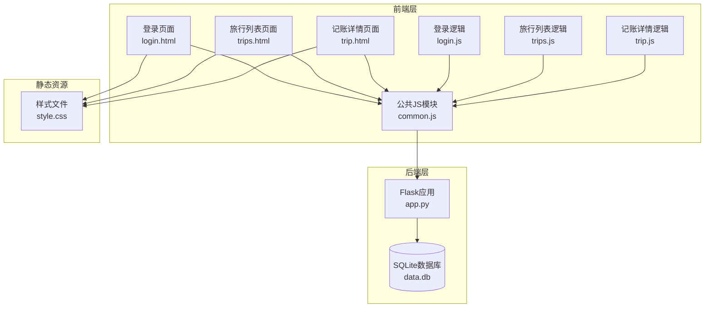
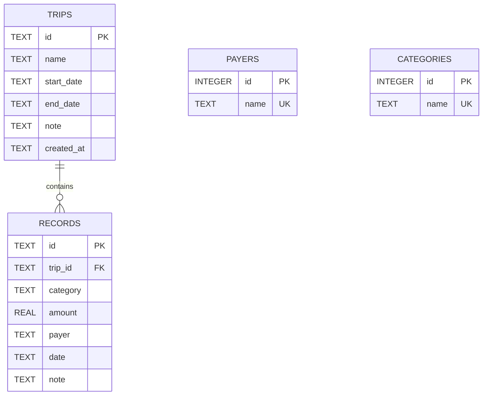
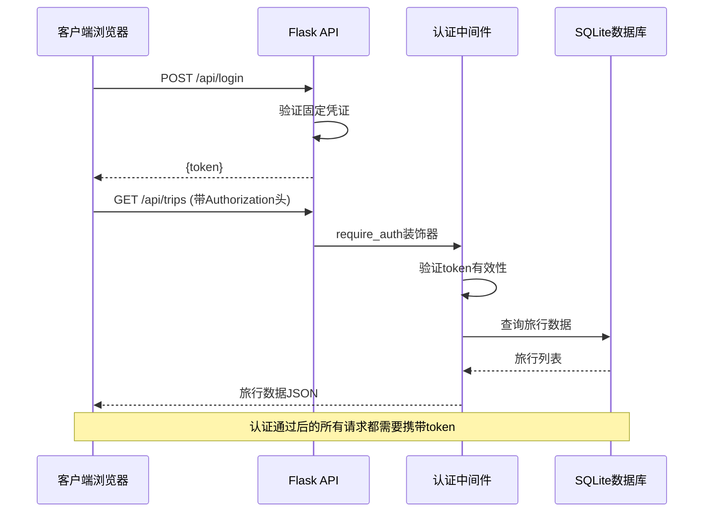
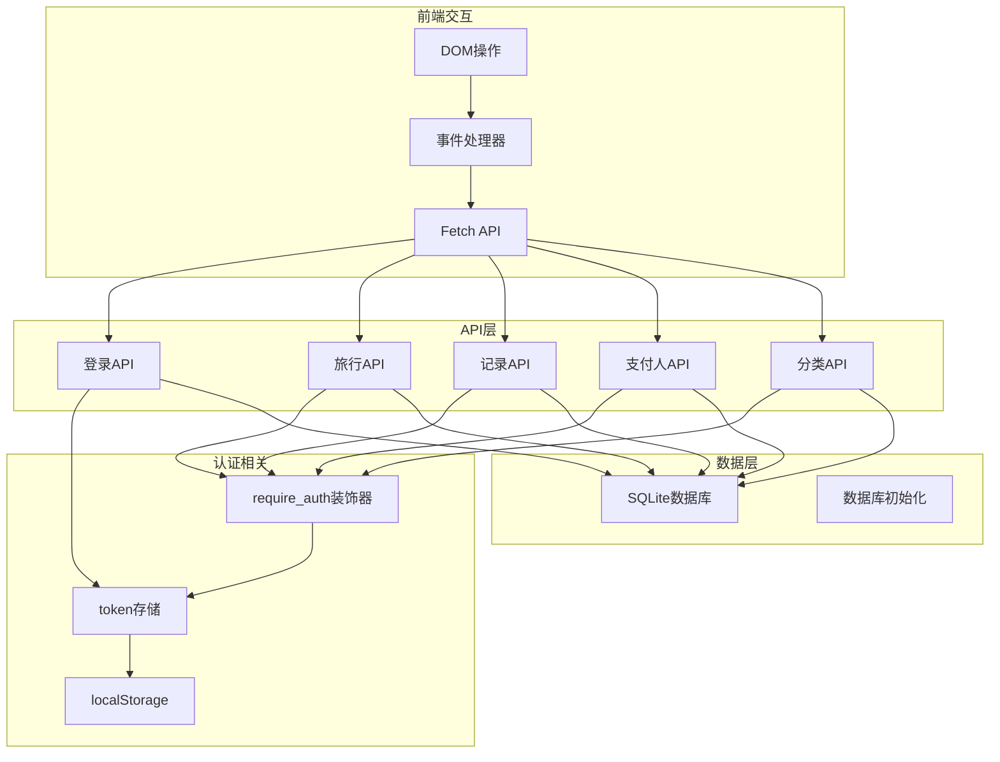

# API接口文档

<cite>
**本文档引用的文件**
- [app.py](file://app.py)
- [common.js](file://assets/js/common.js)
- [login.js](file://assets/js/login.js)
- [trip.js](file://assets/js/trip.js)
- [trips.js](file://assets/js/trips.js)
- [login.html](file://login.html)
- [trip.html](file://trip.html)
- [trips.html](file://trips.html)
- [style.css](file://assets/css/style.css)
</cite>

## 目录
1. [简介](#简介)
2. [项目结构](#项目结构)
3. [核心组件](#核心组件)
4. [架构概览](#架构概览)
5. [详细组件分析](#详细组件分析)
6. [依赖关系分析](#依赖关系分析)
7. [性能考虑](#性能考虑)
8. [故障排除指南](#故障排除指南)
9. [结论](#结论)

## 简介

recorded是一个基于Flask的旅游记账系统，提供了完整的RESTful API接口，支持旅行管理、记账记录管理、支付人管理和分类管理功能。该系统采用JWT风格的令牌认证机制，使用SQLite作为数据存储，前端采用纯JavaScript实现，无需额外的JavaScript框架依赖。

## 项目结构

该项目采用前后端分离的架构设计，主要由以下组件构成：



**图表来源**
- [app.py:1-331](file://app.py#L1-L331)
- [login.html:1-32](file://login.html#L1-L32)
- [trips.html:1-60](file://trips.html#L1-L60)
- [trip.html:1-155](file://trip.html#L1-L155)

**章节来源**
- [app.py:1-331](file://app.py#L1-L331)
- [login.html:1-32](file://login.html#L1-L32)
- [trips.html:1-60](file://trips.html#L1-L60)
- [trip.html:1-155](file://trip.html#L1-L155)

## 核心组件

### 认证系统

系统实现了基于Bearer Token的JWT风格认证机制：

- **固定凭证**：用户名 `lou`，密码 `123`
- **令牌存储**：内存中的集合存储，进程重启后失效
- **认证中间件**：`require_auth`装饰器验证请求头中的Authorization字段
- **会话管理**：基于localStorage的客户端会话持久化

### 数据模型

系统使用SQLite数据库存储以下核心实体：



**图表来源**
- [app.py:46-78](file://app.py#L46-L78)

**章节来源**
- [app.py:16-21](file://app.py#L16-L21)
- [app.py:27-39](file://app.py#L27-L39)
- [app.py:46-78](file://app.py#L46-L78)

## 架构概览

系统采用经典的三层架构：



**图表来源**
- [app.py:106-116](file://app.py#L106-L116)
- [app.py:82-89](file://app.py#L82-L89)
- [app.py:119-139](file://app.py#L119-L139)

## 详细组件分析

### 认证API

#### 登录接口

**HTTP方法**: POST  
**URL模式**: `/api/login`  
**请求头**: `Content-Type: application/json`  
**请求体参数**:

| 参数名 | 类型 | 必填 | 描述 |
|--------|------|------|------|
| username | string | 是 | 用户名，固定为 `lou` |
| password | string | 是 | 密码，固定为 `123` |

**响应格式**:
```json
{
  "token": "字符串类型的访问令牌"
}
```

**状态码**:
- 200: 登录成功，返回token
- 401: 账号或密码错误

**请求示例**:
```javascript
fetch('/api/login', {
  method: 'POST',
  headers: { 'Content-Type': 'application/json' },
  body: JSON.stringify({
    username: 'lou',
    password: '123'
  })
})
```

**响应示例**:
```json
{
  "token": "5f4dcc3b5aa765d61d8327deb882cf99"
}
```

**章节来源**
- [app.py:106-116](file://app.py#L106-L116)
- [common.js:60-71](file://assets/js/common.js#L60-L71)

### 旅行管理API

#### 获取旅行列表

**HTTP方法**: GET  
**URL模式**: `/api/trips`  
**请求头**: `Authorization: Bearer <token>`  
**查询参数**: 无  
**响应格式**: 数组，每个元素包含旅行基本信息和统计信息

**旅行对象结构**:
```json
{
  "id": "旅行ID",
  "name": "旅行名称",
  "start_date": "开始日期",
  "end_date": "结束日期",
  "note": "备注",
  "created_at": "创建时间",
  "record_count": "记录数量",
  "total_amount": "总金额",
  "payers": ["支付人1", "支付人2"],
  "records": [] // 仅在单个旅行详情中包含
}
```

**状态码**:
- 200: 成功返回旅行列表
- 401: 未登录或token无效

**请求示例**:
```javascript
fetch('/api/trips', {
  headers: {
    'Authorization': 'Bearer ' + localStorage.getItem('travel_token')
  }
})
```

**响应示例**:
```json
[
  {
    "id": "abc123",
    "name": "北京三日游",
    "start_date": "2024-01-15",
    "end_date": "2024-01-17",
    "note": "春节假期",
    "created_at": "2024-01-10T10:30:00Z",
    "record_count": 5,
    "total_amount": 2800.50,
    "payers": ["张三", "李四"]
  }
]
```

**章节来源**
- [app.py:119-139](file://app.py#L119-L139)
- [common.js:74-76](file://assets/js/common.js#L74-L76)

#### 创建旅行

**HTTP方法**: POST  
**URL模式**: `/api/trips`  
**请求头**: `Authorization: Bearer <token>`  
**请求体参数**:

| 参数名 | 类型 | 必填 | 描述 |
|--------|------|------|------|
| name | string | 是 | 旅行名称，不能为空 |
| startDate | string | 否 | 开始日期 |
| endDate | string | 否 | 结束日期 |
| note | string | 否 | 备注信息 |

**响应格式**:
```json
{
  "id": "新创建旅行的ID",
  "name": "旅行名称"
}
```

**状态码**:
- 201: 创建成功
- 400: 请求参数错误
- 401: 未登录

**请求示例**:
```javascript
fetch('/api/trips', {
  method: 'POST',
  headers: {
    'Authorization': 'Bearer ' + localStorage.getItem('travel_token'),
    'Content-Type': 'application/json'
  },
  body: JSON.stringify({
    name: "杭州五日游",
    startDate: "2024-03-10",
    endDate: "2024-03-15",
    note: "春游踏青"
  })
})
```

**响应示例**:
```json
{
  "id": "xyz789",
  "name": "杭州五日游"
}
```

**章节来源**
- [app.py:141-156](file://app.py#L141-L156)
- [common.js:77-81](file://assets/js/common.js#L77-L81)

#### 获取单个旅行详情

**HTTP方法**: GET  
**URL模式**: `/api/trips/{trip_id}`  
**路径参数**: `trip_id` - 旅行ID  
**请求头**: `Authorization: Bearer <token>`  
**响应格式**: 包含旅行详情、记录列表和统计信息的对象

**旅行详情对象结构**:
```json
{
  "id": "旅行ID",
  "name": "旅行名称",
  "start_date": "开始日期",
  "end_date": "结束日期",
  "note": "备注",
  "records": [
    {
      "id": "记录ID",
      "trip_id": "旅行ID",
      "category": "类别",
      "amount": 金额,
      "payer": "支付人",
      "date": "日期",
      "note": "备注"
    }
  ],
  "total_amount": "总金额",
  "by_payer": {
    "支付人1": 金额1,
    "支付人2": 金额2
  },
  "by_category": {
    "类别1": 金额1,
    "类别2": 金额2
  }
```

**状态码**:
- 200: 成功返回旅行详情
- 404: 旅行不存在
- 401: 未登录

**请求示例**:
```javascript
fetch('/api/trips/' + tripId, {
  headers: {
    'Authorization': 'Bearer ' + localStorage.getItem('travel_token')
  }
})
```

**响应示例**:
```json
{
  "id": "abc123",
  "name": "北京三日游",
  "start_date": "2024-01-15",
  "end_date": "2024-01-17",
  "note": "春节假期",
  "records": [
    {
      "id": "rec001",
      "trip_id": "abc123",
      "category": "交通",
      "amount": 800.00,
      "payer": "张三",
      "date": "2024-01-15",
      "note": "往返机票"
    }
  ],
  "total_amount": 2800.50,
  "by_payer": {
    "张三": 1500.00,
    "李四": 1300.50
  },
  "by_category": {
    "交通": 800.00,
    "住宿": 1200.00,
    "餐饮": 800.50
  }
}
```

**章节来源**
- [app.py:157-177](file://app.py#L157-L177)
- [common.js:82-84](file://assets/js/common.js#L82-L84)

#### 更新旅行信息

**HTTP方法**: PUT  
**URL模式**: `/api/trips/{trip_id}`  
**路径参数**: `trip_id` - 旅行ID  
**请求头**: `Authorization: Bearer <token>`  
**请求体参数**: 同创建旅行接口的参数

**响应格式**:
```json
{
  "ok": true
}
```

**状态码**:
- 200: 更新成功
- 400: 请求参数错误
- 404: 旅行不存在
- 401: 未登录

**请求示例**:
```javascript
fetch('/api/trips/' + tripId, {
  method: 'PUT',
  headers: {
    'Authorization': 'Bearer ' + localStorage.getItem('travel_token'),
    'Content-Type': 'application/json'
  },
  body: JSON.stringify({
    name: "更新后的旅行名称",
    startDate: "2024-01-15",
    endDate: "2024-01-18",
    note: "延长一天"
  })
})
```

**响应示例**:
```json
{
  "ok": true
}
```

**章节来源**
- [app.py:179-196](file://app.py#L179-L196)
- [common.js:85-89](file://assets/js/common.js#L85-L89)

#### 删除旅行

**HTTP方法**: DELETE  
**URL模式**: `/api/trips/{trip_id}`  
**路径参数**: `trip_id` - 旅行ID  
**请求头**: `Authorization: Bearer <token>`  
**响应格式**:
```json
{
  "ok": true
}
```

**状态码**:
- 200: 删除成功
- 404: 旅行不存在
- 401: 未登录

**请求示例**:
```javascript
fetch('/api/trips/' + tripId, {
  method: 'DELETE',
  headers: {
    'Authorization': 'Bearer ' + localStorage.getItem('travel_token')
  }
})
```

**响应示例**:
```json
{
  "ok": true
}
```

**章节来源**
- [app.py:197-204](file://app.py#L197-L204)
- [common.js:90-93](file://assets/js/common.js#L90-L93)

### 记账记录API

#### 创建记账记录

**HTTP方法**: POST  
**URL模式**: `/api/trips/{trip_id}/records`  
**路径参数**: `trip_id` - 旅行ID  
**请求头**: `Authorization: Bearer <token>`  
**请求体参数**:

| 参数名 | 类型 | 必填 | 描述 |
|--------|------|------|------|
| category | string | 是 | 类别名称，不能为空 |
| amount | number/string | 是 | 金额，必须为正数 |
| payer | string | 是 | 支付人姓名，不能为空 |
| date | string | 否 | 日期，默认当前日期 |
| note | string | 否 | 备注信息 |

**响应格式**:
```json
{
  "id": "新创建记录的ID"
}
```

**状态码**:
- 201: 创建成功
- 400: 请求参数错误
- 404: 旅行不存在
- 401: 未登录

**请求示例**:
```javascript
fetch('/api/trips/' + tripId + '/records', {
  method: 'POST',
  headers: {
    'Authorization': 'Bearer ' + localStorage.getItem('travel_token'),
    'Content-Type': 'application/json'
  },
  body: JSON.stringify({
    category: "餐饮",
    amount: 88.50,
    payer: "张三",
    date: "2024-01-16",
    note: "午餐"
  })
})
```

**响应示例**:
```json
{
  "id": "rec001"
}
```

**章节来源**
- [app.py:208-236](file://app.py#L208-L236)
- [common.js:97-101](file://assets/js/common.js#L97-L101)

#### 更新记账记录

**HTTP方法**: PUT  
**URL模式**: `/api/records/{rec_id}`  
**路径参数**: `rec_id` - 记录ID  
**请求头**: `Authorization: Bearer <token>`  
**请求体参数**: 同创建记录接口的参数

**响应格式**:
```json
{
  "ok": true
}
```

**状态码**:
- 200: 更新成功
- 400: 请求参数错误
- 404: 记录不存在
- 401: 未登录

**请求示例**:
```javascript
fetch('/api/records/' + recordId, {
  method: 'PUT',
  headers: {
    'Authorization': 'Bearer ' + localStorage.getItem('travel_token'),
    'Content-Type': 'application/json'
  },
  body: JSON.stringify({
    category: "餐饮",
    amount: 99.00,
    payer: "李四",
    date: "2024-01-16",
    note: "晚餐"
  })
})
```

**响应示例**:
```json
{
  "ok": true
}
```

**章节来源**
- [app.py:238-264](file://app.py#L238-L264)
- [common.js:102-106](file://assets/js/common.js#L102-L106)

#### 删除记账记录

**HTTP方法**: DELETE  
**URL模式**: `/api/records/{rec_id}`  
**路径参数**: `rec_id` - 记录ID  
**请求头**: `Authorization: Bearer <token>`  
**响应格式**:
```json
{
  "ok": true
}
```

**状态码**:
- 200: 删除成功
- 404: 记录不存在
- 401: 未登录

**请求示例**:
```javascript
fetch('/api/records/' + recordId, {
  method: 'DELETE',
  headers: {
    'Authorization': 'Bearer ' + localStorage.getItem('travel_token')
  }
})
```

**响应示例**:
```json
{
  "ok": true
}
```

**章节来源**
- [app.py:266-272](file://app.py#L266-L272)
- [common.js:107-111](file://assets/js/common.js#L107-L111)

### 支付人管理API

#### 获取支付人列表

**HTTP方法**: GET  
**URL模式**: `/api/payers`  
**请求头**: `Authorization: Bearer <token>`  
**响应格式**: 字符串数组，包含所有支付人姓名

**状态码**:
- 200: 成功返回支付人列表
- 401: 未登录

**请求示例**:
```javascript
fetch('/api/payers', {
  headers: {
    'Authorization': 'Bearer ' + localStorage.getItem('travel_token')
  }
})
```

**响应示例**:
```json
[
  "张三",
  "李四",
  "王五"
]
```

**章节来源**
- [app.py:276-282](file://app.py#L276-L282)
- [common.js:114-116](file://assets/js/common.js#L114-L116)

#### 创建支付人

**HTTP方法**: POST  
**URL模式**: `/api/payers`  
**请求头**: `Authorization: Bearer <token>`  
**请求体参数**:

| 参数名 | 类型 | 必填 | 描述 |
|--------|------|------|------|
| name | string | 是 | 支付人姓名，不能为空 |

**响应格式**:
```json
{
  "ok": true
}
```

**状态码**:
- 201: 创建成功
- 400: 请求参数错误
- 401: 未登录

**请求示例**:
```javascript
fetch('/api/payers', {
  method: 'POST',
  headers: {
    'Authorization': 'Bearer ' + localStorage.getItem('travel_token'),
    'Content-Type': 'application/json'
  },
  body: JSON.stringify({
    name: "赵六"
  })
})
```

**响应示例**:
```json
{
  "ok": true
}
```

**章节来源**
- [app.py:283-294](file://app.py#L283-L294)
- [common.js:117-121](file://assets/js/common.js#L117-L121)

### 分类管理API

#### 获取分类列表

**HTTP方法**: GET  
**URL模式**: `/api/categories`  
**请求头**: `Authorization: Bearer <token>`  
**响应格式**: 字符串数组，包含所有分类名称

**状态码**:
- 200: 成功返回分类列表
- 401: 未登录

**请求示例**:
```javascript
fetch('/api/categories', {
  headers: {
    'Authorization': 'Bearer ' + localStorage.getItem('travel_token')
  }
})
```

**响应示例**:
```json
[
  "交通",
  "住宿",
  "餐饮",
  "其他"
]
```

**章节来源**
- [app.py:297-303](file://app.py#L297-L303)
- [common.js:124-126](file://assets/js/common.js#L124-L126)

#### 创建分类

**HTTP方法**: POST  
**URL模式**: `/api/categories`  
**请求头**: `Authorization: Bearer <token>`  
**请求体参数**:

| 参数名 | 类型 | 必填 | 描述 |
|--------|------|------|------|
| name | string | 是 | 分类名称，不能为空 |

**响应格式**:
```json
{
  "ok": true
}
```

**状态码**:
- 201: 创建成功
- 400: 请求参数错误
- 401: 未登录

**请求示例**:
```javascript
fetch('/api/categories', {
  method: 'POST',
  headers: {
    'Authorization': 'Bearer ' + localStorage.getItem('travel_token'),
    'Content-Type': 'application/json'
  },
  body: JSON.stringify({
    name: "购物"
  })
})
```

**响应示例**:
```json
{
  "ok": true
}
```

**章节来源**
- [app.py:304-315](file://app.py#L304-L315)
- [common.js:127-131](file://assets/js/common.js#L127-L131)

## 依赖关系分析

系统的主要依赖关系如下：



**图表来源**
- [app.py:82-89](file://app.py#L82-L89)
- [app.py:41-78](file://app.py#L41-L78)
- [common.js:15-36](file://assets/js/common.js#L15-L36)

**章节来源**
- [app.py:82-89](file://app.py#L82-L89)
- [common.js:39-132](file://assets/js/common.js#L39-L132)

## 性能考虑

### 数据库优化

- **WAL模式**: 使用SQLite的WAL模式提高并发读取性能
- **外键约束**: 启用外键约束确保数据一致性
- **索引策略**: 旅行ID作为外键自动建立索引
- **事务处理**: 所有写操作都在事务中执行

### API性能

- **批量查询**: 旅行列表同时获取统计数据减少网络请求
- **缓存策略**: 前端对常用数据进行本地缓存
- **分页支持**: 当前版本未实现分页，建议大数据量时添加分页参数

### 安全考虑

- **认证机制**: JWT风格令牌，支持会话过期
- **输入验证**: 严格的参数验证和类型检查
- **SQL注入防护**: 使用参数化查询防止SQL注入
- **跨站脚本防护**: 前端对用户输入进行HTML转义

## 故障排除指南

### 常见错误及解决方案

#### 401 未授权错误
**症状**: 所有受保护的API请求都返回401状态码  
**原因**: token缺失、token过期或token无效  
**解决方案**: 
1. 确保在请求头中正确设置Authorization头
2. 重新登录获取新的token
3. 检查localStorage中的token是否被清除

#### 400 参数错误
**症状**: 创建或更新操作返回400状态码  
**原因**: 请求参数缺失或格式不正确  
**解决方案**:
1. 检查必填参数是否完整
2. 确保金额为正数
3. 验证日期格式

#### 404 资源不存在
**症状**: 访问特定ID的资源返回404状态码  
**原因**: 旅行或记录ID不存在  
**解决方案**:
1. 确认ID的有效性
2. 检查资源是否已被删除

### 前端调试技巧

#### 浏览器开发者工具
1. **Network标签**: 查看API请求和响应
2. **Application标签**: 检查localStorage中的token
3. **Console标签**: 查看JavaScript错误信息

#### 常用调试命令
```javascript
// 检查当前token
console.log(localStorage.getItem('travel_token'));

// 手动测试API
fetch('/api/trips', {
  headers: {'Authorization': 'Bearer ' + localStorage.getItem('travel_token')}
}).then(r => r.json()).then(console.log);
```

**章节来源**
- [common.js:47-57](file://assets/js/common.js#L47-L57)
- [login.js:24-33](file://assets/js/login.js#L24-L33)

## 结论

recorded项目提供了一个功能完整、结构清晰的旅游记账系统API。系统采用简洁的JWT风格认证机制，配合SQLite数据库实现了高效的旅行记账功能。前端采用纯JavaScript实现，无需额外框架依赖，具有良好的兼容性和可维护性。

### 主要优势
- **简单易用**: API设计直观，易于理解和使用
- **数据完整性**: 通过外键约束和参数验证确保数据质量
- **前端友好**: 提供完整的前端JavaScript封装
- **移动端适配**: 样式文件针对移动设备进行了优化

### 改进建议
1. **增强认证**: 考虑使用更安全的JWT实现和token刷新机制
2. **扩展功能**: 添加用户管理系统和多用户支持
3. **性能优化**: 实现分页和搜索功能以支持大量数据
4. **错误处理**: 完善错误处理和重试机制
5. **API文档**: 生成OpenAPI规范文档

该系统为小型团队或个人用户提供了一个可靠的旅行记账解决方案，具有良好的扩展性和维护性。