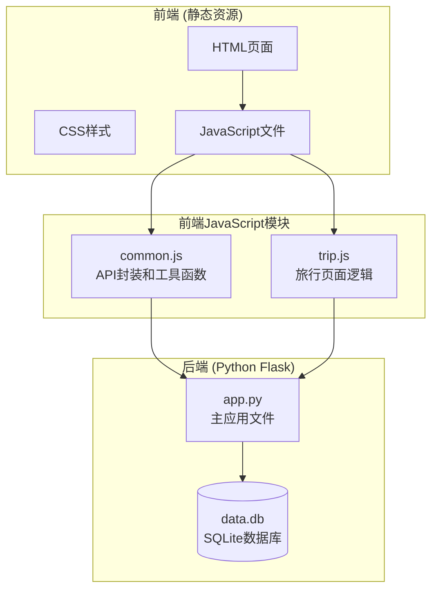
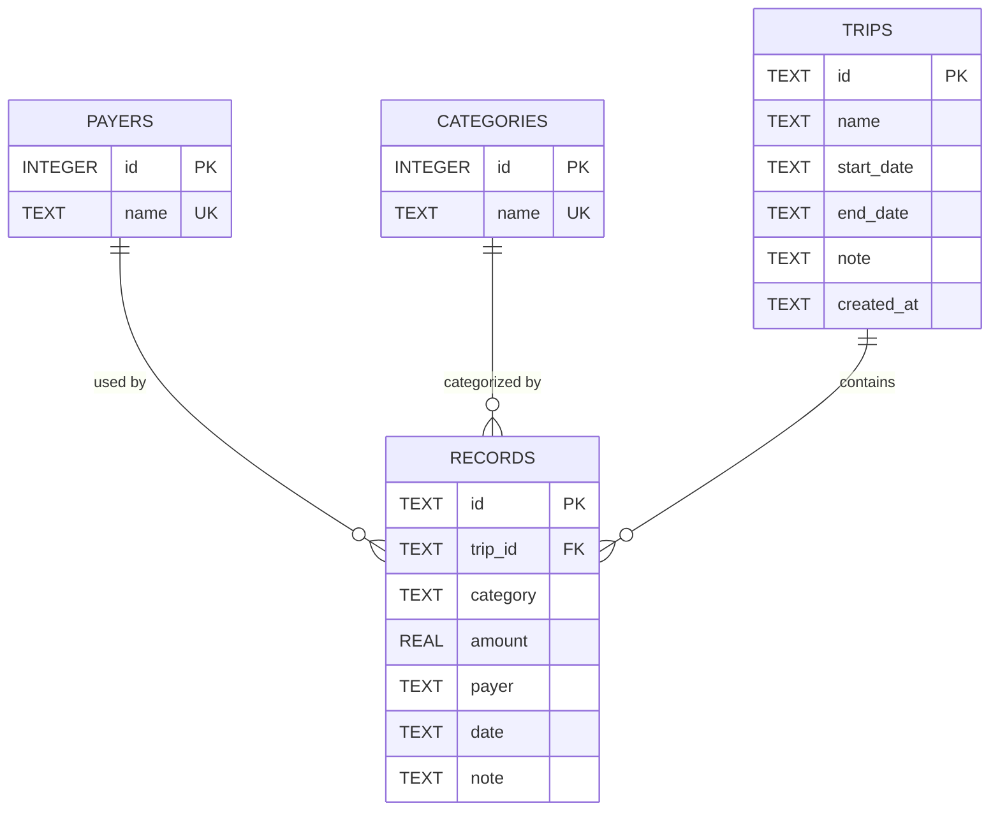
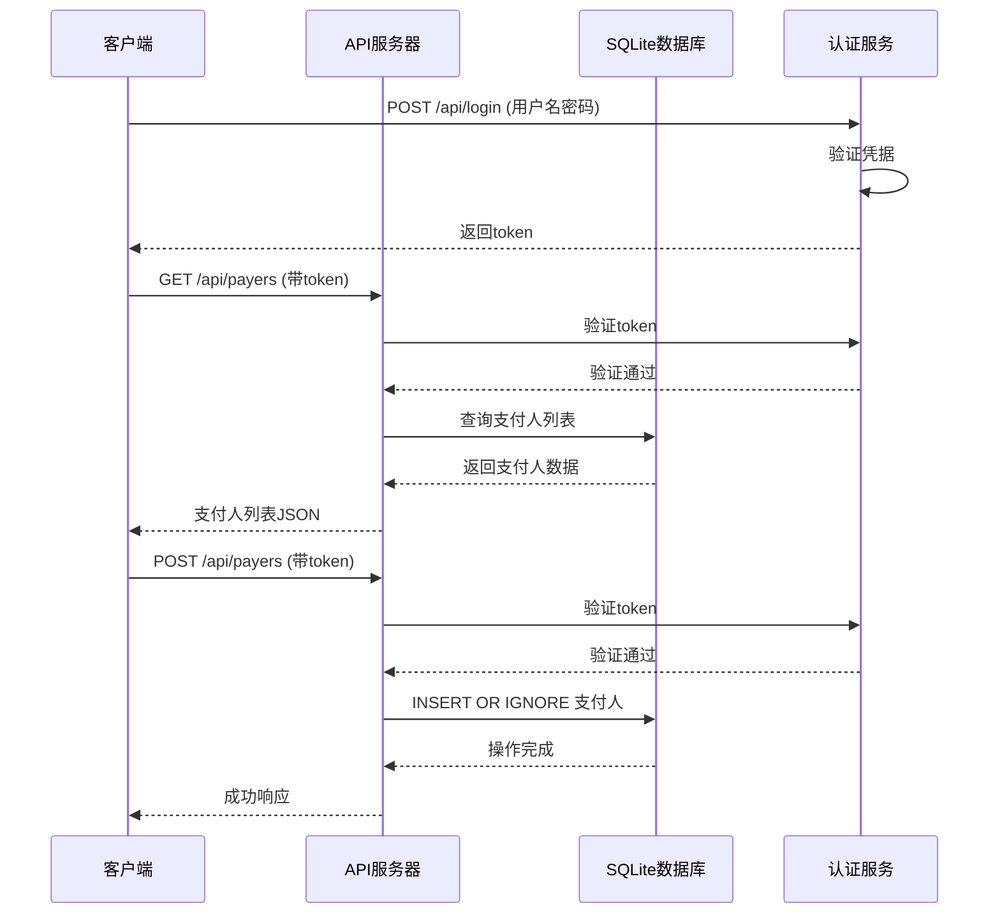
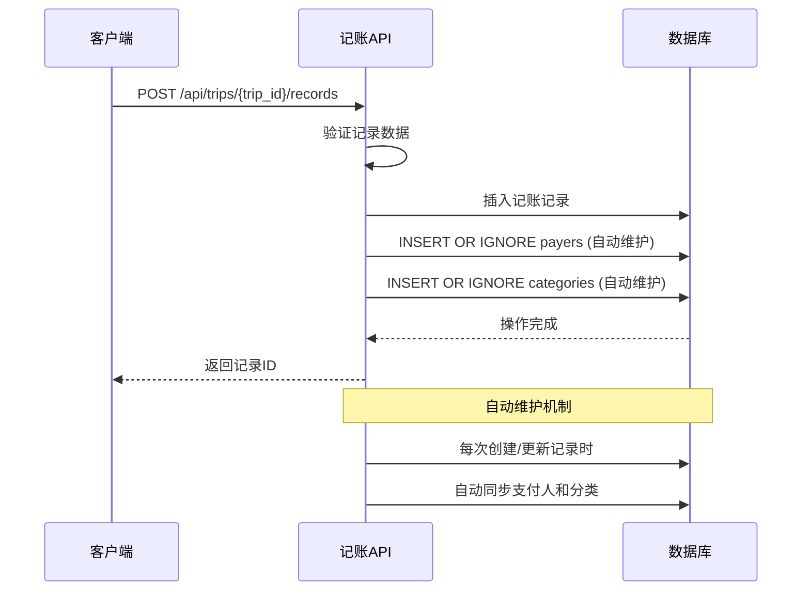
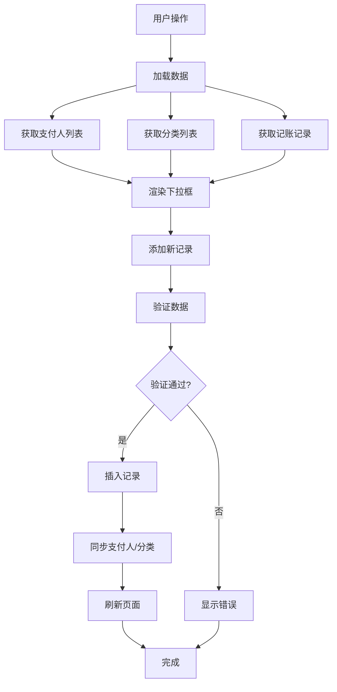

# 支付人和分类API

<cite>
**本文档引用的文件**
- [app.py](file://app.py)
- [common.js](file://assets/js/common.js)
- [trip.js](file://assets/js/trip.js)
- [trip.html](file://trip.html)
- [recorded.md](file://recorded.md)
</cite>

## 目录
1. [简介](#简介)
2. [项目结构](#项目结构)
3. [核心组件](#核心组件)
4. [架构概览](#架构概览)
5. [详细组件分析](#详细组件分析)
6. [依赖关系分析](#依赖关系分析)
7. [性能考虑](#性能考虑)
8. [故障排除指南](#故障排除指南)
9. [结论](#结论)

## 简介

recorded是一个基于Flask的旅游记账系统，提供了完整的支付人和分类管理API。该系统支持多旅行记账、自动数据去重、唯一性约束保证，以及与记账记录API的紧密协同工作。系统采用SQLite作为数据存储，实现了数据一致性保证和自动维护机制。

根据项目描述，系统主要面向旅游记账场景，支持交通工具、住宿、餐费、打车等默认分类，同时允许用户自定义分类和支付人。

## 项目结构

项目采用前后端分离的架构设计，主要文件组织如下：



**图表来源**
- [app.py:1-331](file://app.py#L1-L331)
- [common.js:1-206](file://assets/js/common.js#L1-L206)
- [trip.js:1-401](file://assets/js/trip.js#L1-L401)

**章节来源**
- [app.py:1-331](file://app.py#L1-L331)
- [recorded.md:1-9](file://recorded.md#L1-L9)

## 核心组件

### 数据库架构

系统使用SQLite作为数据存储，包含以下核心表结构：



**图表来源**
- [app.py:46-78](file://app.py#L46-L78)

### 默认分类初始化

系统在数据库初始化时自动创建默认分类，确保用户首次使用时有预设的分类选项：

- 交通工具（飞机/动车/自驾）
- 住宿  
- 餐费
- 打车

**章节来源**
- [app.py:23-23](file://app.py#L23-L23)
- [app.py:74-77](file://app.py#L74-L77)

## 架构概览

系统采用RESTful API设计，前后端通过JSON进行数据交换。认证采用简单的token机制，所有API请求都需要携带Authorization头。



**图表来源**
- [app.py:106-116](file://app.py#L106-L116)
- [app.py:276-294](file://app.py#L276-L294)

## 详细组件分析

### 支付人管理API

#### GET /api/payers - 获取支付人列表

**功能描述**: 返回系统中所有已注册的支付人列表，按ID升序排列。

**请求参数**: 无

**响应数据**: 字符串数组，包含所有支付人姓名

**响应示例**:
```json
[
  "张三",
  "李四", 
  "王五"
]
```

**错误处理**: 
- 401 未登录或登录已过期
- 500 数据库查询异常

#### POST /api/payers - 创建支付人

**功能描述**: 创建新的支付人，使用INSERT OR IGNORE确保数据去重。

**请求参数**:
```json
{
  "name": "新支付人姓名"
}
```

**响应数据**:
```json
{
  "ok": true
}
```

**数据去重机制**:
系统使用SQLite的UNIQUE约束和INSERT OR IGNORE语句实现自动去重：
- UNIQUE约束防止重复姓名插入
- INSERT OR IGNORE跳过重复条目，避免抛出异常
- 保证支付人列表的唯一性和完整性

**错误处理**:
- 400 姓名不能为空
- 401 未登录或登录已过期
- 500 数据库操作异常

**章节来源**
- [app.py:276-294](file://app.py#L276-L294)

### 分类管理API

#### GET /api/categories - 获取分类列表

**功能描述**: 返回系统中所有已注册的分类列表，按ID升序排列。

**请求参数**: 无

**响应数据**: 字符串数组，包含所有分类名称

**响应示例**:
```json
[
  "交通工具（飞机/动车/自驾）",
  "住宿",
  "餐费",
  "打车",
  "购物"
]
```

**错误处理**:
- 401 未登录或登录已过期
- 500 数据库查询异常

#### POST /api/categories - 创建分类

**功能描述**: 创建新的分类，使用INSERT OR IGNORE确保数据去重。

**请求参数**:
```json
{
  "name": "新分类名称"
}
```

**响应数据**:
```json
{
  "ok": true
}
```

**数据去重机制**:
与支付人类似，系统使用UNIQUE约束和INSERT OR IGNORE实现自动去重：
- UNIQUE约束确保分类名称唯一
- INSERT OR IGNORE处理重复插入请求
- 保持分类列表的完整性和一致性

**错误处理**:
- 400 分类名称不能为空
- 401 未登录或登录已过期
- 500 数据库操作异常

**章节来源**
- [app.py:297-315](file://app.py#L297-L315)

### 与记账记录API的协同工作

系统中的记账记录API会自动维护支付人和分类的完整性：



**图表来源**
- [app.py:208-236](file://app.py#L208-L236)
- [app.py:238-264](file://app.py#L238-L264)

**章节来源**
- [app.py:208-236](file://app.py#L208-L236)
- [app.py:238-264](file://app.py#L238-L264)

## 依赖关系分析

### 前端集成

前端JavaScript通过统一的API封装层与后端交互：

```mermaid
graph LR
subgraph "前端模块"
COMMON[common.js<br/>API封装]
TRIP[trip.js<br/>页面逻辑]
HTML[trip.html<br/>页面结构]
end
subgraph "后端API"
LOGIN[POST /api/login]
PAYERS[GET/POST /api/payers]
CATS[GET/POST /api/categories]
RECORDS[POST /api/trips/{trip_id}/records]
end
COMMON --> LOGIN
COMMON --> PAYERS
COMMON --> CATS
COMMON --> RECORDS
TRIP --> COMMON
HTML --> TRIP
```

**图表来源**
- [common.js:114-131](file://assets/js/common.js#L114-L131)
- [trip.js:105-123](file://assets/js/trip.js#L105-L123)

### 数据流分析

系统中的数据流向体现了完整的业务流程：



**图表来源**
- [trip.js:160-197](file://assets/js/trip.js#L160-L197)
- [trip.js:258-313](file://assets/js/trip.js#L258-L313)

**章节来源**
- [common.js:114-131](file://assets/js/common.js#L114-L131)
- [trip.js:105-123](file://assets/js/trip.js#L105-L123)

## 性能考虑

### 数据库优化

1. **索引策略**: 使用UNIQUE约束确保查询效率
2. **事务处理**: 所有数据库操作都在单个事务中执行
3. **连接池**: 使用Flask的g对象管理数据库连接
4. **WAL模式**: 启用Write-Ahead Logging提高并发性能

### 前端性能

1. **批量加载**: 使用Promise.all并行加载多个API请求
2. **本地缓存**: 支付人和分类数据在页面内缓存
3. **防抖处理**: 表单提交时禁用按钮防止重复提交
4. **增量更新**: 只在必要时刷新页面内容

## 故障排除指南

### 常见问题及解决方案

#### 1. 认证失败
**症状**: 请求返回401状态码
**原因**: Token无效或已过期
**解决**: 重新登录获取新Token

#### 2. 数据重复插入
**症状**: POST请求返回成功但数据未更新
**原因**: 使用INSERT OR IGNORE处理重复数据
**解决**: 确保请求体包含正确的name字段

#### 3. 数据库锁定
**症状**: 请求超时或操作失败
**原因**: SQLite并发访问冲突
**解决**: 等待当前事务完成或重启应用

#### 4. 前端数据不同步
**症状**: 新增的支付人或分类未显示
**原因**: 前端缓存未刷新
**解决**: 刷新页面或调用refresh()方法

**章节来源**
- [app.py:82-89](file://app.py#L82-L89)
- [common.js:47-57](file://assets/js/common.js#L47-L57)

## 结论

recorded项目的支付人和分类管理API设计合理，实现了以下关键特性：

1. **数据完整性**: 通过UNIQUE约束和INSERT OR IGNORE确保数据唯一性
2. **自动维护**: 与记账记录API紧密集成，自动同步支付人和分类信息
3. **用户体验**: 前后端分离架构提供流畅的交互体验
4. **扩展性**: 支持自定义分类和支付人，满足多样化需求

系统采用简洁有效的技术方案，在保证功能完整性的同时保持了代码的可维护性。建议在生产环境中考虑添加更完善的错误日志和监控机制，以进一步提升系统的可靠性。