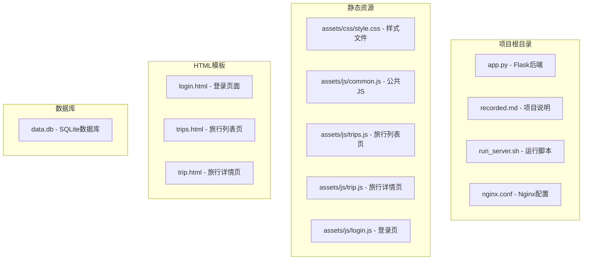
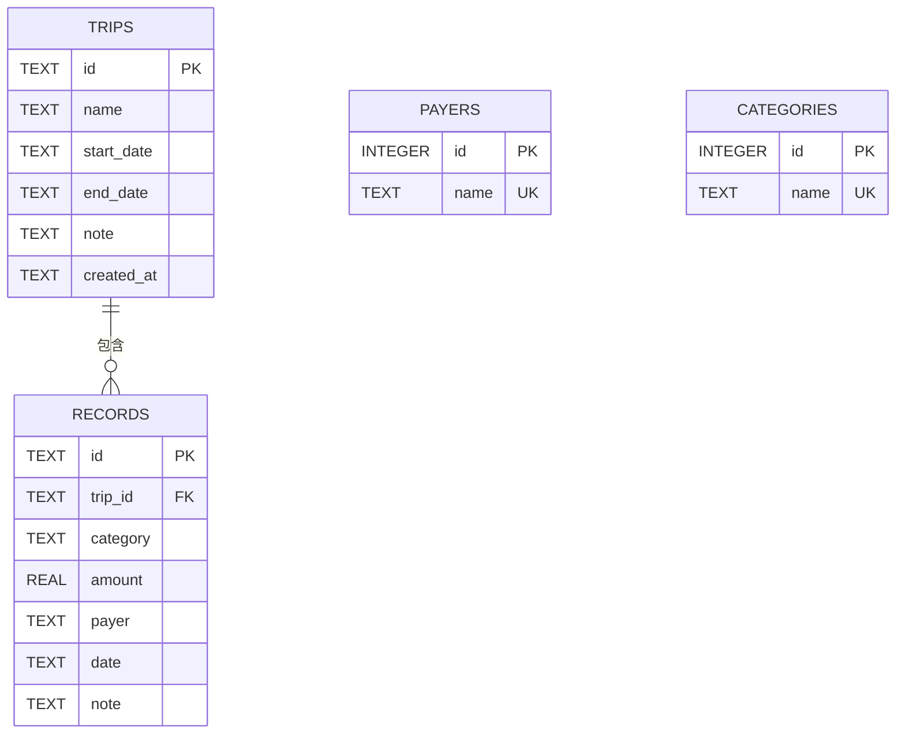
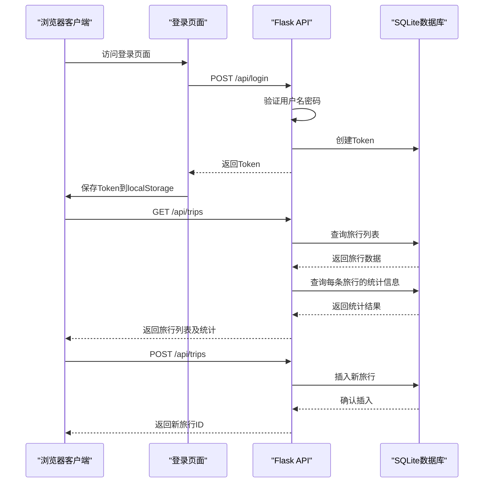
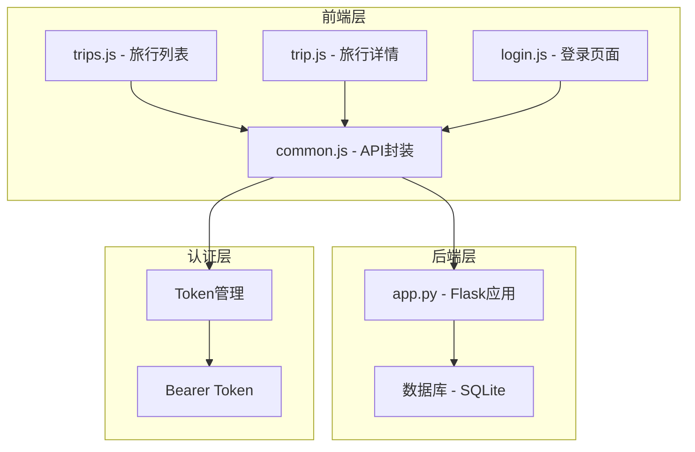
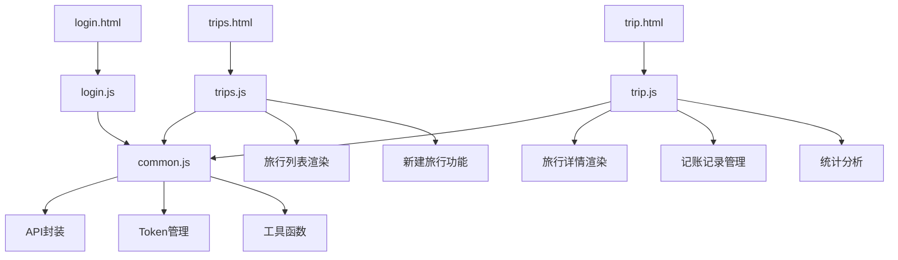

# 旅行管理API

<cite>
**本文档引用的文件**
- [app.py](file://app.py)
- [assets/js/common.js](file://assets/js/common.js)
- [assets/js/trips.js](file://assets/js/trips.js)
- [assets/js/trip.js](file://assets/js/trip.js)
- [trips.html](file://trips.html)
- [trip.html](file://trip.html)
- [login.html](file://login.html)
- [recorded.md](file://recorded.md)
</cite>

## 目录
1. [简介](#简介)
2. [项目结构](#项目结构)
3. [核心组件](#核心组件)
4. [架构概览](#架构概览)
5. [详细组件分析](#详细组件分析)
6. [依赖关系分析](#依赖关系分析)
7. [性能考虑](#性能考虑)
8. [故障排除指南](#故障排除指南)
9. [结论](#结论)

## 简介

recorded是一个基于Flask的旅游记账管理系统，提供了完整的旅行管理和记账功能。该系统采用前后端分离架构，后端使用Python Flask框架提供RESTful API，前端使用原生JavaScript实现用户界面。

系统的主要功能包括：
- 旅行管理：创建、查询、更新、删除旅行记录
- 记账管理：为旅行添加各类消费记录
- 统计分析：按支付人和分类进行费用统计
- 用户认证：基于Bearer Token的简单认证机制

## 项目结构

项目采用简洁的文件组织方式，主要包含以下结构：



**图表来源**
- [app.py:1-331](file://app.py#L1-L331)
- [assets/js/common.js:1-206](file://assets/js/common.js#L1-L206)
- [trips.html:1-60](file://trips.html#L1-L60)
- [trip.html:1-155](file://trip.html#L1-L155)

**章节来源**
- [app.py:1-331](file://app.py#L1-L331)
- [recorded.md:1-9](file://recorded.md#L1-L9)

## 核心组件

### 数据库设计

系统使用SQLite作为数据存储，包含以下核心表结构：



**图表来源**
- [app.py:46-78](file://app.py#L46-L78)

### 认证机制

系统采用简单的Bearer Token认证机制：
- 固定用户名：`lou`
- 固定密码：`123`
- Token存储在内存中，重启后失效

**章节来源**
- [app.py:16-21](file://app.py#L16-L21)
- [app.py:106-116](file://app.py#L106-L116)
- [assets/js/common.js:15-36](file://assets/js/common.js#L15-L36)

## 架构概览

系统采用前后端分离架构，整体交互流程如下：



**图表来源**
- [app.py:119-139](file://app.py#L119-L139)
- [assets/js/common.js:74-94](file://assets/js/common.js#L74-L94)

## 详细组件分析

### 旅行管理API

#### GET /api/trips - 获取旅行列表

**功能描述**：获取所有旅行记录，并为每个旅行附加统计信息。

**请求参数**：
- 头部参数：Authorization: Bearer {token}

**响应格式**：数组格式，每个元素包含旅行基本信息和统计信息

**旅行数据结构**：
```javascript
{
  "id": "字符串",           // 旅行唯一标识
  "name": "字符串",         // 旅行名称
  "start_date": "字符串",   // 开始日期 (可选)
  "end_date": "字符串",     // 结束日期 (可选)
  "note": "字符串",         // 备注 (可选)
  "created_at": "字符串",   // 创建时间
  "record_count": 整数,     // 记录数量
  "total_amount": 数值,     // 总金额
  "payers": 数组           // 参与人员列表
}
```

**附加统计信息**：
- `record_count`：该旅行下的记账记录总数
- `total_amount`：该旅行下的总花费金额
- `payers`：参与该旅行的所有支付人

**响应示例**：
```json
[
  {
    "id": "abc123",
    "name": "北京三日游",
    "start_date": "2024-01-15",
    "end_date": "2024-01-17",
    "note": "春节家庭旅行",
    "created_at": "2024-01-10 14:30:00",
    "record_count": 15,
    "total_amount": 2850.50,
    "payers": ["张三", "李四", "王五"]
  }
]
```

**章节来源**
- [app.py:119-139](file://app.py#L119-L139)
- [assets/js/trips.js:26-36](file://assets/js/trips.js#L26-L36)

#### POST /api/trips - 创建旅行

**功能描述**：创建新的旅行记录。

**请求头**：Authorization: Bearer {token}

**请求体参数**：
```javascript
{
  "name": "字符串*",        // 旅行名称 (必填)
  "startDate": "字符串",    // 开始日期 (可选)
  "endDate": "字符串",      // 结束日期 (可选)
  "note": "字符串"          // 备注 (可选)
}
```

**响应格式**：
```json
{
  "id": "字符串",   // 新创建旅行的ID
  "name": "字符串"  // 旅行名称
}
```

**响应状态码**：
- 201 Created：创建成功
- 400 Bad Request：旅行名称为空
- 401 Unauthorized：未认证或Token无效

**请求示例**：
```json
{
  "name": "杭州西湖游",
  "startDate": "2024-03-15",
  "endDate": "2024-03-17",
  "note": "春游踏青"
}
```

**响应示例**：
```json
{
  "id": "xyz789",
  "name": "杭州西湖游"
}
```

**章节来源**
- [app.py:141-155](file://app.py#L141-L155)
- [assets/js/trips.js:101-121](file://assets/js/trips.js#L101-L121)

#### GET /api/trips/{trip_id} - 获取特定旅行详情

**功能描述**：获取指定旅行的详细信息，包括所有记账记录和统计分析。

**路径参数**：
- `trip_id`：旅行唯一标识符

**响应格式**：包含旅行基本信息、记录列表和统计信息的对象

**旅行详情数据结构**：
```javascript
{
  "id": "字符串",
  "name": "字符串",
  "start_date": "字符串",
  "end_date": "字符串",
  "note": "字符串",
  "created_at": "字符串",
  "records": 数组,           // 记账记录列表
  "total_amount": 数值,      // 总金额
  "by_payer": 对象,          // 按支付人统计
  "by_category": 对象       // 按类别统计
}
```

**记录数据结构**：
```javascript
{
  "id": "字符串",
  "trip_id": "字符串",
  "category": "字符串",
  "amount": 数值,
  "payer": "字符串",
  "date": "字符串",
  "note": "字符串"
}
```

**统计信息**：
- `total_amount`：该旅行下所有记录的总金额
- `by_payer`：对象格式，键为支付人姓名，值为该支付人的总支出
- `by_category`：对象格式，键为消费类别，值为该类别的总支出

**响应示例**：
```json
{
  "id": "abc123",
  "name": "北京三日游",
  "start_date": "2024-01-15",
  "end_date": "2024-01-17",
  "note": "春节家庭旅行",
  "created_at": "2024-01-10 14:30:00",
  "records": [
    {
      "id": "rec001",
      "trip_id": "abc123",
      "category": "交通",
      "amount": 800.00,
      "payer": "张三",
      "date": "2024-01-15",
      "note": "往返机票"
    }
  ],
  "total_amount": 2850.50,
  "by_payer": {
    "张三": 1200.00,
    "李四": 850.50,
    "王五": 800.00
  },
  "by_category": {
    "交通": 1600.00,
    "住宿": 800.00,
    "餐饮": 450.50
  }
}
```

**章节来源**
- [app.py:157-177](file://app.py#L157-L177)
- [assets/js/trip.js:140-149](file://assets/js/trip.js#L140-L149)

#### PUT /api/trips/{trip_id} - 更新旅行信息

**功能描述**：更新指定旅行的信息。

**路径参数**：
- `trip_id`：旅行唯一标识符

**请求体参数**：
```javascript
{
  "name": "字符串*",        // 旅行名称 (必填)
  "startDate": "字符串",    // 开始日期 (可选)
  "endDate": "字符串",      // 结束日期 (可选)
  "note": "字符串"          // 备注 (可选)
}
```

**响应格式**：
```json
{
  "ok": true
}
```

**响应状态码**：
- 200 OK：更新成功
- 400 Bad Request：旅行名称为空
- 404 Not Found：旅行不存在
- 401 Unauthorized：未认证

**请求示例**：
```json
{
  "name": "更新后的旅行名称",
  "startDate": "2024-01-20",
  "endDate": "2024-01-22",
  "note": "更新备注信息"
}
```

**响应示例**：
```json
{
  "ok": true
}
```

**章节来源**
- [app.py:179-195](file://app.py#L179-L195)
- [assets/js/trip.js:361-379](file://assets/js/trip.js#L361-L379)

#### DELETE /api/trips/{trip_id} - 删除旅行

**功能描述**：删除指定旅行及其所有相关记录。

**路径参数**：
- `trip_id`：旅行唯一标识符

**响应格式**：
```json
{
  "ok": true
}
```

**响应状态码**：
- 200 OK：删除成功
- 404 Not Found：旅行不存在
- 401 Unauthorized：未认证

**注意**：删除旅行会级联删除该旅行下的所有记账记录。

**响应示例**：
```json
{
  "ok": true
}
```

**章节来源**
- [app.py:197-204](file://app.py#L197-L204)

### 记账记录API

虽然题目要求主要关注旅行管理API，但为了完整性，这里也说明相关的记账记录操作：

#### POST /api/trips/{trip_id}/records - 创建记账记录

**功能描述**：为指定旅行添加新的记账记录。

**路径参数**：
- `trip_id`：旅行唯一标识符

**请求体参数**：
```javascript
{
  "category": "字符串*",    // 消费类别 (必填)
  "amount": 数值*,          // 金额 (必填，必须为正数)
  "payer": "字符串*",       // 支付人 (必填)
  "date": "字符串",         // 日期 (可选)
  "note": "字符串"          // 备注 (可选)
}
```

**响应格式**：
```json
{
  "id": "字符串"  // 新创建记录的ID
}
```

**章节来源**
- [app.py:208-236](file://app.py#L208-L236)

## 依赖关系分析

系统各组件之间的依赖关系如下：



**图表来源**
- [assets/js/common.js:38-132](file://assets/js/common.js#L38-L132)
- [app.py:82-89](file://app.py#L82-L89)

### 前端组件依赖



**图表来源**
- [assets/js/common.js:38-132](file://assets/js/common.js#L38-L132)
- [assets/js/trips.js:1-130](file://assets/js/trips.js#L1-L130)
- [assets/js/trip.js:1-401](file://assets/js/trip.js#L1-L401)

**章节来源**
- [assets/js/common.js:38-132](file://assets/js/common.js#L38-L132)
- [assets/js/trips.js:1-130](file://assets/js/trips.js#L1-L130)
- [assets/js/trip.js:1-401](file://assets/js/trip.js#L1-L401)

## 性能考虑

### 数据库优化

1. **索引策略**：当前使用外键约束确保数据一致性，但未显式创建索引
2. **查询优化**：旅行列表查询包含聚合计算，建议考虑在records表上建立适当的索引
3. **连接池**：使用Flask的g对象管理数据库连接，避免重复连接

### 前端性能

1. **懒加载**：旅行详情页面使用Promise.all并行加载数据
2. **缓存策略**：Token存储在localStorage中，减少重复登录
3. **DOM操作**：批量更新DOM，避免频繁的重排重绘

### 安全性

1. **认证机制**：Bearer Token认证，支持自动登出
2. **输入验证**：后端对关键参数进行验证
3. **SQL注入防护**：使用参数化查询

## 故障排除指南

### 常见问题及解决方案

**1. 认证失败**
- 检查Token是否正确设置在Authorization头部
- 确认用户名密码是否为固定的`lou:123`
- Token过期后需要重新登录

**2. 数据库连接问题**
- 确认data.db文件存在且可读写
- 检查数据库文件权限
- 重启应用后数据库初始化是否成功

**3. API调用失败**
- 检查网络连接和服务器状态
- 确认API端点URL正确
- 查看浏览器开发者工具中的错误信息

**4. 数据显示异常**
- 刷新页面重新加载数据
- 检查浏览器控制台是否有JavaScript错误
- 确认数据格式符合预期

**章节来源**
- [assets/js/common.js:47-57](file://assets/js/common.js#L47-L57)
- [app.py:82-89](file://app.py#L82-L89)

## 结论

recorded项目提供了一个功能完整、结构清晰的旅游记账管理系统。系统采用前后端分离架构，具有以下特点：

**优势**：
- 简洁明了的API设计，易于理解和使用
- 完整的旅行生命周期管理
- 实时的数据统计和分析
- 良好的用户体验和响应式设计

**扩展建议**：
- 添加数据库索引优化查询性能
- 实现分页功能处理大量数据
- 增加数据导入导出功能
- 添加更多统计图表和报表

该系统为个人和小团队的旅行记账需求提供了可靠的解决方案，代码结构清晰，便于维护和扩展。