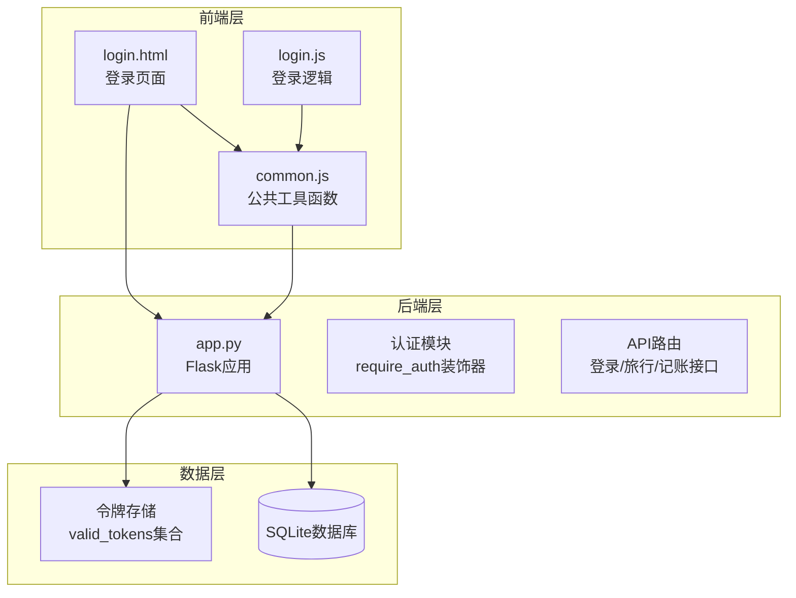
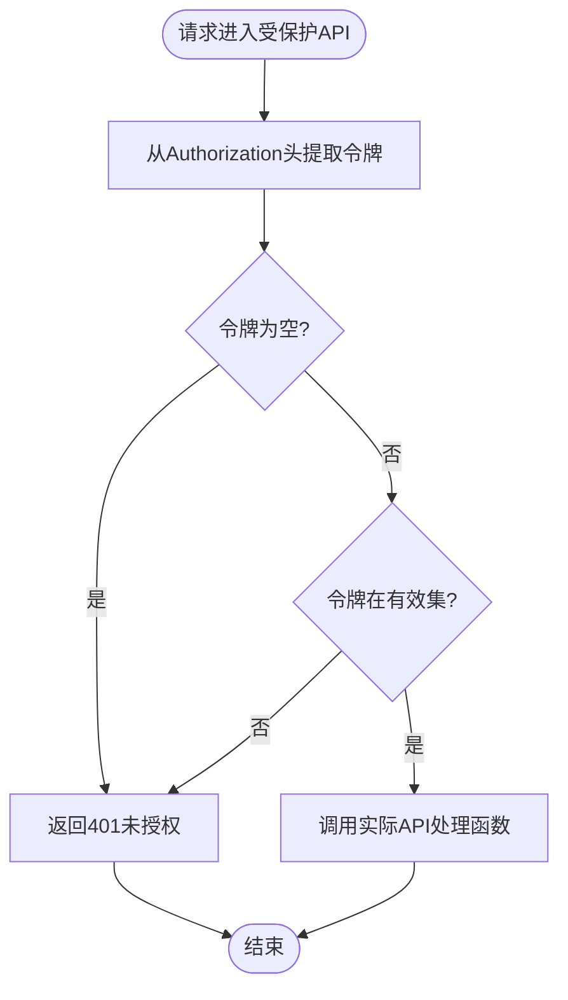
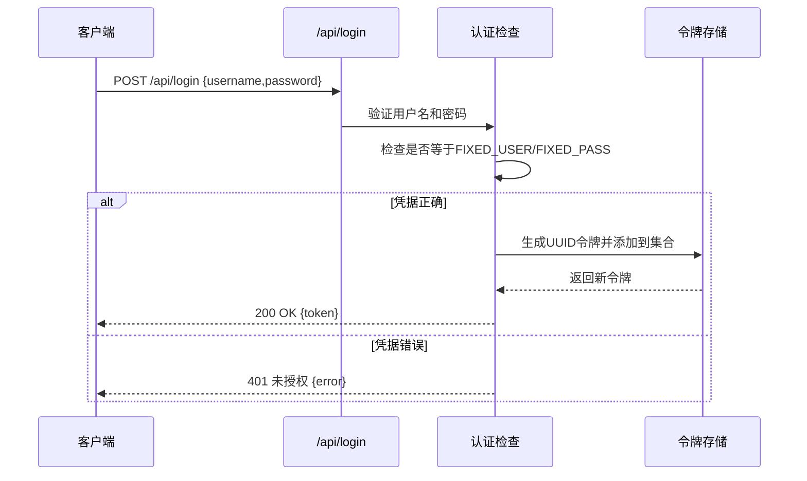
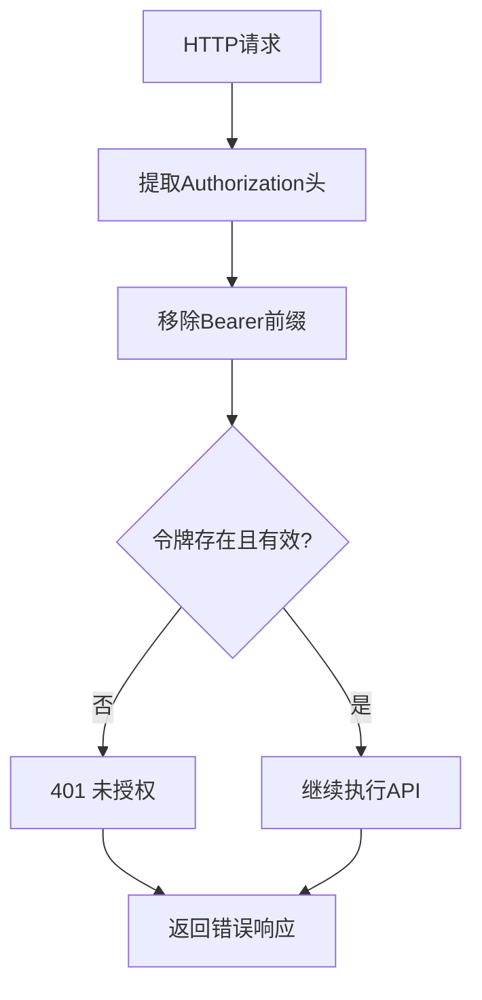
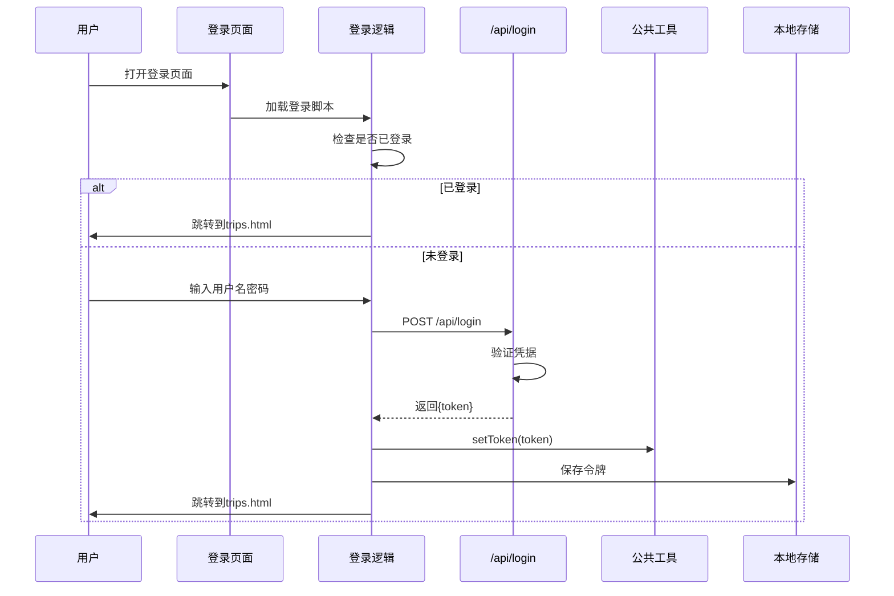
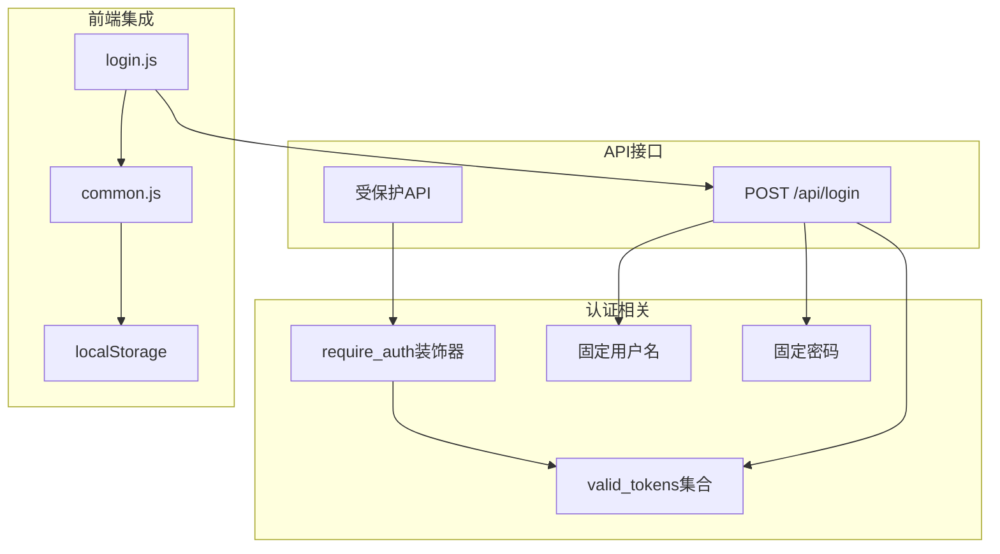

# 认证API

<cite>
**本文档引用的文件**
- [app.py](file://app.py)
- [assets/js/common.js](file://assets/js/common.js)
- [assets/js/login.js](file://assets/js/login.js)
- [login.html](file://login.html)
</cite>

## 目录
1. [简介](#简介)
2. [项目结构](#项目结构)
3. [核心组件](#核心组件)
4. [架构概览](#架构概览)
5. [详细组件分析](#详细组件分析)
6. [依赖关系分析](#依赖关系分析)
7. [性能考虑](#性能考虑)
8. [故障排除指南](#故障排除指南)
9. [结论](#结论)

## 简介

本文件详细说明了recorded项目的认证API，特别是登录接口的实现机制。该项目采用基于Bearer Token的简单认证方案，使用Flask框架构建RESTful API，并通过JavaScript前端进行交互。认证系统的核心包括JWT风格的令牌生成和验证、require_auth装饰器的实现、以及完整的错误处理机制。

## 项目结构

recorded项目采用前后端分离的架构设计，主要由以下组件构成：



**图表来源**
- [app.py:1-331](file://app.py#L1-L331)
- [assets/js/common.js:1-206](file://assets/js/common.js#L1-L206)
- [assets/js/login.js:1-44](file://assets/js/login.js#L1-L44)

**章节来源**
- [app.py:1-331](file://app.py#L1-L331)
- [assets/js/common.js:1-206](file://assets/js/common.js#L1-L206)
- [assets/js/login.js:1-44](file://assets/js/login.js#L1-L44)

## 核心组件

### 认证装饰器 require_auth

require_auth是项目中的核心认证组件，采用装饰器模式实现。该装饰器负责拦截所有受保护的API请求，验证客户端提供的令牌有效性。



**图表来源**
- [app.py:82-89](file://app.py#L82-L89)

### 登录接口 /api/login

登录接口实现了基于固定凭据的认证机制，生成临时令牌供后续API调用使用。



**图表来源**
- [app.py:106-115](file://app.py#L106-L115)

**章节来源**
- [app.py:82-89](file://app.py#L82-L89)
- [app.py:106-115](file://app.py#L106-L115)

## 架构概览

整个认证系统的架构采用分层设计，确保安全性和可维护性：

```mermaid
graph TB
subgraph "客户端层"
Browser[浏览器]
LocalStorage[localStorage<br/>存储令牌]
end
subgraph "API层"
LoginAPI[/api/login<br/>登录接口]
ProtectedAPI[受保护API<br/>/api/trips,/api/records]
end
subgraph "认证层"
RequireAuth[require_auth装饰器]
TokenValidation[令牌验证]
end
subgraph "存储层"
MemoryStore[内存令牌集合<br/>valid_tokens]
SQLiteDB[(SQLite数据库)]
end
Browser --> LoginAPI
Browser --> LocalStorage
LoginAPI --> MemoryStore
ProtectedAPI --> RequireAuth
RequireAuth --> TokenValidation
TokenValidation --> MemoryStore
ProtectedAPI --> SQLiteDB
```

**图表来源**
- [app.py:17-21](file://app.py#L17-L21)
- [app.py:82-89](file://app.py#L82-L89)

## 详细组件分析

### 认证装饰器实现详解

require_auth装饰器采用Python的装饰器语法，实现了透明的API保护机制：

#### 关键实现特性：
- **令牌提取**：从HTTP头Authorization中提取Bearer令牌
- **空值检查**：确保令牌不为空
- **有效性验证**：检查令牌是否存在于valid_tokens集合中
- **错误处理**：统一的401未授权响应格式

#### 令牌验证流程：



**图表来源**
- [app.py:85-87](file://app.py#L85-L87)

**章节来源**
- [app.py:82-89](file://app.py#L82-L89)

### 前端认证集成

前端通过common.js中的API封装实现了完整的认证流程：

#### 令牌管理功能：
- **getToken()**：从localStorage读取令牌
- **setToken()**：保存令牌到localStorage
- **clearToken()**：清除令牌
- **isLoggedIn()**：检查登录状态

#### API请求头自动添加：
前端在所有受保护的API请求中自动添加Authorization头，格式为"Bearer {token}"。

**章节来源**
- [assets/js/common.js:15-36](file://assets/js/common.js#L15-L36)
- [assets/js/common.js:39-132](file://assets/js/common.js#L39-L132)

### 登录流程完整示例

#### 正确的登录流程：



**图表来源**
- [assets/js/login.js:13-34](file://assets/js/login.js#L13-L34)
- [assets/js/common.js:19-21](file://assets/js/common.js#L19-L21)

**章节来源**
- [assets/js/login.js:1-44](file://assets/js/login.js#L1-L44)
- [assets/js/common.js:59-71](file://assets/js/common.js#L59-L71)

## 依赖关系分析

认证系统各组件之间的依赖关系如下：



**图表来源**
- [app.py:17-18](file://app.py#L17-L18)
- [app.py:21](file://app.py#L21)
- [app.py:82-89](file://app.py#L82-L89)

**章节来源**
- [app.py:17-18](file://app.py#L17-L18)
- [app.py:21](file://app.py#L21)
- [app.py:82-89](file://app.py#L82-L89)

## 性能考虑

### 令牌存储优化
- **内存存储**：使用Python集合存储令牌，查询时间复杂度为O(1)
- **简单设计**：避免复杂的令牌持久化机制，简化部署

### 认证检查效率
- **快速验证**：令牌验证仅涉及简单的集合查找操作
- **零数据库查询**：认证过程不需要访问数据库，减少I/O开销

### 内存使用考量
- **令牌生命周期**：令牌存储在内存中，服务器重启后所有令牌失效
- **内存泄漏预防**：当前实现没有令牌过期清理机制

## 故障排除指南

### 常见认证问题及解决方案

#### 1. 401 未授权错误
**症状**：API调用返回401状态码
**可能原因**：
- 未提供Authorization头
- 令牌格式错误（缺少Bearer前缀）
- 令牌不在有效集合中
- 令牌已被服务器重启清除

**解决方法**：
```javascript
// 确保正确的请求头格式
const headers = {
    'Content-Type': 'application/json',
    'Authorization': 'Bearer ' + token  // 必须包含Bearer前缀
};
```

#### 2. 登录失败
**症状**：登录接口返回401状态码
**可能原因**：
- 用户名或密码错误
- 服务器配置问题

**解决方法**：
- 确认用户名为"lou"
- 确认密码为"123"
- 检查服务器日志

#### 3. 会话状态异常
**症状**：登录后仍提示未登录
**可能原因**：
- 浏览器禁用了localStorage
- 令牌存储失败

**解决方法**：
```javascript
// 检查localStorage可用性
if (typeof(Storage) !== "undefined") {
    console.log('localStorage可用');
} else {
    console.log('localStorage不可用');
}
```

**章节来源**
- [assets/js/common.js:47-56](file://assets/js/common.js#L47-L56)
- [app.py:85-87](file://app.py#L85-L87)

## 结论

recorded项目的认证API采用简洁而有效的设计，通过以下特点实现了可靠的用户认证：

### 设计优势
- **简单可靠**：基于固定凭据的认证机制，易于理解和维护
- **透明保护**：require_auth装饰器提供统一的API保护
- **前后端协作**：前端自动处理令牌存储和请求头添加
- **快速响应**：内存存储确保认证检查的高性能

### 安全考虑
- **令牌存储**：当前实现为内存存储，适合开发环境
- **令牌管理**：支持令牌的动态生成和失效
- **错误处理**：统一的401错误响应格式

### 扩展建议
对于生产环境，建议考虑以下改进：
- 实现令牌过期机制
- 添加令牌刷新功能
- 使用更安全的令牌存储方案
- 增加登录尝试限制
- 实现更灵活的用户管理系统

该认证系统为recorded项目提供了坚实的安全基础，支持后续的功能扩展和业务发展。