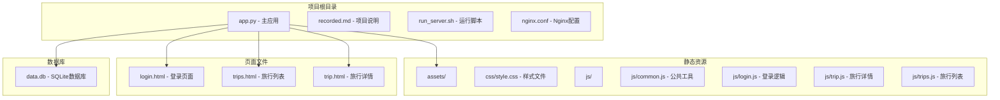
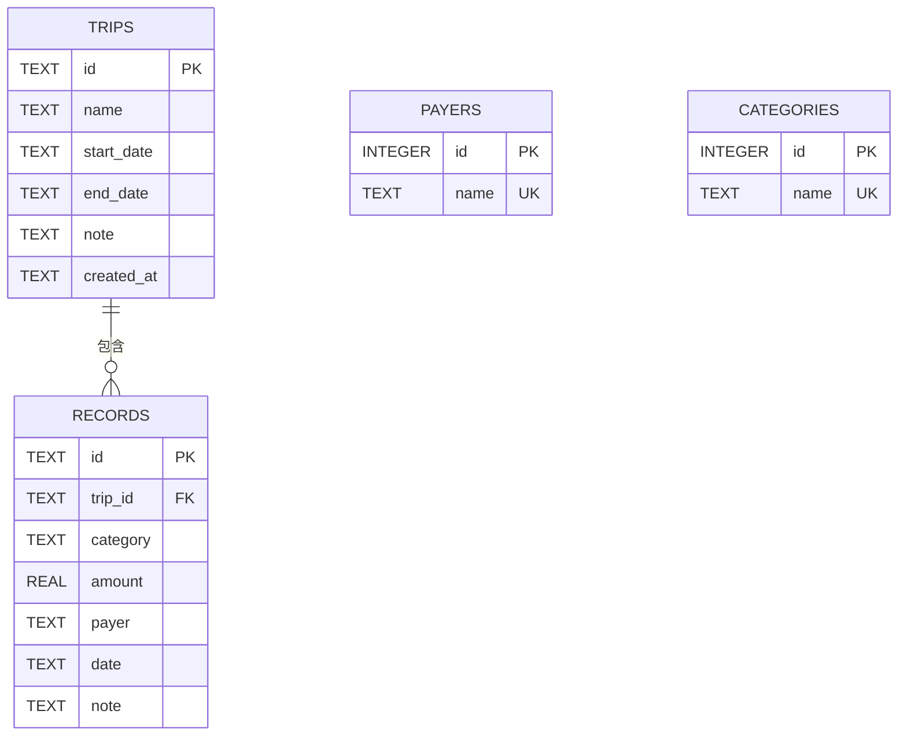
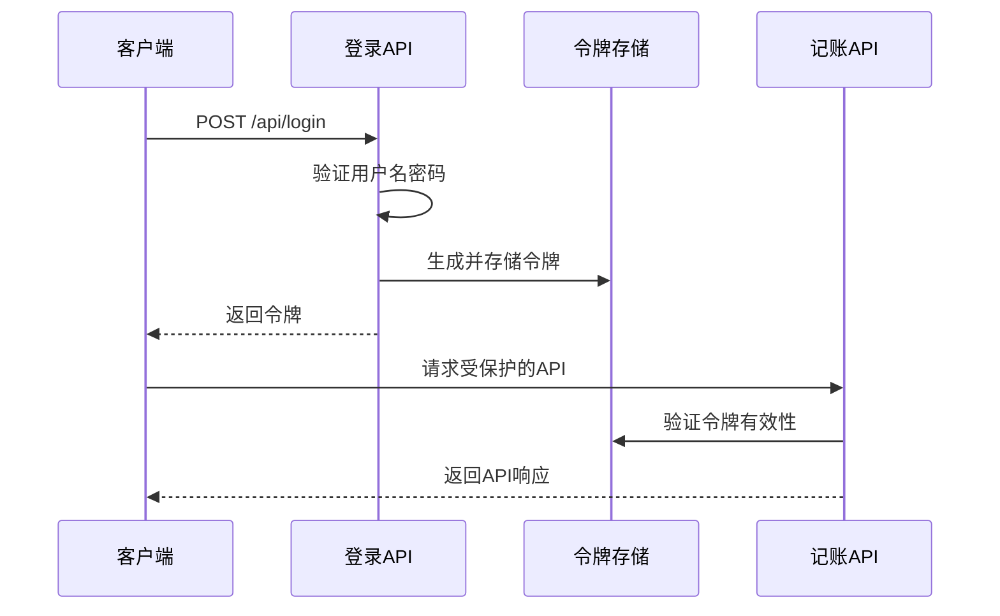
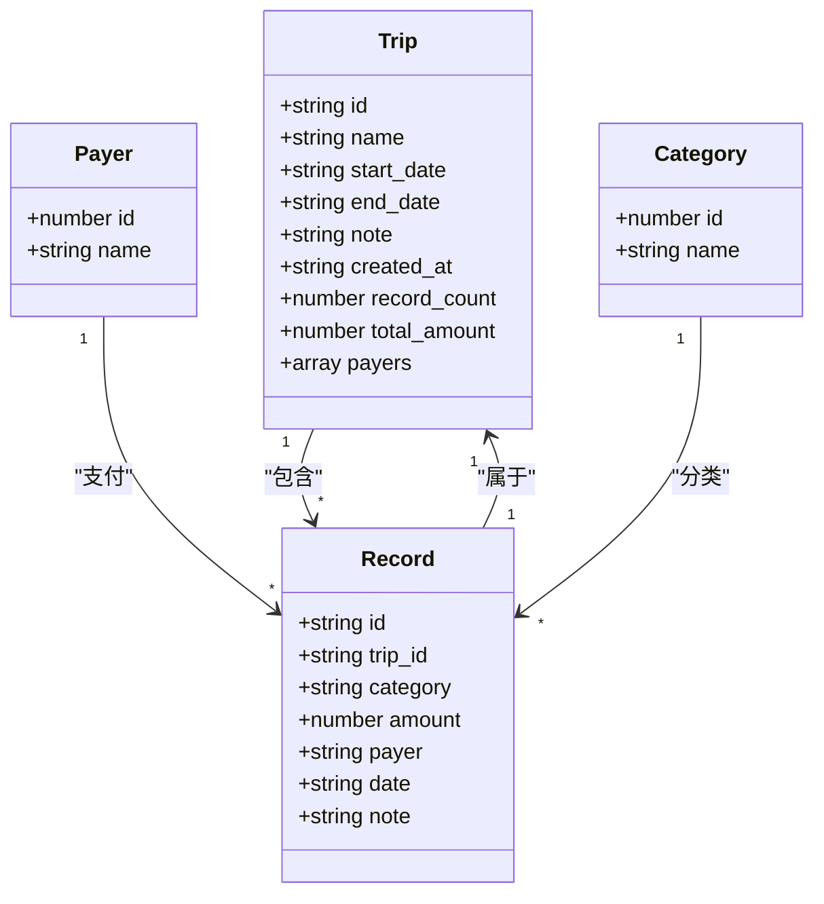
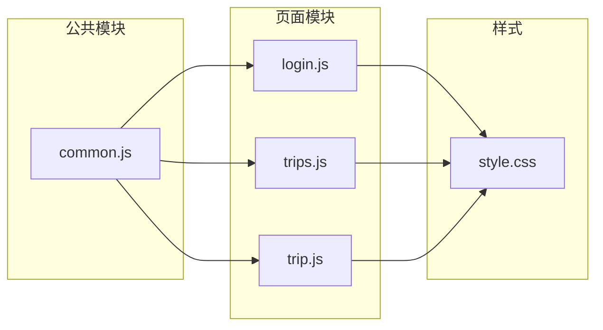
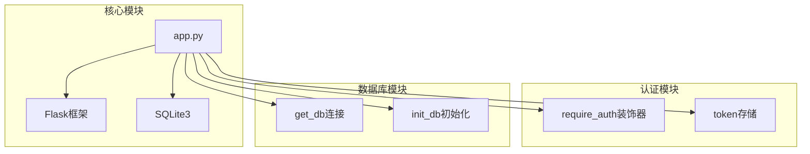

# 记账记录API

<cite>
**本文档引用的文件**
- [app.py](file://app.py)
- [common.js](file://assets/js/common.js)
- [trip.js](file://assets/js/trip.js)
- [trips.js](file://assets/js/trips.js)
- [style.css](file://assets/css/style.css)
- [login.html](file://login.html)
- [trips.html](file://trips.html)
- [trip.html](file://trip.html)
- [recorded.md](file://recorded.md)
</cite>

## 目录
1. [简介](#简介)
2. [项目结构](#项目结构)
3. [核心组件](#核心组件)
4. [架构概览](#架构概览)
5. [详细组件分析](#详细组件分析)
6. [依赖关系分析](#依赖关系分析)
7. [性能考虑](#性能考虑)
8. [故障排除指南](#故障排除指南)
9. [结论](#结论)

## 简介

recorded是一个基于Flask的旅游记账系统，提供了完整的记账记录管理功能。该系统支持多旅行的独立记账，自动记录支付人和类别，以及丰富的统计分析功能。系统采用前后端分离架构，后端使用Python Flask框架，前端使用原生JavaScript实现。

根据项目需求文档，系统主要功能包括：
- 以旅游记账为主的记账功能
- 旅行费用的主要分类：交通工具、住宿、餐费、打车
- 分离每次旅游的记账信息
- 支付人管理（保留输入过的支付人）
- 记账内容的总结功能
- 通过微信打开的自适应页面

## 项目结构



**图表来源**
- [app.py:1-331](file://app.py#L1-L331)
- [style.css:1-273](file://assets/css/style.css#L1-L273)

**章节来源**
- [app.py:1-331](file://app.py#L1-L331)
- [recorded.md:1-9](file://recorded.md#L1-L9)

## 核心组件

### 数据库设计

系统使用SQLite作为数据存储，包含以下核心表结构：



**图表来源**
- [app.py:46-78](file://app.py#L46-L78)

### 默认类别配置

系统预设了四个默认类别，确保基本记账需求：
- 交通工具（飞机/动车/自驾）
- 住宿
- 餐费
- 打车

这些类别在数据库初始化时自动插入，使用`INSERT OR IGNORE`确保不会重复创建。

**章节来源**
- [app.py:23](file://app.py#L23)
- [app.py:74-77](file://app.py#L74-L77)

## 架构概览

```mermaid
graph TB
subgraph "客户端层"
A[浏览器]
B[移动端微信]
end
subgraph "前端应用"
C[common.js - API封装]
D[trip.js - 旅行详情]
E[trips.js - 旅行列表]
F[login.js - 登录逻辑]
end
subgraph "后端服务"
G[Flask应用]
H[认证中间件]
I[数据库连接]
end
subgraph "数据存储"
J[SQLite数据库]
K[数据表]
end
A --> C
B --> C
C --> G
G --> H
G --> I
I --> J
J --> K
subgraph "API端点"
L[/api/login]
M[/api/trips]
N[/api/trips/{trip_id}]
O[/api/trips/{trip_id}/records]
P[/api/records/{rec_id}]
Q[/api/payers]
R[/api/categories]
end
G --> L
G --> M
G --> N
G --> O
G --> P
G --> Q
G --> R
```

**图表来源**
- [app.py:106-314](file://app.py#L106-L314)
- [common.js:39-132](file://assets/js/common.js#L39-L132)

## 详细组件分析

### 记账记录API详解

#### POST /api/trips/{trip_id}/records - 创建消费记录

**功能描述**
创建指定旅行的消费记录，支持自动记录支付人和类别信息。

**请求参数**
| 参数名 | 类型 | 必填 | 描述 | 验证规则 |
|--------|------|------|------|----------|
| category | string | 是 | 记账类别 | 非空，最小长度1字符 |
| amount | number | 是 | 金额 | 正数，大于0 |
| payer | string | 是 | 支付人 | 非空，最小长度1字符 |
| date | string | 否 | 日期 | ISO格式日期字符串 |
| note | string | 否 | 备注 | 可为空 |

**数据验证规则**
1. **类别验证**：必须非空，去除首尾空白字符
2. **金额验证**：必须为正数，转换为浮点数后必须大于0
3. **支付人验证**：必须非空，去除首尾空白字符
4. **日期验证**：可选，格式为ISO日期字符串
5. **备注验证**：可选，去除首尾空白字符

**自动填充机制**
- 自动生成唯一记录ID（UUID十六进制前16位）
- 自动记录支付人：使用`INSERT OR IGNORE INTO payers`避免重复
- 自动记录类别：使用`INSERT OR IGNORE INTO categories`避免重复
- 自动设置创建时间：使用数据库内置`datetime("now")`

**响应格式**
- 成功：返回记录ID，HTTP状态码201
- 失败：返回错误信息，HTTP状态码400或404

**请求示例**
```javascript
// 基本请求
{
  "category": "餐费",
  "amount": 150.50,
  "payer": "张三",
  "date": "2024-01-15",
  "note": "午餐聚餐"
}

// 自定义类别和支付人
{
  "category": "景点门票",
  "amount": 80.00,
  "payer": "李四",
  "date": "2024-01-16"
}
```

**响应示例**
```javascript
// 成功响应
{
  "id": "abc123def456ghi7"
}

// 错误响应
{
  "error": "金额必须为正数"
}
```

**章节来源**
- [app.py:208-236](file://app.py#L208-L236)
- [trip.js:161-197](file://assets/js/trip.js#L161-L197)

#### PUT /api/records/{rec_id} - 更新记录

**功能描述**
更新指定的记账记录信息。

**请求参数**
与创建记录相同，但所有参数都是可选的。

**更新逻辑**
1. 首先检查记录是否存在，不存在则返回404
2. 应用相同的验证规则
3. 更新记录的所有字段
4. 自动同步支付人和类别信息

**响应格式**
- 成功：返回`{"ok": true}`，HTTP状态码200
- 失败：返回错误信息，HTTP状态码400或404

**请求示例**
```javascript
{
  "category": "交通费",
  "amount": 200.00,
  "payer": "王五",
  "date": "2024-01-17",
  "note": "高铁票"
}
```

**响应示例**
```javascript
{
  "ok": true
}
```

**章节来源**
- [app.py:238-264](file://app.py#L238-L264)
- [trip.js:282-313](file://assets/js/trip.js#L282-L313)

#### DELETE /api/records/{rec_id} - 删除记录

**功能描述**
删除指定的记账记录。

**删除逻辑**
1. 检查记录是否存在
2. 直接执行删除操作
3. 不影响相关的支付人和类别信息

**响应格式**
- 成功：返回`{"ok": true}`，HTTP状态码200
- 失败：返回错误信息，HTTP状态码404

**请求示例**
```javascript
// DELETE /api/records/abc123def456ghi7
```

**响应示例**
```javascript
{
  "ok": true
}
```

**章节来源**
- [app.py:266-272](file://app.py#L266-L272)
- [trip.js:246-255](file://assets/js/trip.js#L246-L255)

### 认证和授权

系统使用简单的令牌认证机制：



**图表来源**
- [app.py:106-115](file://app.py#L106-L115)
- [common.js:59-71](file://assets/js/common.js#L59-L71)

**章节来源**
- [app.py:82-89](file://app.py#L82-L89)
- [common.js:16-36](file://assets/js/common.js#L16-L36)

### 数据模型和关系



**图表来源**
- [app.py:47-72](file://app.py#L47-L72)
- [trip.js:110-123](file://assets/js/trip.js#L110-L123)

**章节来源**
- [app.py:208-272](file://app.py#L208-L272)

## 依赖关系分析

### 前端依赖关系



**图表来源**
- [common.js:1-206](file://assets/js/common.js#L1-L206)
- [login.html:28-29](file://login.html#L28-L29)
- [trips.html:56-57](file://trips.html#L56-L57)
- [trip.html:151-152](file://trip.html#L151-L152)

### 后端依赖关系



**图表来源**
- [app.py:9-39](file://app.py#L9-L39)
- [app.py:82-89](file://app.py#L82-L89)
- [app.py:27-39](file://app.py#L27-L39)

**章节来源**
- [app.py:1-331](file://app.py#L1-L331)

## 性能考虑

### 数据库优化
- 使用WAL模式提高并发性能
- 启用外键约束保证数据完整性
- 使用事务批量操作减少磁盘I/O

### 前端性能
- 使用本地存储缓存令牌，避免重复登录
- 按需加载数据，减少初始页面大小
- 移动端自适应设计，优化触摸体验

### API性能
- 使用UUID作为主键，避免序列号带来的竞争
- 合理的索引策略（外键自动建立索引）
- 最小化响应数据量，只传输必要字段

## 故障排除指南

### 常见错误及解决方案

**认证相关错误**
- **401 未登录或登录已过期**：检查Authorization头是否正确设置，确认令牌未过期
- **403 访问被拒绝**：确认用户权限和令牌有效性

**数据验证错误**
- **400 参数无效**：检查请求参数格式，确保金额为正数，类别和支付人非空
- **404 资源不存在**：确认旅行ID或记录ID的有效性

**数据库相关错误**
- **500 内部服务器错误**：检查数据库连接和权限
- **数据重复**：系统会自动处理重复的支付人和类别，无需手动干预

**章节来源**
- [app.py:82-89](file://app.py#L82-L89)
- [app.py:216-226](file://app.py#L216-L226)

### 调试建议

1. **检查网络请求**：使用浏览器开发者工具查看API请求和响应
2. **验证令牌**：确认Authorization头格式为"Bearer token"
3. **测试数据库**：直接查询SQLite数据库验证数据一致性
4. **查看控制台**：检查JavaScript错误和API响应

## 结论

recorded项目提供了一个完整且实用的旅游记账解决方案。系统具有以下特点：

**技术优势**
- 简洁的前后端分离架构
- 完善的数据验证和错误处理
- 自动化的数据管理和去重机制
- 移动端友好的界面设计

**功能特性**
- 支持多旅行独立记账
- 自动记录支付人和类别
- 丰富的统计分析功能
- 完整的CRUD操作支持

**扩展建议**
- 添加用户账户系统替代固定凭据
- 实现数据导出功能
- 增加更多统计图表和报告
- 支持图片附件和发票扫描

该系统为个人和小团队的旅游记账提供了可靠的解决方案，代码结构清晰，易于维护和扩展。