# 前端页面详解

<cite>
**本文档引用的文件**
- [login.html](file://login.html)
- [trips.html](file://trips.html)
- [trip.html](file://trip.html)
- [settings.html](file://settings.html)
- [style.css](file://assets/css/style.css)
- [common.js](file://assets/js/common.js)
- [login.js](file://assets/js/login.js)
- [trips.js](file://assets/js/trips.js)
- [trip.js](file://assets/js/trip.js)
- [settings.js](file://assets/js/settings.js)
</cite>

## 目录
1. [简介](#简介)
2. [项目结构](#项目结构)
3. [核心组件](#核心组件)
4. [架构概览](#架构概览)
5. [详细组件分析](#详细组件分析)
6. [依赖关系分析](#依赖关系分析)
7. [性能考虑](#性能考虑)
8. [故障排除指南](#故障排除指南)
9. [结论](#结论)

## 简介

recorded是一个基于Web的旅游记账应用，采用前后端分离的架构设计。该项目提供了四个核心前端页面：登录页面、旅行列表页面、记账详情页面和设置页面。系统使用原生JavaScript实现前端逻辑，配合CSS样式构建响应式界面，并通过RESTful API与后端服务进行数据交互。

该应用特别针对微信浏览器等移动设备进行了优化，提供了流畅的移动端用户体验。所有页面都遵循统一的设计语言和交互模式，确保用户在不同页面间切换时的一致性体验。

## 项目结构

项目采用简洁的文件组织结构，主要包含以下目录和文件：

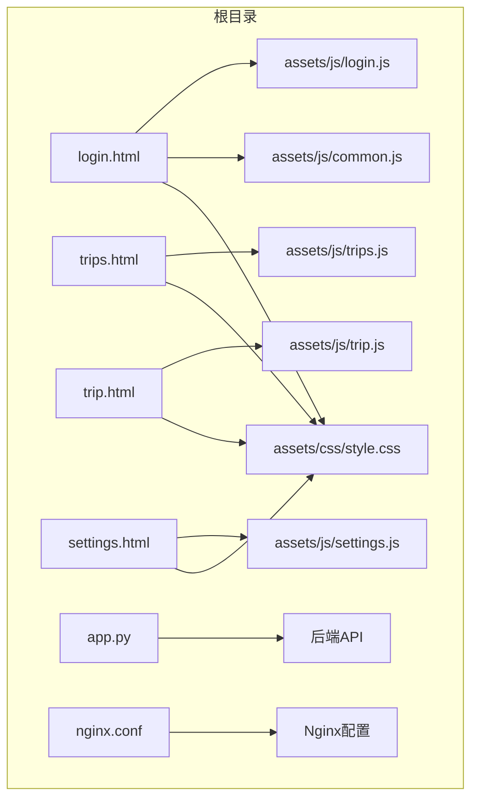

**图表来源**
- [login.html:1-32](file://login.html#L1-L32)
- [trips.html:1-61](file://trips.html#L1-L61)
- [trip.html:1-156](file://trip.html#L1-L156)
- [settings.html:1-83](file://settings.html#L1-L83)

项目的核心特点：
- **静态页面设计**：所有前端页面都是独立的HTML文件，便于部署和维护
- **模块化JavaScript**：每个页面都有对应的JavaScript文件，实现功能模块化
- **统一样式系统**：共享CSS文件提供一致的视觉设计和响应式布局
- **API驱动架构**：通过RESTful API与后端服务通信

**章节来源**
- [login.html:1-32](file://login.html#L1-L32)
- [trips.html:1-61](file://trips.html#L1-L61)
- [trip.html:1-156](file://trip.html#L1-L156)
- [settings.html:1-83](file://settings.html#L1-L83)

## 核心组件

### 页面架构组件

系统由四个主要页面构成，每个页面都有其独特的功能和设计：

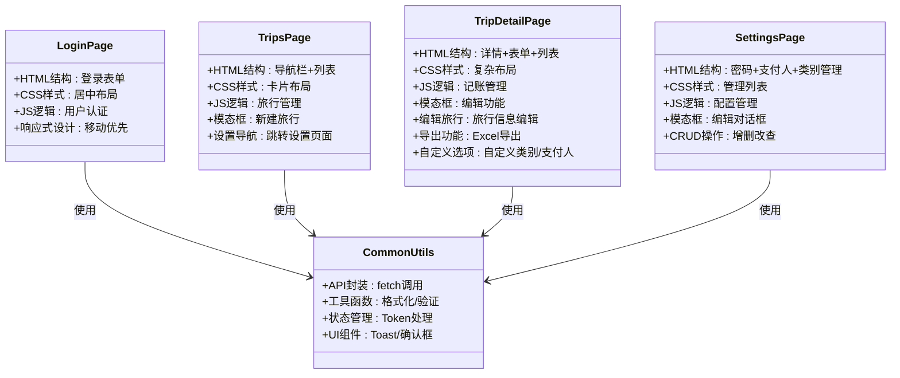

**图表来源**
- [common.js:1-206](file://assets/js/common.js#L1-L206)
- [login.js:1-44](file://assets/js/login.js#L1-L44)
- [trips.js:1-136](file://assets/js/trips.js#L1-L136)
- [trip.js:1-411](file://assets/js/trip.js#L1-L411)
- [settings.js:1-235](file://assets/js/settings.js#L1-L235)

### 样式系统组件

CSS采用现代设计系统，支持主题变量和响应式设计：

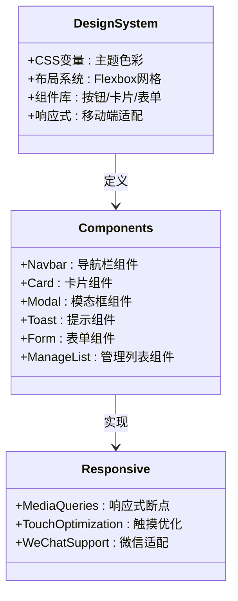

**图表来源**
- [style.css:1-283](file://assets/css/style.css#L1-L283)

**章节来源**
- [style.css:1-283](file://assets/css/style.css#L1-L283)
- [common.js:1-206](file://assets/js/common.js#L1-L206)

## 架构概览

系统采用客户端-服务器架构，前端负责用户界面和交互逻辑，后端提供RESTful API服务。

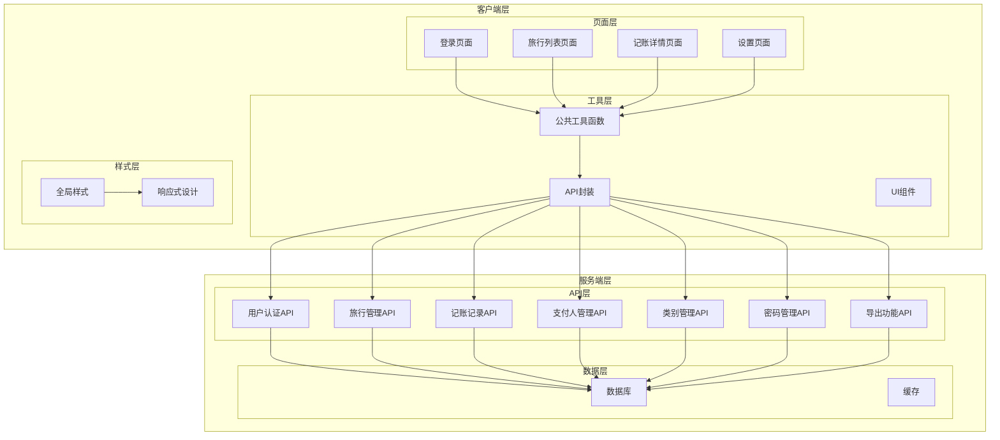

**图表来源**
- [common.js:39-132](file://assets/js/common.js#L39-L132)
- [login.html:1-32](file://login.html#L1-L32)
- [trips.html:1-61](file://trips.html#L1-L61)
- [trip.html:1-156](file://trip.html#L1-L156)
- [settings.html:1-83](file://settings.html#L1-L83)

### 数据流架构

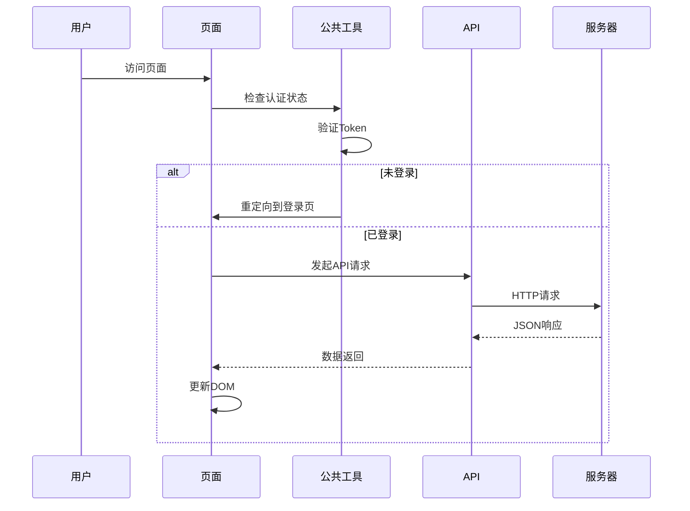

**图表来源**
- [common.js:25-36](file://assets/js/common.js#L25-L36)
- [login.js:1-44](file://assets/js/login.js#L1-L44)
- [trips.js:1-136](file://assets/js/trips.js#L1-L136)

## 详细组件分析

### 登录页面分析

登录页面是系统的入口页面，负责用户身份验证和权限控制。

#### HTML结构设计

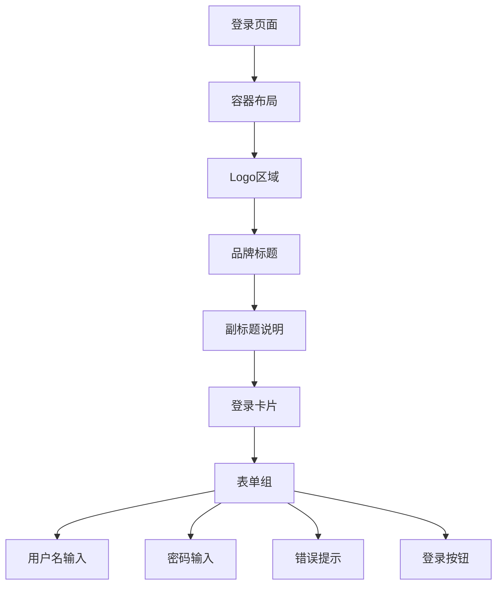

**图表来源**
- [login.html:10-27](file://login.html#L10-L27)

#### 样式设计特点

登录页面采用居中布局设计，强调品牌识别和用户体验：

- **视觉层次**：使用品牌蓝色作为主色调，营造专业可信感
- **响应式设计**：在小屏幕设备上自动调整内边距和字体大小
- **焦点状态**：输入框获得焦点时显示高亮效果
- **错误状态**：错误信息以红色显示，提升可读性

#### JavaScript交互逻辑

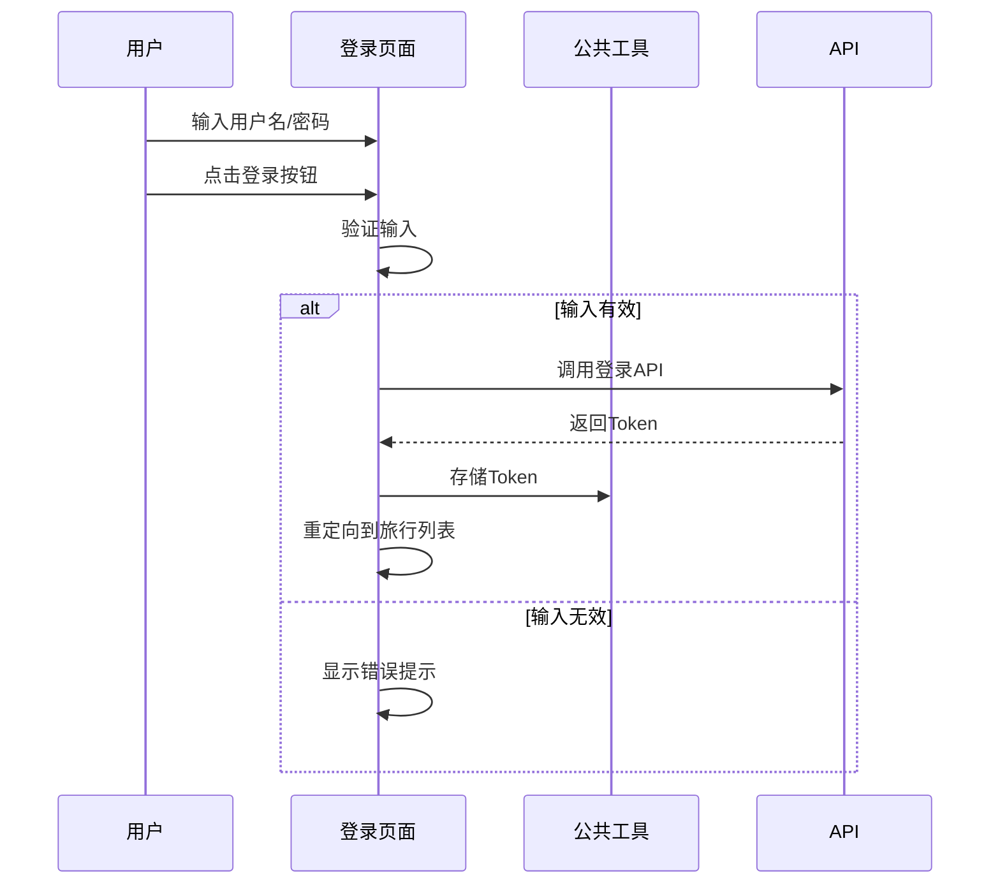

**图表来源**
- [login.js:13-34](file://assets/js/login.js#L13-L34)

**章节来源**
- [login.html:1-32](file://login.html#L1-L32)
- [login.js:1-44](file://assets/js/login.js#L1-L44)

### 旅行列表页面分析

旅行列表页面提供旅行项目的管理和导航功能。

#### HTML结构设计

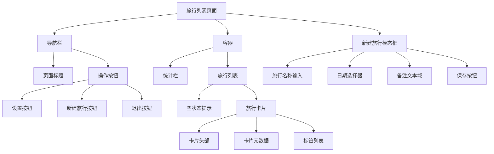

**图表来源**
- [trips.html:11-54](file://trips.html#L11-L54)

#### 样式设计特点

旅行列表页面采用卡片式布局，突出信息层次和交互元素：

- **统计展示**：使用统计栏展示关键指标
- **卡片设计**：每个旅行项目以卡片形式呈现
- **标签系统**：支付人信息以标签形式显示
- **模态框设计**：新建旅行采用底部弹出式模态框
- **设置导航**：新增设置按钮提供配置入口

#### JavaScript交互逻辑

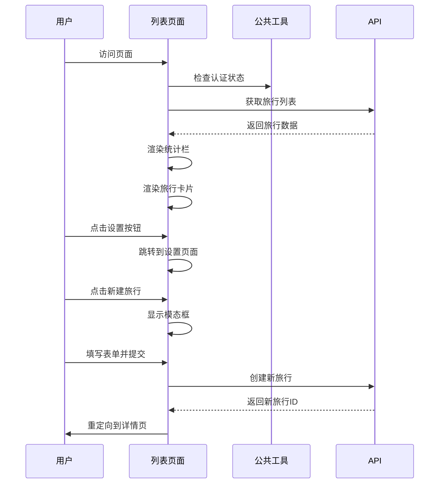

**图表来源**
- [trips.js:17-121](file://assets/js/trips.js#L17-L121)

**章节来源**
- [trips.html:1-61](file://trips.html#L1-L61)
- [trips.js:1-136](file://assets/js/trips.js#L1-L136)

### 记账详情页面分析

记账详情页面是最复杂的页面，提供完整的旅行记账功能。

#### HTML结构设计

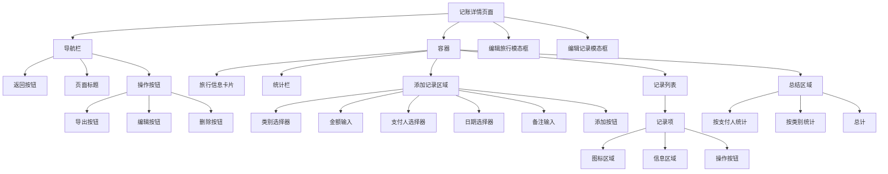

**图表来源**
- [trip.html:11-149](file://trip.html#L11-L149)

#### 样式设计特点

记账详情页面采用复杂布局，需要平衡信息密度和可读性：

- **多级标题**：使用分割线分隔不同功能区域
- **灵活布局**：支持横向排列的表单控件
- **图标系统**：为不同类别分配专用图标和颜色
- **响应式表格**：统计区域采用卡片式布局
- **编辑功能**：新增旅行信息编辑和记录编辑功能
- **导出功能**：支持Excel格式导出

#### JavaScript交互逻辑

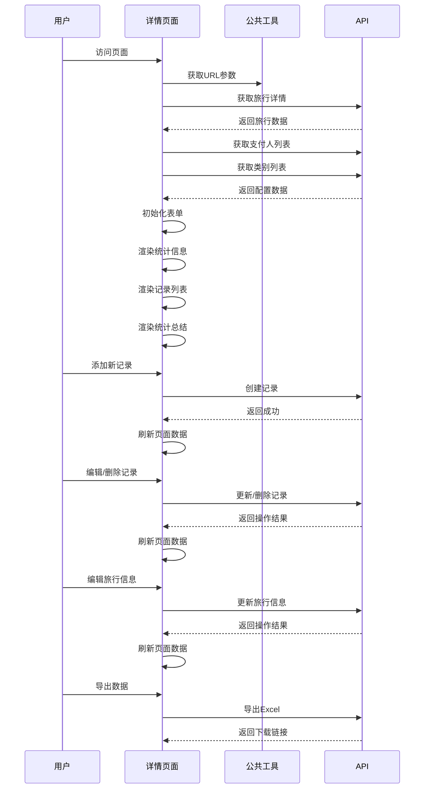

**图表来源**
- [trip.js:105-123](file://assets/js/trip.js#L105-L123)

**章节来源**
- [trip.html:1-156](file://trip.html#L1-L156)
- [trip.js:1-411](file://assets/js/trip.js#L1-L411)

### 设置页面分析

设置页面提供用户配置和系统管理功能。

#### HTML结构设计

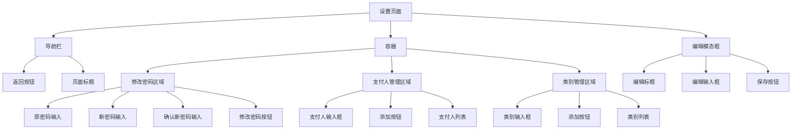

**图表来源**
- [settings.html:11-61](file://settings.html#L11-L61)

#### 样式设计特点

设置页面采用管理列表设计，突出配置功能：

- **分区设计**：使用分割标题区分不同功能区域
- **卡片布局**：每个功能区域以卡片形式呈现
- **表单设计**：简洁的表单控件布局
- **列表管理**：支持增删改查操作
- **模态框编辑**：提供统一的编辑体验

#### JavaScript交互逻辑

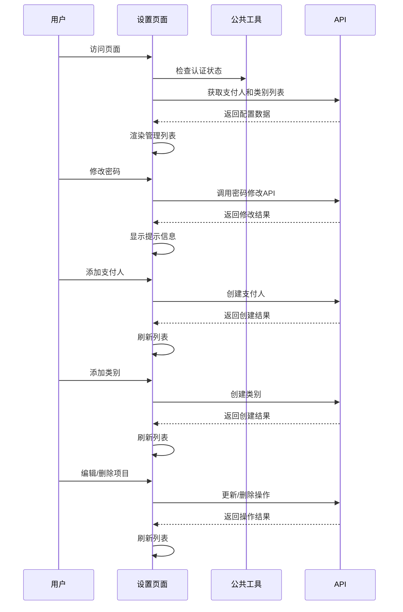

**图表来源**
- [settings.js:27-37](file://assets/js/settings.js#L27-L37)

**章节来源**
- [settings.html:1-83](file://settings.html#L1-L83)
- [settings.js:1-235](file://assets/js/settings.js#L1-L235)

## 依赖关系分析

系统采用模块化设计，各组件之间的依赖关系清晰明确。

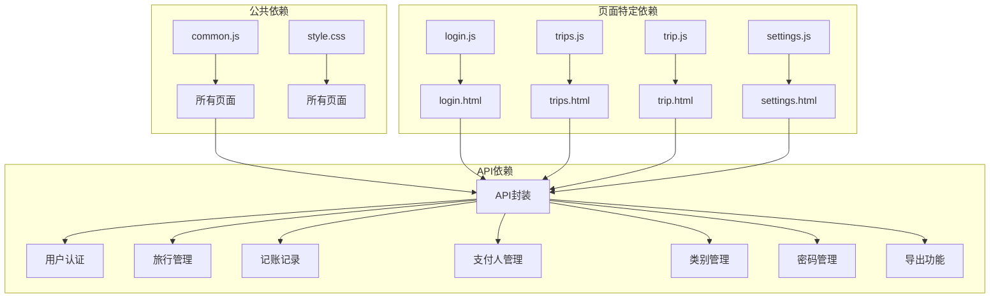

**图表来源**
- [common.js:39-132](file://assets/js/common.js#L39-L132)
- [login.js:1-44](file://assets/js/login.js#L1-L44)
- [trips.js:1-136](file://assets/js/trips.js#L1-L136)
- [trip.js:1-411](file://assets/js/trip.js#L1-L411)
- [settings.js:1-235](file://assets/js/settings.js#L1-L235)

### 数据传递机制

系统通过多种方式实现页面间的数据传递：

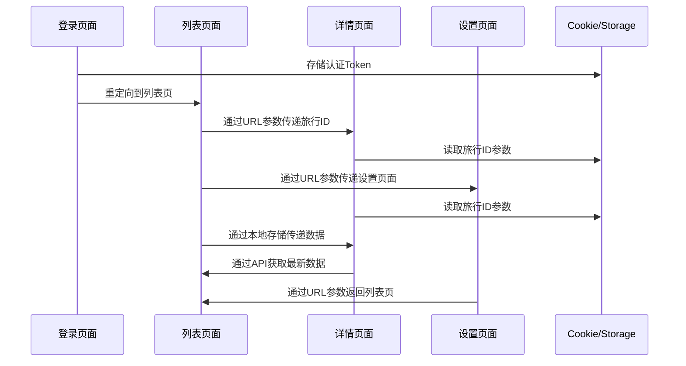

**图表来源**
- [login.js:24-26](file://assets/js/login.js#L24-L26)
- [trips.js:76-78](file://assets/js/trips.js#L76-L78)
- [trip.js:4-5](file://assets/js/trip.js#L4-L5)
- [settings.js:228-230](file://assets/js/settings.js#L228-L230)

**章节来源**
- [common.js:14-145](file://assets/js/common.js#L14-L145)
- [login.js:1-44](file://assets/js/login.js#L1-L44)
- [trips.js:1-136](file://assets/js/trips.js#L1-L136)
- [trip.js:1-411](file://assets/js/trip.js#L1-L411)
- [settings.js:1-235](file://assets/js/settings.js#L1-L235)

## 性能考虑

### 响应式设计实现

系统采用移动优先的设计策略，针对不同设备提供优化的用户体验：

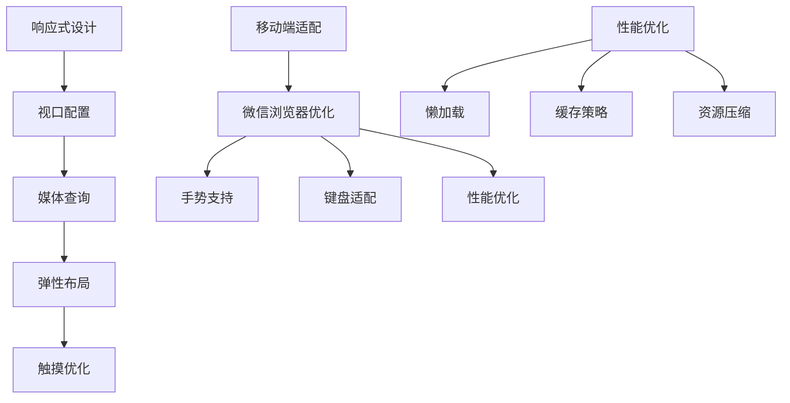

**图表来源**
- [style.css:268-273](file://assets/css/style.css#L268-L273)
- [login.html:5-6](file://login.html#L5-L6)
- [trips.html:5-6](file://trips.html#L5-L6)
- [trip.html:5-6](file://trip.html#L5-L6)
- [settings.html:5-6](file://settings.html#L5-L6)

### 性能优化建议

1. **代码分割**：将大型JavaScript文件拆分为更小的模块
2. **图片优化**：使用适当的图片格式和尺寸
3. **缓存策略**：合理设置HTTP缓存头
4. **异步加载**：延迟加载非关键资源
5. **内存管理**：及时清理事件监听器和DOM引用
6. **模态框优化**：使用CSS动画替代JavaScript动画
7. **列表虚拟化**：对于大量数据使用虚拟滚动

### 用户体验改进建议

1. **加载状态**：为长操作提供进度指示器
2. **错误处理**：提供友好的错误消息和重试机制
3. **无障碍访问**：支持键盘导航和屏幕阅读器
4. **离线支持**：实现基本的离线功能
5. **性能监控**：集成性能监控和用户行为分析
6. **手势支持**：为移动端提供更好的手势交互
7. **动画优化**：使用硬件加速的CSS动画

## 故障排除指南

### 常见问题诊断

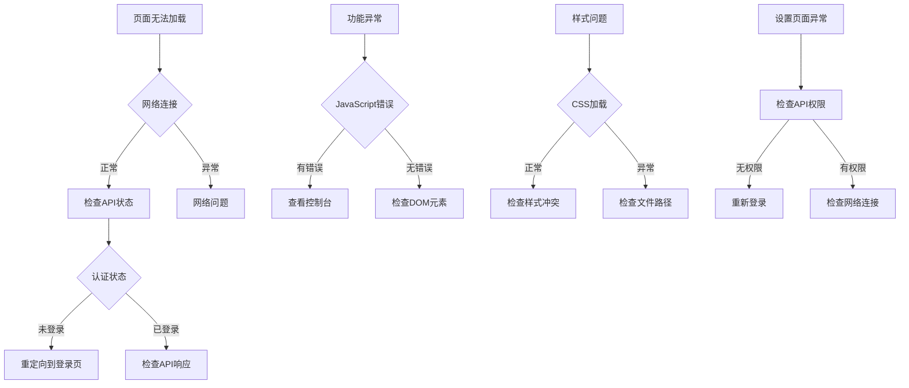

### 错误处理机制

系统实现了多层次的错误处理机制：

1. **API错误处理**：自动处理401未授权和请求失败
2. **表单验证**：实时验证用户输入的有效性
3. **用户反馈**：通过Toast和确认框提供即时反馈
4. **降级处理**：在网络异常时提供基本功能
5. **设置页面保护**：防止重复提交和无效操作

**章节来源**
- [common.js:47-57](file://assets/js/common.js#L47-L57)
- [login.js:24-33](file://assets/js/login.js#L24-L33)
- [trips.js:21-23](file://assets/js/trips.js#L21-L23)
- [trip.js:120-122](file://assets/js/trip.js#L120-L122)
- [settings.js:124-151](file://assets/js/settings.js#L124-L151)

## 结论

recorded项目展现了优秀的前端工程实践，具有以下显著特点：

### 技术优势

1. **架构清晰**：采用模块化设计，职责分离明确
2. **用户体验优秀**：响应式设计和移动端优化到位
3. **代码质量高**：结构化编程和良好的错误处理机制
4. **可维护性强**：清晰的文件组织和注释规范
5. **功能完整性**：涵盖从登录到设置的完整业务流程
6. **扩展性强**：模块化设计便于功能扩展和定制

### 改进建议

1. **现代化框架**：考虑迁移到React/Vue等现代框架
2. **测试覆盖**：增加单元测试和集成测试
3. **性能监控**：集成性能监控和用户体验分析
4. **国际化支持**：添加多语言支持功能
5. **离线功能**：实现基本的离线数据同步
6. **手势优化**：为移动端提供更好的手势交互体验

### 扩展指导

开发者可以按照以下原则对系统进行定制和扩展：

1. **保持一致性**：遵循现有的设计系统和命名约定
2. **模块化开发**：将新功能封装为独立模块
3. **API兼容性**：确保与现有API接口保持兼容
4. **测试驱动**：先编写测试再实现功能
5. **性能优先**：在扩展功能时考虑性能影响
6. **用户体验**：始终以用户为中心进行设计决策

该系统为旅游记账应用提供了一个坚实的基础，通过合理的架构设计和用户体验优化，能够满足用户的日常使用需求，并为未来的功能扩展奠定了良好的技术基础。