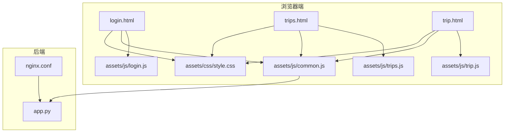
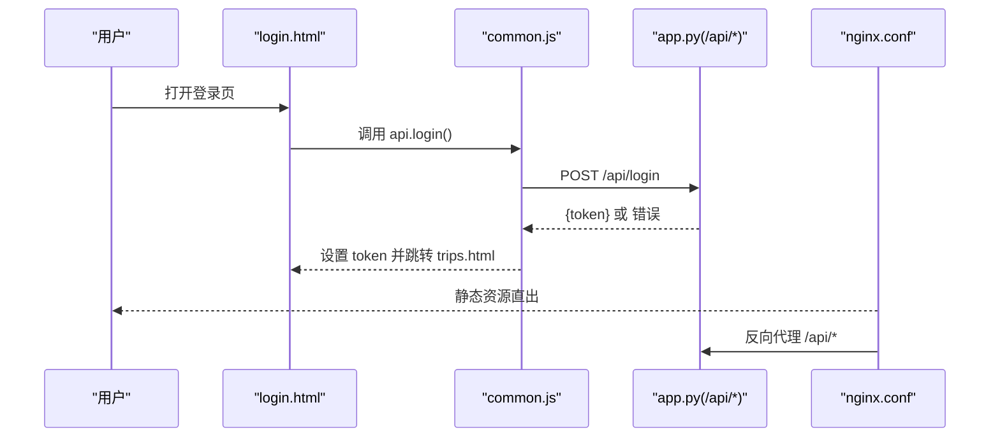
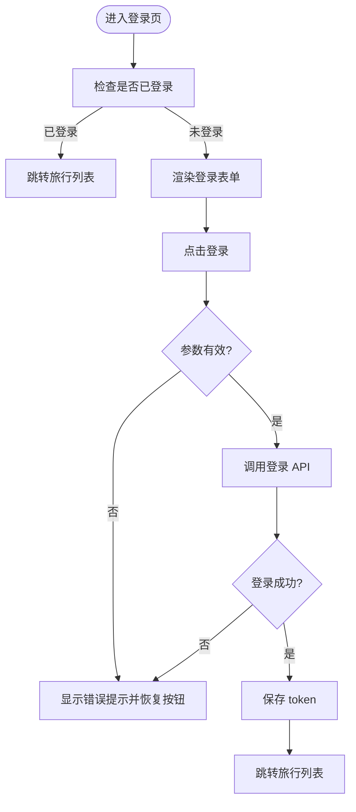
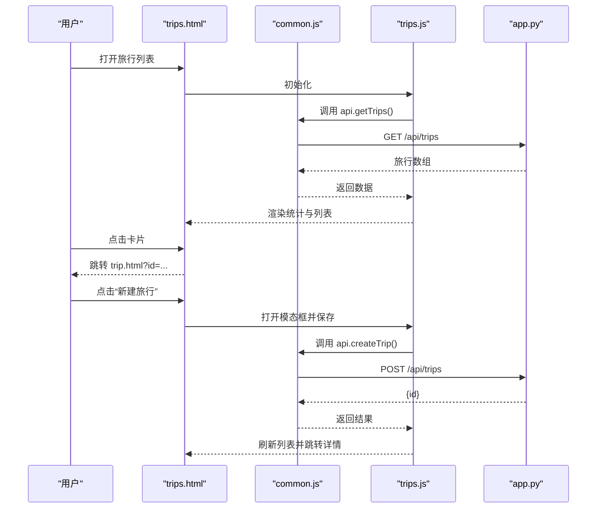
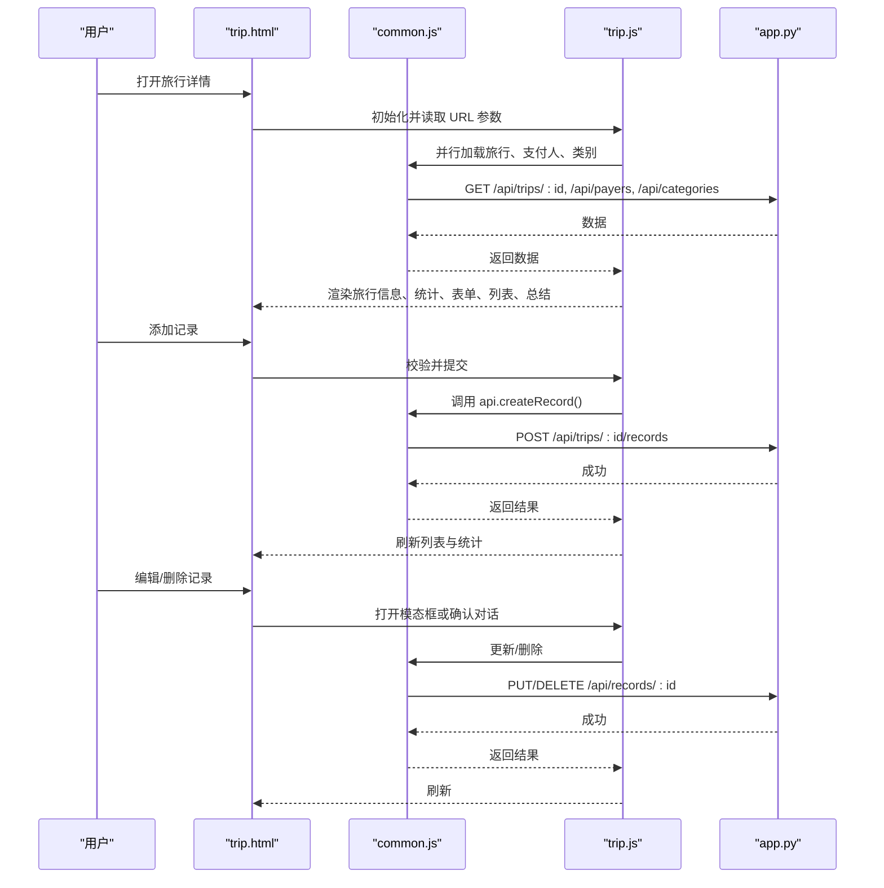
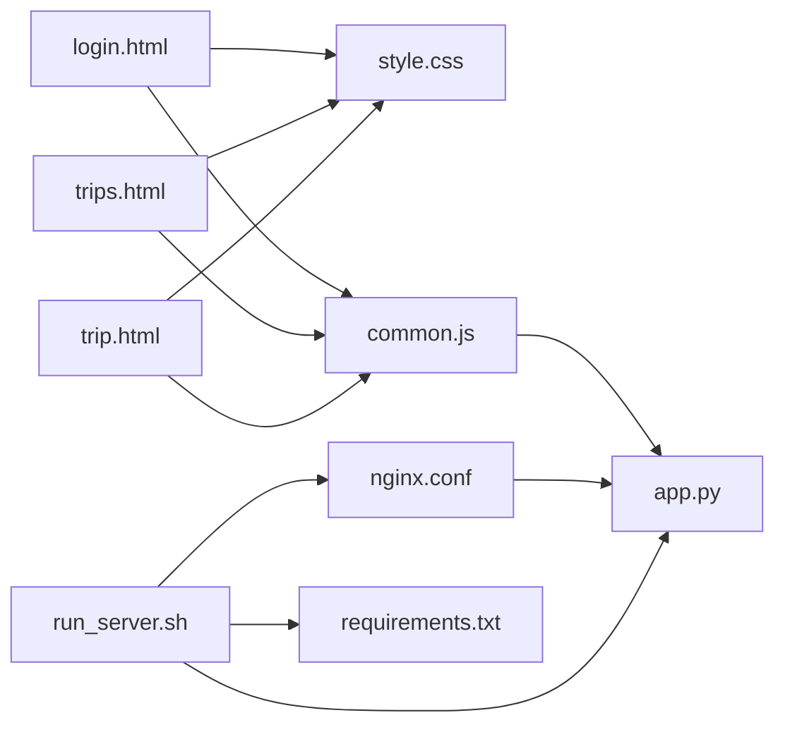

# 响应式设计与移动端适配

<cite>
**本文引用的文件**
- [style.css](file://assets/css/style.css)
- [login.html](file://login.html)
- [trips.html](file://trips.html)
- [trip.html](file://trip.html)
- [common.js](file://assets/js/common.js)
- [login.js](file://assets/js/login.js)
- [trips.js](file://assets/js/trips.js)
- [trip.js](file://assets/js/trip.js)
- [app.py](file://app.py)
- [nginx.conf](file://nginx.conf)
- [run_server.sh](file://run_server.sh)
- [requirements.txt](file://requirements.txt)
</cite>

## 目录
1. [简介](#简介)
2. [项目结构](#项目结构)
3. [核心组件](#核心组件)
4. [架构总览](#架构总览)
5. [详细组件分析](#详细组件分析)
6. [依赖关系分析](#依赖关系分析)
7. [性能考量](#性能考量)
8. [故障排查指南](#故障排查指南)
9. [结论](#结论)
10. [附录](#附录)

## 简介
本技术文档聚焦于 recorded 项目的响应式设计与移动端适配，系统性解析 CSS 样式体系、媒体查询策略、弹性布局与移动端适配方案，并结合微信浏览器的特性进行专项优化。文档同时覆盖三个页面在不同设备尺寸下的布局变化与交互优化，剖析 CSS 变量的使用、样式复用与主题定制能力，并给出移动端用户体验优化建议（加载速度、手势操作、离线能力），以及跨浏览器兼容性最佳实践。

## 项目结构
该项目采用前后端分离的静态资源与后端 API 架构：
- 前端静态资源位于 assets 目录，包含样式与脚本
- 三个页面分别对应登录页、旅行列表页与旅行详情页
- 后端使用 Flask 提供 REST API，Nginx 作为反向代理与静态资源服务

图表来源
- [login.html](file://login.html)
- [trips.html](file://trips.html)
- [trip.html](file://trip.html)
- [style.css](file://assets/css/style.css)
- [common.js](file://assets/js/common.js)
- [login.js](file://assets/js/login.js)
- [trips.js](file://assets/js/trips.js)
- [trip.js](file://assets/js/trip.js)
- [nginx.conf](file://nginx.conf)
- [app.py](file://app.py)

章节来源
- [login.html](file://login.html)
- [trips.html](file://trips.html)
- [trip.html](file://trip.html)
- [style.css](file://assets/css/style.css)
- [common.js](file://assets/js/common.js)
- [login.js](file://assets/js/login.js)
- [trips.js](file://assets/js/trips.js)
- [trip.js](file://assets/js/trip.js)
- [nginx.conf](file://nginx.conf)
- [app.py](file://app.py)

## 核心组件
- CSS 样式系统：基于 CSS 变量的主题化设计，统一的导航栏、容器、卡片、表单、按钮、模态框与提示组件；在移动端宽度阈值内进行微调
- 页面层：登录页、旅行列表页、旅行详情页，均包含导航栏与容器布局，详情页还包含统计区、添加记录表单、记录列表与费用总结
- 前端交互：公共 API 封装、鉴权与提示组件；各页面独立的业务逻辑与事件绑定
- 后端 API：提供旅行与记账记录的 CRUD，支付人与类别的管理接口，统一鉴权与错误处理

章节来源
- [style.css](file://assets/css/style.css)
- [login.html](file://login.html)
- [trips.html](file://trips.html)
- [trip.html](file://trip.html)
- [common.js](file://assets/js/common.js)
- [login.js](file://assets/js/login.js)
- [trips.js](file://assets/js/trips.js)
- [trip.js](file://assets/js/trip.js)
- [app.py](file://app.py)

## 架构总览
前端通过 fetch API 调用后端 /api/* 接口，Nginx 将静态资源直接返回，/api/* 请求转发至本地 Flask 后端。鉴权通过 Authorization 头携带 Bearer Token 实现。

图表来源
- [login.html](file://login.html)
- [common.js](file://assets/js/common.js)
- [app.py](file://app.py)
- [nginx.conf](file://nginx.conf)

## 详细组件分析

### CSS 样式系统与响应式架构
- 主题变量：通过 :root 定义主色、强调色、背景、卡片背景、文本色、边框、阴影与圆角等变量，便于主题定制与一致性
- 基础样式：重置内外边距、设置根字体大小、全局字体族、文本缩放与高亮透明度，确保移动端可读性与交互反馈
- 导航栏：固定定位顶部，flex 布局，包含返回按钮、标题与功能按钮
- 容器：最大宽度约束与居中对齐，移动端内边距缩减
- 登录页：垂直居中布局，卡片最大宽度限制，移动端内边距调整
- 表单：统一的 label、输入框、选择框、文本域与栅格化表单行；移动端表单行子项弹性分配
- 按钮：多种尺寸与风格，支持块级与图标按钮
- 卡片：统一阴影与圆角，点击态缩放反馈
- 空状态：统一的空提示图标与文案
- 统计区：三列等宽统计项
- 记录列表：图标分类、信息区与操作区，移动端紧凑排布
- 模态框：底部滑入动画，遮罩层与内容区
- Toast 与确认框：全局提示与二次确认
- 移动端适配：在 768px 以下对容器与登录卡片内边距进行微调

章节来源
- [style.css](file://assets/css/style.css)

### 页面布局与交互优化

#### 登录页（login.html）
- 结构要点：全屏垂直居中登录卡片，包含账号、密码输入与错误提示，提交按钮
- 响应式：在小屏设备上减小容器与卡片内边距
- 交互：输入回车切换焦点，登录按钮禁用与文案更新，错误提示显隐与自动消失

图表来源
- [login.html](file://login.html)
- [login.js](file://assets/js/login.js)
- [common.js](file://assets/js/common.js)

章节来源
- [login.html](file://login.html)
- [login.js](file://assets/js/login.js)
- [common.js](file://assets/js/common.js)

#### 旅行列表页（trips.html）
- 结构要点：导航栏、统计区、旅行卡片列表、新建旅行模态框
- 响应式：容器内边距在小屏设备下调小
- 交互：点击卡片跳转详情页；新建旅行弹窗的打开/关闭与保存流程；退出登录

图表来源
- [trips.html](file://trips.html)
- [trips.js](file://assets/js/trips.js)
- [common.js](file://assets/js/common.js)
- [app.py](file://app.py)

章节来源
- [trips.html](file://trips.html)
- [trips.js](file://assets/js/trips.js)
- [common.js](file://assets/js/common.js)
- [app.py](file://app.py)

#### 旅行详情页（trip.html）
- 结构要点：导航栏、旅行信息卡片、统计区、添加记录表单、记录列表、费用总结、编辑旅行与编辑记录模态框
- 响应式：容器与卡片内边距在小屏设备下调小；表单行在小屏下仍保持弹性分配
- 交互：类别与支付人下拉联动（自定义选项）、添加/编辑记录、删除记录、编辑旅行信息、删除旅行、返回列表

图表来源
- [trip.html](file://trip.html)
- [trip.js](file://assets/js/trip.js)
- [common.js](file://assets/js/common.js)
- [app.py](file://app.py)

章节来源
- [trip.html](file://trip.html)
- [trip.js](file://assets/js/trip.js)
- [common.js](file://assets/js/common.js)
- [app.py](file://app.py)

### CSS 变量、样式复用与主题定制
- 变量集中：在 :root 定义主色、强调色、背景、卡片背景、文本色、边框、阴影与圆角等变量，统一用于各类组件
- 复用模式：导航栏、容器、卡片、表单、按钮、统计区、记录列表、模态框、提示等组件均通过变量与类名组合实现一致风格
- 主题定制：通过修改 :root 变量即可实现主题切换（如深色模式），无需改动组件内部样式

章节来源
- [style.css](file://assets/css/style.css)

### 针对微信浏览器的特殊优化
- viewport 配置：在三个页面的 head 中设置 viewport，包含 width、initial-scale、maximum-scale、user-scalable 控制，禁止电话号码识别
- 触摸与交互：全局样式设置了文本缩放与高亮透明度，减少移动端点击反馈干扰；按钮与卡片提供视觉反馈
- 屏幕适配：在 768px 以下对容器与登录卡片内边距进行微调，保证小屏阅读与点击体验

章节来源
- [login.html](file://login.html)
- [trips.html](file://trips.html)
- [trip.html](file://trip.html)
- [style.css](file://assets/css/style.css)

### 三个页面在不同设备尺寸下的布局变化
- 登录页：在小屏设备上容器与卡片内边距减小，输入框与按钮在紧凑空间内保持可用
- 旅行列表页：容器内边距在小屏下调小；卡片列表在小屏下仍保持紧凑排布
- 旅行详情页：表单行在小屏下保持弹性分配；记录列表与统计区在小屏下保持可读性与点击范围

章节来源
- [login.html](file://login.html)
- [trips.html](file://trips.html)
- [trip.html](file://trip.html)
- [style.css](file://assets/css/style.css)

### 移动端用户体验优化建议
- 加载速度提升：启用 Nginx 对静态资源的缓存与压缩；将 CSS/JS 合理拆分与按需加载；后端接口尽量返回精简数据
- 手势操作支持：在交互层增加触摸反馈（如按钮 active 效果）；避免不必要的点击延迟；在表单输入时考虑软键盘遮挡问题
- 离线访问能力：当前项目为 SPA + API，建议引入 Service Worker 与 Manifest，实现 PWA 能力，支持离线缓存与应用安装

章节来源
- [nginx.conf](file://nginx.conf)
- [common.js](file://assets/js/common.js)
- [style.css](file://assets/css/style.css)

### 跨浏览器兼容性指导
- 字体与文本：使用系统字体栈，确保在不同平台的一致性；开启文本缩放与高亮透明度以改善移动端体验
- 表单控件：隐藏原生样式，使用自定义样式与 SVG 背景图，保证在不同浏览器中的外观一致性
- 媒体查询：使用 min-width 与 max-width 的组合，确保在不同设备与方向下的稳定表现

章节来源
- [style.css](file://assets/css/style.css)

## 依赖关系分析
- 前端依赖：HTML 页面依赖 CSS 与公共脚本；各页面脚本依赖公共 API 封装与后端接口
- 后端依赖：Flask 提供 REST API；Nginx 作为反向代理与静态资源服务
- 部署脚本：自动化安装依赖、初始化数据库、配置 Nginx、启动后端服务

图表来源
- [login.html](file://login.html)
- [trips.html](file://trips.html)
- [trip.html](file://trip.html)
- [style.css](file://assets/css/style.css)
- [common.js](file://assets/js/common.js)
- [app.py](file://app.py)
- [nginx.conf](file://nginx.conf)
- [run_server.sh](file://run_server.sh)
- [requirements.txt](file://requirements.txt)

章节来源
- [app.py](file://app.py)
- [nginx.conf](file://nginx.conf)
- [run_server.sh](file://run_server.sh)
- [requirements.txt](file://requirements.txt)

## 性能考量
- 静态资源：Nginx 直接服务静态文件，减少后端压力；建议启用 gzip/br 压缩与缓存头
- API 调用：合并必要的请求（如旅行详情页的并行加载），减少往返次数
- 样式体积：CSS 变量集中管理，避免重复定义；组件化样式减少冗余
- 交互反馈：按钮与卡片的过渡动画应简洁，避免影响滚动与点击性能

## 故障排查指南
- 登录失败：检查用户名与密码是否正确；查看网络面板中的 /api/login 返回；确认 token 是否写入 localStorage
- 未登录跳转：检查 Authorization 头是否携带 Bearer Token；确认 token 是否过期
- 页面空白或加载失败：检查 /api/* 接口是否可达；确认 Flask 服务是否运行；查看 Nginx 反代配置
- 移动端显示异常：检查 viewport 配置；确认媒体查询阈值与容器内边距是否生效

章节来源
- [common.js](file://assets/js/common.js)
- [app.py](file://app.py)
- [nginx.conf](file://nginx.conf)

## 结论
recorded 项目在响应式设计方面采用了 CSS 变量与组件化样式的统一风格，并在 768px 以下提供了针对性的内边距优化。页面层通过导航栏、容器、卡片、表单与模态框等组件实现了清晰的信息层级与交互流程。结合微信浏览器的 viewport 配置与触摸反馈，整体在移动端具备良好的可用性。为进一步提升移动端体验，建议引入 PWA 能力与更精细的性能优化策略。

## 附录
- 部署与运行：使用 run_server.sh 脚本一键安装依赖、初始化数据库、配置 Nginx 并启动 Flask 后端
- 后端接口：提供旅行、记账记录、支付人与类别的完整 CRUD，统一鉴权与错误处理

章节来源
- [run_server.sh](file://run_server.sh)
- [app.py](file://app.py)