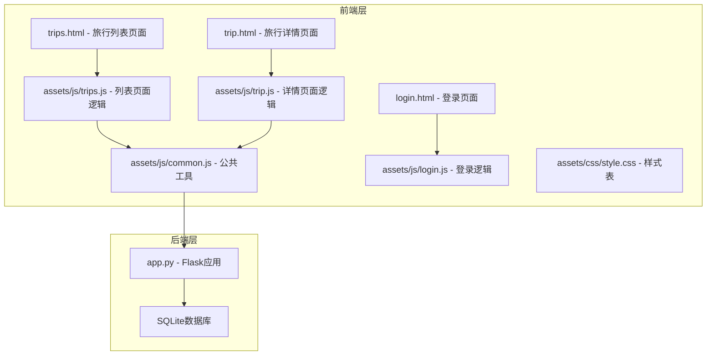
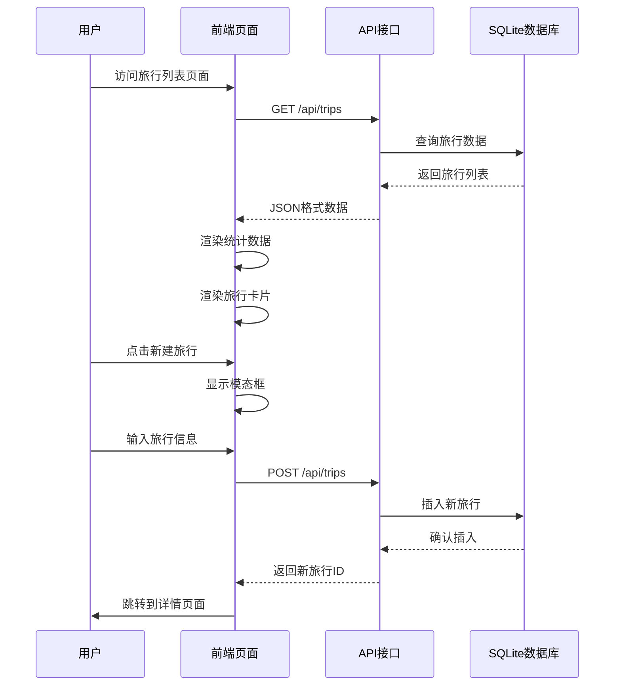
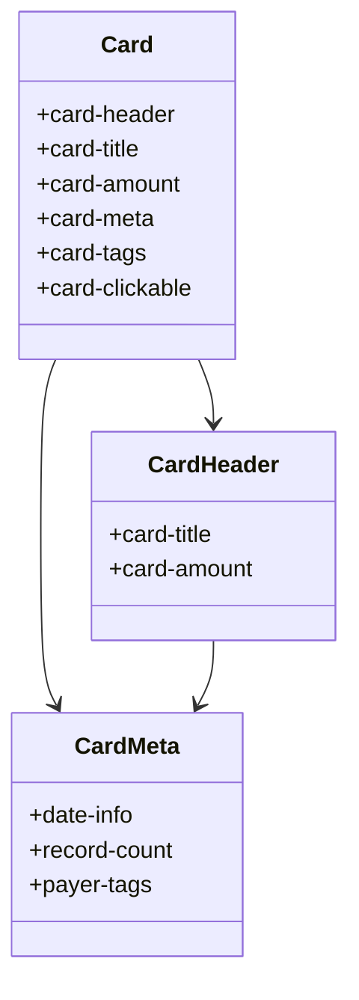
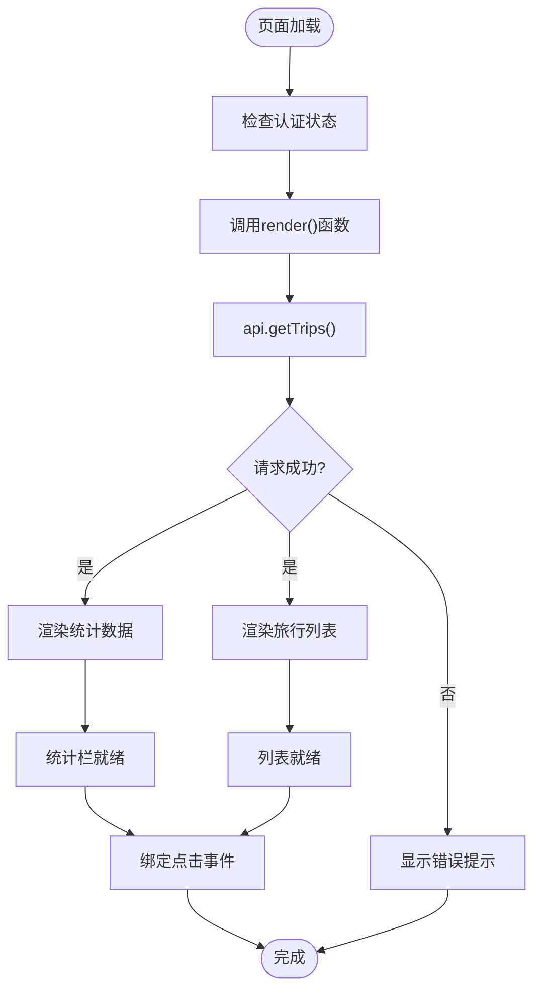
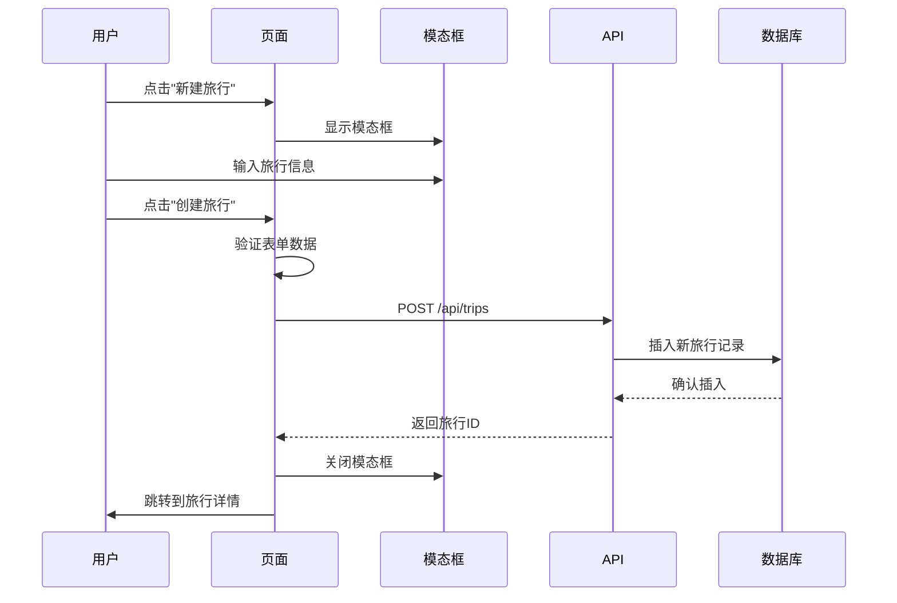
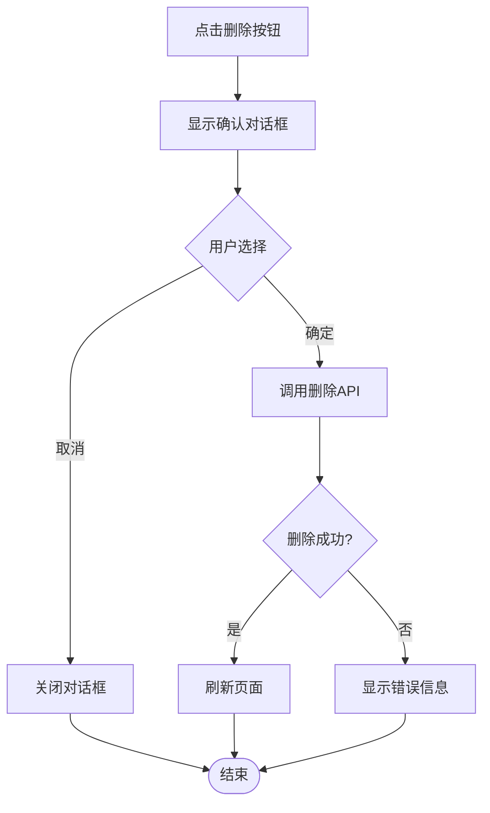
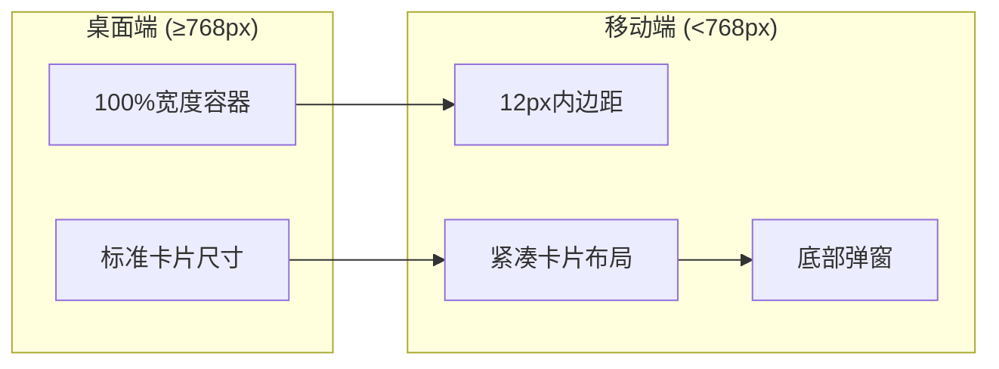
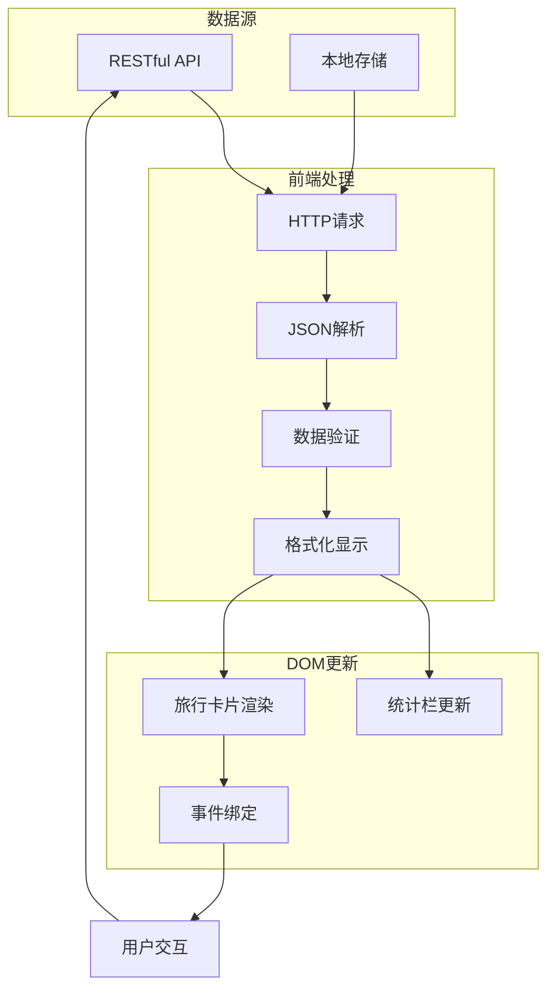
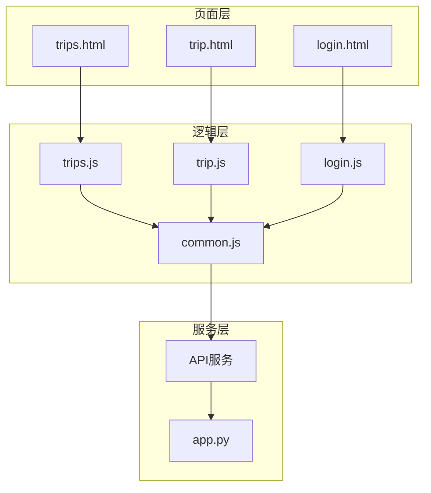

# 旅行列表页面设计

<cite>
**本文档引用的文件**
- [trips.html](file://trips.html)
- [assets/js/trips.js](file://assets/js/trips.js)
- [trip.html](file://trip.html)
- [assets/js/trip.js](file://assets/js/trip.js)
- [assets/js/common.js](file://assets/js/common.js)
- [assets/css/style.css](file://assets/css/style.css)
- [app.py](file://app.py)
- [login.html](file://login.html)
</cite>

## 目录
1. [简介](#简介)
2. [项目结构](#项目结构)
3. [核心组件](#核心组件)
4. [架构概览](#架构概览)
5. [详细组件分析](#详细组件分析)
6. [依赖关系分析](#依赖关系分析)
7. [性能考虑](#性能考虑)
8. [故障排除指南](#故障排除指南)
9. [结论](#结论)
10. [附录](#附录)

## 简介

旅行列表页面是旅游记账系统的核心界面，负责展示用户的旅行记录、提供旅行管理功能以及实现完整的数据流处理。该页面采用现代化的响应式设计，支持桌面端和移动端访问，通过RESTful API与后端进行数据交互，实现了从旅行创建、记录管理到数据分析的完整功能链路。

## 项目结构

项目采用前后端分离的架构设计，前端使用纯HTML、CSS和JavaScript实现，后端基于Flask框架提供RESTful API服务。

**图表来源**
- [trips.html:1-60](file://trips.html#L1-L60)
- [trip.html:1-155](file://trip.html#L1-L155)
- [assets/js/common.js:1-206](file://assets/js/common.js#L1-L206)
- [app.py:1-331](file://app.py#L1-L331)

**章节来源**
- [trips.html:1-60](file://trips.html#L1-L60)
- [trip.html:1-155](file://trip.html#L1-L155)
- [assets/js/common.js:1-206](file://assets/js/common.js#L1-L206)
- [app.py:1-331](file://app.py#L1-L331)

## 核心组件

### 页面结构设计

旅行列表页面采用简洁而功能丰富的布局设计，主要包含以下核心组件：

1. **导航栏区域** - 包含页面标题和操作按钮
2. **统计栏** - 展示旅行总数和累计花费
3. **旅行列表** - 动态渲染的旅行卡片
4. **模态框系统** - 新建旅行表单和确认对话框

### 数据展示格式

页面采用卡片式布局展示旅行信息，每张卡片包含：
- 旅行名称（标题）
- 累计花费（金额）
- 旅行日期范围
- 记录数量统计
- 参与支付人的标签

**章节来源**
- [trips.html:10-54](file://trips.html#L10-L54)
- [assets/js/trips.js:27-80](file://assets/js/trips.js#L27-L80)

## 架构概览

系统采用客户端-服务器架构，前端通过AJAX请求与后端API进行通信。

**图表来源**
- [assets/js/trips.js:17-24](file://assets/js/trips.js#L17-L24)
- [app.py:119-139](file://app.py#L119-L139)
- [assets/js/common.js:74-94](file://assets/js/common.js#L74-L94)

## 详细组件分析

### HTML结构设计

#### 旅行卡片布局

旅行卡片采用Flexbox布局，实现响应式设计和良好的视觉层次：

**图表来源**
- [trips.html:58-70](file://trips.html#L58-L70)
- [assets/css/style.css:125-143](file://assets/css/style.css#L125-L143)

#### 操作按钮组织

页面提供清晰的操作按钮组织，包括：
- 新建旅行按钮（主操作）
- 退出登录按钮（辅助操作）
- 旅行卡片点击跳转功能

**章节来源**
- [trips.html:12-18](file://trips.html#L12-L18)
- [assets/js/trips.js:73-80](file://assets/js/trips.js#L73-L80)

### JavaScript交互逻辑

#### 数据获取与渲染流程

**图表来源**
- [assets/js/trips.js:17-24](file://assets/js/trips.js#L17-L24)
- [assets/js/trips.js:27-36](file://assets/js/trips.js#L27-L36)

#### 新增旅行功能实现

新增旅行功能采用模态框设计，提供完整的表单验证和错误处理：

**图表来源**
- [assets/js/trips.js:101-121](file://assets/js/trips.js#L101-L121)
- [app.py:141-155](file://app.py#L141-L155)

**章节来源**
- [assets/js/trips.js:101-121](file://assets/js/trips.js#L101-L121)

#### 删除确认机制

页面采用全局确认对话框模式，确保用户操作的安全性：

**图表来源**
- [assets/js/trip.js:246-255](file://assets/js/trip.js#L246-L255)
- [assets/js/common.js:177-205](file://assets/js/common.js#L177-L205)

**章节来源**
- [assets/js/trip.js:246-255](file://assets/js/trip.js#L246-L255)
- [assets/js/common.js:177-205](file://assets/js/common.js#L177-L205)

### 响应式设计实现

#### 移动端布局优化

系统采用移动优先的设计理念，针对不同屏幕尺寸提供优化的布局：

**图表来源**
- [assets/css/style.css:268-273](file://assets/css/style.css#L268-L273)
- [assets/css/style.css:207-225](file://assets/css/style.css#L207-L225)

关键响应式特性包括：
- 容器内边距调整（桌面端16px，移动端12px）
- 模态框采用底部滑入动画
- 触摸友好的按钮尺寸和间距
- 优化的字体大小和行高

**章节来源**
- [assets/css/style.css:268-273](file://assets/css/style.css#L268-L273)
- [assets/css/style.css:207-225](file://assets/css/style.css#L207-L225)

### 数据流处理

#### 完整的数据流过程

**图表来源**
- [assets/js/common.js:38-132](file://assets/js/common.js#L38-L132)
- [assets/js/trips.js:17-80](file://assets/js/trips.js#L17-L80)

**章节来源**
- [assets/js/common.js:38-132](file://assets/js/common.js#L38-L132)
- [assets/js/trips.js:17-80](file://assets/js/trips.js#L17-L80)

## 依赖关系分析

### 组件耦合度分析

系统采用松耦合设计，各组件间依赖关系清晰：

**图表来源**
- [trips.html:56-57](file://trips.html#L56-L57)
- [trip.html:151-152](file://trip.html#L151-L152)
- [assets/js/trips.js:1-2](file://assets/js/trips.js#L1-L2)
- [assets/js/trip.js:1-2](file://assets/js/trip.js#L1-L2)
- [assets/js/common.js:1-1](file://assets/js/common.js#L1-L1)

### 外部依赖和集成点

系统的主要外部依赖包括：
- **浏览器API** - Fetch API用于HTTP请求
- **本地存储** - localStorage用于会话管理
- **CSS变量** - 实现主题定制和响应式设计
- **SVG图标** - 使用内联SVG实现图标系统

**章节来源**
- [assets/js/common.js:38-132](file://assets/js/common.js#L38-L132)
- [assets/css/style.css:1-19](file://assets/css/style.css#L1-L19)

## 性能考虑

### 优化策略

#### 内存管理
- 使用事件委托减少事件监听器数量
- 及时清理模态框和确认对话框DOM元素
- 避免重复的DOM查询和操作

#### 网络优化
- 合理的缓存策略
- 批量数据请求避免频繁网络调用
- 错误重试机制

#### 用户体验优化
- 加载状态指示器
- 错误处理和用户反馈
- 响应式设计提升移动端体验

### 性能监控建议

建议在生产环境中添加以下监控指标：
- 页面加载时间
- API响应延迟
- 用户交互响应时间
- 内存使用情况

## 故障排除指南

### 常见问题及解决方案

#### 认证相关问题
- **问题**：页面重定向到登录页
- **原因**：token过期或无效
- **解决**：重新登录获取新token

#### 数据加载失败
- **问题**：旅行列表显示为空
- **原因**：网络连接问题或API异常
- **解决**：检查网络连接，刷新页面重试

#### 表单提交错误
- **问题**：新建旅行失败
- **原因**：必填字段缺失或格式不正确
- **解决**：检查表单验证提示

**章节来源**
- [assets/js/common.js:28-36](file://assets/js/common.js#L28-L36)
- [assets/js/trips.js:21-23](file://assets/js/trips.js#L21-L23)

### 调试技巧

1. **浏览器开发者工具** - 检查网络请求和控制台错误
2. **localStorage检查** - 验证token状态
3. **API测试** - 使用curl或Postman验证后端接口

## 结论

旅行列表页面设计体现了现代Web应用的最佳实践，通过清晰的架构设计、响应式布局和完善的错误处理机制，为用户提供了流畅的旅行管理体验。系统采用前后端分离架构，具有良好的可维护性和扩展性。

未来可以考虑的功能增强包括：
- 旅行搜索和过滤功能
- 数据导出功能
- 更丰富的统计分析
- 离线数据同步

## 附录

### API接口规范

#### 旅行相关接口
- `GET /api/trips` - 获取旅行列表
- `POST /api/trips` - 创建新旅行
- `GET /api/trips/:id` - 获取旅行详情
- `PUT /api/trips/:id` - 更新旅行信息
- `DELETE /api/trips/:id` - 删除旅行

#### 记账记录接口
- `POST /api/trips/:id/records` - 创建记录
- `PUT /api/records/:id` - 更新记录
- `DELETE /api/records/:id` - 删除记录

### 样式类参考

常用样式类包括：
- `.card` - 通用卡片样式
- `.stats-bar` - 统计栏容器
- `.modal-overlay` - 模态框遮罩
- `.btn-primary` - 主要操作按钮
- `.form-input` - 表单输入框