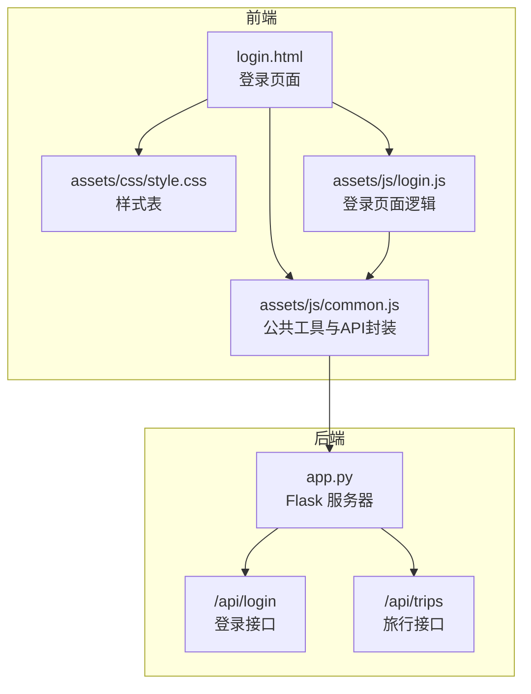
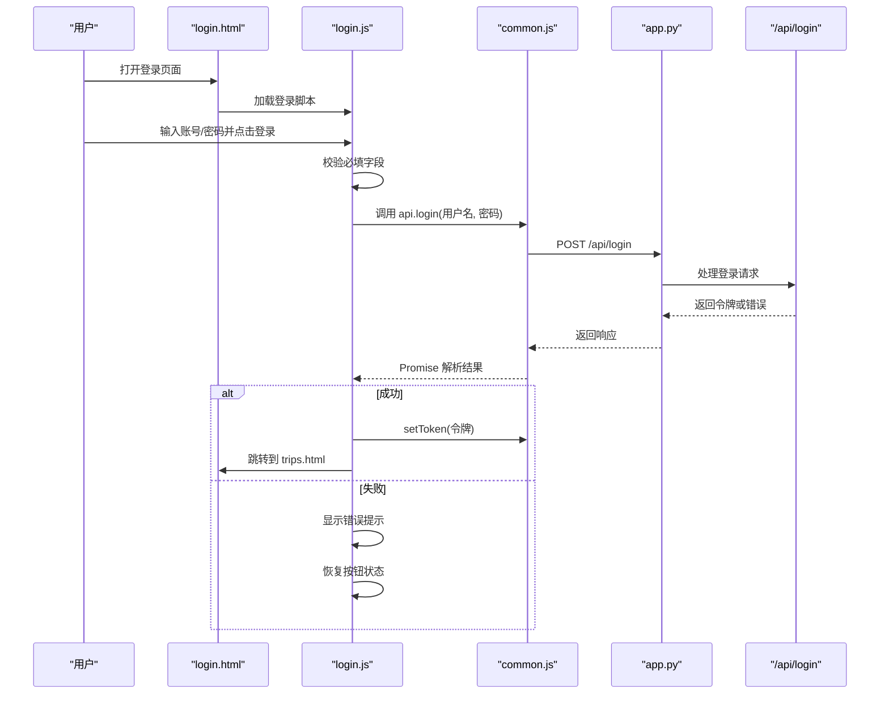
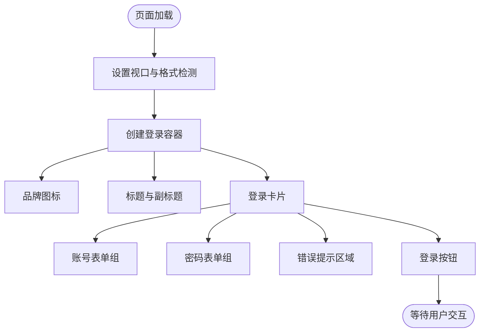
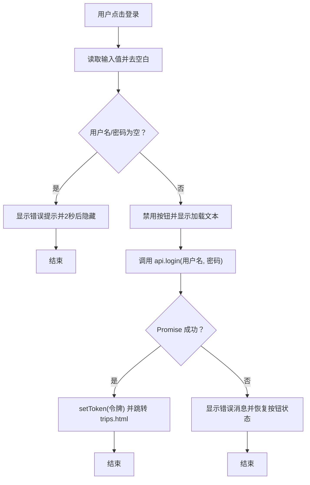
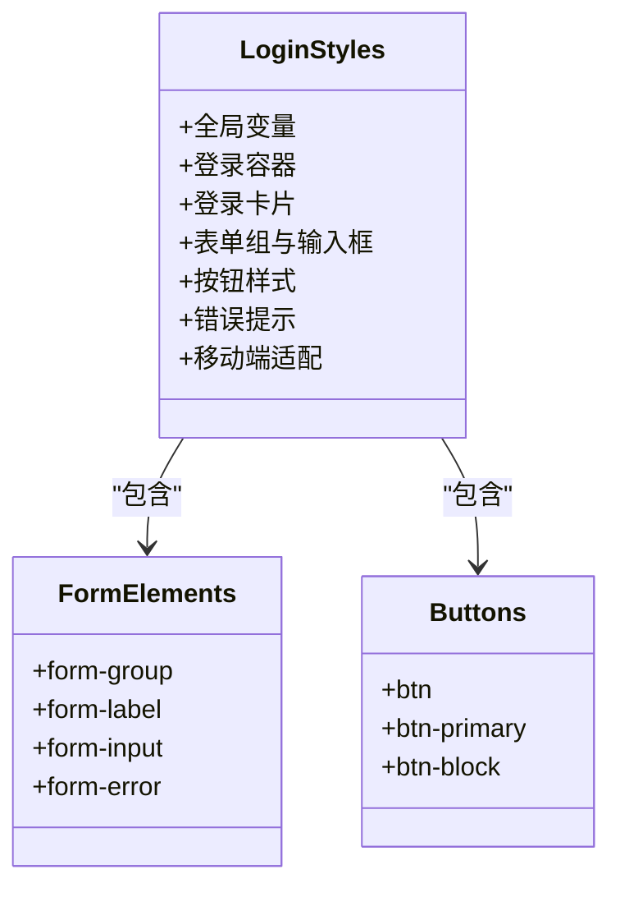
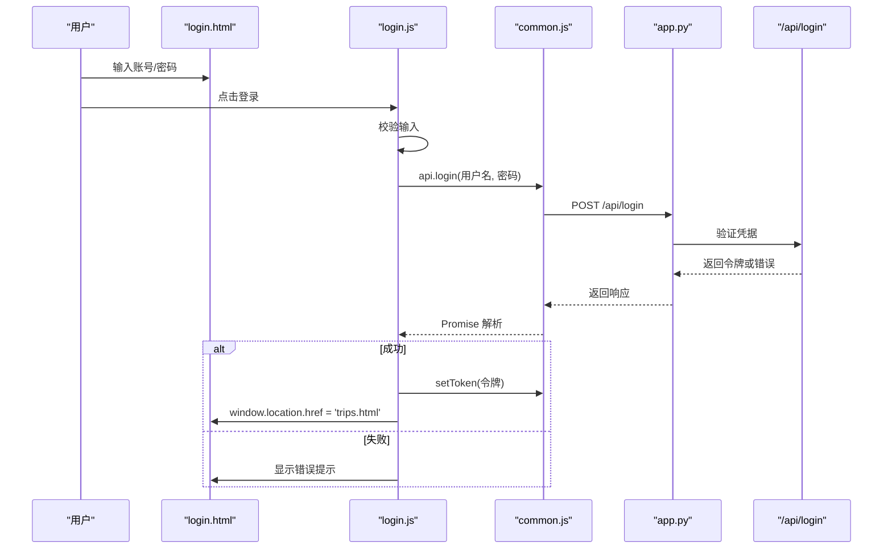
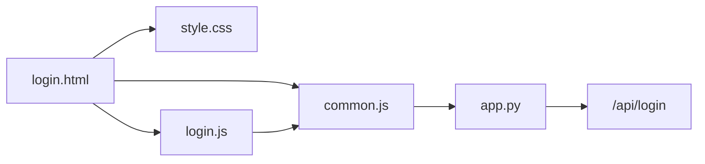

# 登录页面设计

<cite>
**本文档引用的文件**
- [login.html](file://login.html)
- [assets/js/login.js](file://assets/js/login.js)
- [assets/js/common.js](file://assets/js/common.js)
- [assets/css/style.css](file://assets/css/style.css)
- [app.py](file://app.py)
</cite>

## 目录
1. [简介](#简介)
2. [项目结构](#项目结构)
3. [核心组件](#核心组件)
4. [架构概览](#架构概览)
5. [详细组件分析](#详细组件分析)
6. [依赖关系分析](#依赖关系分析)
7. [性能考量](#性能考量)
8. [故障排除指南](#故障排除指南)
9. [结论](#结论)
10. [附录](#附录)

## 简介
本文件为登录页面的详细技术文档，涵盖 login.html 的 HTML 结构设计、assets/js/login.js 的 JavaScript 交互逻辑、CSS 样式设计以及完整的登录流程实现。文档重点分析了响应式布局、表单元素组织、视觉设计、表单验证、登录请求处理、错误状态管理、移动端适配与微信浏览器优化，并提供定制化建议与安全考虑。

## 项目结构
登录页面采用前后端分离的静态资源组织方式：
- 前端静态页面：login.html
- 样式文件：assets/css/style.css
- JavaScript 文件：assets/js/common.js（公共 API 封装与认证工具）、assets/js/login.js（登录页面专用逻辑）
- 后端服务：app.py（Flask 实现的 REST API）

**图表来源**
- [login.html:1-32](file://login.html#L1-L32)
- [assets/js/common.js:39-132](file://assets/js/common.js#L39-L132)
- [app.py:106-115](file://app.py#L106-L115)

**章节来源**
- [login.html:1-32](file://login.html#L1-L32)
- [assets/css/style.css:62-74](file://assets/css/style.css#L62-L74)
- [assets/js/common.js:39-132](file://assets/js/common.js#L39-L132)
- [app.py:106-115](file://app.py#L106-L115)

## 核心组件
- HTML 页面结构：包含登录容器、品牌标识、标题、副标题、表单组（账号、密码）、错误提示区域、登录按钮等。
- JavaScript 交互：负责表单校验、登录请求、错误状态管理、键盘事件处理（回车键切换焦点与提交）。
- CSS 样式：定义全局变量、登录卡片布局、表单样式、按钮样式、Toast 提示、确认对话框、以及针对移动端的适配规则。
- 后端 API：提供登录接口，返回令牌；其他接口通过 Authorization 头进行鉴权。

**章节来源**
- [login.html:11-26](file://login.html#L11-L26)
- [assets/js/login.js:13-34](file://assets/js/login.js#L13-L34)
- [assets/css/style.css:62-99](file://assets/css/style.css#L62-L99)
- [assets/js/common.js:39-71](file://assets/js/common.js#L39-L71)
- [app.py:106-115](file://app.py#L106-L115)

## 架构概览
登录流程从用户在登录页面输入凭据开始，前端通过 common.js 中的 api.login 发起登录请求，后端 app.py 的 /api/login 接口验证凭据并返回令牌。成功后前端将令牌存储到本地并跳转至旅行列表页面；失败则显示错误提示并恢复按钮状态。

**图表来源**
- [assets/js/login.js:13-34](file://assets/js/login.js#L13-L34)
- [assets/js/common.js:59-71](file://assets/js/common.js#L59-L71)
- [app.py:106-115](file://app.py#L106-L115)

## 详细组件分析

### HTML 结构设计
- 视口与格式检测：设置 viewport、禁止缩放、关闭电话号码自动识别，确保移动端体验一致。
- 登录容器：使用垂直居中布局，包含品牌图标、标题、副标题与登录卡片。
- 表单元素：账号与密码输入框，标签与占位符清晰；错误提示区域初始隐藏，成功时显示。
- 按钮：主按钮样式，支持禁用与加载态文本变化。

**图表来源**
- [login.html:4-26](file://login.html#L4-L26)

**章节来源**
- [login.html:4-26](file://login.html#L4-L26)

### JavaScript 交互逻辑
- 登录前检查：若已登录则直接跳转至旅行列表页面。
- 表单校验：用户名与密码均需非空，否则显示错误提示并自动消失。
- 请求处理：禁用按钮并更新文本为“登录中...”，调用 api.login 并处理 Promise。
- 错误管理：捕获异常，显示错误消息，恢复按钮状态。
- 键盘事件：回车键在密码输入框触发登录，在用户名输入框聚焦到密码框。

**图表来源**
- [assets/js/login.js:13-34](file://assets/js/login.js#L13-L34)

**章节来源**
- [assets/js/login.js:1-44](file://assets/js/login.js#L1-L44)

### CSS 样式设计
- 全局变量：定义主色、强调色、背景、文字、边框、阴影与圆角等变量，便于统一风格。
- 登录页面布局：登录卡片最大宽度、内边距、阴影与圆角，保证在桌面与移动设备上的可读性。
- 表单样式：输入框聚焦态高亮、过渡动画、选择器下拉箭头；错误提示默认隐藏，显式类控制显示。
- 按钮样式：主按钮、块级按钮、激活态与尺寸变体；统一过渡效果提升交互体验。
- 移动端适配：在 768px 以下减小容器与卡片内边距，提升移动端紧凑布局下的可用性。

**图表来源**
- [assets/css/style.css:62-99](file://assets/css/style.css#L62-L99)
- [assets/css/style.css:100-124](file://assets/css/style.css#L100-L124)
- [assets/css/style.css:268-273](file://assets/css/style.css#L268-L273)

**章节来源**
- [assets/css/style.css:1-273](file://assets/css/style.css#L1-L273)

### 登录流程完整实现
- 用户输入：在登录页面输入账号与密码。
- 前端校验：检查必填项并在失败时显示错误提示。
- API 调用：通过 common.js 的 api.login 发送 POST 请求到 /api/login。
- 后端验证：app.py 的 /api/login 对比固定凭据，成功生成令牌并加入有效令牌集合。
- 响应处理：前端解析响应，成功则保存令牌并跳转，失败则显示错误并恢复界面。
- 页面跳转：成功后跳转至旅行列表页面，作为后续功能入口。

**图表来源**
- [assets/js/login.js:13-34](file://assets/js/login.js#L13-L34)
- [assets/js/common.js:59-71](file://assets/js/common.js#L59-L71)
- [app.py:106-115](file://app.py#L106-L115)

**章节来源**
- [assets/js/login.js:13-34](file://assets/js/login.js#L13-L34)
- [assets/js/common.js:59-71](file://assets/js/common.js#L59-L71)
- [app.py:106-115](file://app.py#L106-L115)

### 移动端适配与微信浏览器优化
- 视口设置：禁止缩放与电话识别，避免微信浏览器默认手势干扰。
- 响应式卡片：在 768px 以下减少内边距，提升紧凑布局下的可读性。
- 交互细节：输入框聚焦态高亮与过渡动画，增强移动端触摸反馈。
- 字体与文本：使用系统字体栈与文本大小调整，提升移动端阅读体验。

**章节来源**
- [login.html:5-6](file://login.html#L5-L6)
- [assets/css/style.css:268-273](file://assets/css/style.css#L268-L273)
- [assets/css/style.css:25-32](file://assets/css/style.css#L25-L32)

## 依赖关系分析
- login.html 依赖样式表与两个 JS 文件：common.js 提供 API 封装与认证工具，login.js 负责登录页面逻辑。
- login.js 依赖 common.js 的 api.login 与认证工具（如 setToken、isLoggedIn）。
- common.js 依赖 Flask 后端提供的 /api/login 接口。
- app.py 提供 /api/login 与鉴权中间件，确保后续接口的安全访问。

**图表来源**
- [login.html:8-29](file://login.html#L8-L29)
- [assets/js/login.js:1-6](file://assets/js/login.js#L1-L6)
- [assets/js/common.js:39-132](file://assets/js/common.js#L39-L132)
- [app.py:106-115](file://app.py#L106-L115)

**章节来源**
- [login.html:8-29](file://login.html#L8-L29)
- [assets/js/login.js:1-6](file://assets/js/login.js#L1-L6)
- [assets/js/common.js:39-132](file://assets/js/common.js#L39-L132)
- [app.py:106-115](file://app.py#L106-L115)

## 性能考量
- 资源加载：登录页面仅加载必要的样式与脚本，避免不必要的网络请求。
- DOM 操作：仅对错误提示与按钮进行最小化 DOM 更新，减少重排与重绘。
- 本地存储：令牌存储于 localStorage，避免每次请求携带敏感信息，降低网络负载。
- 响应时间：登录接口为轻量级验证，响应迅速；前端在请求期间禁用按钮，防止重复提交。

[本节为通用性能建议，不直接分析具体文件]

## 故障排除指南
- 登录失败提示：当用户名或密码为空时，错误提示会在 2 秒后自动隐藏；若出现持续显示，检查错误提示元素的类名与显示逻辑。
- 按钮状态异常：若登录按钮无法恢复，请确认 Promise 捕获分支是否正确执行，以及按钮文本与禁用状态的还原逻辑。
- 401 未授权：后端在鉴权失败时会清除令牌并跳转至登录页；前端在收到 401 时也会清除令牌并跳转，确保一致性。
- 本地存储问题：若令牌无法持久化，请检查浏览器是否允许 localStorage，以及 setToken/clearToken 的实现。

**章节来源**
- [assets/js/login.js:16-33](file://assets/js/login.js#L16-L33)
- [assets/js/common.js:47-57](file://assets/js/common.js#L47-L57)
- [assets/js/common.js:28-36](file://assets/js/common.js#L28-L36)

## 结论
登录页面通过简洁的 HTML 结构、清晰的 CSS 布局与稳健的 JavaScript 交互，实现了良好的用户体验与可维护性。配合后端的简单鉴权机制与令牌管理，形成了从输入到跳转的完整闭环。建议在生产环境中进一步加强安全措施与错误处理，以提升系统的健壮性与安全性。

[本节为总结性内容，不直接分析具体文件]

## 附录

### 定制化建议
- 品牌化：可替换品牌图标与颜色变量，统一整体视觉风格。
- 表单扩展：增加邮箱/手机号输入、验证码、记住登录等功能。
- 动画与反馈：为按钮与错误提示添加更丰富的过渡动画，提升交互体验。
- 多语言：引入多语言支持，适配不同地区用户的语言习惯。

[本节为通用建议，不直接分析具体文件]

### 安全考虑
- 凭据验证：当前为固定凭据，建议接入数据库与密码哈希机制，避免硬编码。
- 传输安全：建议启用 HTTPS，防止令牌在传输过程中被窃取。
- 令牌管理：令牌存储于 localStorage，建议结合 HttpOnly Cookie 或短期令牌策略，降低 XSS 风险。
- 防暴力破解：增加登录尝试次数限制与验证码机制，防止自动化攻击。
- 输入清理：对所有用户输入进行严格的白名单过滤与长度限制，避免注入攻击。

[本节为通用安全建议，不直接分析具体文件]