# 记账详情页面设计

<cite>
**本文档引用的文件**
- [trip.html](file://trip.html)
- [trip.js](file://assets/js/trip.js)
- [common.js](file://assets/js/common.js)
- [style.css](file://assets/css/style.css)
- [app.py](file://app.py)
- [trips.html](file://trips.html)
</cite>

## 目录
1. [简介](#简介)
2. [项目结构](#项目结构)
3. [核心组件](#核心组件)
4. [架构概览](#架构概览)
5. [详细组件分析](#详细组件分析)
6. [依赖关系分析](#依赖关系分析)
7. [性能考虑](#性能考虑)
8. [故障排除指南](#故障排除指南)
9. [结论](#结论)
10. [附录](#附录)

## 简介

记账详情页面是旅游记账系统的核心界面，负责展示和管理单个旅行的所有消费记录。该页面采用前后端分离架构，前端使用纯JavaScript实现交互逻辑，后端基于Flask框架提供RESTful API服务。页面支持完整的CRUD操作，包括旅行信息管理、消费记录添加、编辑、删除以及实时统计分析功能。

## 项目结构

项目采用模块化的文件组织方式，主要包含以下结构：

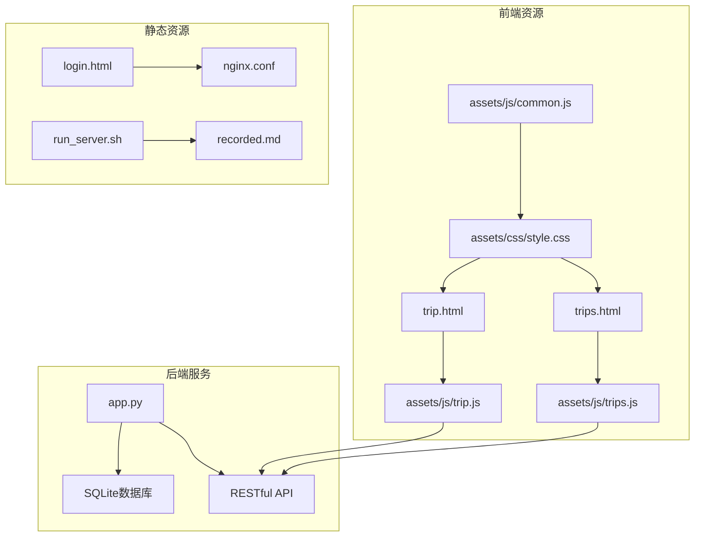

**图表来源**
- [trip.html:1-155](file://trip.html#L1-L155)
- [app.py:1-331](file://app.py#L1-L331)

**章节来源**
- [trip.html:1-155](file://trip.html#L1-L155)
- [app.py:1-331](file://app.py#L1-L331)

## 核心组件

### 页面结构组件

记账详情页面由多个功能区域组成，每个区域都有明确的职责分工：

1. **导航栏区域** - 包含返回按钮、页面标题和操作按钮
2. **旅行信息展示区** - 显示旅行的基本信息和时间范围
3. **统计栏** - 展示关键统计数据
4. **记录添加表单** - 新增消费记录的输入界面
5. **记录列表** - 展示所有消费记录
6. **费用总结区域** - 按支付人和类别的统计分析

### JavaScript核心功能模块

页面的JavaScript代码采用立即执行函数模式，包含以下主要功能模块：

- **DOM元素管理** - 统一管理页面元素引用
- **数据加载与渲染** - 处理异步数据加载和页面渲染
- **表单验证与提交** - 管理用户输入和数据验证
- **模态框交互** - 处理编辑和确认对话框
- **API通信封装** - 提供统一的后端接口调用

**章节来源**
- [trip.js:1-401](file://assets/js/trip.js#L1-L401)
- [common.js:1-206](file://assets/js/common.js#L1-L206)

## 架构概览

系统采用经典的三层架构设计：

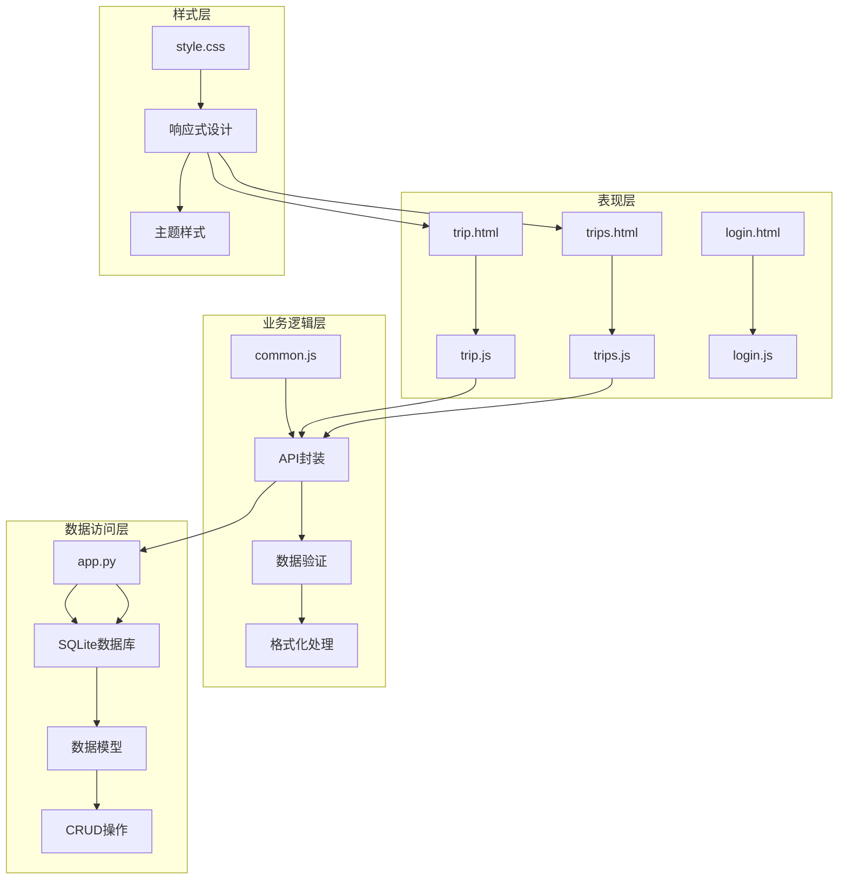

**图表来源**
- [trip.js:1-401](file://assets/js/trip.js#L1-L401)
- [common.js:38-132](file://assets/js/common.js#L38-L132)
- [app.py:157-177](file://app.py#L157-L177)

## 详细组件分析

### HTML结构设计

#### 导航栏系统

导航栏采用响应式设计，包含返回按钮、页面标题和操作按钮：

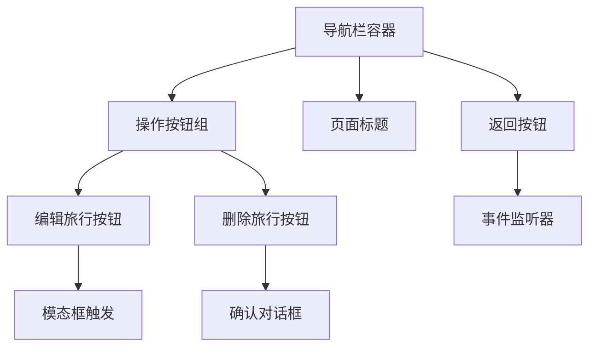

**图表来源**
- [trip.html:11-21](file://trip.html#L11-L21)
- [trip.js:394-396](file://assets/js/trip.js#L394-L396)

#### 旅行信息展示

旅行信息区域动态渲染旅行的基本信息：

- **标题显示** - 显示旅行名称
- **日期范围** - 显示开始和结束日期
- **备注信息** - 显示旅行备注

#### 记录添加表单

表单采用灵活的布局设计，支持动态内容：

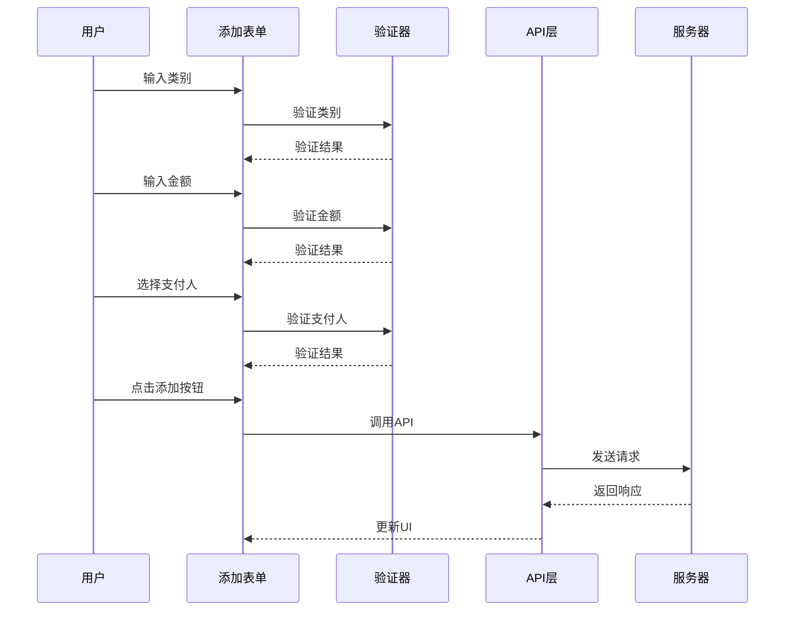

**图表来源**
- [trip.html:30-70](file://trip.html#L30-L70)
- [trip.js:161-197](file://assets/js/trip.js#L161-L197)

**章节来源**
- [trip.html:23-79](file://trip.html#L23-L79)

### JavaScript交互逻辑

#### 数据加载与渲染流程

页面初始化时执行异步数据加载：

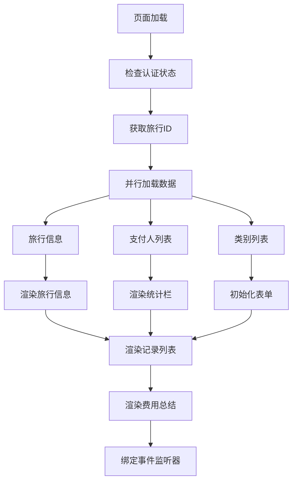

**图表来源**
- [trip.js:105-123](file://assets/js/trip.js#L105-L123)
- [trip.js:126-149](file://assets/js/trip.js#L126-L149)

#### 记录管理功能

##### 添加记录功能

添加记录过程包含完整的数据验证和错误处理：

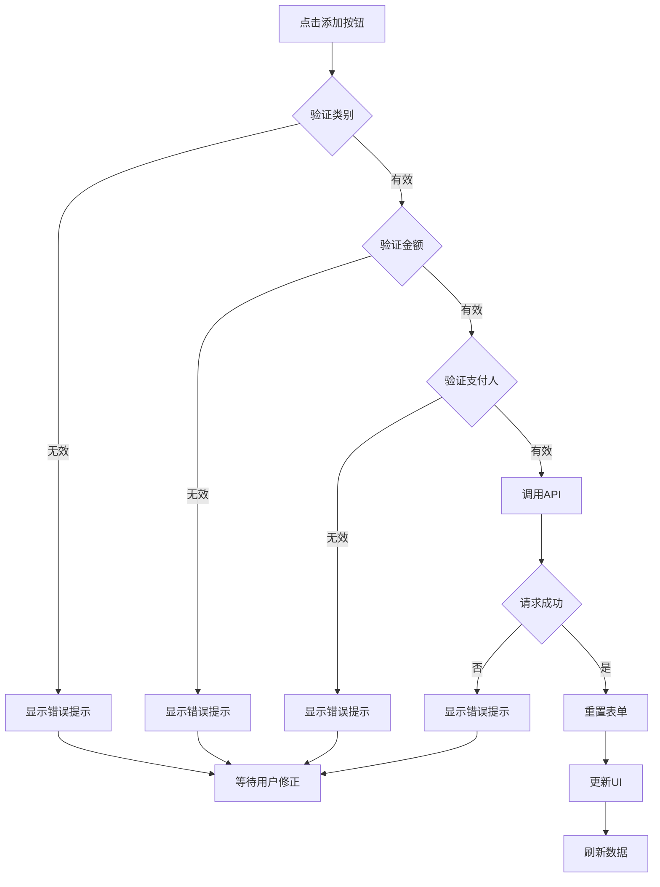

**图表来源**
- [trip.js:161-197](file://assets/js/trip.js#L161-L197)

##### 编辑记录功能

编辑记录采用模态框设计，支持实时预览：

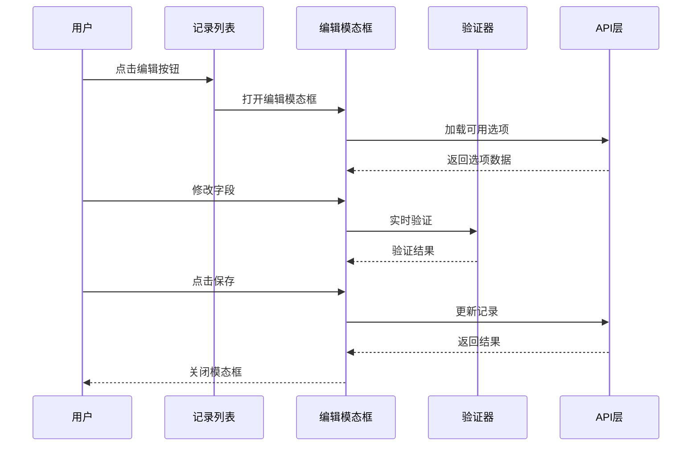

**图表来源**
- [trip.js:259-313](file://assets/js/trip.js#L259-L313)

#### 支付人选择机制

支付人选择采用下拉菜单联动设计：

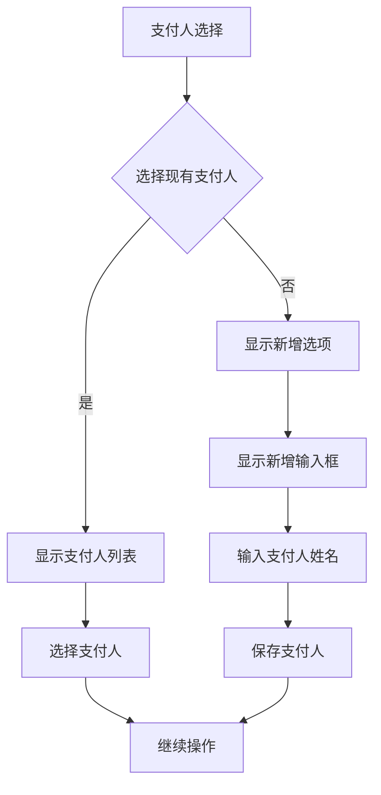

**图表来源**
- [trip.js:97-102](file://assets/js/trip.js#L97-L102)
- [trip.js:74-88](file://assets/js/trip.js#L74-L88)

#### 分类管理功能

类别管理支持预定义类别和自定义类别：

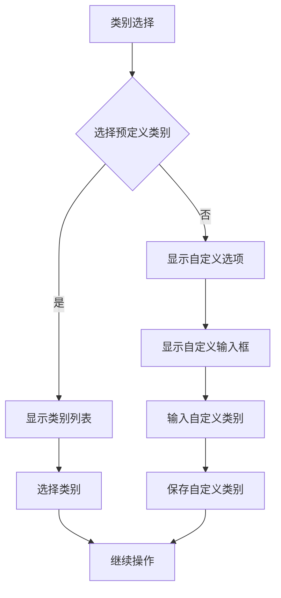

**图表来源**
- [trip.js:91-96](file://assets/js/trip.js#L91-L96)
- [trip.js:55-72](file://assets/js/trip.js#L55-L72)

### 数据处理逻辑

#### 数据聚合算法

页面实现了高效的统计数据聚合：

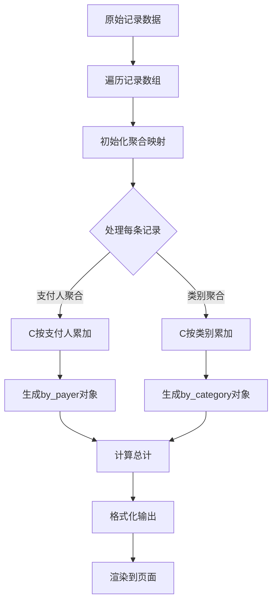

**图表来源**
- [app.py:169-176](file://app.py#L169-L176)
- [trip.js:316-348](file://assets/js/trip.js#L316-L348)

#### 实时统计计算

统计计算在客户端和服务器端分别进行：

- **服务器端聚合** - 在数据库层面进行分组统计
- **客户端格式化** - 对聚合结果进行格式化和本地缓存

**章节来源**
- [app.py:157-177](file://app.py#L157-L177)
- [trip.js:141-149](file://assets/js/trip.js#L141-L149)

### 状态同步机制

页面采用双向数据绑定和事件驱动的设计模式：

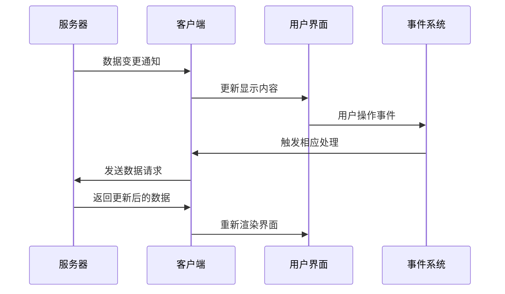

**图表来源**
- [trip.js:105-123](file://assets/js/trip.js#L105-L123)
- [common.js:38-132](file://assets/js/common.js#L38-L132)

## 依赖关系分析

### 前端依赖图

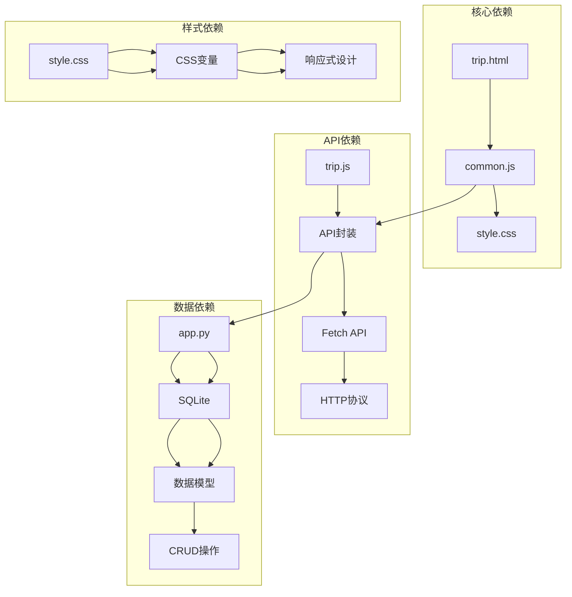

**图表来源**
- [trip.js:1-50](file://assets/js/trip.js#L1-L50)
- [common.js:38-132](file://assets/js/common.js#L38-L132)
- [app.py:157-177](file://app.py#L157-L177)

### 数据流分析

页面的数据流遵循单向数据流原则：

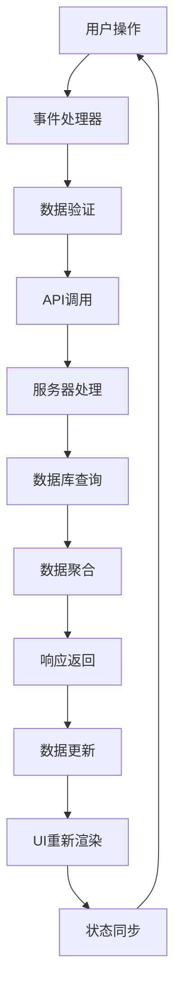

**图表来源**
- [trip.js:161-197](file://assets/js/trip.js#L161-L197)
- [app.py:208-236](file://app.py#L208-L236)

**章节来源**
- [trip.js:1-401](file://assets/js/trip.js#L1-L401)
- [common.js:1-206](file://assets/js/common.js#L1-L206)

## 性能考虑

### 渲染优化策略

#### 大数据量渲染优化

针对大量记录的场景，页面采用了以下优化策略：

1. **虚拟滚动** - 对于超大列表，可以考虑实现虚拟滚动以减少DOM节点数量
2. **分页加载** - 实现分页机制，避免一次性加载所有记录
3. **懒加载** - 对非首屏内容采用懒加载策略

#### 内存管理

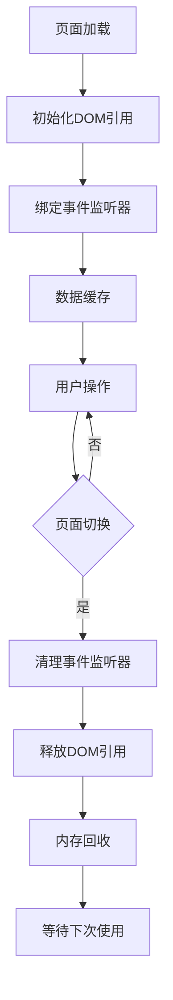

#### 网络请求优化

- **并发请求** - 使用Promise.all并行加载多个数据源
- **请求去重** - 避免重复请求相同数据
- **缓存策略** - 实现简单的客户端缓存机制

### 响应式设计优化

页面采用移动优先的设计理念：

- **触摸友好的交互** - 按钮大小和间距适合触摸操作
- **渐进式增强** - 在不同设备上提供最佳体验
- **性能优先** - 减少不必要的重绘和回流

## 故障排除指南

### 常见问题诊断

#### 认证相关问题

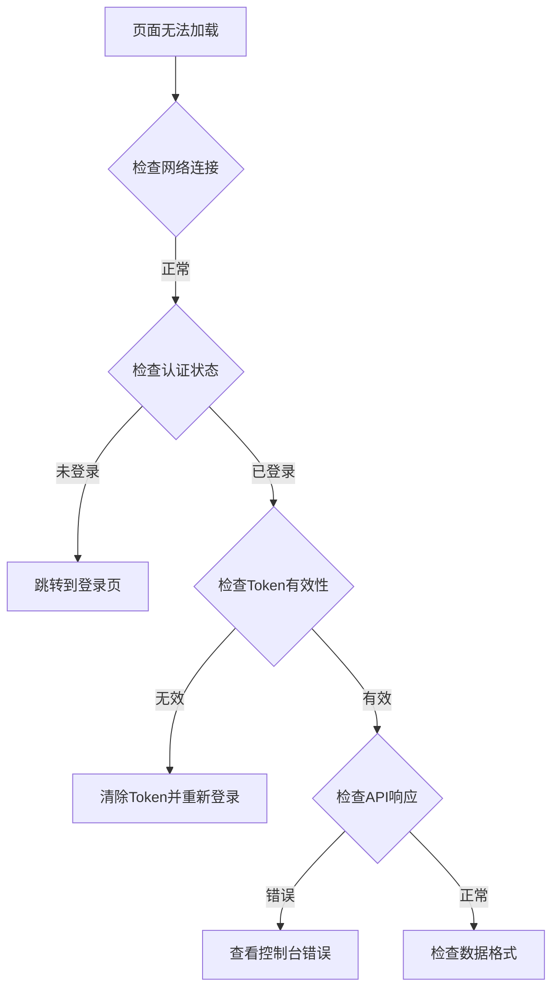

#### 数据加载失败

当出现数据加载失败时，可以按照以下步骤排查：

1. **检查网络连接** - 确保能够访问后端API
2. **验证服务器状态** - 检查Flask应用是否正常运行
3. **查看API响应** - 检查返回的状态码和错误信息
4. **数据库连接** - 确认SQLite数据库文件存在且可访问

#### 表单验证错误

表单验证失败通常由以下原因引起：

- **必填字段为空** - 确保所有标记为必需的字段都已填写
- **数据类型不匹配** - 检查金额字段是否为有效的数字格式
- **业务规则违反** - 验证支付人和类别是否在允许范围内

### 调试技巧

#### 浏览器开发者工具使用

1. **Network面板** - 监控API请求和响应
2. **Console面板** - 查看JavaScript错误和警告
3. **Elements面板** - 检查DOM结构和样式应用
4. **Sources面板** - 设置断点调试JavaScript代码

#### 日志记录策略

```javascript
// 建议在开发环境中添加日志记录
console.log('Debug:', { key: value });
console.error('Error:', errorMessage);
console.warn('Warning:', warningMessage);
```

#### 性能监控

使用浏览器性能面板监控：
- **FPS帧率** - 确保动画流畅
- **内存使用** - 监控内存泄漏
- **网络延迟** - 优化API响应时间

**章节来源**
- [trip.js:120-122](file://assets/js/trip.js#L120-L122)
- [common.js:163-175](file://assets/js/common.js#L163-L175)

## 结论

记账详情页面是一个功能完整、架构清晰的单页应用。它成功地实现了以下目标：

1. **用户体验优化** - 采用响应式设计和直观的交互模式
2. **数据完整性** - 通过严格的验证和错误处理确保数据质量
3. **性能考虑** - 实现了合理的渲染优化和内存管理
4. **可维护性** - 采用模块化的代码结构和清晰的依赖关系

该页面为后续的功能扩展奠定了良好的基础，包括数据导入导出、报表生成功能等高级特性都可以在此基础上进行扩展。

## 附录

### API接口规范

#### 旅行相关接口

| 接口 | 方法 | 描述 | 请求参数 | 响应数据 |
|------|------|------|----------|----------|
| `/api/trips` | GET | 获取旅行列表 | 无 | 旅行数组 |
| `/api/trips` | POST | 创建新旅行 | 旅行信息 | 旅行ID |
| `/api/trips/:id` | GET | 获取旅行详情 | 旅行ID | 旅行详情 |
| `/api/trips/:id` | PUT | 更新旅行信息 | 旅行ID, 旅行信息 | 成功状态 |
| `/api/trips/:id` | DELETE | 删除旅行 | 旅行ID | 成功状态 |

#### 记录相关接口

| 接口 | 方法 | 描述 | 请求参数 | 响应数据 |
|------|------|------|----------|----------|
| `/api/trips/:trip_id/records` | POST | 创建消费记录 | 旅行ID, 记录信息 | 记录ID |
| `/api/records/:id` | PUT | 更新消费记录 | 记录ID, 记录信息 | 成功状态 |
| `/api/records/:id` | DELETE | 删除消费记录 | 记录ID | 成功状态 |

### 数据模型

#### 旅行表结构

```sql
CREATE TABLE trips (
    id TEXT PRIMARY KEY,
    name TEXT NOT NULL,
    start_date TEXT,
    end_date TEXT,
    note TEXT,
    created_at TEXT
);
```

#### 记录表结构

```sql
CREATE TABLE records (
    id TEXT PRIMARY KEY,
    trip_id TEXT NOT NULL,
    category TEXT NOT NULL,
    amount REAL NOT NULL,
    payer TEXT NOT NULL,
    date TEXT,
    note TEXT,
    FOREIGN KEY (trip_id) REFERENCES trips(id) ON DELETE CASCADE
);
```

#### 支付人表结构

```sql
CREATE TABLE payers (
    id INTEGER PRIMARY KEY AUTOINCREMENT,
    name TEXT UNIQUE NOT NULL
);
```

#### 类别表结构

```sql
CREATE TABLE categories (
    id INTEGER PRIMARY KEY AUTOINCREMENT,
    name TEXT UNIQUE NOT NULL
);
```

### 扩展功能建议

#### 数据导入导出

1. **CSV导入功能** - 支持批量导入消费记录
2. **Excel导出功能** - 导出详细的费用统计报表
3. **数据备份** - 提供完整的数据备份和恢复机制

#### 报表生成功能

1. **月度报表** - 生成月度消费趋势分析
2. **类别分析** - 提供图表化的类别消费分布
3. **支付人对比** - 展示各支付人的消费贡献

#### 高级功能

1. **多旅行对比** - 支持同时比较多个旅行的消费情况
2. **预算管理** - 添加预算设置和超支提醒功能
3. **图片附件** - 支持为消费记录添加发票图片

这些扩展功能可以在保持现有架构稳定性的前提下逐步实现，为用户提供更丰富的记账体验。