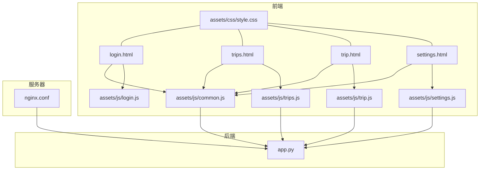
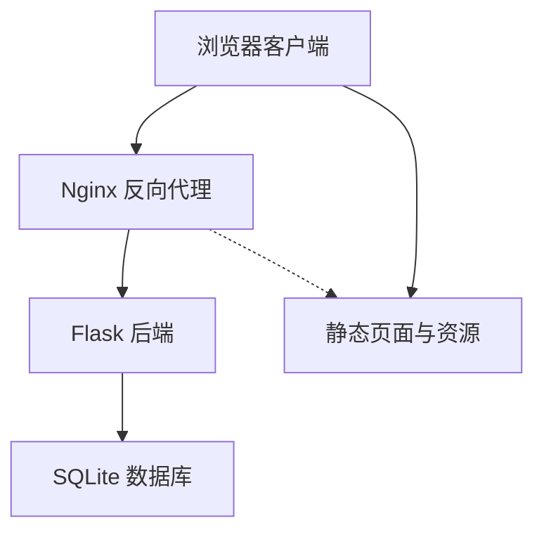
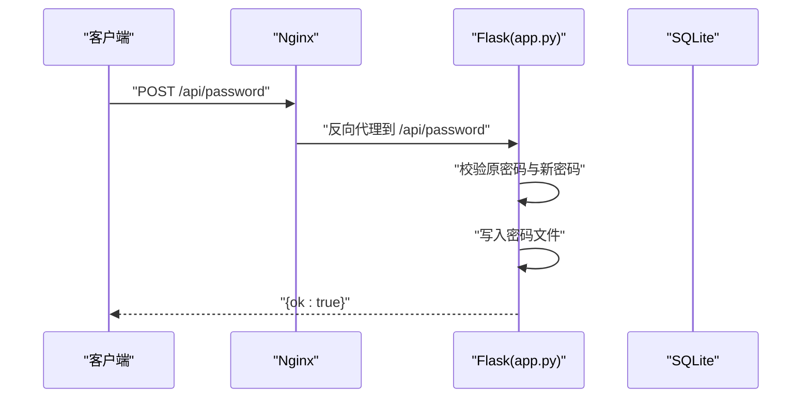
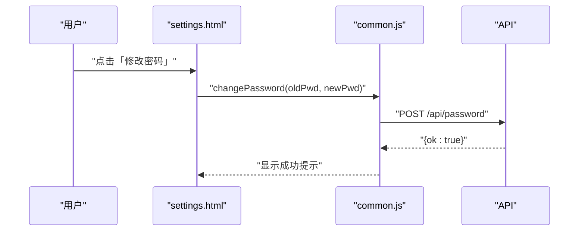
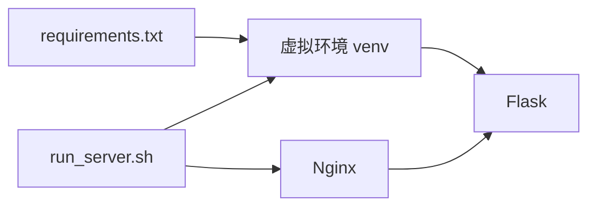

# 开发指南

<cite>
**本文引用的文件**
- [app.py](file://app.py)
- [login.html](file://login.html)
- [trips.html](file://trips.html)
- [trip.html](file://trip.html)
- [settings.html](file://settings.html)
- [assets/css/style.css](file://assets/css/style.css)
- [assets/js/common.js](file://assets/js/common.js)
- [assets/js/login.js](file://assets/js/login.js)
- [assets/js/settings.js](file://assets/js/settings.js)
- [assets/js/trips.js](file://assets/js/trips.js)
- [assets/js/trip.js](file://assets/js/trip.js)
- [nginx.conf](file://nginx.conf)
- [run_server.sh](file://run_server.sh)
- [recorded.md](file://recorded.md)
- [requirements.txt](file://requirements.txt)
</cite>

## 目录
1. [简介](#简介)
2. [项目结构](#项目结构)
3. [核心组件](#核心组件)
4. [架构总览](#架构总览)
5. [详细组件分析](#详细组件分析)
6. [依赖分析](#依赖分析)
7. [性能考虑](#性能考虑)
8. [故障排查指南](#故障排查指南)
9. [结论](#结论)
10. [附录](#附录)

## 简介
本指南面向新加入的开发者，帮助你快速理解 recorded 项目的整体架构、前后端代码风格与最佳实践、开发与调试流程、以及如何安全地扩展功能（新增 API、页面与数据库表）。项目采用轻量级技术栈：后端为 Python 的 Flask，前端为原生 JavaScript 与静态 HTML/CSS，通过 Nginx 提供静态资源与反向代理，SQLite 作为本地存储。

**更新** 本版本新增了设置页面开发、前端组件优化和API增强的开发说明。

## 项目结构
项目采用"按职责分层 + 按页面组织"的混合结构：
- 后端入口与路由：app.py
- 前端页面：login.html、trips.html、trip.html、**settings.html**
- 公共样式与脚本：assets/css/style.css、assets/js/common.js
- 页面级脚本：assets/js/login.js、assets/js/settings.js、assets/js/trips.js、assets/js/trip.js
- 服务器与反向代理：nginx.conf
- 一键部署脚本：run_server.sh
- 依赖声明：requirements.txt
- 项目目标与约束：recorded.md

**图表来源**
- [app.py:1-515](file://app.py#L1-L515)
- [login.html:1-32](file://login.html#L1-L32)
- [trips.html:1-60](file://trips.html#L1-L60)
- [trip.html:1-155](file://trip.html#L1-L155)
- [settings.html:1-83](file://settings.html#L1-L83)
- [assets/css/style.css:1-283](file://assets/css/style.css#L1-L283)
- [assets/js/common.js:1-239](file://assets/js/common.js#L1-L239)
- [assets/js/login.js:1-44](file://assets/js/login.js#L1-L44)
- [assets/js/settings.js:1-235](file://assets/js/settings.js#L1-L235)
- [assets/js/trips.js:1-130](file://assets/js/trips.js#L1-L130)
- [assets/js/trip.js:1-401](file://assets/js/trip.js#L1-L401)
- [nginx.conf:1-38](file://nginx.conf#L1-L38)

**章节来源**
- [app.py:1-515](file://app.py#L1-L515)
- [login.html:1-32](file://login.html#L1-L32)
- [trips.html:1-60](file://trips.html#L1-L60)
- [trip.html:1-155](file://trip.html#L1-L155)
- [settings.html:1-83](file://settings.html#L1-L83)
- [assets/css/style.css:1-283](file://assets/css/style.css#L1-L283)
- [assets/js/common.js:1-239](file://assets/js/common.js#L1-L239)
- [assets/js/login.js:1-44](file://assets/js/login.js#L1-L44)
- [assets/js/settings.js:1-235](file://assets/js/settings.js#L1-L235)
- [assets/js/trips.js:1-130](file://assets/js/trips.js#L1-L130)
- [assets/js/trip.js:1-401](file://assets/js/trip.js#L1-L401)
- [nginx.conf:1-38](file://nginx.conf#L1-L38)
- [run_server.sh:1-81](file://run_server.sh#L1-L81)
- [recorded.md:1-9](file://recorded.md#L1-L9)
- [requirements.txt:1-2](file://requirements.txt#L1-L2)

## 核心组件
- 后端 Flask 应用
  - 数据库连接与生命周期管理：get_db、teardown_appcontext
  - 初始化数据库与默认类别：init_db
  - 鉴权装饰器：require_auth
  - API 列表：登录、旅行 CRUD、记账记录 CRUD、支付人、类别、**密码修改**
  - 静态文件服务：serve_static、serve_index
- 前端公共模块
  - 令牌管理：localStorage 读取/设置/清理、鉴权检查、登出
  - API 封装：统一 header、响应处理、401 自动跳转登录
  - 工具函数：金额格式化、URL 参数解析、今日日期、HTML 转义、Toast、确认对话框
- 页面脚本
  - 登录页：校验输入、调用登录 API、设置 token、跳转
  - 旅行列表页：加载旅行、统计、新建旅行、跳转详情
  - 旅行详情页：加载旅行与明细、统计、添加/编辑/删除记录、总结、编辑旅行、删除旅行
  - **设置页**：密码修改、支付人管理、类别管理、编辑模态框

**更新** 新增设置页面的完整功能支持。

**章节来源**
- [app.py:27-39](file://app.py#L27-L39)
- [app.py:41-78](file://app.py#L41-L78)
- [app.py:82-89](file://app.py#L82-L89)
- [app.py:106-515](file://app.py#L106-L515)
- [assets/js/common.js:15-36](file://assets/js/common.js#L15-L36)
- [assets/js/common.js:38-132](file://assets/js/common.js#L38-L132)
- [assets/js/common.js:134-239](file://assets/js/common.js#L134-L239)
- [assets/js/login.js:1-44](file://assets/js/login.js#L1-L44)
- [assets/js/settings.js:1-235](file://assets/js/settings.js#L1-L235)
- [assets/js/trips.js:1-130](file://assets/js/trips.js#L1-L130)
- [assets/js/trip.js:1-401](file://assets/js/trip.js#L1-L401)

## 架构总览
系统采用"Nginx + Flask"双层架构：
- Nginx 负责静态资源与反向代理，将 /api/ 请求转发至 Flask
- Flask 对外暴露 RESTful 接口，内部使用 SQLite 存储
- 前端页面通过 common.js 统一发起 API 请求，并在 401 时自动跳转登录

**图表来源**
- [nginx.conf:14-21](file://nginx.conf#L14-L21)
- [app.py:500-515](file://app.py#L500-L515)
- [app.py:14](file://app.py#L14)

## 详细组件分析

### 后端：Flask 应用与数据库
- 数据库初始化
  - trips、records、payers、categories 表；启用 WAL 与外键约束
  - 默认类别插入（忽略重复）
- 鉴权
  - require_auth 装饰器从 Authorization 头提取 Bearer token，未通过则返回 401
- API 设计
  - 登录：用户名/密码校验，生成 token 并放入内存集合
  - 旅行：CRUD，查询时附带汇总（记录数、总金额、参与人）
  - 记账记录：CRUD，同时维护 payers 与 categories
  - 支付人/类别：列表与新增（去重）
  - **密码管理**：密码修改、密码文件持久化
- 静态文件
  - 无 Nginx 时由 Flask 直接托管，根路径映射到 login.html

**更新** 新增密码修改API和密码文件持久化功能。

**图表来源**
- [app.py:139-152](file://app.py#L139-L152)
- [nginx.conf:14-21](file://nginx.conf#L14-L21)

**章节来源**
- [app.py:41-78](file://app.py#L41-L78)
- [app.py:82-89](file://app.py#L82-L89)
- [app.py:106-515](file://app.py#L106-L515)
- [app.py:500-515](file://app.py#L500-L515)

### 前端：公共模块与页面脚本
- common.js
  - 令牌管理：localStorage 键 travel_token
  - API 封装：统一 header（含 Authorization）、响应体解析、错误处理与 401 自动跳转
  - 工具函数：金额格式化、URL 参数、今日日期、HTML 转义、Toast、确认对话框
  - **API 增强**：新增密码修改、支付人管理、类别管理 API
- login.js
  - 输入校验、调用 api.login、设置 token、跳转 trips.html
- settings.js
  - **设置页面**：密码修改表单验证、支付人/类别列表渲染、编辑模态框、删除确认
- trips.js
  - 加载旅行列表与统计、渲染卡片、打开/关闭新建旅行弹窗、提交新建旅行
- trip.js
  - 加载旅行详情、统计、初始化表单、添加/编辑/删除记录、渲染总结、编辑旅行、删除旅行

**更新** 新增设置页面的完整前端实现和API增强。

**图表来源**
- [assets/js/settings.js:123-151](file://assets/js/settings.js#L123-L151)
- [assets/js/common.js:153-158](file://assets/js/common.js#L153-L158)
- [app.py:139-152](file://app.py#L139-L152)

**章节来源**
- [assets/js/common.js:15-36](file://assets/js/common.js#L15-L36)
- [assets/js/common.js:38-132](file://assets/js/common.js#L38-L132)
- [assets/js/common.js:134-239](file://assets/js/common.js#L134-L239)
- [assets/js/login.js:1-44](file://assets/js/login.js#L1-L44)
- [assets/js/settings.js:1-235](file://assets/js/settings.js#L1-L235)
- [assets/js/trips.js:1-130](file://assets/js/trips.js#L1-L130)
- [assets/js/trip.js:1-401](file://assets/js/trip.js#L1-L401)

### 样式组织与移动端适配
- 使用 CSS 变量集中管理主题色、阴影、圆角等
- 面向移动端与微信内嵌场景，提供媒体查询适配
- 组件化类名命名（如 .card、.btn、.modal-overlay），便于复用与维护
- **新增管理列表样式**：.manage-list、.manage-item、.manage-item-name、.manage-item-actions

**更新** 新增设置页面的专用样式支持。

**章节来源**
- [assets/css/style.css:1-283](file://assets/css/style.css#L1-L283)

## 依赖分析
- 运行时依赖
  - Flask（requirements.txt）
  - Python 3、pip、venv、nginx（部署脚本安装）
- 运行与部署
  - run_server.sh 完成虚拟环境、依赖安装、数据库初始化、Nginx 配置与启动
  - nginx.conf 将 /api/ 反代到 Flask（127.0.0.1:5000）

**图表来源**
- [requirements.txt:1-2](file://requirements.txt#L1-L2)
- [run_server.sh:26-32](file://run_server.sh#L26-L32)
- [nginx.conf:14-21](file://nginx.conf#L14-L21)

**章节来源**
- [requirements.txt:1-2](file://requirements.txt#L1-L2)
- [run_server.sh:1-81](file://run_server.sh#L1-L81)
- [nginx.conf:1-38](file://nginx.conf#L1-L38)

## 性能考虑
- 数据库
  - 启用 WAL 模式与外键约束，提升并发与一致性
  - 查询时尽量使用索引列（当前 trips.name 未显式索引，可按需添加）
- API
  - 列表接口对每条旅行进行二次查询汇总，建议在 records 上建立 trip_id 索引以优化
  - **新增** 支付人和类别管理的批量操作建议使用 Promise.all 并行处理
- 前端
  - 使用 Promise.all 并行加载旅行详情相关数据，减少等待时间
  - 列表渲染采用字符串拼接，建议在复杂场景引入模板引擎或轻量框架
  - **新增** 设置页面的模态框采用事件委托，避免重复绑定

**更新** 新增设置页面相关的性能优化建议。

**章节来源**
- [app.py:31-32](file://app.py#L31-L32)
- [app.py:122-139](file://app.py#L122-L139)
- [assets/js/trip.js:104-123](file://assets/js/trip.js#L104-L123)
- [assets/js/settings.js:27-37](file://assets/js/settings.js#L27-L37)

## 故障排查指南
- 登录失败
  - 检查用户名/密码是否正确（固定账号：lou/123）
  - 查看浏览器网络面板 /api/login 是否返回 401
  - 确认 common.js 是否正确设置 Authorization 头
- 401 未登录
  - 检查 localStorage 中 travel_token 是否存在
  - 确认 Nginx 是否正确反代 /api/ 到 Flask
- 静态资源 404
  - 确认 Nginx root 指向项目目录
  - 确认 run_server.sh 已执行并启用站点
- 数据库问题
  - 确认 init_db 已执行
  - 检查 data.db 文件权限与路径
- **新增** 设置页面问题
  - 检查密码修改是否满足长度要求（至少3位）
  - 确认支付人和类别名称唯一性约束
  - 验证模态框事件绑定是否正常

**更新** 新增设置页面相关的故障排查指导。

**章节来源**
- [assets/js/common.js:15-36](file://assets/js/common.js#L15-L36)
- [nginx.conf:14-21](file://nginx.conf#L14-L21)
- [run_server.sh:40-50](file://run_server.sh#L40-L50)
- [app.py:41-78](file://app.py#L41-L78)
- [assets/js/settings.js:123-151](file://assets/js/settings.js#L123-L151)

## 结论
recorded 项目以简洁清晰的方式实现了旅游记账的核心功能，前后端分离明确、API 设计直观。**本次更新**新增了设置页面，提供了完整的用户管理功能，包括密码修改、支付人管理和类别管理。建议在后续迭代中引入更完善的鉴权方案（如 JWT 持久化）、数据库索引优化与前端模板化，以进一步提升安全性、性能与可维护性。

## 附录

### 开发环境搭建与调试
- 系统与依赖
  - Ubuntu 22 环境，安装 Python 3、pip、venv、nginx
  - 使用 run_server.sh 一键安装依赖、初始化数据库、配置 Nginx、启动 Flask
- 本地开发建议
  - 使用 VS Code 或 WebStorm，开启 ESLint（JS）、flake8（Python）扩展
  - 前端调试：Chrome DevTools Network 面板查看 /api/ 请求与响应
  - 后端调试：查看 flask.log 输出，必要时临时开启 Flask debug
- 热重载与开发体验
  - 当前未集成热重载，建议在开发阶段使用浏览器自动刷新插件或本地代理工具
  - 修改静态资源后刷新页面即可生效

**章节来源**
- [run_server.sh:20-32](file://run_server.sh#L20-L32)
- [run_server.sh:52-66](file://run_server.sh#L52-L66)
- [app.py:512-515](file://app.py#L512-L515)

### 代码规范与最佳实践
- Python 后端
  - 命名：函数与变量使用 snake_case；常量使用 UPPER_CASE
  - 注释：为复杂逻辑与 API 接口添加简要注释
  - 错误处理：统一返回 JSON 错误体与合适的状态码
  - 安全：固定账号仅用于演示，生产环境应接入数据库与强密码策略
  - **新增** 密码管理：使用独立文件存储密码，支持动态修改
- JavaScript 前端
  - 命名：函数与变量使用 camelCase；DOM 选择器使用前缀（如 tripId、recordListEl）
  - 模块化：公共逻辑集中在 common.js，页面脚本仅处理 UI 交互
  - 安全：使用 escapeHtml 防止 XSS；统一通过 api.login 设置 Authorization
  - 可维护性：将 UI 字符串抽取为常量，避免魔法字符串
  - **新增** 设置页面：采用事件委托模式，优化内存使用
- CSS 样式
  - 使用 CSS 变量统一主题；组件类名语义化
  - 移动端优先，使用媒体查询适配微信内嵌场景
  - **新增** 管理列表样式：支持编辑、删除操作的统一界面

**更新** 新增设置页面相关的代码规范和最佳实践。

**章节来源**
- [app.py:139-152](file://app.py#L139-L152)
- [app.py:106-515](file://app.py#L106-L515)
- [assets/js/common.js:38-132](file://assets/js/common.js#L38-L132)
- [assets/js/settings.js:1-235](file://assets/js/settings.js#L1-L235)
- [assets/css/style.css:1-283](file://assets/css/style.css#L1-L283)

### 功能扩展指导
- 新增 API 端点
  - 在 app.py 中添加路由与处理函数，确保使用 require_auth 装饰器保护
  - 在 common.js 中补充对应的 api 方法，遵循现有命名与参数约定
  - **新增** 设置页面相关API：密码修改、支付人管理、类别管理
- 新增页面
  - 新建 HTML 页面，引入 assets/css/style.css 与 assets/js/common.js
  - 在对应页面脚本中实现数据加载、表单处理与交互逻辑
  - **新增** 设置页面：导航栏、表单验证、模态框交互
- 新增数据库表
  - 在 init_db 中创建表结构与索引
  - 在 app.py 中补充相应 API 与数据模型转换
  - 如需迁移，建议增加版本号与迁移脚本
- **新增** 前端组件优化
  - 采用事件委托减少内存占用
  - 实现统一的模态框组件复用
  - 优化表单验证与错误提示

**更新** 新增设置页面开发和前端组件优化的扩展指导。

**章节来源**
- [app.py:41-78](file://app.py#L41-L78)
- [app.py:106-515](file://app.py#L106-L515)
- [assets/js/common.js:38-132](file://assets/js/common.js#L38-L132)
- [assets/js/settings.js:1-235](file://assets/js/settings.js#L1-L235)

### 代码审查清单
- 后端
  - 是否使用 require_auth 保护敏感接口
  - 参数校验是否完整（空值、类型、范围）
  - 错误信息是否友好且不泄露敏感信息
  - 是否存在 SQL 注入风险（当前使用参数化查询，无需担心）
  - 是否有必要的索引与事务控制
  - **新增** 密码修改：原密码验证、新密码强度检查
- 前端
  - 是否统一处理 401 并跳转登录
  - 是否存在 XSS 风险（escapeHtml 使用）
  - 是否有内存泄漏（事件绑定与解绑）
  - 是否具备良好的错误提示与用户体验
  - **新增** 设置页面：表单验证、模态框状态管理
- 部署与安全
  - Nginx 是否禁止访问 .py/.sh/.db
  - 静态资源路径与反代配置是否正确
  - 日志输出与错误监控是否到位

**更新** 新增设置页面相关的代码审查要点。

**章节来源**
- [app.py:82-89](file://app.py#L82-L89)
- [assets/js/common.js:47-57](file://assets/js/common.js#L47-L57)
- [nginx.conf:23-36](file://nginx.conf#L23-L36)
- [assets/js/settings.js:123-151](file://assets/js/settings.js#L123-L151)

### 版本控制与协作流程
- 分支策略
  - 主分支仅合并稳定功能，特性开发在 feature/* 分支
  - 修复紧急问题使用 hotfix/* 分支
  - **新增** 设置页面开发：feature/settings-page 分支
- 提交规范
  - 标题：type(scope): subject
  - 内容：变更动机与影响范围
- 审查与合并
  - 至少一名同事审查通过后方可合并
  - 合并前确保 run_server.sh 与 nginx.conf 无冲突

**更新** 新增设置页面开发的版本控制策略。

**章节来源**
- [recorded.md:1-9](file://recorded.md#L1-L9)
- [nginx.conf:1-38](file://nginx.conf#L1-L38)
- [run_server.sh:1-81](file://run_server.sh#L1-L81)