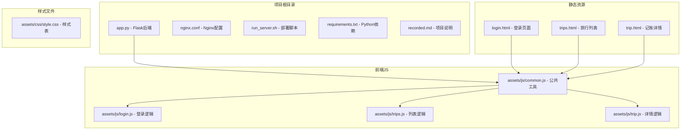
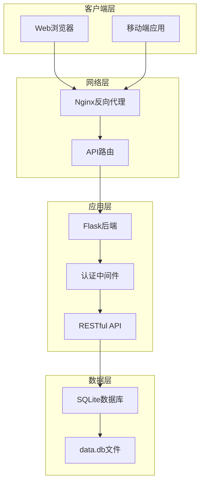
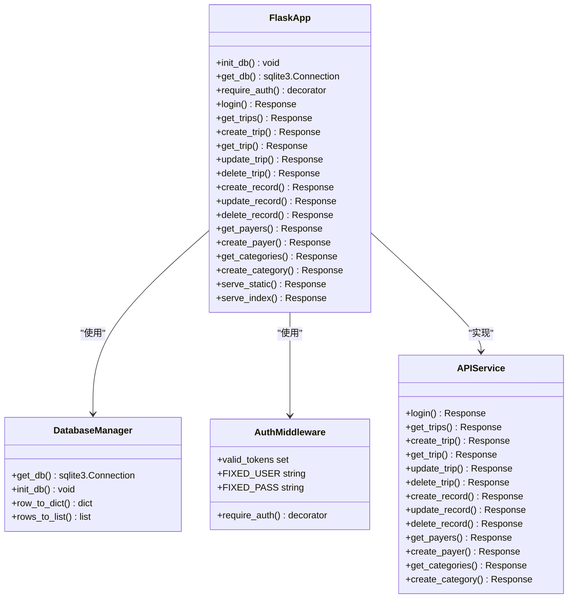
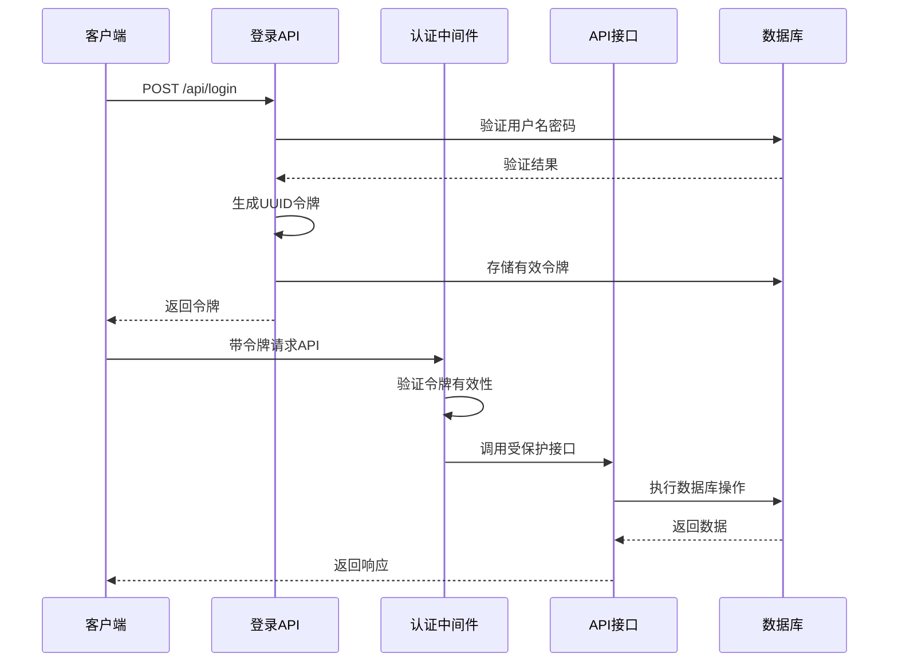
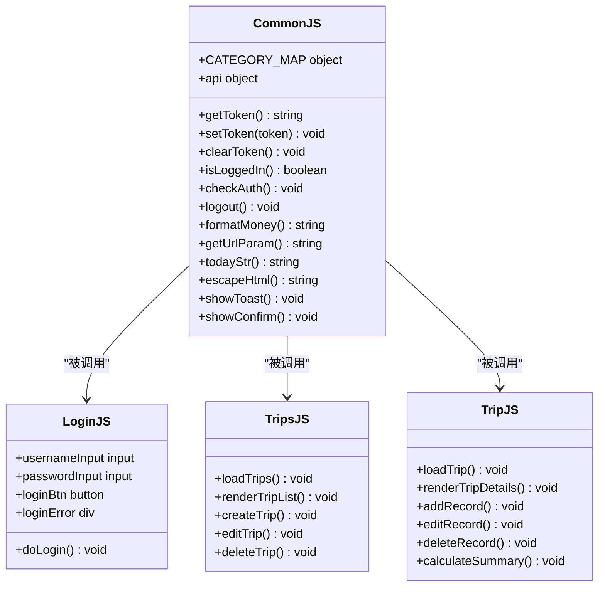
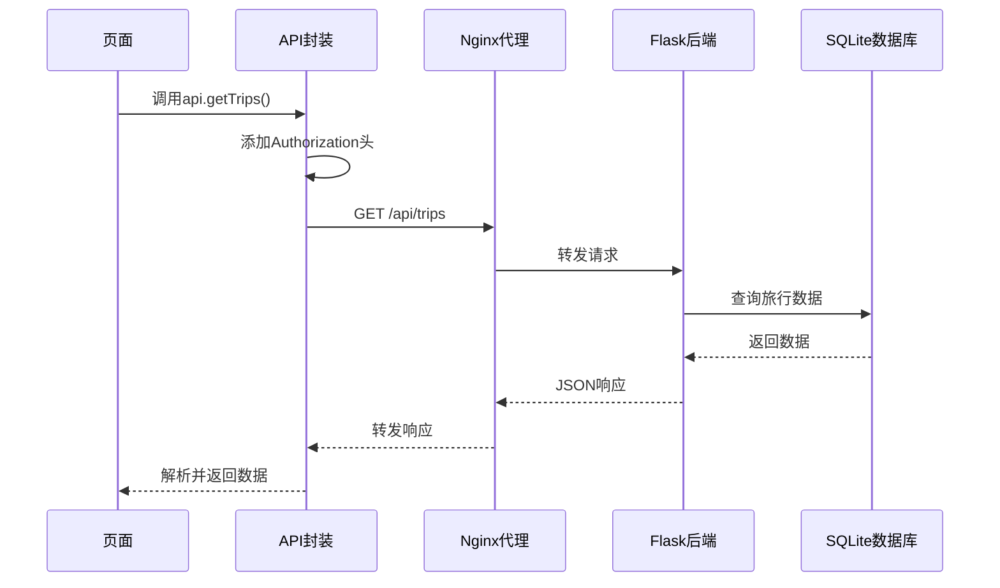
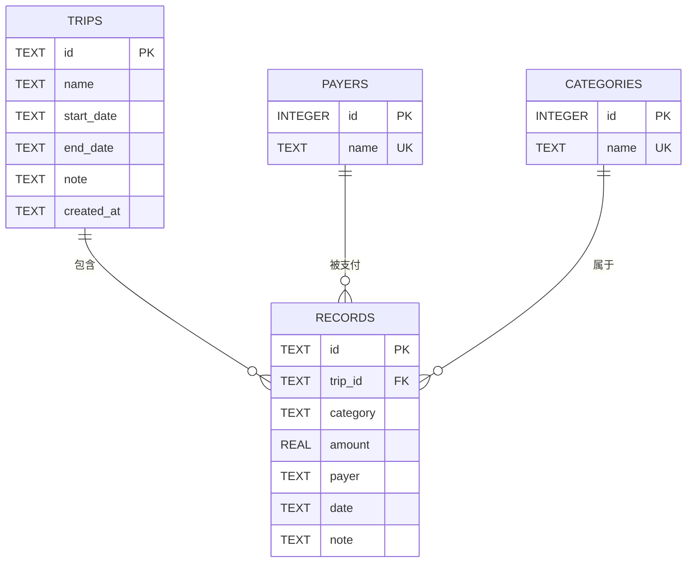

# 快速开始

<cite>
**本文引用的文件**
- [app.py](file://app.py)
- [nginx.conf](file://nginx.conf)
- [run_server.sh](file://run_server.sh)
- [login.html](file://login.html)
- [trips.html](file://trips.html)
- [trip.html](file://trip.html)
- [assets/js/common.js](file://assets/js/common.js)
- [assets/js/login.js](file://assets/js/login.js)
- [requirements.txt](file://requirements.txt)
- [recorded.md](file://recorded.md)
</cite>

## 目录
1. [简介](#简介)
2. [项目结构](#项目结构)
3. [核心组件](#核心组件)
4. [架构概览](#架构概览)
5. [详细组件分析](#详细组件分析)
6. [依赖分析](#依赖分析)
7. [性能考虑](#性能考虑)
8. [故障排除指南](#故障排除指南)
9. [结论](#结论)
10. [附录](#附录)

## 简介

recorded是一个基于Flask的旅游记账系统，专为Ubuntu 22.04系统设计。该项目提供了完整的前后端分离架构，包括Web前端界面、Flask后端API、SQLite数据库存储和Nginx反向代理。系统支持多旅行记账管理、费用分类统计、支付人管理等功能，具有响应式设计，可在微信等移动设备上良好运行。

**章节来源**
- [recorded.md:1-9](file://recorded.md#L1-L9)

## 项目结构

项目采用前后端分离的目录结构，主要包含以下核心文件：



**图表来源**
- [app.py:1-331](file://app.py#L1-L331)
- [nginx.conf:1-38](file://nginx.conf#L1-L38)
- [run_server.sh:1-81](file://run_server.sh#L1-L81)

**章节来源**
- [app.py:1-331](file://app.py#L1-L331)
- [login.html:1-32](file://login.html#L1-L32)
- [trips.html:1-60](file://trips.html#L1-L60)
- [trip.html:1-155](file://trip.html#L1-L155)

## 核心组件

### Flask后端服务

Flask应用提供了RESTful API接口，支持以下核心功能：
- 用户认证和令牌管理
- 旅行信息管理（CRUD操作）
- 记账记录管理（CRUD操作）
- 支付人和费用类别管理
- SQLite数据库操作

### 前端界面系统

系统包含三个主要页面：
- 登录页面：用户身份验证
- 旅行列表页面：查看和管理旅行
- 记账详情页面：具体的费用记录和统计

### Nginx反向代理

Nginx作为反向代理服务器，负责：
- 静态文件服务
- API请求转发到Flask后端
- 安全防护（禁止访问敏感文件）

**章节来源**
- [app.py:105-331](file://app.py#L105-L331)
- [nginx.conf:1-38](file://nginx.conf#L1-L38)

## 架构概览

系统采用经典的三层架构模式：



**图表来源**
- [app.py:80-90](file://app.py#L80-L90)
- [nginx.conf:14-21](file://nginx.conf#L14-L21)

## 详细组件分析

### Flask后端架构

Flask应用采用模块化设计，包含以下关键组件：



**图表来源**
- [app.py:27-331](file://app.py#L27-L331)

#### 认证机制

系统实现了基于Bearer Token的简单认证机制：



**图表来源**
- [app.py:106-115](file://app.py#L106-L115)
- [app.py:82-89](file://app.py#L82-L89)

**章节来源**
- [app.py:16-21](file://app.py#L16-L21)
- [app.py:82-115](file://app.py#L82-L115)

### 前端JavaScript架构

前端采用模块化JavaScript设计，包含公共工具函数和页面特定逻辑：



**图表来源**
- [assets/js/common.js:1-206](file://assets/js/common.js#L1-L206)
- [assets/js/login.js:1-44](file://assets/js/login.js#L1-L44)

#### API调用流程

前端通过统一的API封装进行数据交互：



**图表来源**
- [assets/js/common.js:74-94](file://assets/js/common.js#L74-L94)
- [nginx.conf:14-21](file://nginx.conf#L14-L21)

**章节来源**
- [assets/js/common.js:39-132](file://assets/js/common.js#L39-L132)
- [assets/js/login.js:13-34](file://assets/js/login.js#L13-L34)

### 数据模型设计

系统使用SQLite数据库存储数据，包含以下核心表结构：



**图表来源**
- [app.py:46-78](file://app.py#L46-L78)

**章节来源**
- [app.py:46-78](file://app.py#L46-L78)

## 依赖分析

### Python依赖

项目使用最小化的Python依赖配置：

| 依赖包 | 版本要求 | 用途 |
|--------|----------|------|
| flask | 最新版本 | Web框架 |
| sqlite3 | 内置 | 数据库操作 |

**章节来源**
- [requirements.txt:1-2](file://requirements.txt#L1-L2)

### 系统依赖

部署脚本自动安装以下系统级依赖：

| 依赖包 | 用途 | 安装命令 |
|--------|------|----------|
| python3 | Python解释器 | apt-get install python3 |
| python3-pip | 包管理器 | apt-get install python3-pip |
| python3-venv | 虚拟环境 | apt-get install python3-venv |
| nginx | Web服务器 | apt-get install nginx |

**章节来源**
- [run_server.sh:22-24](file://run_server.sh#L22-L24)

## 性能考虑

### 数据库优化

系统采用了SQLite的WAL模式和外键约束，提高了并发性能和数据完整性：

- WAL模式：支持多读写并发，减少锁竞争
- 外键约束：确保数据一致性，防止脏数据
- PRAGMA设置：优化查询性能

### 缓存策略

- 内存令牌缓存：使用set存储有效令牌，支持快速验证
- 前端本地存储：使用localStorage缓存用户令牌，减少重复登录

### 部署优化

- Nginx静态文件缓存：提高静态资源加载速度
- 反向代理：统一入口，便于扩展和监控
- 虚拟环境：隔离依赖，避免版本冲突

## 故障排除指南

### 常见问题及解决方案

#### 1. Flask应用无法启动

**症状**：部署后Flask进程异常退出
**解决方法**：
- 检查Python虚拟环境是否正确创建
- 验证requirements.txt依赖是否安装
- 查看flask.log日志文件获取详细错误信息

#### 2. Nginx配置错误

**症状**：浏览器显示502 Bad Gateway
**解决方法**：
- 使用`nginx -t`测试配置语法
- 检查Flask后端是否在5000端口运行
- 验证反向代理配置中的proxy_pass地址

#### 3. 登录失败

**症状**：使用默认凭据无法登录
**解决方法**：
- 确认数据库已正确初始化
- 检查令牌生成和验证逻辑
- 验证前端JavaScript的API调用

#### 4. 权限问题

**症状**：Nginx无法访问静态文件
**解决方法**：
- 确保Nginx用户对项目目录有读取权限
- 检查SELinux或AppArmor安全策略
- 验证文件路径配置是否正确

**章节来源**
- [run_server.sh:52-66](file://run_server.sh#L52-L66)
- [nginx.conf:23-36](file://nginx.conf#L23-L36)

### 调试技巧

1. **查看Flask日志**：`tail -f flask.log`
2. **检查进程状态**：`systemctl status nginx` 和 `ps aux | grep python`
3. **验证API响应**：使用curl命令测试API接口
4. **浏览器开发者工具**：检查网络请求和JavaScript错误

## 结论

recorded项目提供了一个完整、可部署的旅游记账系统解决方案。通过合理的架构设计和自动化部署脚本，用户可以在Ubuntu 22.04系统上快速搭建开发或生产环境。

系统的主要优势包括：
- 简洁的前后端分离架构
- 自动化的部署流程
- 完整的功能覆盖（登录、旅行管理、记账、统计）
- 良好的移动端适配
- 安全的认证机制

建议的后续改进方向：
- 添加用户注册和多用户支持
- 实现数据备份和恢复机制
- 增加更丰富的统计图表
- 支持图片上传和附件功能

## 附录

### 环境准备步骤

#### Ubuntu 22.04系统准备

1. **更新系统包列表**
   ```bash
   sudo apt update
   ```

2. **安装基础工具**
   ```bash
   sudo apt install -y curl wget git vim
   ```

#### Python环境配置

1. **安装Python 3和pip**
   ```bash
   sudo apt install -y python3 python3-pip python3-venv
   ```

2. **创建虚拟环境**
   ```bash
   python3 -m venv venv
   source venv/bin/activate
   ```

3. **安装Flask依赖**
   ```bash
   pip install flask
   ```

#### Flask框架安装

1. **验证Flask安装**
   ```bash
   python3 -c "import flask; print(flask.__version__)"
   ```

2. **测试Flask应用**
   ```bash
   python3 app.py
   ```

#### Nginx服务器安装和配置

1. **安装Nginx**
   ```bash
   sudo apt install -y nginx
   ```

2. **配置站点**
   ```bash
   sudo cp nginx.conf /etc/nginx/sites-available/recorded
   sudo ln -s /etc/nginx/sites-available/recorded /etc/nginx/sites-enabled/
   sudo rm /etc/nginx/sites-enabled/default
   ```

3. **测试配置**
   ```bash
   sudo nginx -t
   ```

4. **重启服务**
   ```bash
   sudo systemctl restart nginx
   sudo systemctl enable nginx
   ```

### 部署流程

#### 方法一：使用一键部署脚本

1. **赋予执行权限**
   ```bash
   chmod +x run_server.sh
   ```

2. **以root权限运行**
   ```bash
   sudo ./run_server.sh
   ```

3. **查看部署结果**
   ```bash
   cat flask.log
   ```

#### 方法二：手动部署

1. **克隆代码**
   ```bash
   git clone https://github.com/your-repo/recorded.git
   cd recorded
   ```

2. **创建虚拟环境**
   ```bash
   python3 -m venv venv
   source venv/bin/activate
   pip install flask
   ```

3. **初始化数据库**
   ```bash
   python3 -c "from app import init_db; init_db()"
   ```

4. **启动Flask后端**
   ```bash
   nohup venv/bin/python3 app.py > flask.log 2>&1 &
   ```

5. **配置Nginx**
   ```bash
   sudo cp nginx.conf /etc/nginx/sites-available/recorded
   sudo ln -s /etc/nginx/sites-available/recorded /etc/nginx/sites-enabled/
   sudo nginx -t && sudo systemctl restart nginx
   ```

### 登录凭证和初始访问

- **默认登录账号**：lou
- **默认登录密码**：123
- **初始访问地址**：http://服务器IP地址/login.html

### 服务管理命令

- **启动Flask**：`sudo systemctl start flask`
- **停止Flask**：`sudo systemctl stop flask`
- **重启Flask**：`sudo systemctl restart flask`
- **查看Flask状态**：`sudo systemctl status flask`
- **启动Nginx**：`sudo systemctl start nginx`
- **停止Nginx**：`sudo systemctl stop nginx`

**章节来源**
- [run_server.sh:3-81](file://run_server.sh#L3-L81)
- [app.py:17-18](file://app.py#L17-L18)
- [app.py:328-331](file://app.py#L328-L331)