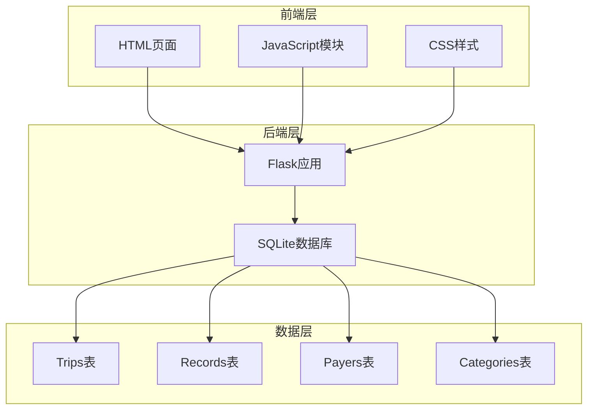
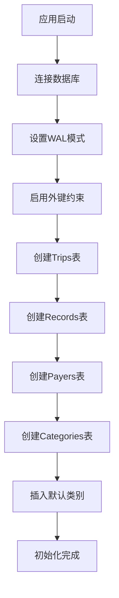
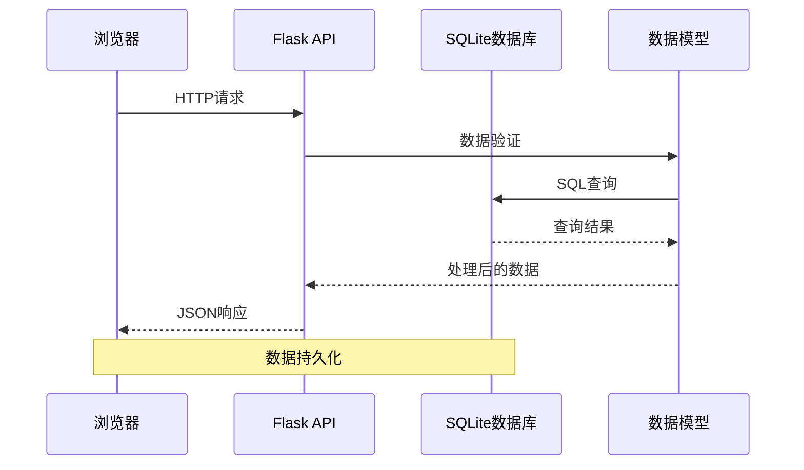
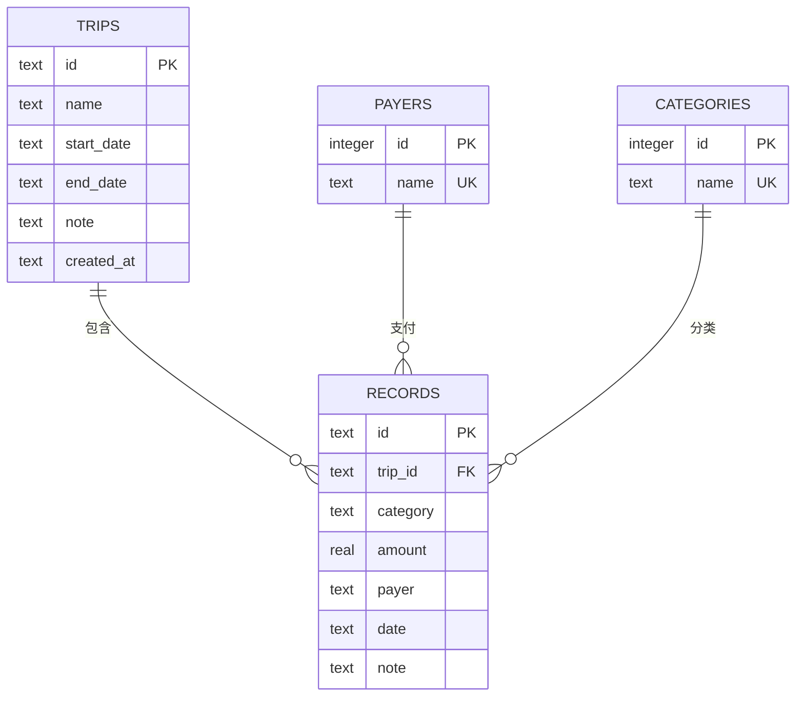
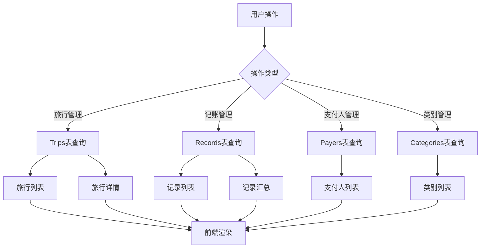
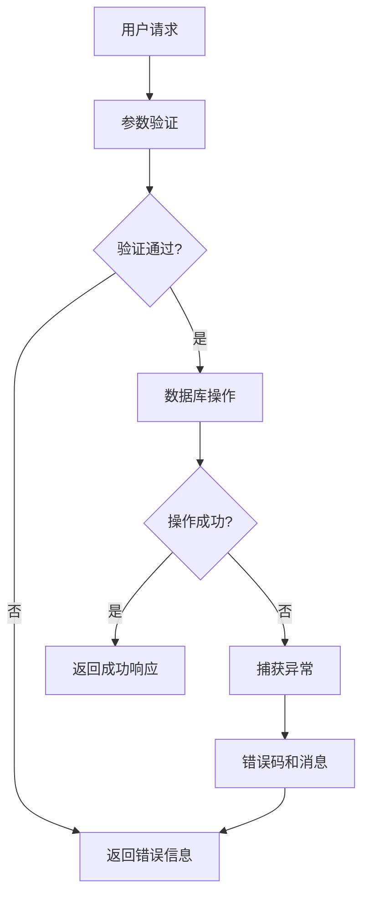

# 数据库设计

<cite>
**本文档引用的文件**
- [app.py](file://app.py)
- [common.js](file://assets/js/common.js)
- [trip.js](file://assets/js/trip.js)
- [trips.js](file://assets/js/trips.js)
- [trip.html](file://trip.html)
- [trips.html](file://trips.html)
- [recorded.md](file://recorded.md)
</cite>

## 目录
1. [简介](#简介)
2. [项目结构](#项目结构)
3. [核心组件](#核心组件)
4. [架构概览](#架构概览)
5. [详细组件分析](#详细组件分析)
6. [依赖关系分析](#依赖关系分析)
7. [性能考虑](#性能考虑)
8. [故障排除指南](#故障排除指南)
9. [结论](#结论)

## 简介

recorded是一个基于Flask和SQLite的旅游记账系统。该系统采用轻量级的数据库设计，通过四个核心表来管理旅行信息、记账记录、支付人和费用类别。系统支持Web界面操作，具有完整的数据验证和业务逻辑约束。

## 项目结构

项目采用前后端分离的架构设计，主要文件组织如下：

**图表来源**
- [app.py:1-331](file://app.py#L1-L331)
- [trip.html:1-155](file://trip.html#L1-L155)
- [trips.html:1-60](file://trips.html#L1-L60)

**章节来源**
- [app.py:1-331](file://app.py#L1-L331)
- [recorded.md:1-9](file://recorded.md#L1-L9)

## 核心组件

### 数据库初始化

系统在启动时自动初始化数据库，配置了SQLite的WAL模式和外键约束：

**图表来源**
- [app.py:41-79](file://app.py#L41-L79)

### 数据库连接管理

系统使用Flask的g对象管理数据库连接，确保每个请求都有独立的数据库会话：

**章节来源**
- [app.py:27-40](file://app.py#L27-L40)

## 架构概览

系统采用三层架构设计，数据流从浏览器到后端API再到SQLite数据库：

**图表来源**
- [app.py:106-331](file://app.py#L106-L331)
- [common.js:38-132](file://assets/js/common.js#L38-L132)

## 详细组件分析

### Trips表（旅行表）

Trips表是系统的核心实体表，用于存储旅行的基本信息。

#### 字段定义

| 字段名 | 数据类型 | 约束条件 | 描述 |
|--------|----------|----------|------|
| id | TEXT | PRIMARY KEY | 旅行唯一标识符，UUID格式 |
| name | TEXT | NOT NULL | 旅行名称 |
| start_date | TEXT | NULL | 开始日期（YYYY-MM-DD） |
| end_date | TEXT | NULL | 结束日期（YYYY-MM-DD） |
| note | TEXT | NULL | 备注信息 |
| created_at | TEXT | NULL | 创建时间戳 |

#### 索引设计

- 主键索引：自动创建，基于id字段
- 无额外索引：由于查询模式相对简单，未创建额外索引

#### 外键关系

- 无外键依赖：作为顶级实体表

**章节来源**
- [app.py:47-54](file://app.py#L47-L54)

### Records表（记账记录表）

Records表存储具体的消费记录，与Trips表建立一对多关系。

#### 字段定义

| 字段名 | 数据类型 | 约束条件 | 描述 |
|--------|----------|----------|------|
| id | TEXT | PRIMARY KEY | 记录唯一标识符 |
| trip_id | TEXT | NOT NULL, FOREIGN KEY | 关联的旅行ID |
| category | TEXT | NOT NULL | 费用类别名称 |
| amount | REAL | NOT NULL | 金额（数值类型） |
| payer | TEXT | NOT NULL | 支付人姓名 |
| date | TEXT | NULL | 消费日期 |
| note | TEXT | NULL | 备注信息 |

#### 索引设计

- 主键索引：自动创建，基于id字段
- 外键索引：自动创建，基于trip_id字段

#### 外键关系

- 外键约束：trip_id -> trips.id (CASCADE DELETE)
- 级联删除：当旅行被删除时，相关记录自动删除

**章节来源**
- [app.py:55-64](file://app.py#L55-L64)

### Payers表（支付人表）

Payers表维护系统中出现过的支付人信息。

#### 字段定义

| 字段名 | 数据类型 | 约束条件 | 描述 |
|--------|----------|----------|------|
| id | INTEGER | PRIMARY KEY, AUTOINCREMENT | 自增主键 |
| name | TEXT | NOT NULL, UNIQUE | 支付人姓名 |

#### 索引设计

- 主键索引：自动创建
- 唯一索引：自动创建，基于name字段

#### 外键关系

- 无外键依赖：独立实体表

**章节来源**
- [app.py:65-68](file://app.py#L65-L68)

### Categories表（费用类别表）

Categories表管理费用类别信息，支持系统预设类别和自定义类别。

#### 字段定义

| 字段名 | 数据类型 | 约束条件 | 描述 |
|--------|----------|----------|------|
| id | INTEGER | PRIMARY KEY, AUTOINCREMENT | 自增主键 |
| name | TEXT | NOT NULL, UNIQUE | 类别名称 |

#### 索引设计

- 主键索引：自动创建
- 唯一索引：自动创建，基于name字段

#### 外键关系

- 无外键依赖：独立实体表

**章节来源**
- [app.py:69-72](file://app.py#L69-L72)

## 依赖关系分析

系统采用严格的外键约束确保数据完整性：

**图表来源**
- [app.py:47-72](file://app.py#L47-L72)

### 数据完整性保证机制

1. **外键约束**：Records表的trip_id字段强制引用Trips表的id字段
2. **级联删除**：删除旅行时自动删除其关联的所有记录
3. **唯一约束**：Payers和Categories表的name字段保持唯一性
4. **非空约束**：关键字段如name、category、amount、payer等都设置了NOT NULL约束

**章节来源**
- [app.py:63](file://app.py#L63)

## 性能考虑

### 查询优化策略

1. **索引策略**
   - 主键索引：自动为所有主键字段创建
   - 外键索引：自动为外键字段创建
   - 无额外索引：当前查询模式相对简单，避免不必要的索引开销

2. **查询模式分析**
   - 旅行列表查询：按created_at降序排列
   - 记录查询：按trip_id过滤，按date降序排列
   - 汇总查询：使用COUNT和SUM聚合函数

3. **缓存策略**
   - 内存中的token存储：临时认证状态管理
   - 前端本地存储：用户认证token持久化

### 数据访问模式

**图表来源**
- [app.py:119-177](file://app.py#L119-L177)
- [app.py:208-272](file://app.py#L208-L272)

## 故障排除指南

### 常见问题及解决方案

1. **数据库连接问题**
   - 检查数据库文件权限
   - 确认SQLite扩展可用性
   - 验证WAL模式配置

2. **外键约束错误**
   - 确保先创建父表再创建子表
   - 检查外键值的有效性
   - 验证级联删除配置

3. **数据重复问题**
   - 检查UNIQUE约束冲突
   - 验证INSERT OR IGNORE语句
   - 确认数据去重逻辑

### 错误处理机制

系统实现了多层次的错误处理：

**图表来源**
- [app.py:210-236](file://app.py#L210-L236)
- [app.py:238-264](file://app.py#L238-L264)

**章节来源**
- [app.py:82-89](file://app.py#L82-L89)
- [app.py:106-115](file://app.py#L106-L115)

## 结论

recorded项目的数据库设计体现了简洁而实用的原则：

### 设计优势

1. **简洁性**：仅使用四个核心表，满足基本业务需求
2. **完整性**：通过外键约束和唯一约束确保数据一致性
3. **可扩展性**：支持自定义类别和支付人，适应不同业务场景
4. **性能**：SQLite的WAL模式提供良好的并发性能

### 技术特点

1. **轻量级**：无需复杂的数据库服务器配置
2. **易部署**：单文件数据库，便于分发和部署
3. **安全**：内置外键约束防止数据不一致
4. **直观**：清晰的表关系和约束定义

### 改进建议

1. **索引优化**：可根据实际查询模式添加适当的索引
2. **审计日志**：添加数据变更历史记录
3. **备份机制**：实现定期数据库备份策略
4. **监控指标**：添加数据库性能监控

该数据库设计为旅游记账场景提供了坚实的数据基础，既满足了当前的功能需求，又具备了良好的扩展潜力。