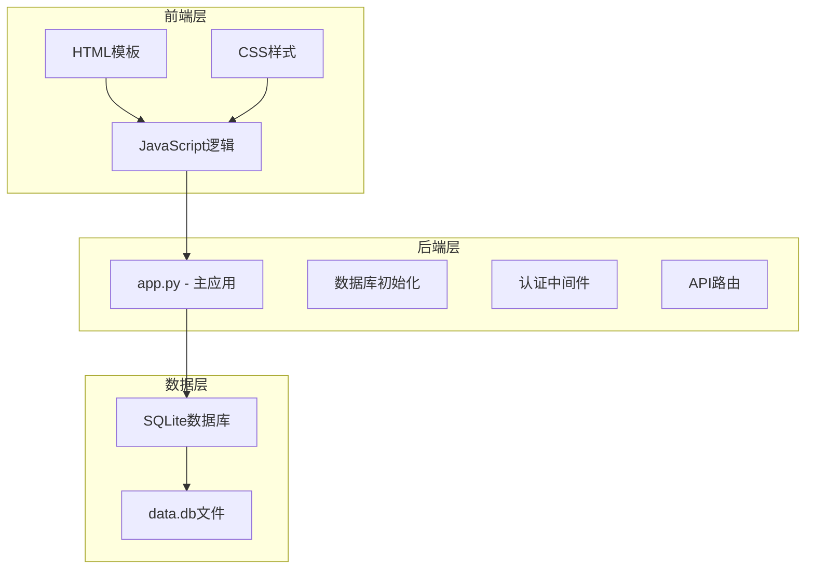
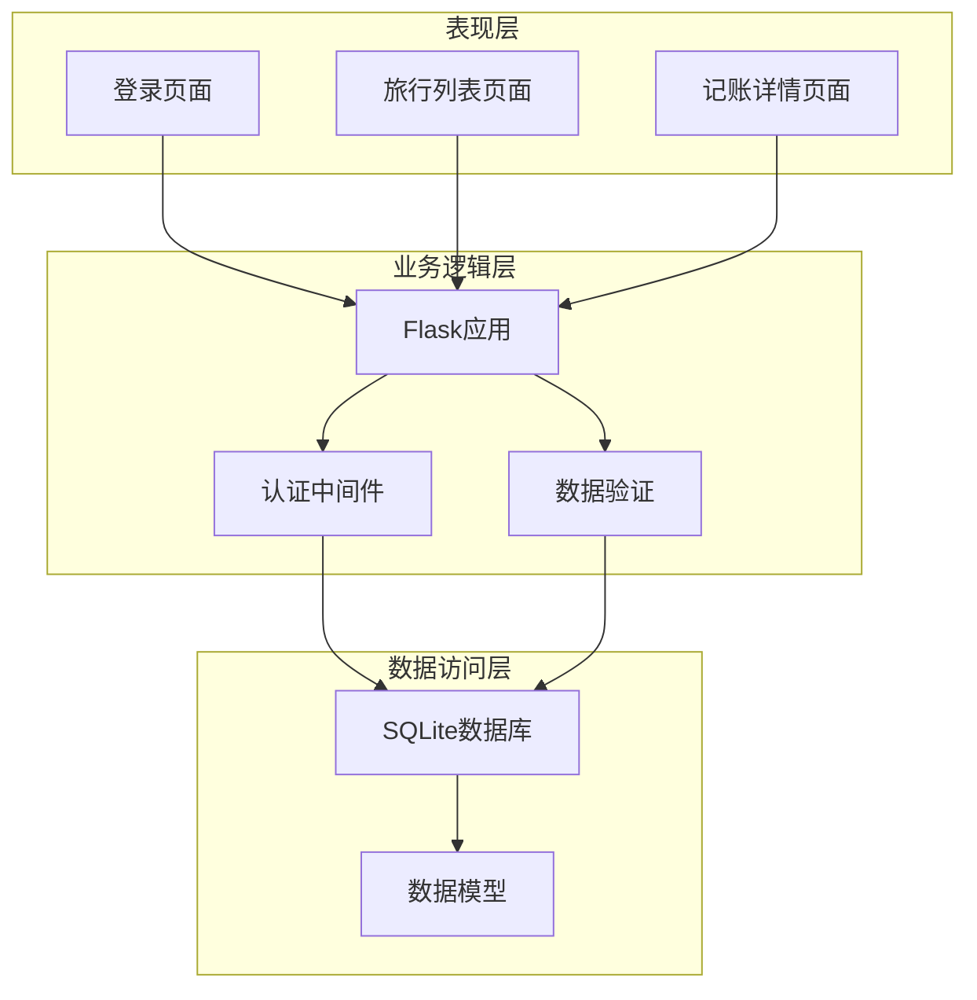
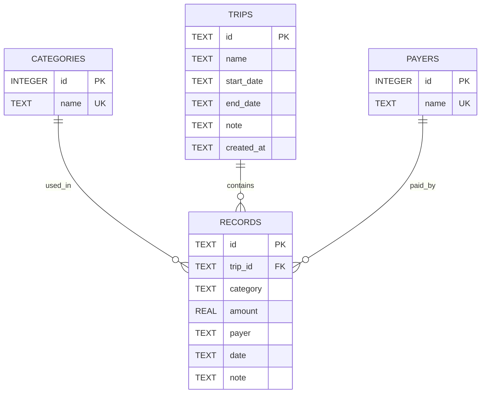
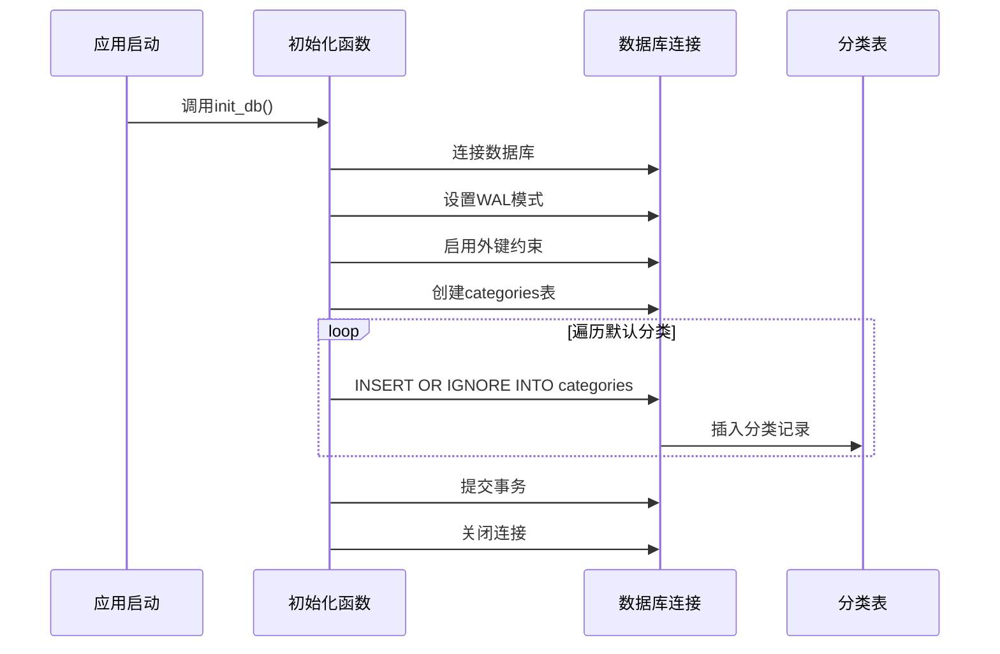
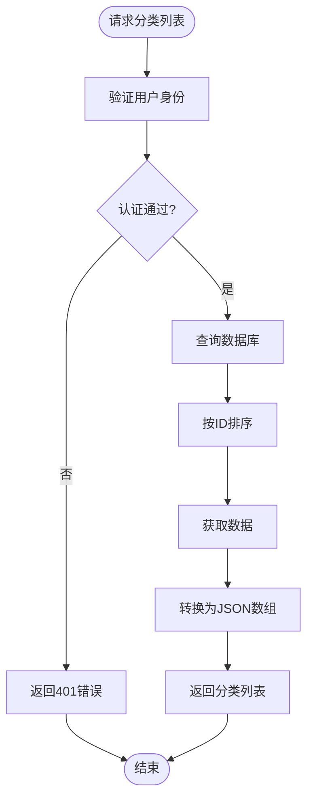
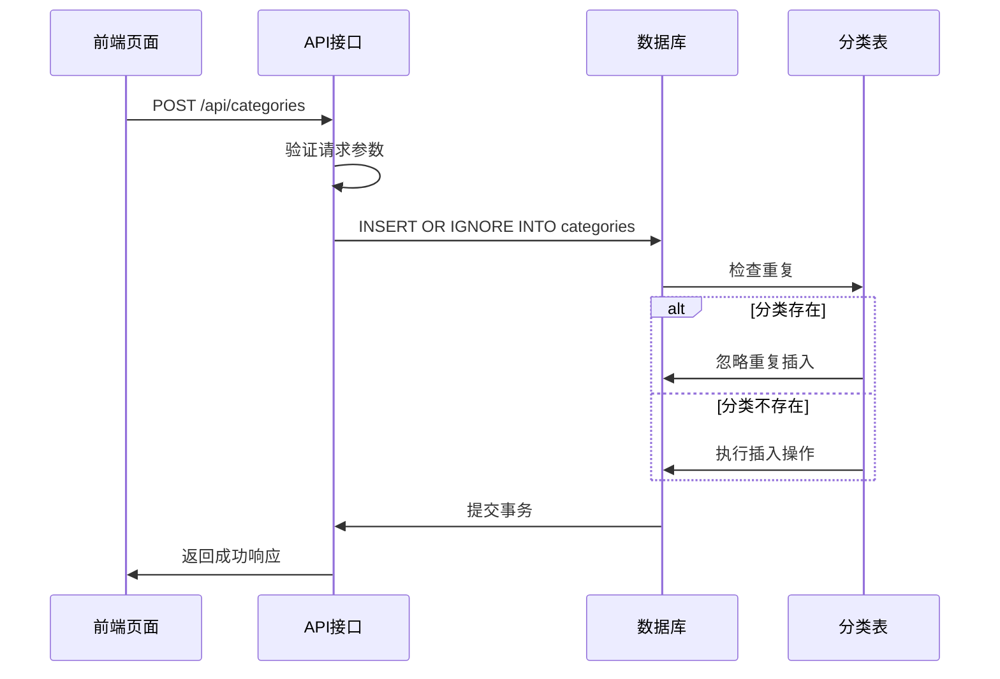
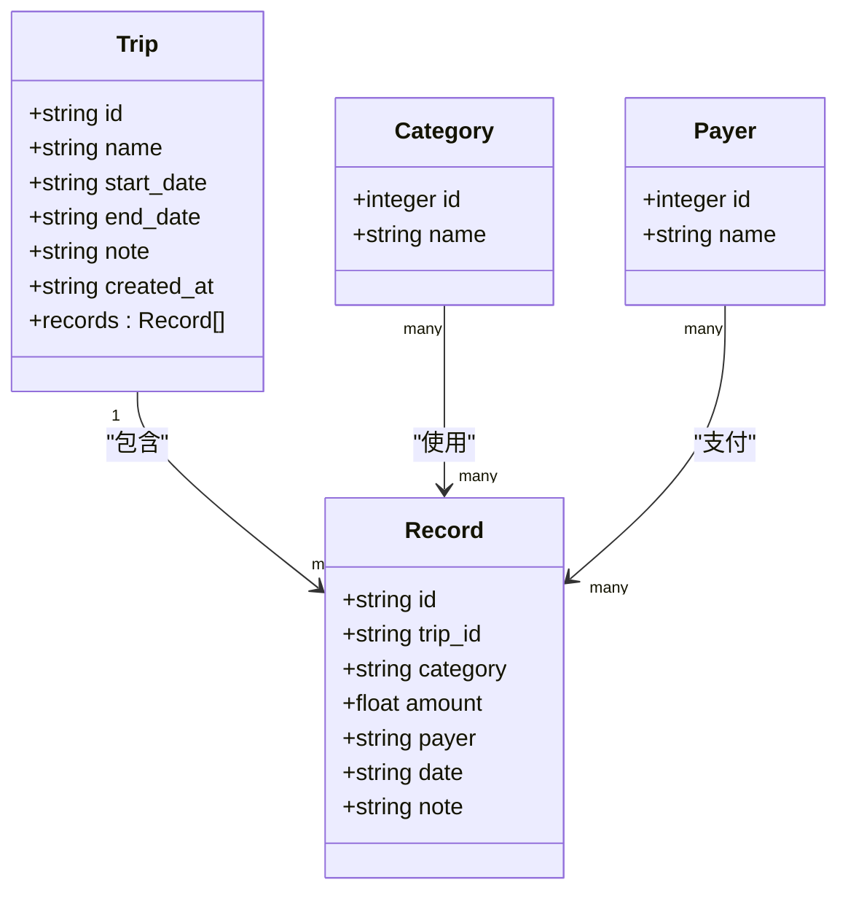
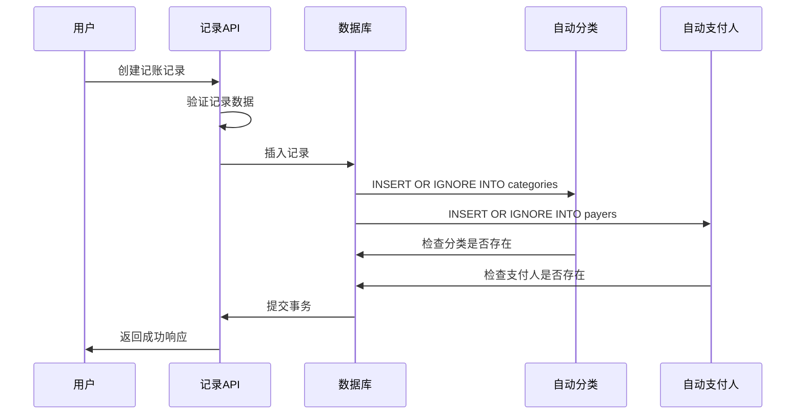
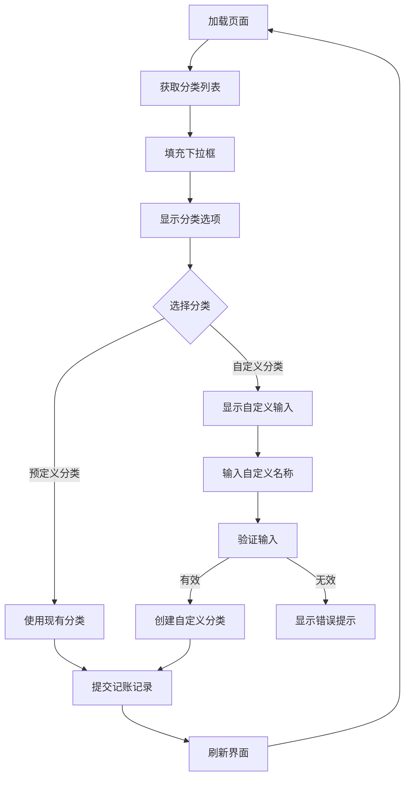
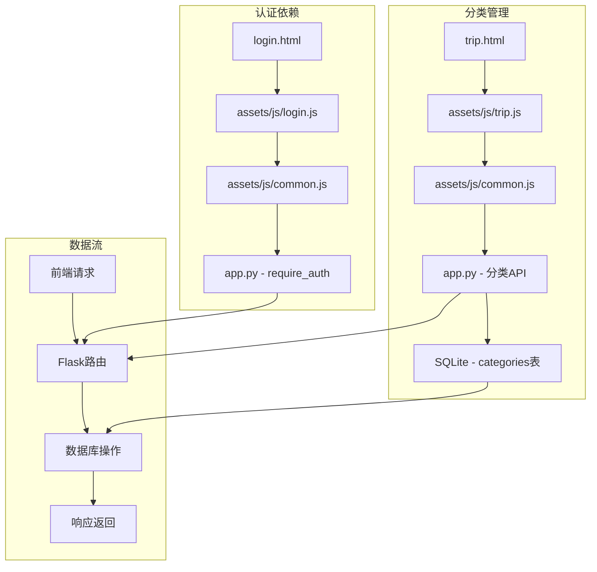

# 分类管理

<cite>
**本文档引用的文件**
- [app.py](file://app.py)
- [recorded.md](file://recorded.md)
- [trip.html](file://trip.html)
- [trips.html](file://trips.html)
- [assets/js/common.js](file://assets/js/common.js)
- [assets/js/trip.js](file://assets/js/trip.js)
- [assets/js/trips.js](file://assets/js/trips.js)
- [login.html](file://login.html)
- [assets/js/login.js](file://assets/js/login.js)
</cite>

## 目录
1. [简介](#简介)
2. [项目结构](#项目结构)
3. [核心组件](#核心组件)
4. [架构概览](#架构概览)
5. [详细组件分析](#详细组件分析)
6. [依赖关系分析](#依赖关系分析)
7. [性能考虑](#性能考虑)
8. [故障排除指南](#故障排除指南)
9. [结论](#结论)
10. [附录](#附录)

## 简介

recorded项目是一个基于Flask的旅游记账系统，专注于记录和管理旅行过程中的各类支出。该系统实现了完整的分类管理功能，支持默认分类的初始化、分类列表的获取、分类的创建以及分类与记账记录的关联关系管理。

该项目采用前后端分离的架构设计，后端使用Python Flask框架提供RESTful API接口，前端使用原生JavaScript实现用户界面交互。系统通过SQLite数据库存储所有数据，包括旅行信息、记账记录、支付人和分类等。

## 项目结构

项目采用模块化的文件组织方式，主要包含以下结构：

**图表来源**
- [app.py:1-331](file://app.py#L1-L331)
- [trip.html:1-155](file://trip.html#L1-L155)
- [trips.html:1-60](file://trips.html#L1-L60)

**章节来源**
- [app.py:1-331](file://app.py#L1-L331)
- [recorded.md:1-9](file://recorded.md#L1-L9)

## 核心组件

### 数据库设计

系统使用SQLite作为数据存储引擎，采用关系型数据库设计模式。核心数据表包括：

1. **trips表** - 存储旅行基本信息
2. **records表** - 存储记账记录，包含外键约束
3. **payers表** - 存储支付人信息
4. **categories表** - 存储分类信息

### 默认分类初始化

系统在启动时自动初始化默认分类，确保用户首次使用时具备基本的分类选项。

**章节来源**
- [app.py:41-79](file://app.py#L41-L79)
- [app.py:23](file://app.py#L23)

### API接口设计

系统提供完整的RESTful API接口，支持分类的CRUD操作：

- GET `/api/categories` - 获取分类列表
- POST `/api/categories` - 创建新分类
- GET `/api/payers` - 获取支付人列表  
- POST `/api/payers` - 创建新支付人

**章节来源**
- [app.py:297-315](file://app.py#L297-L315)
- [app.py:276-294](file://app.py#L276-L294)

## 架构概览

系统采用经典的三层架构模式，实现了清晰的职责分离：

**图表来源**
- [app.py:82-89](file://app.py#L82-L89)
- [assets/js/common.js:39-132](file://assets/js/common.js#L39-L132)

## 详细组件分析

### 分类表设计

分类表采用简洁而高效的设计模式：

**图表来源**
- [app.py:47-72](file://app.py#L47-L72)

#### 表结构特点

1. **主键设计**：categories表使用自增整数ID作为主键，确保唯一性
2. **唯一约束**：分类名称和支付人名称都设置了UNIQUE约束，防止重复
3. **外键关系**：records表通过trip_id关联到trips表，实现数据完整性
4. **索引优化**：按ID排序查询，利用SQLite的内置索引提升查询性能

**章节来源**
- [app.py:69-72](file://app.py#L69-L72)

### 默认分类初始化逻辑

系统在启动时自动执行默认分类初始化，确保用户体验的一致性：

**图表来源**
- [app.py:41-79](file://app.py#L41-L79)

#### 初始化策略

1. **原子性保证**：使用`INSERT OR IGNORE`确保重复插入的安全性
2. **性能优化**：批量处理默认分类，减少数据库往返次数
3. **数据完整性**：通过UNIQUE约束防止重复分类

**章节来源**
- [app.py:23](file://app.py#L23)
- [app.py:74-76](file://app.py#L74-L76)

### 分类列表获取实现

分类列表获取功能实现了按ID排序的查询机制：

**图表来源**
- [app.py:297-302](file://app.py#L297-L302)
- [assets/js/trip.js:105-123](file://assets/js/trip.js#L105-L123)

#### 查询优化特性

1. **排序机制**：使用`ORDER BY id`确保分类列表的稳定性和一致性
2. **数据转换**：通过`rows_to_list`函数将SQLite Row对象转换为字典格式
3. **实时同步**：前端通过Promise.all并发获取旅行信息、支付人和分类数据

**章节来源**
- [app.py:299-301](file://app.py#L299-L301)
- [assets/js/trip.js:105-123](file://assets/js/trip.js#L105-L123)

### 分类创建功能

分类创建功能实现了智能的重复检测和自动忽略机制：

**图表来源**
- [app.py:304-314](file://app.py#L304-L314)
- [assets/js/trip.js:161-197](file://assets/js/trip.js#L161-L197)

#### 重复处理机制

1. **自动忽略**：使用`INSERT OR IGNORE`语句自动处理重复分类
2. **用户友好**：即使用户尝试创建重复分类也不会收到错误提示
3. **数据一致性**：通过UNIQUE约束确保数据库层面的数据完整性

**章节来源**
- [app.py:312](file://app.py#L312)
- [assets/js/trip.js:161-197](file://assets/js/trip.js#L161-L197)

### 分类与记账记录的关联关系

系统实现了强关联关系，确保数据完整性和业务逻辑正确性：

**图表来源**
- [app.py:55-64](file://app.py#L55-L64)
- [app.py:65-68](file://app.py#L65-L68)

#### 外键约束设计

1. **级联删除**：当旅行被删除时，其关联的所有记录会自动删除
2. **数据完整性**：通过外键约束防止悬挂引用
3. **引用完整性**：确保记录中的trip_id始终指向有效的旅行

**章节来源**
- [app.py:63](file://app.py#L63)

### 自动记录分类的业务逻辑

系统实现了智能的自动分类维护机制，在添加消费记录时自动更新分类列表：

**图表来源**
- [app.py:208-236](file://app.py#L208-L236)
- [assets/js/trip.js:177-197](file://assets/js/trip.js#L177-L197)

#### 自动维护策略

1. **即时同步**：在创建记录时立即更新分类和支付人列表
2. **智能去重**：使用`INSERT OR IGNORE`避免重复条目
3. **用户体验**：用户无需手动维护分类，系统自动学习使用过的分类

**章节来源**
- [app.py:232-234](file://app.py#L232-L234)
- [assets/js/trip.js:177-197](file://assets/js/trip.js#L177-L197)

### 前端分类管理实现

前端实现了完整的分类管理界面，支持动态分类选择和自定义分类：

**图表来源**
- [assets/js/trip.js:54-72](file://assets/js/trip.js#L54-L72)
- [assets/js/trip.js:161-197](file://assets/js/trip.js#L161-L197)

#### 前端交互特性

1. **动态下拉框**：根据当前可用分类动态填充选择器
2. **自定义支持**：提供"+ 自定义类别"选项支持用户自定义分类
3. **智能回显**：如果记录使用了不存在的分类，会自动添加到列表中

**章节来源**
- [assets/js/trip.js:54-72](file://assets/js/trip.js#L54-L72)
- [assets/js/trip.js:161-197](file://assets/js/trip.js#L161-L197)

## 依赖关系分析

系统各组件之间的依赖关系清晰明确：

**图表来源**
- [assets/js/login.js:1-44](file://assets/js/login.js#L1-L44)
- [assets/js/trip.js:1-401](file://assets/js/trip.js#L1-L401)
- [assets/js/common.js:39-132](file://assets/js/common.js#L39-L132)

### 外部依赖

1. **Flask框架**：提供Web应用开发基础
2. **SQLite数据库**：轻量级关系型数据库
3. **原生JavaScript**：前端交互逻辑
4. **HTML/CSS**：用户界面展示

**章节来源**
- [app.py:9](file://app.py#L9)
- [app.py:5](file://app.py#L5)

## 性能考虑

### 查询优化

1. **索引利用**：categories表的ID列自动建立索引，支持高效的ORDER BY操作
2. **批量操作**：初始化时批量插入默认分类，减少数据库往返
3. **并发处理**：前端使用Promise.all并发获取多个数据源

### 内存管理

1. **连接池**：Flask应用使用g对象管理数据库连接
2. **及时释放**：应用关闭时自动清理数据库连接
3. **内存安全**：使用INSERT OR IGNORE避免重复数据占用空间

### 网络优化

1. **HTTP缓存**：合理设置响应头，支持浏览器缓存
2. **请求合并**：前端使用Promise.all减少HTTP请求数量
3. **错误处理**：完善的错误处理机制，避免网络异常影响用户体验

## 故障排除指南

### 常见问题及解决方案

#### 分类无法显示

**症状**：分类下拉框为空或显示异常
**可能原因**：
1. 数据库连接失败
2. 分类表初始化失败
3. 前端异步加载错误

**解决步骤**：
1. 检查数据库文件是否存在
2. 验证categories表结构是否正确
3. 查看浏览器控制台是否有JavaScript错误

#### 重复分类问题

**症状**：系统允许创建重复的分类名称
**实际状态**：系统通过UNIQUE约束和INSERT OR IGNORE机制自动处理重复

**解决建议**：
1. 系统已自动处理重复分类，无需用户干预
2. 如需修改现有分类，可通过数据库直接更新

#### 记账记录分类丢失

**症状**：新创建的分类在记录中不显示
**解决方法**：
1. 刷新页面重新加载分类数据
2. 检查网络连接是否正常
3. 确认分类是否正确保存到数据库

**章节来源**
- [app.py:312](file://app.py#L312)
- [assets/js/trip.js:105-123](file://assets/js/trip.js#L105-L123)

### 调试技巧

1. **浏览器开发者工具**：查看网络请求和响应
2. **数据库查看器**：验证数据完整性
3. **日志分析**：检查Flask应用日志输出

## 结论

recorded项目的分类管理功能展现了优秀的软件工程实践，具有以下特点：

1. **设计理念先进**：采用前后端分离架构，职责清晰
2. **数据设计合理**：关系型数据库设计确保数据完整性
3. **用户体验优秀**：自动维护机制减少用户操作负担
4. **扩展性强**：模块化设计便于功能扩展和定制

系统通过智能的默认分类初始化、高效的分类查询、可靠的重复处理机制和完整的前端交互，为用户提供了一个完整而优雅的分类管理解决方案。

## 附录

### 使用场景

1. **旅行记账**：记录交通、住宿、餐饮等各类支出
2. **团队聚餐**：支持多人AA制的费用分摊
3. **购物消费**：分类统计各类商品的购买情况
4. **日常开销**：管理日常生活中的各种支出

### 扩展方法

1. **自定义分类**：通过API接口添加新的分类类型
2. **分类标签**：可扩展为多维分类体系
3. **统计分析**：增加更丰富的数据分析功能
4. **移动端适配**：优化移动设备上的使用体验

### 技术指导

1. **数据库迁移**：如需修改表结构，应制定安全的迁移方案
2. **性能监控**：定期监控数据库查询性能和响应时间
3. **安全加固**：增强SQL注入防护和XSS攻击防护
4. **备份策略**：建立定期的数据备份机制