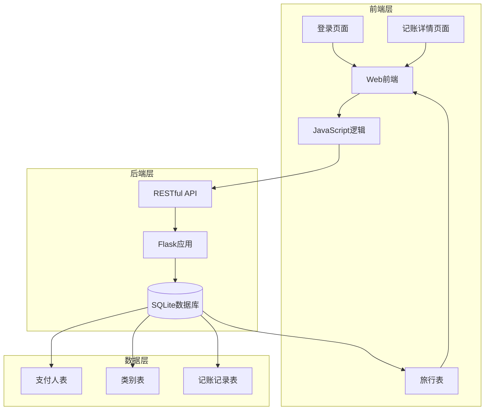
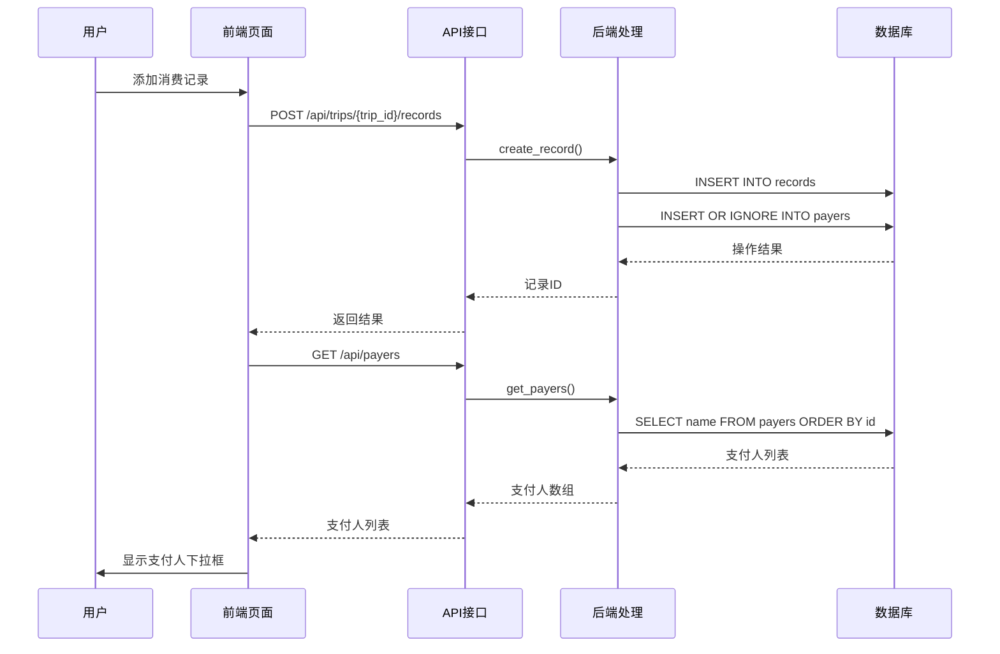
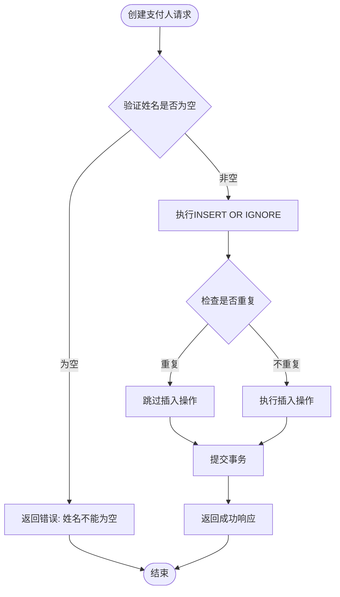
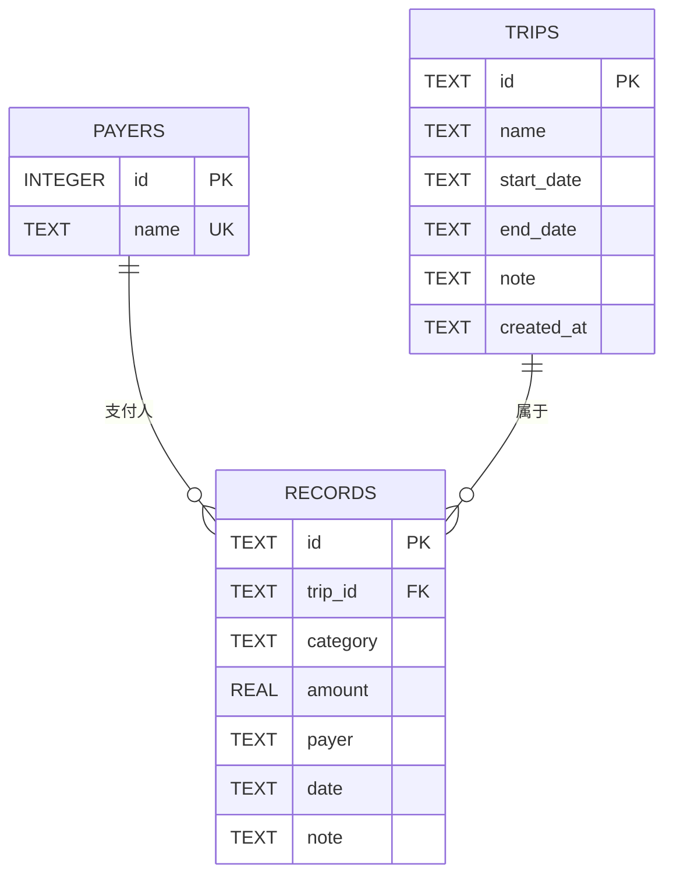
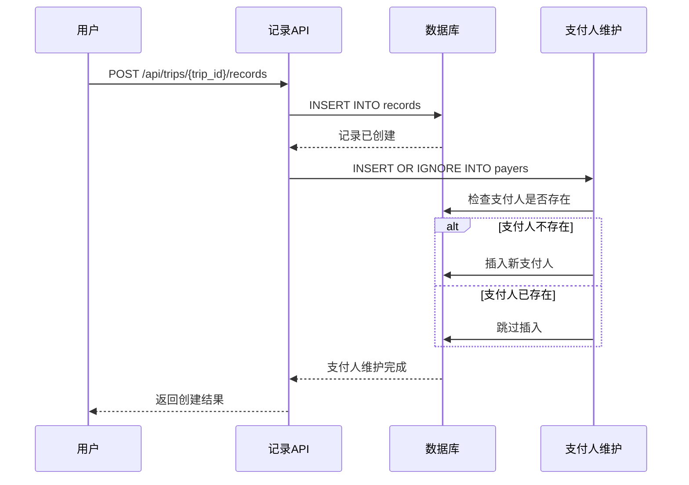
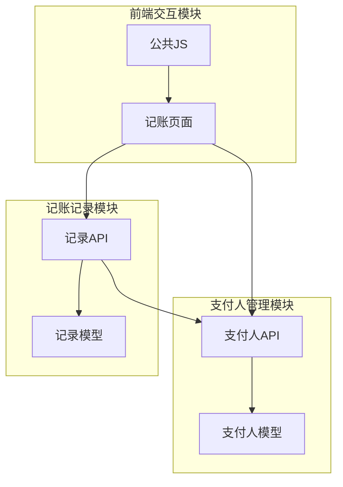

# 支付人管理

<cite>
**本文档引用的文件**
- [app.py](file://app.py)
- [trip.html](file://trip.html)
- [assets/js/trip.js](file://assets/js/trip.js)
- [assets/js/common.js](file://assets/js/common.js)
- [recorded.md](file://recorded.md)
</cite>

## 目录
1. [简介](#简介)
2. [项目结构](#项目结构)
3. [核心组件](#核心组件)
4. [架构概览](#架构概览)
5. [详细组件分析](#详细组件分析)
6. [依赖关系分析](#依赖关系分析)
7. [性能考虑](#性能考虑)
8. [故障排除指南](#故障排除指南)
9. [结论](#结论)

## 简介

recorded项目是一个基于Flask的旅游记账系统，专门用于记录和管理旅行过程中的各种费用支出。该系统的核心功能之一是支付人管理，它允许用户为每次消费记录指定支付人，并自动维护支付人列表。本文档将深入分析支付人管理功能的实现细节，包括数据库设计、API接口、前端交互以及相关的业务逻辑。

根据项目需求文档，系统需要支持：
- 支付人列表的维护和管理
- 自动记录支付人的业务逻辑
- 支付人与记账记录的关联关系
- 支付人数据的去重和一致性保证

## 项目结构

recorded项目采用前后端分离的架构设计，主要包含以下组件：



**图表来源**
- [app.py:46-78](file://app.py#L46-L78)
- [trip.html:1-155](file://trip.html#L1-L155)

**章节来源**
- [app.py:1-331](file://app.py#L1-L331)
- [recorded.md:1-9](file://recorded.md#L1-L9)

## 核心组件

### 数据库表设计

系统使用SQLite作为数据存储，核心表结构如下：

#### 支付人表 (payers)
- **id**: INTEGER PRIMARY KEY AUTOINCREMENT - 自增主键
- **name**: TEXT UNIQUE NOT NULL - 唯一的支付人姓名

#### 记账记录表 (records)
- **id**: TEXT PRIMARY KEY - 记录ID
- **trip_id**: TEXT NOT NULL - 外键关联旅行
- **category**: TEXT NOT NULL - 消费类别
- **amount**: REAL NOT NULL - 金额
- **payer**: TEXT NOT NULL - 支付人
- **date**: TEXT - 消费日期
- **note**: TEXT - 备注

#### 旅行表 (trips)
- **id**: TEXT PRIMARY KEY - 旅行ID
- **name**: TEXT NOT NULL - 旅行名称
- **start_date**: TEXT - 开始日期
- **end_date**: TEXT - 结束日期
- **note**: TEXT - 备注
- **created_at**: TEXT - 创建时间

**章节来源**
- [app.py:46-78](file://app.py#L46-L78)

### 支付人管理API

系统提供了完整的支付人管理API接口：

| 接口 | 方法 | 描述 | 请求参数 | 响应 |
|------|------|------|----------|------|
| `/api/payers` | GET | 获取支付人列表 | 无 | 支付人姓名数组 |
| `/api/payers` | POST | 创建支付人 | `{name: string}` | `{ok: true}` |

**章节来源**
- [app.py:276-294](file://app.py#L276-L294)

## 架构概览

支付人管理功能在整个系统中的位置和交互关系如下：



**图表来源**
- [app.py:208-236](file://app.py#L208-L236)
- [app.py:276-281](file://app.py#L276-L281)

## 详细组件分析

### 支付人表设计与约束

#### 唯一性约束分析

支付人表采用了双重约束机制来确保数据完整性：

1. **主键约束**: `id INTEGER PRIMARY KEY AUTOINCREMENT`
   - 自动生成唯一的自增ID
   - 保证每条记录的唯一标识

2. **唯一性约束**: `name TEXT UNIQUE NOT NULL`
   - 确保支付人姓名的唯一性
   - 防止重复的支付人记录

这种设计既保证了内部标识的唯一性，又确保了业务语义的正确性。

#### 自增ID机制

自增ID的实现机制：
- SQLite自动管理ID递增
- 每次插入新记录时自动分配下一个可用ID
- ID从1开始递增，不重复使用已删除记录的ID

**章节来源**
- [app.py:65-68](file://app.py#L65-L68)

### 支付人列表获取实现

#### 查询逻辑分析

支付人列表的获取实现了按ID排序的查询逻辑：

```sql
SELECT name FROM payers ORDER BY id
```

这个查询的特点：
- **排序规则**: 按照自增ID升序排列
- **返回字段**: 仅返回支付人姓名
- **性能优化**: 使用索引进行排序

#### 前端集成

前端通过API获取支付人列表并动态填充到下拉框中：

```mermaid
flowchart TD
Start([页面加载]) --> LoadData[调用API获取支付人列表]
LoadData --> ParseData[解析返回的支付人数组]
ParseData --> FillSelect[填充下拉框选项]
FillSelect --> AddNewOption[添加"新增支付人"选项]
AddNewOption --> End([完成渲染])
```

**图表来源**
- [assets/js/trip.js:74-88](file://assets/js/trip.js#L74-L88)
- [assets/js/trip.js:105-123](file://assets/js/trip.js#L105-L123)

**章节来源**
- [app.py:276-281](file://app.py#L276-L281)
- [assets/js/trip.js:74-88](file://assets/js/trip.js#L74-L88)

### 支付人创建功能

#### 自动忽略重复支付人机制

系统实现了智能的重复支付人处理机制：



**图表来源**
- [app.py:283-293](file://app.py#L283-L293)

#### 业务逻辑实现

重复支付人的自动忽略机制通过SQLite的`INSERT OR IGNORE`语法实现：
- 如果支付人姓名已存在，系统会自动跳过插入
- 不会产生重复记录
- 保持数据的一致性和完整性

**章节来源**
- [app.py:283-293](file://app.py#L283-L293)

### 支付人与记账记录的关联关系

#### 外键约束设计

虽然支付人字段在记录表中没有显式的外键约束，但系统通过以下方式保证数据一致性：

1. **业务约束**: 支付人必须存在于支付人表中
2. **自动维护**: 添加记录时自动维护支付人列表
3. **查询验证**: 前端在显示时验证支付人有效性

#### 数据一致性保证



**图表来源**
- [app.py:46-78](file://app.py#L46-L78)

**章节来源**
- [app.py:55-64](file://app.py#L55-L64)

### 自动记录支付人的业务逻辑

#### 添加消费记录时的自动维护

系统在添加消费记录时自动维护支付人列表，这是通过以下代码实现的：

```python
# 添加记录后自动维护支付人
db.execute('INSERT OR IGNORE INTO payers (name) VALUES (?)', (payer,))
```

#### 自动维护流程



**图表来源**
- [app.py:232-235](file://app.py#L232-L235)

#### 更新和删除记录时的处理

系统在更新和删除记录时也保持支付人列表的维护：
- **更新记录**: 同样执行支付人自动维护
- **删除记录**: 支付人不会被自动删除（保留历史记录）

**章节来源**
- [app.py:232-235](file://app.py#L232-L235)
- [app.py:261-263](file://app.py#L261-L263)

### 前端交互实现

#### 支付人下拉框的动态管理

前端实现了智能的支付人下拉框管理：

```mermaid
flowchart TD
LoadPage[页面加载] --> LoadPayers[加载支付人列表]
LoadPayers --> RenderSelect[渲染下拉框]
RenderSelect --> AddNewOption[添加"新增支付人"选项]
AddNewOption --> ShowHideGroup{用户选择支付人}
ShowHideGroup --> |选择现有支付人| HideNewGroup[隐藏新增组]
ShowHideGroup --> |选择新增支付人| ShowNewGroup[显示新增组]
HideNewGroup --> SubmitForm[提交表单]
ShowNewGroup --> GetNewName[获取新支付人姓名]
GetNewName --> SubmitForm
SubmitForm --> RefreshData[刷新数据]
RefreshData --> LoadPayers
```

**图表来源**
- [assets/js/trip.js:97-102](file://assets/js/trip.js#L97-L102)
- [assets/js/trip.js:160-197](file://assets/js/trip.js#L160-L197)

**章节来源**
- [assets/js/trip.js:74-88](file://assets/js/trip.js#L74-L88)
- [assets/js/trip.js:97-102](file://assets/js/trip.js#L97-L102)

## 依赖关系分析

### 组件耦合度分析



**图表来源**
- [app.py:276-294](file://app.py#L276-L294)
- [app.py:208-236](file://app.py#L208-L236)

### 外部依赖

系统的主要外部依赖：
- **Flask**: Web框架
- **SQLite**: 数据库引擎
- **JavaScript**: 前端交互
- **HTML/CSS**: 用户界面

**章节来源**
- [app.py:1-331](file://app.py#L1-L331)

## 性能考虑

### 数据库性能优化

1. **索引优化**: 支付人表的ID列自动建立索引
2. **查询优化**: 支付人列表查询使用ORDER BY id
3. **连接池**: Flask应用使用SQLite连接池
4. **事务管理**: 批量操作使用事务保证原子性

### 前端性能优化

1. **懒加载**: 支付人列表在需要时才加载
2. **缓存策略**: 支付人列表在会话期间缓存
3. **异步加载**: 使用Promise.all并行加载多个API
4. **DOM优化**: 动态生成的DOM元素及时清理

## 故障排除指南

### 常见问题及解决方案

#### 支付人重复问题
- **症状**: 添加相同支付人时出现错误
- **原因**: 唯一性约束导致插入失败
- **解决方案**: 系统自动忽略重复支付人，无需手动处理

#### 支付人列表为空
- **症状**: 下拉框只显示"新增支付人"选项
- **原因**: 数据库中没有支付人记录
- **解决方案**: 通过添加消费记录自动维护支付人列表

#### 支付人名称过长
- **症状**: 支付人名称被截断
- **原因**: SQLite TEXT类型限制
- **解决方案**: 确保支付人名称合理长度

**章节来源**
- [app.py:283-293](file://app.py#L283-L293)

## 结论

recorded项目的支付人管理功能实现了以下核心特性：

1. **完整的数据模型**: 通过支付人表和记账记录表建立了清晰的数据关系
2. **智能的去重机制**: 使用INSERT OR IGNORE确保支付人名称的唯一性
3. **自动化的维护**: 在添加消费记录时自动维护支付人列表
4. **良好的用户体验**: 前端实现了智能的支付人选择和新增功能
5. **可靠的性能**: 通过合理的数据库设计和查询优化保证系统性能

该实现充分体现了现代Web应用的最佳实践，既满足了业务需求，又保证了系统的可维护性和扩展性。对于后续的功能扩展，可以在保持现有约束的基础上，考虑添加支付人分组、标签等功能，进一步提升系统的实用性。