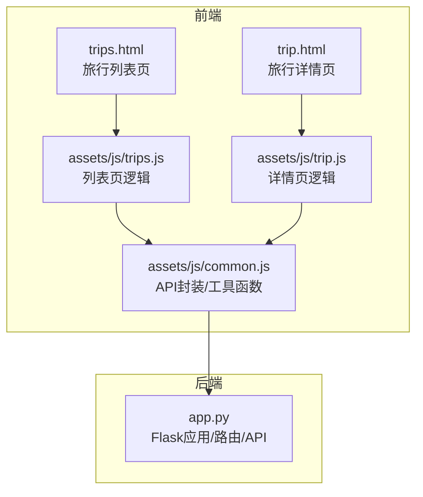
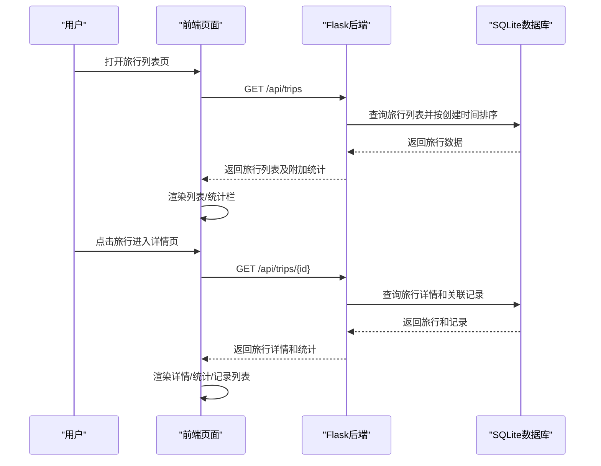
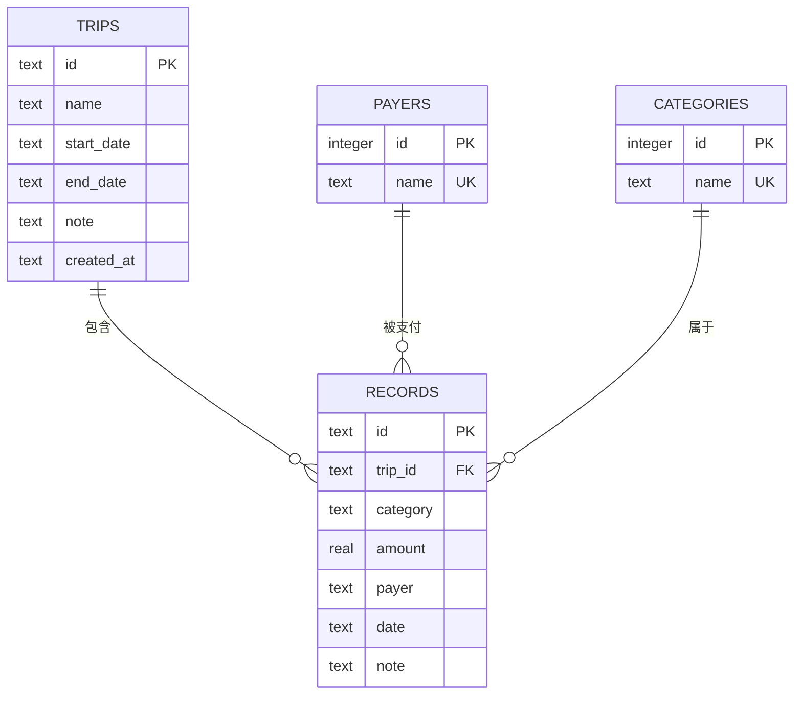
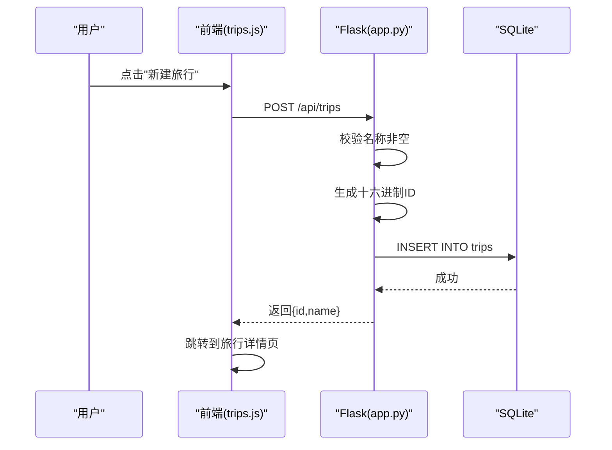
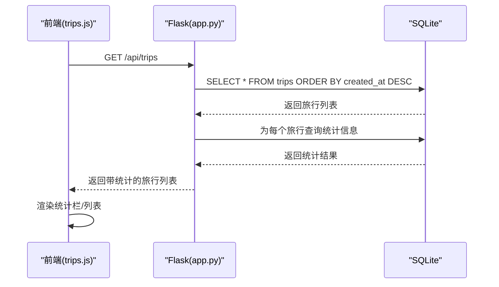
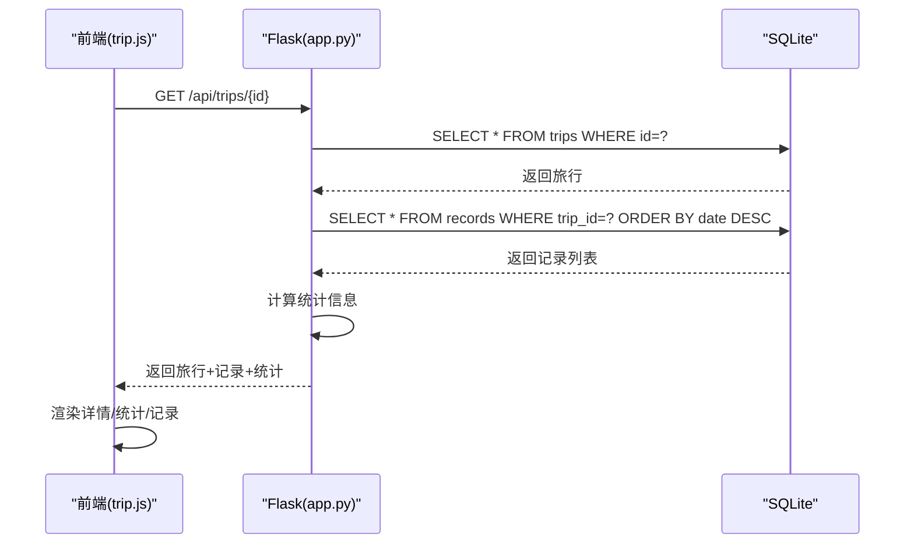
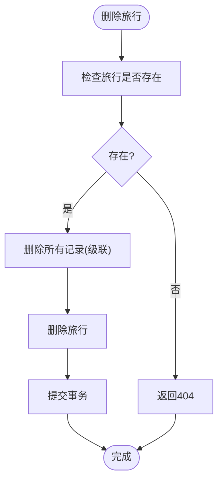
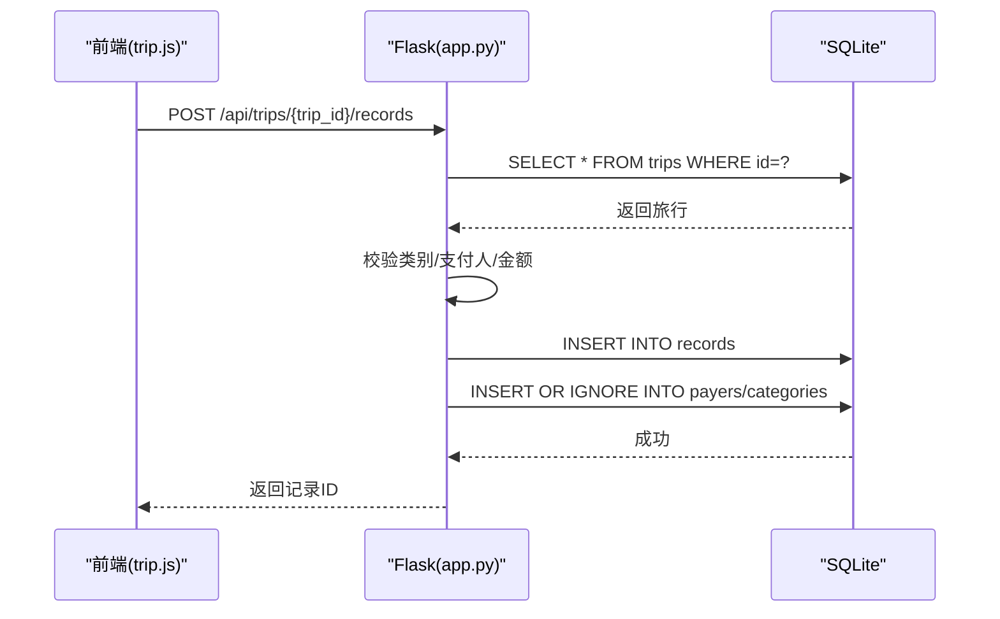
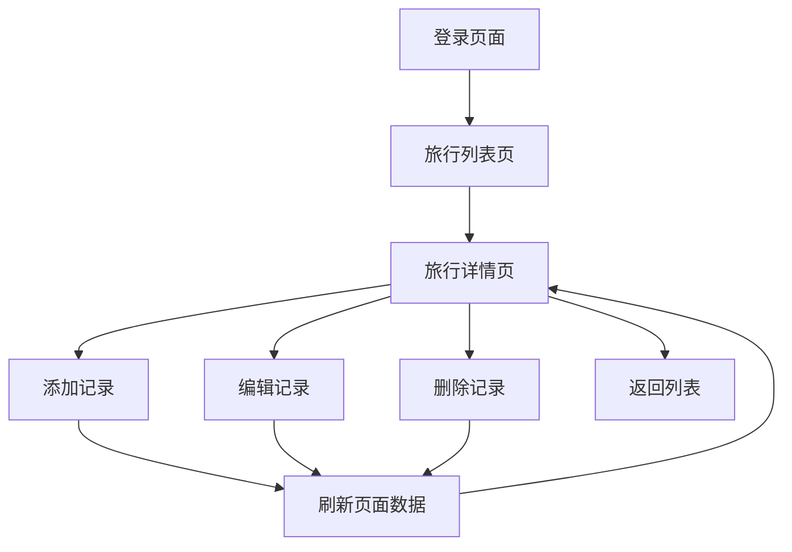
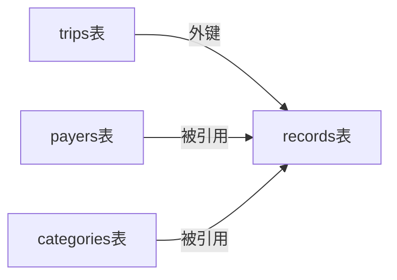

# 旅行管理功能

<cite>
**本文引用的文件**
- [app.py](file://app.py)
- [assets/js/common.js](file://assets/js/common.js)
- [assets/js/trips.js](file://assets/js/trips.js)
- [assets/js/trip.js](file://assets/js/trip.js)
- [trips.html](file://trips.html)
- [trip.html](file://trip.html)
- [recorded.md](file://recorded.md)
</cite>

## 目录
1. [简介](#简介)
2. [项目结构](#项目结构)
3. [核心组件](#核心组件)
4. [架构概览](#架构概览)
5. [详细组件分析](#详细组件分析)
6. [依赖分析](#依赖分析)
7. [性能考虑](#性能考虑)
8. [故障排除指南](#故障排除指南)
9. [结论](#结论)
10. [附录](#附录)

## 简介
本文件针对 recorded 项目的旅行管理功能进行深入的技术文档说明，覆盖旅行 CRUD 操作的实现细节、数据模型设计、前端交互流程以及扩展建议。系统采用 Flask + SQLite 的轻量架构，提供旅行创建、列表展示、详情统计、记录管理等核心能力，并通过前端 JavaScript 实现完整的用户交互体验。

## 项目结构
项目采用前后端分离的静态页面 + 后端 API 的模式：
- 后端：Flask 应用，提供 RESTful API 接口，使用 SQLite 作为数据存储
- 前端：HTML + CSS + JavaScript，包含旅行列表页、旅行详情页、登录页等
- 静态资源：样式文件和通用工具函数

**图表来源**
- [app.py:1-331](file://app.py#L1-L331)
- [assets/js/common.js:1-206](file://assets/js/common.js#L1-L206)
- [assets/js/trips.js:1-130](file://assets/js/trips.js#L1-L130)
- [assets/js/trip.js:1-401](file://assets/js/trip.js#L1-L401)
- [trips.html:1-60](file://trips.html#L1-L60)
- [trip.html:1-155](file://trip.html#L1-L155)

**章节来源**
- [app.py:1-331](file://app.py#L1-L331)
- [assets/js/common.js:1-206](file://assets/js/common.js#L1-L206)
- [assets/js/trips.js:1-130](file://assets/js/trips.js#L1-L130)
- [assets/js/trip.js:1-401](file://assets/js/trip.js#L1-L401)
- [trips.html:1-60](file://trips.html#L1-L60)
- [trip.html:1-155](file://trip.html#L1-L155)

## 核心组件
- 数据模型与数据库初始化：包含 trips、records、payers、categories 表，启用外键约束和 WAL 模式
- 旅行管理 API：旅行的创建、读取、更新、删除接口
- 记账记录 API：在旅行上下文下的记录创建、读取、更新、删除接口
- 支付人与类别管理：支持动态维护支付人和类别列表
- 前端交互：旅行列表页、详情页、登录页的完整交互流程

**章节来源**
- [app.py:41-78](file://app.py#L41-L78)
- [app.py:119-204](file://app.py#L119-L204)
- [app.py:208-272](file://app.py#L208-L272)
- [app.py:274-314](file://app.py#L274-L314)
- [assets/js/common.js:38-132](file://assets/js/common.js#L38-L132)

## 架构概览
系统采用三层架构：
- 表现层：HTML 页面 + JavaScript 前端逻辑
- 业务层：Flask 路由处理请求，执行业务逻辑
- 数据层：SQLite 数据库，使用外键约束保证数据一致性

**图表来源**
- [app.py:119-177](file://app.py#L119-L177)
- [assets/js/common.js:74-94](file://assets/js/common.js#L74-L94)
- [assets/js/trips.js:17-24](file://assets/js/trips.js#L17-L24)
- [assets/js/trip.js:105-123](file://assets/js/trip.js#L105-L123)

## 详细组件分析

### 数据模型与字段设计
旅行管理涉及以下核心表：
- trips：旅行基本信息
  - id：主键，十六进制字符串
  - name：旅行名称，必填
  - start_date：开始日期
  - end_date：结束日期
  - note：备注
  - created_at：创建时间，自动设置
- records：记账记录
  - id：主键，十六进制字符串
  - trip_id：外键，关联 trips.id，删除时级联删除
  - category：类别，必填
  - amount：金额，必填且必须为正数
  - payer：支付人，必填
  - date：日期
  - note：备注
- payers：支付人字典表
  - id：自增主键
  - name：唯一，支付人姓名
- categories：类别字典表
  - id：自增主键
  - name：唯一，类别名称

**图表来源**
- [app.py:47-72](file://app.py#L47-L72)

**章节来源**
- [app.py:47-72](file://app.py#L47-L72)

### 旅行创建流程（CRUD-C）
- 前端：旅行列表页提供新建按钮，弹出模态框收集旅行信息
- 后端：接收请求，校验旅行名称非空，生成十六进制 ID，插入 trips 表，设置 created_at 为当前时间
- 响应：返回新旅行的 id 和 name

**图表来源**
- [assets/js/trips.js:101-121](file://assets/js/trips.js#L101-L121)
- [app.py:141-155](file://app.py#L141-L155)

**章节来源**
- [assets/js/trips.js:101-121](file://assets/js/trips.js#L101-L121)
- [app.py:141-155](file://app.py#L141-L155)

### 旅行列表获取（CRUD-R）
- 后端：按 created_at 降序查询 trips 表，为每个旅行附加统计信息：
  - 记录数量：COUNT(*) from records where trip_id=?
  - 总金额：SUM(amount) from records where trip_id=?
  - 参与人：DISTINCT payer from records where trip_id=?
- 前端：渲染统计栏和旅行卡片，点击卡片跳转详情页

**图表来源**
- [assets/js/trips.js:17-24](file://assets/js/trips.js#L17-L24)
- [app.py:119-139](file://app.py#L119-L139)

**章节来源**
- [assets/js/trips.js:17-36](file://assets/js/trips.js#L17-L36)
- [app.py:119-139](file://app.py#L119-L139)

### 旅行详情获取（CRUD-R）
- 后端：根据 trip_id 查询旅行详情，再查询该旅行的所有记录并按日期降序排列
- 统计计算：
  - 总金额：对记录金额求和
  - 按支付人统计：聚合每人的支出
  - 按类别统计：聚合每个类别的支出
- 前端：渲染旅行信息、统计栏、记录列表和费用总结

**图表来源**
- [assets/js/trip.js:105-123](file://assets/js/trip.js#L105-L123)
- [app.py:157-177](file://app.py#L157-L177)

**章节来源**
- [assets/js/trip.js:105-179](file://assets/js/trip.js#L105-L179)
- [app.py:157-177](file://app.py#L157-L177)

### 旅行更新与删除（CRUD-U/D）
- 更新：校验旅行存在性，校验名称非空，更新旅行信息
- 删除：先删除该旅行下的所有记录（利用外键级联），再删除旅行本身

**图表来源**
- [app.py:179-204](file://app.py#L179-L204)

**章节来源**
- [app.py:179-204](file://app.py#L179-L204)

### 记账记录管理（关联 CRUD）
- 创建记录：校验旅行存在性，校验类别和支付人非空，校验金额为正数，插入记录并自动维护支付人和类别字典
- 更新记录：校验记录存在性，执行相同的数据验证，更新记录并同步字典
- 删除记录：直接删除记录

**图表来源**
- [assets/js/trip.js:161-197](file://assets/js/trip.js#L161-L197)
- [app.py:208-236](file://app.py#L208-L236)

**章节来源**
- [assets/js/trip.js:161-313](file://assets/js/trip.js#L161-L313)
- [app.py:208-272](file://app.py#L208-L272)

### 前端交互与业务流程
- 登录流程：固定账号登录，成功后保存 token，后续请求携带 Authorization 头
- 列表页：加载旅行列表，显示统计信息，点击卡片跳转详情
- 详情页：加载旅行详情、记录列表、统计信息，支持添加/编辑/删除记录
- 字段联动：类别选择自定义时显示自定义输入框；支付人选择新增时显示新支付人输入框

**图表来源**
- [assets/js/common.js:25-36](file://assets/js/common.js#L25-L36)
- [assets/js/trips.js:17-24](file://assets/js/trips.js#L17-L24)
- [assets/js/trip.js:105-123](file://assets/js/trip.js#L105-L123)

**章节来源**
- [assets/js/common.js:25-36](file://assets/js/common.js#L25-L36)
- [assets/js/trips.js:17-80](file://assets/js/trips.js#L17-L80)
- [assets/js/trip.js:105-399](file://assets/js/trip.js#L105-L399)

## 依赖分析
- 外键约束：records.trip_id -> trips.id，启用 ON DELETE CASCADE，确保旅行删除时自动清理记录
- 数据一致性：通过 INSERT OR IGNORE 维护支付人和类别字典，避免重复
- 查询优化：旅行列表页在内存中聚合统计，详情页按日期排序记录

**图表来源**
- [app.py:63](file://app.py#L63)
- [app.py:75-76](file://app.py#L75-L76)

**章节来源**
- [app.py:63](file://app.py#L63)
- [app.py:128-138](file://app.py#L128-L138)

## 性能考虑
- 数据库配置：启用 WAL 模式提升并发性能，开启外键约束保证一致性
- 查询策略：列表页一次性查询旅行和统计，减少往返次数；详情页按日期倒序查询记录
- 前端缓存：localStorage 存储 token，避免重复登录
- 建议优化：
  - 为 trips.created_at 建索引以优化排序
  - 为 records.trip_id 建索引以优化关联查询
  - 对频繁查询的字段建立复合索引（如 records.trip_id + records.date）

## 故障排除指南
- 未登录或登录过期：后端返回 401，前端清除 token 并跳转登录页
- 旅行不存在：删除/更新旅行时返回 404
- 数据验证失败：
  - 旅行名称为空：返回 400
  - 记账记录类别或支付人为空：返回 400
  - 金额非正数：返回 400
- 常见问题排查：
  - 确认浏览器已正确保存 token
  - 检查网络请求是否携带 Authorization 头
  - 确认 SQLite 文件权限正确

**章节来源**
- [assets/js/common.js:47-57](file://assets/js/common.js#L47-L57)
- [app.py:106-115](file://app.py#L106-L115)
- [app.py:183-185](file://app.py#L183-L185)
- [app.py:219-226](file://app.py#L219-L226)

## 结论
recorded 项目的旅行管理功能实现了完整的 CRUD 流程，采用简洁的前后端分离架构，通过 SQLite 和 Flask 提供了可靠的旅行记账解决方案。系统具备良好的扩展性，可通过增加字段、优化查询索引等方式进一步增强性能和用户体验。

## 附录

### API 定义概览
- 旅行管理
  - GET /api/trips：获取旅行列表（按创建时间排序，附加统计）
  - POST /api/trips：创建旅行
  - GET /api/trips/{id}：获取旅行详情（含记录和统计）
  - PUT /api/trips/{id}：更新旅行
  - DELETE /api/trips/{id}：删除旅行（级联删除记录）
- 记账记录
  - POST /api/trips/{trip_id}/records：创建记录
  - PUT /api/records/{id}：更新记录
  - DELETE /api/records/{id}：删除记录
- 支付人
  - GET /api/payers：获取支付人列表
  - POST /api/payers：新增支付人
- 类别
  - GET /api/categories：获取类别列表
  - POST /api/categories：新增类别

### 技术扩展建议
- 增强搜索与筛选：支持按日期范围、支付人、类别筛选记录
- 导出功能：导出旅行账单为 CSV/PDF
- 图表可视化：使用图表展示费用分布
- 移动端优化：适配不同屏幕尺寸和触摸交互
- 数据备份：定期备份 SQLite 数据库