# 核心功能实现

<cite>
**本文档引用的文件**
- [app.py](file://app.py)
- [login.html](file://login.html)
- [trip.html](file://trip.html)
- [trips.html](file://trips.html)
- [assets/js/common.js](file://assets/js/common.js)
- [assets/js/login.js](file://assets/js/login.js)
- [assets/js/trip.js](file://assets/js/trip.js)
- [assets/js/trips.js](file://assets/js/trips.js)
</cite>

## 目录
1. [简介](#简介)
2. [项目结构](#项目结构)
3. [核心组件](#核心组件)
4. [架构概览](#架构概览)
5. [详细组件分析](#详细组件分析)
6. [依赖关系分析](#依赖关系分析)
7. [性能考虑](#性能考虑)
8. [故障排除指南](#故障排除指南)
9. [结论](#结论)

## 简介

recorded是一个基于Flask的旅游记账管理系统，提供了完整的旅行管理和消费记录功能。该系统采用前后端分离架构，前端使用纯JavaScript实现，后端使用Python Flask框架，数据存储采用SQLite数据库。系统包含用户认证、旅行管理、记账记录管理、支付人管理和分类管理等核心功能模块。

## 项目结构

项目采用简洁的文件组织结构，主要分为以下几个部分：

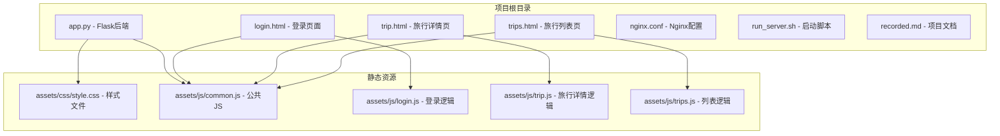

**图表来源**
- [app.py:1-331](file://app.py#L1-L331)
- [login.html:1-32](file://login.html#L1-L32)
- [trip.html:1-155](file://trip.html#L1-L155)
- [trips.html:1-60](file://trips.html#L1-L60)

**章节来源**
- [app.py:1-331](file://app.py#L1-L331)
- [login.html:1-32](file://login.html#L1-L32)
- [trip.html:1-155](file://trip.html#L1-L155)
- [trips.html:1-60](file://trips.html#L1-L60)

## 核心组件

### 数据库设计

系统使用SQLite作为数据存储，包含四个核心表：

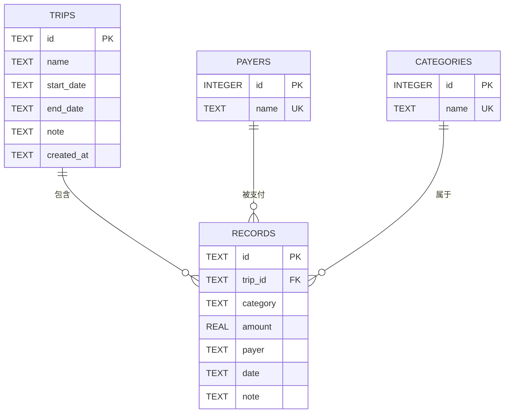

**图表来源**
- [app.py:46-78](file://app.py#L46-L78)

### 用户认证机制

系统实现了基于固定账号的简单认证机制：

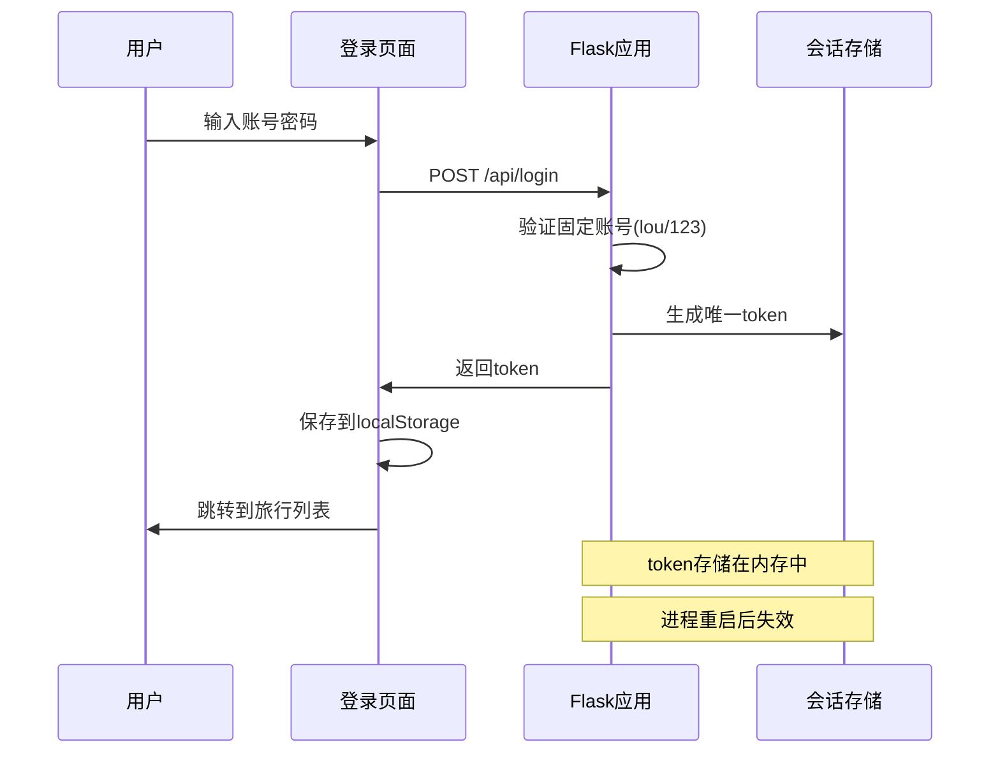

**图表来源**
- [app.py:106-115](file://app.py#L106-L115)
- [assets/js/login.js:13-34](file://assets/js/login.js#L13-L34)

### 旅行管理功能

旅行管理提供完整的CRUD操作：

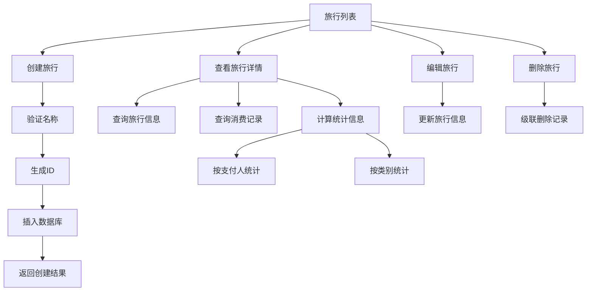

**图表来源**
- [app.py:119-204](file://app.py#L119-L204)
- [assets/js/trips.js:17-24](file://assets/js/trips.js#L17-L24)

### 记账记录管理

消费记录管理支持完整的生命周期：

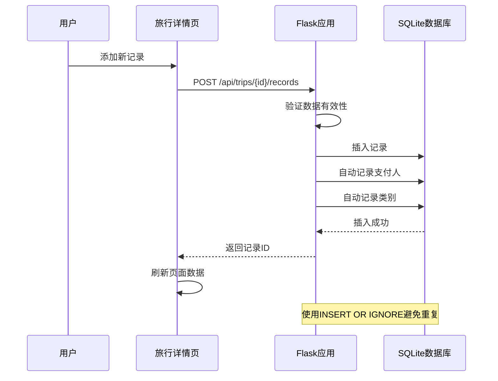

**图表来源**
- [app.py:208-236](file://app.py#L208-L236)
- [assets/js/trip.js:161-197](file://assets/js/trip.js#L161-L197)

### 支付人管理系统

支付人管理提供自动维护功能：

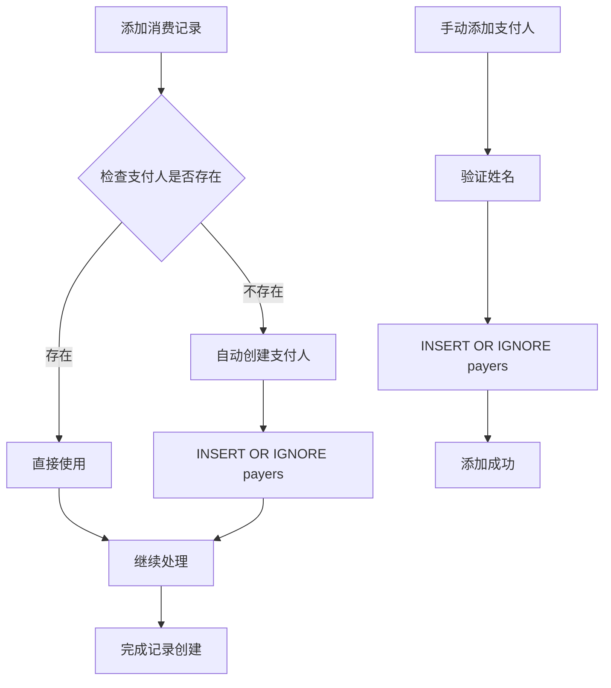

**图表来源**
- [app.py:232-234](file://app.py#L232-L234)
- [app.py:283-293](file://app.py#L283-L293)

### 分类管理功能

类别管理支持默认值和自定义扩展：

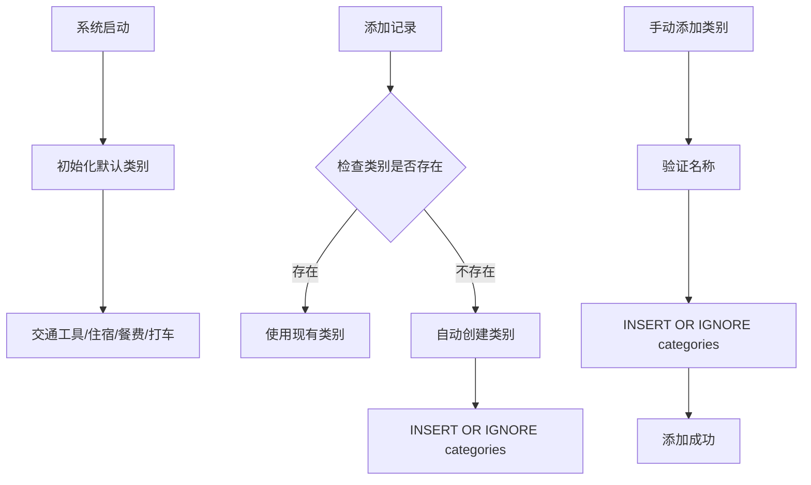

**图表来源**
- [app.py:23-23](file://app.py#L23-L23)
- [app.py:74-76](file://app.py#L74-L76)
- [app.py:304-314](file://app.py#L304-L314)

**章节来源**
- [app.py:46-78](file://app.py#L46-L78)
- [app.py:106-115](file://app.py#L106-L115)
- [app.py:119-204](file://app.py#L119-L204)
- [app.py:208-272](file://app.py#L208-L272)
- [app.py:274-314](file://app.py#L274-L314)

## 架构概览

系统采用前后端分离架构，整体架构如下：

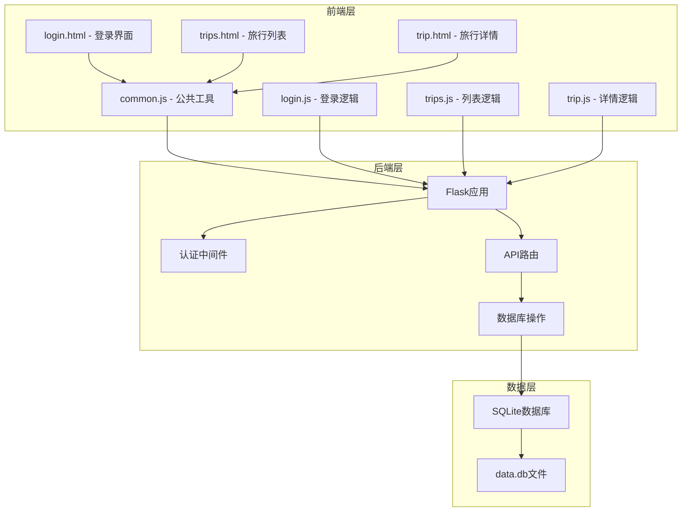

**图表来源**
- [app.py:1-331](file://app.py#L1-L331)
- [assets/js/common.js:1-132](file://assets/js/common.js#L1-L132)

## 详细组件分析

### 用户认证组件

#### 安全考虑

系统采用了简化的固定账号认证机制：

- **固定凭据**：用户名和密码在代码中硬编码为固定的值
- **内存令牌**：认证令牌存储在服务器内存中，进程重启后失效
- **简单防护**：使用装饰器实现基本的访问控制

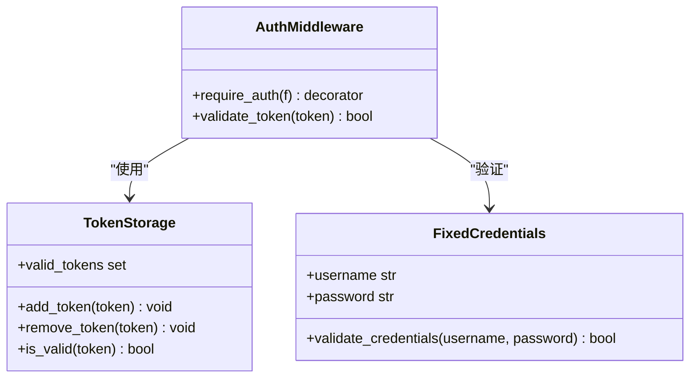

**图表来源**
- [app.py:82-89](file://app.py#L82-L89)
- [app.py:16-21](file://app.py#L16-L21)
- [app.py:106-115](file://app.py#L106-L115)

#### 会话管理

会话管理采用简单的内存存储方案：

- **令牌生成**：使用UUID生成唯一令牌
- **令牌存储**：存储在服务器内存的集合中
- **令牌验证**：每次请求检查Authorization头中的令牌
- **自动清理**：进程重启后所有令牌失效

**章节来源**
- [app.py:82-115](file://app.py#L82-L115)
- [assets/js/common.js:15-36](file://assets/js/common.js#L15-L36)

### 旅行管理组件

#### 数据模型

旅行实体包含以下字段：
- `id`: 唯一标识符（UUID前16位）
- `name`: 旅行名称（必填）
- `start_date`: 开始日期
- `end_date`: 结束日期
- `note`: 备注信息
- `created_at`: 创建时间

#### 业务逻辑

旅行管理遵循RESTful API设计：

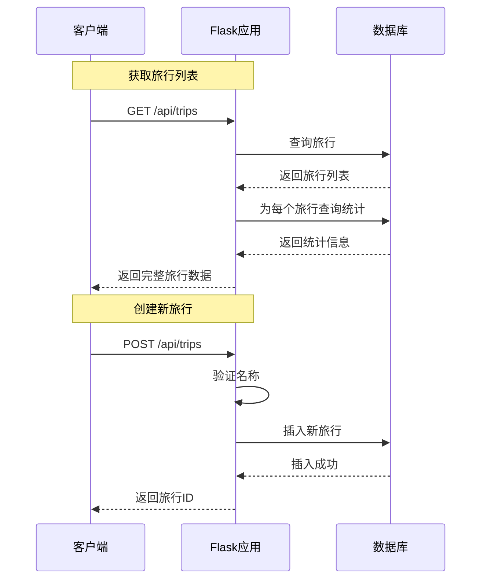

**图表来源**
- [app.py:119-139](file://app.py#L119-L139)
- [app.py:141-155](file://app.py#L141-L155)

**章节来源**
- [app.py:47-54](file://app.py#L47-L54)
- [app.py:119-204](file://app.py#L119-L204)

### 记账记录管理组件

#### 数据模型

记录实体包含以下字段：
- `id`: 唯一标识符（UUID前16位）
- `trip_id`: 关联的旅行ID（外键）
- `category`: 消费类别（必填）
- `amount`: 金额（必填，必须为正数）
- `payer`: 支付人（必填）
- `date`: 消费日期
- `note`: 备注信息

#### 核心功能

记录管理提供完整的CRUD操作，并具备自动维护功能：

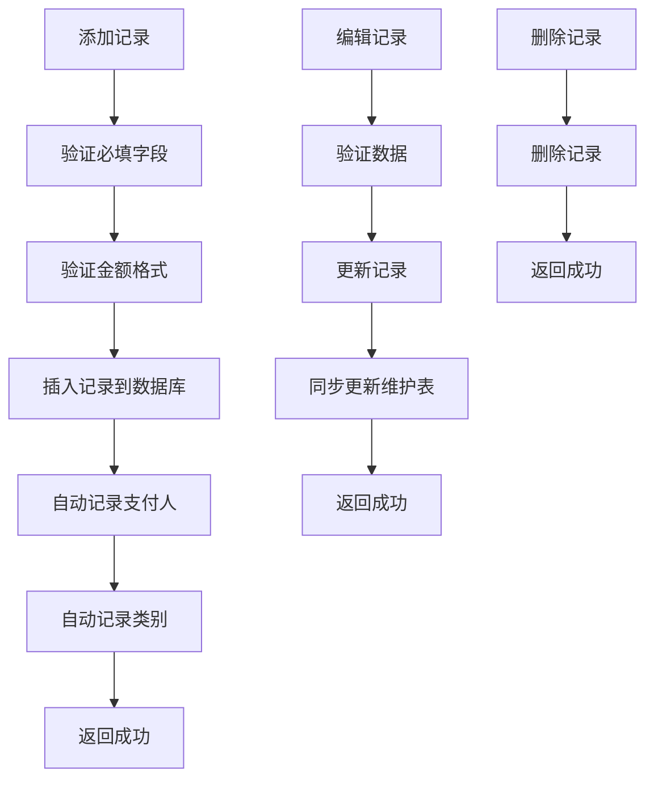

**图表来源**
- [app.py:208-272](file://app.py#L208-L272)
- [assets/js/trip.js:161-313](file://assets/js/trip.js#L161-L313)

**章节来源**
- [app.py:55-64](file://app.py#L55-L64)
- [app.py:208-272](file://app.py#L208-L272)
- [assets/js/trip.js:161-313](file://assets/js/trip.js#L161-L313)

### 支付人管理组件

#### 自动维护机制

系统在添加或编辑记录时自动维护支付人列表：

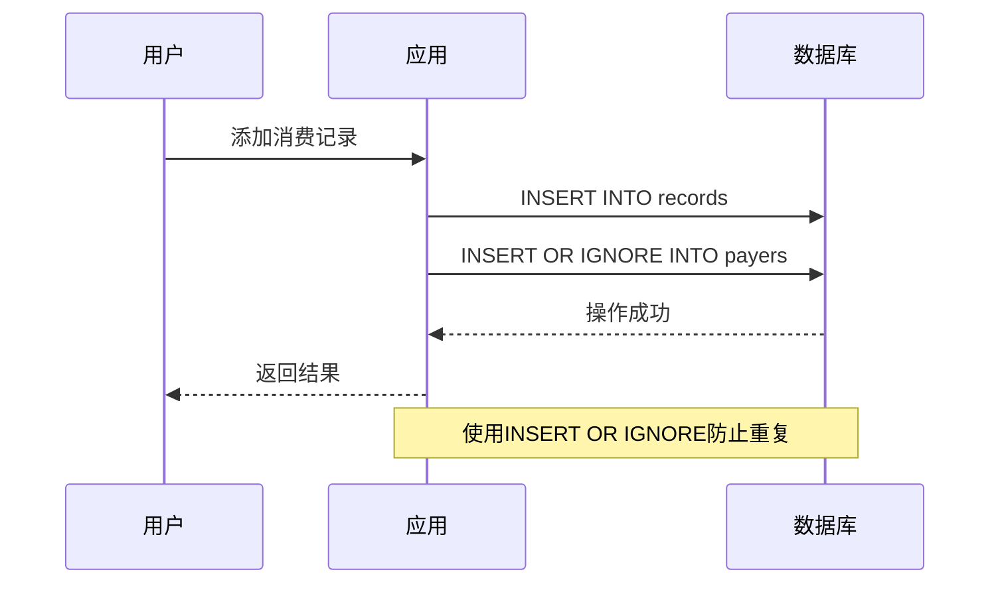

**图表来源**
- [app.py:232-234](file://app.py#L232-L234)
- [app.py:261-262](file://app.py#L261-L262)

#### 手动管理

用户也可以手动添加支付人：

```mermaid
flowchart TD
A[用户点击"新增支付人"] --> B[显示输入框]
B --> C[用户输入姓名]
C --> D[提交到服务器]
D --> E[验证姓名非空]
E --> F[INSERT OR IGNORE payers]
F --> G[添加成功]
```

**图表来源**
- [app.py:283-293](file://app.py#L283-L293)
- [assets/js/trip.js:97-102](file://assets/js/trip.js#L97-L102)

**章节来源**
- [app.py:274-293](file://app.py#L274-L293)
- [assets/js/trip.js:74-88](file://assets/js/trip.js#L74-L88)

### 分类管理组件

#### 默认分类

系统预设了四个常用消费类别：
- 交通工具（飞机/动车/自驾）
- 住宿
- 餐费
- 打车

#### 自动维护

与支付人类似，类别也具有自动维护功能：

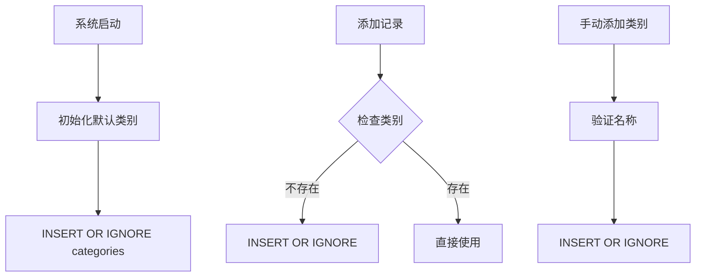

**图表来源**
- [app.py:23-23](file://app.py#L23-L23)
- [app.py:74-76](file://app.py#L74-L76)
- [app.py:232-234](file://app.py#L232-L234)

**章节来源**
- [app.py:295-314](file://app.py#L295-L314)
- [assets/js/trip.js:55-88](file://assets/js/trip.js#L55-L88)

### 前端组件分析

#### 公共工具模块

common.js提供了统一的API封装和工具函数：

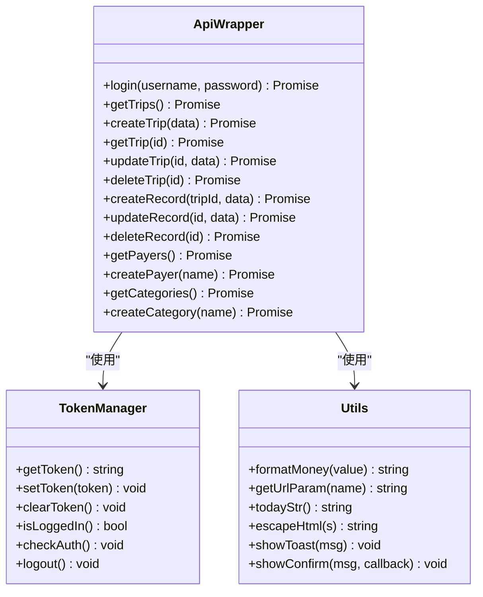

**图表来源**
- [assets/js/common.js:39-132](file://assets/js/common.js#L39-L132)
- [assets/js/common.js:15-36](file://assets/js/common.js#L15-L36)
- [assets/js/common.js:134-206](file://assets/js/common.js#L134-L206)

#### 页面交互逻辑

每个页面都有独立的JavaScript模块处理特定的业务逻辑：

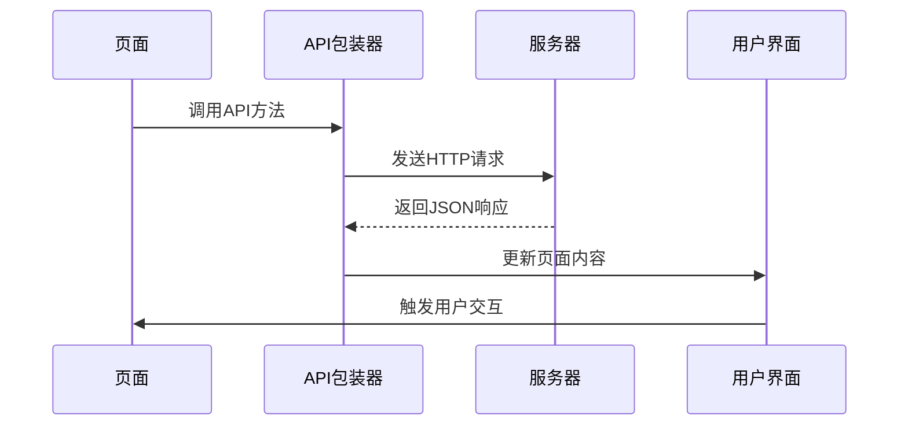

**图表来源**
- [assets/js/trips.js:17-24](file://assets/js/trips.js#L17-L24)
- [assets/js/trip.js:105-123](file://assets/js/trip.js#L105-L123)

**章节来源**
- [assets/js/common.js:1-206](file://assets/js/common.js#L1-L206)
- [assets/js/trips.js:1-130](file://assets/js/trips.js#L1-L130)
- [assets/js/trip.js:1-401](file://assets/js/trip.js#L1-L401)

## 依赖关系分析

系统的主要依赖关系如下：

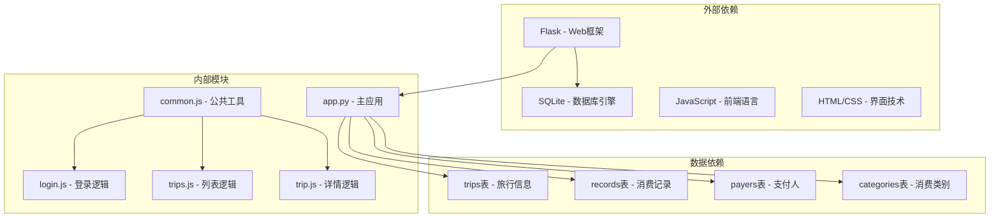

**图表来源**
- [app.py:1-331](file://app.py#L1-L331)
- [assets/js/common.js:1-132](file://assets/js/common.js#L1-L132)

**章节来源**
- [app.py:1-331](file://app.py#L1-L331)
- [assets/js/common.js:1-132](file://assets/js/common.js#L1-L132)

## 性能考虑

### 数据库优化

- **WAL模式**：启用写前日志模式提高并发性能
- **外键约束**：确保数据完整性，防止脏数据
- **索引策略**：旅行ID作为外键，自动建立索引
- **批量操作**：使用事务保证操作原子性

### 前端性能

- **懒加载**：仅在需要时加载数据
- **缓存策略**：利用浏览器缓存静态资源
- **异步处理**：使用Promise处理异步操作
- **防抖处理**：避免重复提交

### 安全考虑

- **输入验证**：前后端双重验证
- **SQL注入防护**：使用参数化查询
- **XSS防护**：HTML转义输出
- **CSRF防护**：令牌验证

## 故障排除指南

### 常见问题及解决方案

#### 登录失败
- **症状**：登录后立即跳转回登录页
- **原因**：令牌验证失败或过期
- **解决**：重新登录，检查网络连接

#### 数据加载失败
- **症状**：页面空白或显示加载错误
- **原因**：API调用失败或网络问题
- **解决**：检查服务器状态，刷新页面

#### 数据验证错误
- **症状**：提交表单时报错
- **原因**：必填字段为空或格式不正确
- **解决**：检查输入格式，确保必填字段完整

#### 数据库连接问题
- **症状**：应用启动失败
- **原因**：数据库文件权限问题
- **解决**：检查文件权限，确保读写权限

**章节来源**
- [assets/js/common.js:47-57](file://assets/js/common.js#L47-L57)
- [assets/js/common.js:177-206](file://assets/js/common.js#L177-L206)

## 结论

recorded项目是一个功能完整、结构清晰的旅游记账管理系统。系统采用简洁的设计理念，在保证功能完整性的同时保持了代码的可读性和可维护性。

### 主要优势

1. **架构清晰**：前后端分离，职责明确
2. **功能完整**：覆盖了旅游记账的全流程
3. **易于扩展**：模块化设计便于功能扩展
4. **部署简单**：单文件部署，无需复杂配置

### 技术特点

1. **轻量级**：使用Flask和SQLite，资源占用少
2. **响应式**：前端适配移动端设备
3. **离线支持**：本地存储令牌，支持离线使用
4. **国际化**：支持多语言界面

### 扩展建议

1. **认证升级**：从固定账号升级到动态用户管理
2. **数据持久化**：考虑使用更强大的数据库
3. **功能增强**：添加报表导出、数据分析等功能
4. **用户体验**：优化界面交互和加载速度

该系统为个人和小团队的旅游记账需求提供了完整的解决方案，具有良好的实用价值和扩展潜力。