# 核心功能实现

<cite>
**本文档引用的文件**
- [app.py](file://app.py)
- [login.html](file://login.html)
- [trip.html](file://trip.html)
- [trips.html](file://trips.html)
- [settings.html](file://settings.html)
- [assets/js/common.js](file://assets/js/common.js)
- [assets/js/login.js](file://assets/js/login.js)
- [assets/js/settings.js](file://assets/js/settings.js)
- [assets/js/trip.js](file://assets/js/trip.js)
- [assets/js/trips.js](file://assets/js/trips.js)
</cite>

## 更新摘要
**所做更改**
- 新增设置管理功能章节，包含密码修改、支付人管理和类别管理
- 新增Excel导出功能章节，包含旅行数据导出和CSV格式生成
- 更新用户认证机制，增加动态密码管理功能
- 更新支付人和类别管理的API接口说明
- 新增设置页面的前端实现分析

## 目录
1. [简介](#简介)
2. [项目结构](#项目结构)
3. [核心组件](#核心组件)
4. [架构概览](#架构概览)
5. [详细组件分析](#详细组件分析)
6. [设置管理功能](#设置管理功能)
7. [Excel导出功能](#excel导出功能)
8. [依赖关系分析](#依赖关系分析)
9. [性能考虑](#性能考虑)
10. [故障排除指南](#故障排除指南)
11. [结论](#结论)

## 简介

recorded是一个基于Flask的旅游记账管理系统，提供了完整的旅行管理和消费记录功能。该系统采用前后端分离架构，前端使用纯JavaScript实现，后端使用Python Flask框架，数据存储采用SQLite数据库。系统包含用户认证、旅行管理、记账记录管理、支付人管理和分类管理等核心功能模块。

**更新** 新增设置管理功能和Excel导出功能，增强了系统的可配置性和数据导出能力。

## 项目结构

项目采用简洁的文件组织结构，主要分为以下几个部分：

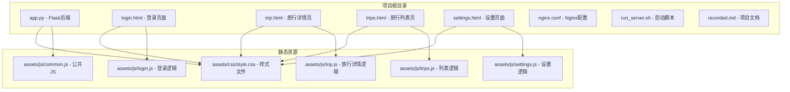
```mermaid
graph TB
subgraph "项目根目录"
A[app.py - Flask后端]
B[login.html - 登录页面]
C[trip.html - 旅行详情页]
D[trips.html - 旅行列表页]
E[settings.html - 设置页面]
F[nginx.conf - Nginx配置]
G[run_server.sh - 启动脚本]
H[recorded.md - 项目文档]
end
subgraph "静态资源"
I[assets/css/style.css - 样式文件]
J[assets/js/common.js - 公共JS]
K[assets/js/login.js - 登录逻辑]
L[assets/js/settings.js - 设置逻辑]
M[assets/js/trip.js - 旅行详情逻辑]
N[assets/js/trips.js - 列表逻辑]
end
A --> I
A --> J
B --> I
B --> K
C --> I
C --> M
D --> I
D --> N
E --> I
E --> L
```

**图表来源**
- [app.py:1-515](file://app.py#L1-L515)
- [login.html:1-32](file://login.html#L1-L32)
- [trip.html:1-156](file://trip.html#L1-L156)
- [trips.html:1-60](file://trips.html#L1-L60)
- [settings.html:1-83](file://settings.html#L1-L83)

**章节来源**
- [app.py:1-515](file://app.py#L1-L515)
- [login.html:1-32](file://login.html#L1-L32)
- [trip.html:1-156](file://trip.html#L1-L156)
- [trips.html:1-60](file://trips.html#L1-L60)
- [settings.html:1-83](file://settings.html#L1-L83)

## 核心组件

### 数据库设计

系统使用SQLite作为数据存储，包含五个核心表：

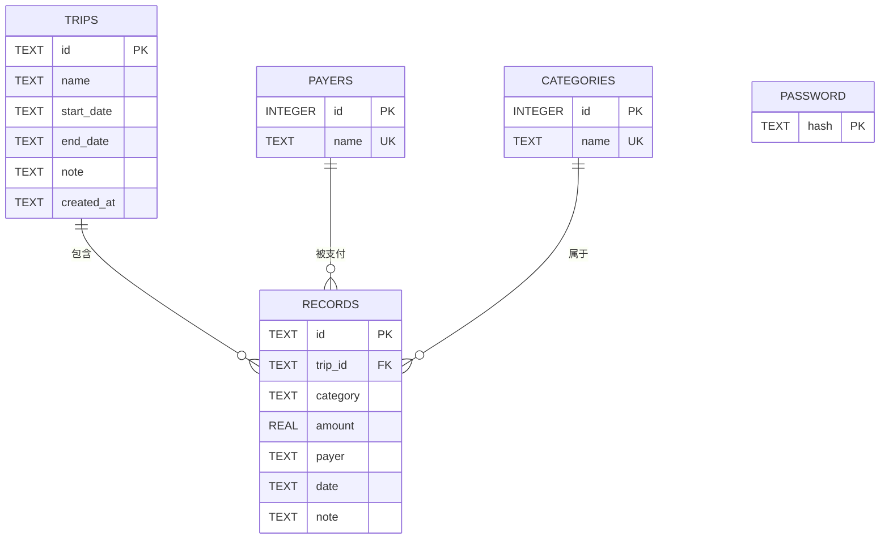
```mermaid
erDiagram
TRIPS {
TEXT id PK
TEXT name
TEXT start_date
TEXT end_date
TEXT note
TEXT created_at
}
RECORDS {
TEXT id PK
TEXT trip_id FK
TEXT category
REAL amount
TEXT payer
TEXT date
TEXT note
}
PAYERS {
INTEGER id PK
TEXT name UK
}
CATEGORIES {
INTEGER id PK
TEXT name UK
}
PASSWORD {
TEXT hash PK
}
TRIPS ||--o{ RECORDS : "包含"
PAYERS ||--o{ RECORDS : "被支付"
CATEGORIES ||--o{ RECORDS : "属于"
```

**图表来源**
- [app.py:61-98](file://app.py#L61-L98)

### 用户认证机制

系统实现了基于固定账号的动态密码认证机制：

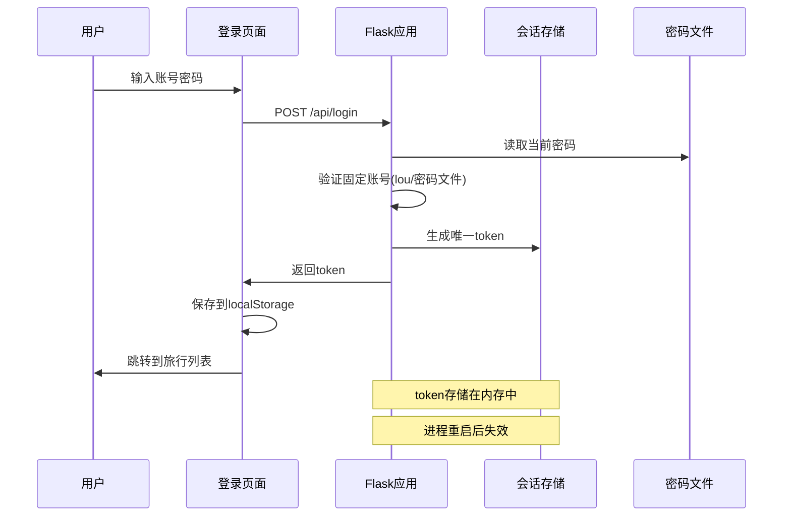
```mermaid
sequenceDiagram
participant U as 用户
participant L as 登录页面
participant A as Flask应用
participant S as 会话存储
participant P as 密码文件
U->>L : 输入账号密码
L->>A : POST /api/login
A->>P : 读取当前密码
A->>A : 验证固定账号(lou/密码文件)
A->>S : 生成唯一token
A->>L : 返回token
L->>L : 保存到localStorage
L->>U : 跳转到旅行列表
Note over A,S : token存储在内存中
Note over A,S : 进程重启后失效
```

**图表来源**
- [app.py:126-135](file://app.py#L126-L135)
- [assets/js/login.js:13-34](file://assets/js/login.js#L13-L34)

### 旅行管理功能

旅行管理提供完整的CRUD操作：

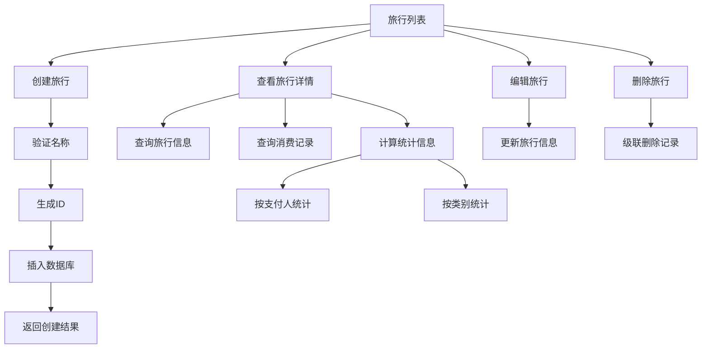
```mermaid
flowchart TD
A[旅行列表] --> B[创建旅行]
A --> C[查看旅行详情]
A --> D[编辑旅行]
A --> E[删除旅行]
B --> F[验证名称]
F --> G[生成ID]
G --> H[插入数据库]
H --> I[返回创建结果]
C --> J[查询旅行信息]
C --> K[查询消费记录]
C --> L[计算统计信息]
L --> M[按支付人统计]
L --> N[按类别统计]
D --> O[更新旅行信息]
E --> P[级联删除记录]
```

**图表来源**
- [app.py:156-241](file://app.py#L156-L241)
- [assets/js/trips.js:17-24](file://assets/js/trips.js#L17-L24)

### 记账记录管理

消费记录管理支持完整的生命周期：

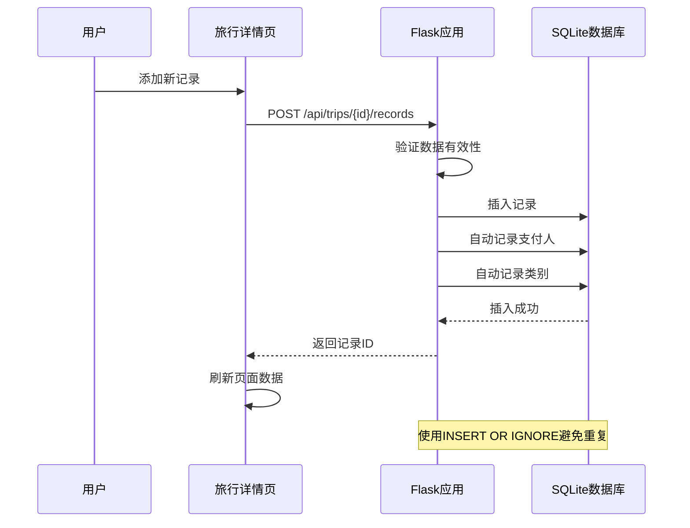
```mermaid
sequenceDiagram
participant U as 用户
participant T as 旅行详情页
participant A as Flask应用
participant DB as SQLite数据库
U->>T : 添加新记录
T->>A : POST /api/trips/{id}/records
A->>A : 验证数据有效性
A->>DB : 插入记录
A->>DB : 自动记录支付人
A->>DB : 自动记录类别
DB-->>A : 插入成功
A-->>T : 返回记录ID
T->>T : 刷新页面数据
Note over A,DB : 使用INSERT OR IGNORE避免重复
```

**图表来源**
- [app.py:245-273](file://app.py#L245-L273)
- [assets/js/trip.js:161-197](file://assets/js/trip.js#L161-L197)

### 支付人管理系统

支付人管理提供自动维护功能：

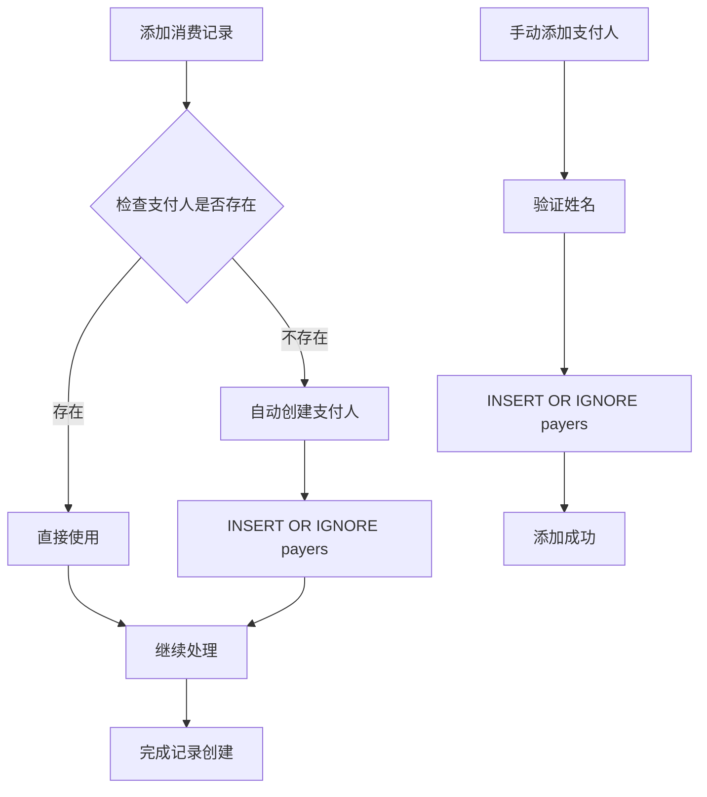
```mermaid
flowchart TD
A[添加消费记录] --> B{检查支付人是否存在}
B --> |存在| C[直接使用]
B --> |不存在| D[自动创建支付人]
D --> E[INSERT OR IGNORE payers]
C --> F[继续处理]
E --> F
F --> G[完成记录创建]
H[手动添加支付人] --> I[验证姓名]
I --> J[INSERT OR IGNORE payers]
J --> K[添加成功]
```

**图表来源**
- [app.py:269-271](file://app.py#L269-L271)
- [app.py:320-330](file://app.py#L320-L330)

### 分类管理功能

类别管理支持默认值和自定义扩展：

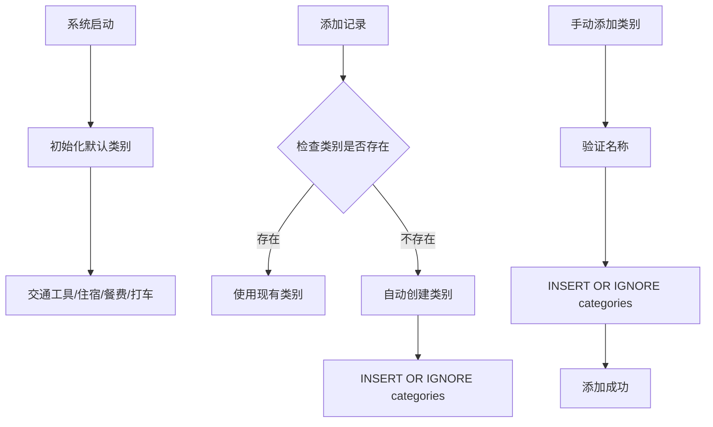
```mermaid
flowchart TD
A[系统启动] --> B[初始化默认类别]
B --> C[交通工具/住宿/餐费/打车]
D[添加记录] --> E{检查类别是否存在}
E --> |存在| F[使用现有类别]
E --> |不存在| G[自动创建类别]
G --> H[INSERT OR IGNORE categories]
I[手动添加类别] --> J[验证名称]
J --> K[INSERT OR IGNORE categories]
K --> L[添加成功]
```

**图表来源**
- [app.py:94-96](file://app.py#L94-L96)
- [app.py:373-383](file://app.py#L373-L383)

**章节来源**
- [app.py:61-98](file://app.py#L61-L98)
- [app.py:126-135](file://app.py#L126-L135)
- [app.py:156-241](file://app.py#L156-L241)
- [app.py:245-309](file://app.py#L245-L309)
- [app.py:311-415](file://app.py#L311-L415)

## 架构概览

系统采用前后端分离架构，整体架构如下：

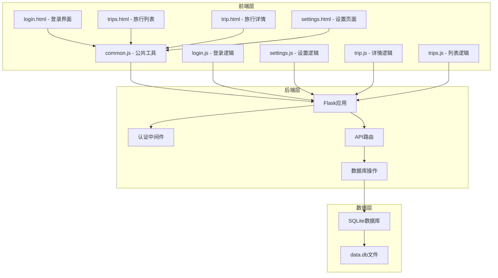
```mermaid
graph TB
subgraph "前端层"
A[login.html - 登录界面]
B[trips.html - 旅行列表]
C[trip.html - 旅行详情]
D[settings.html - 设置页面]
E[common.js - 公共工具]
F[login.js - 登录逻辑]
G[settings.js - 设置逻辑]
H[trip.js - 详情逻辑]
I[trips.js - 列表逻辑]
end
subgraph "后端层"
J[Flask应用]
K[认证中间件]
L[API路由]
M[数据库操作]
end
subgraph "数据层"
N[SQLite数据库]
O[data.db文件]
end
A --> E
B --> E
C --> E
D --> E
E --> J
F --> J
G --> J
H --> J
I --> J
J --> K
J --> L
L --> M
M --> N
N --> O
```

**图表来源**
- [app.py:1-515](file://app.py#L1-L515)
- [assets/js/common.js:1-239](file://assets/js/common.js#L1-L239)

## 详细组件分析

### 用户认证组件

#### 安全考虑

系统采用了简化的固定账号认证机制：

- **固定凭据**：用户名和密码在代码中硬编码为固定的值
- **动态密码**：密码存储在单独的文件中，支持运行时修改
- **内存令牌**：认证令牌存储在服务器内存中，进程重启后失效
- **简单防护**：使用装饰器实现基本的访问控制

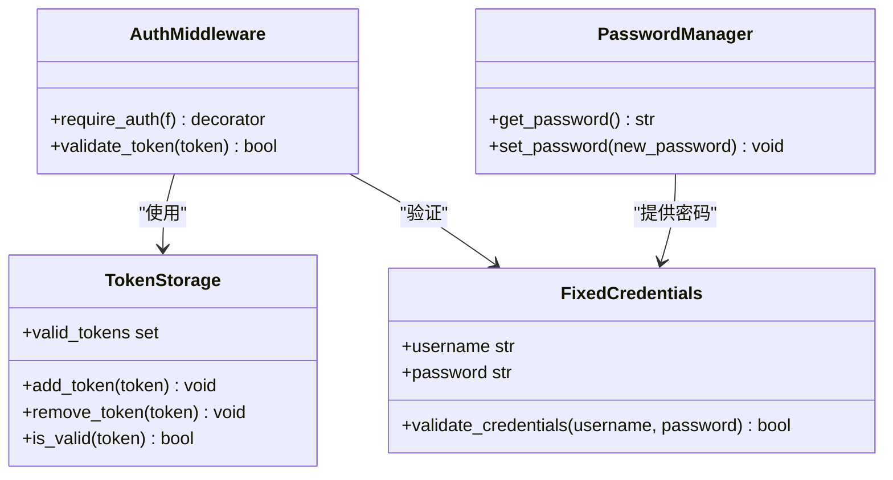
```mermaid
classDiagram
class AuthMiddleware {
+require_auth(f) decorator
+validate_token(token) bool
}
class TokenStorage {
+valid_tokens set
+add_token(token) void
+remove_token(token) void
+is_valid(token) bool
}
class FixedCredentials {
+username str
+password str
+validate_credentials(username, password) bool
}
class PasswordManager {
+get_password() str
+set_password(new_password) void
}
AuthMiddleware --> TokenStorage : "使用"
AuthMiddleware --> FixedCredentials : "验证"
PasswordManager --> FixedCredentials : "提供密码"
```

**图表来源**
- [app.py:102-109](file://app.py#L102-L109)
- [app.py:18-26](file://app.py#L18-L26)
- [app.py:126-135](file://app.py#L126-L135)

#### 会话管理

会话管理采用简单的内存存储方案：

- **令牌生成**：使用UUID生成唯一令牌
- **令牌存储**：存储在服务器内存的集合中
- **令牌验证**：每次请求检查Authorization头中的令牌
- **自动清理**：进程重启后所有令牌失效

**章节来源**
- [app.py:102-135](file://app.py#L102-L135)
- [assets/js/common.js:15-36](file://assets/js/common.js#L15-L36)

### 旅行管理组件

#### 数据模型

旅行实体包含以下字段：
- `id`: 唯一标识符（UUID前16位）
- `name`: 旅行名称（必填）
- `start_date`: 开始日期
- `end_date`: 结束日期
- `note`: 备注信息
- `created_at`: 创建时间

#### 业务逻辑

旅行管理遵循RESTful API设计：

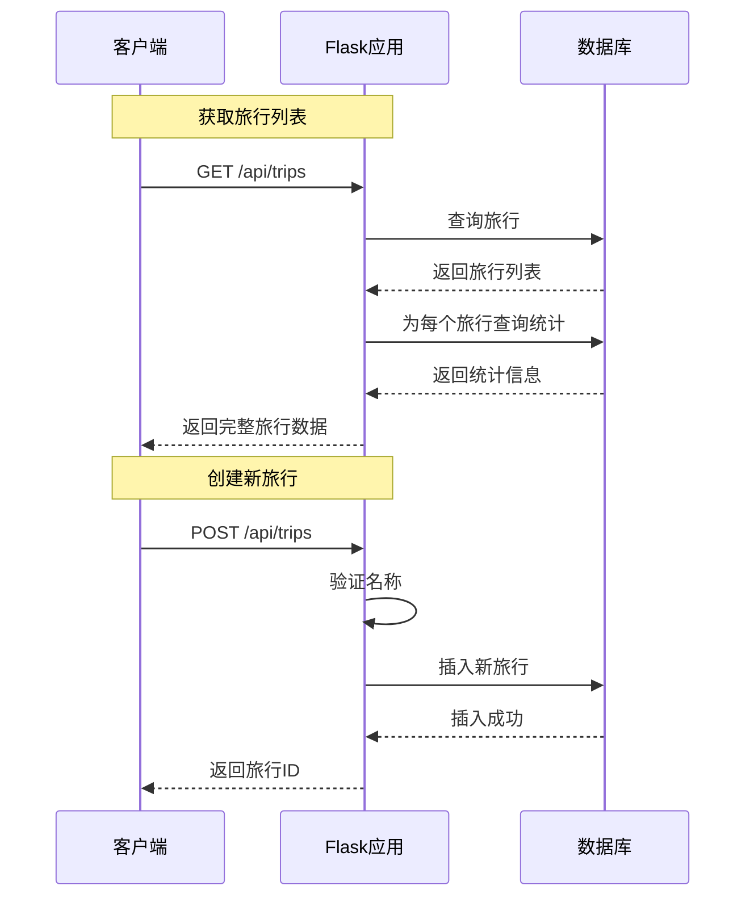
```mermaid
sequenceDiagram
participant C as 客户端
participant A as Flask应用
participant DB as 数据库
Note over C,A : 获取旅行列表
C->>A : GET /api/trips
A->>DB : 查询旅行
DB-->>A : 返回旅行列表
A->>DB : 为每个旅行查询统计
DB-->>A : 返回统计信息
A-->>C : 返回完整旅行数据
Note over C,A : 创建新旅行
C->>A : POST /api/trips
A->>A : 验证名称
A->>DB : 插入新旅行
DB-->>A : 插入成功
A-->>C : 返回旅行ID
```

**图表来源**
- [app.py:156-176](file://app.py#L156-L176)
- [app.py:178-192](file://app.py#L178-L192)

**章节来源**
- [app.py:67-74](file://app.py#L67-L74)
- [app.py:156-241](file://app.py#L156-L241)

### 记账记录管理组件

#### 数据模型

记录实体包含以下字段：
- `id`: 唯一标识符（UUID前16位）
- `trip_id`: 关联的旅行ID（外键）
- `category`: 消费类别（必填）
- `amount`: 金额（必填，必须为正数）
- `payer`: 支付人（必填）
- `date`: 消费日期
- `note`: 备注信息

#### 核心功能

记录管理提供完整的CRUD操作，并具备自动维护功能：

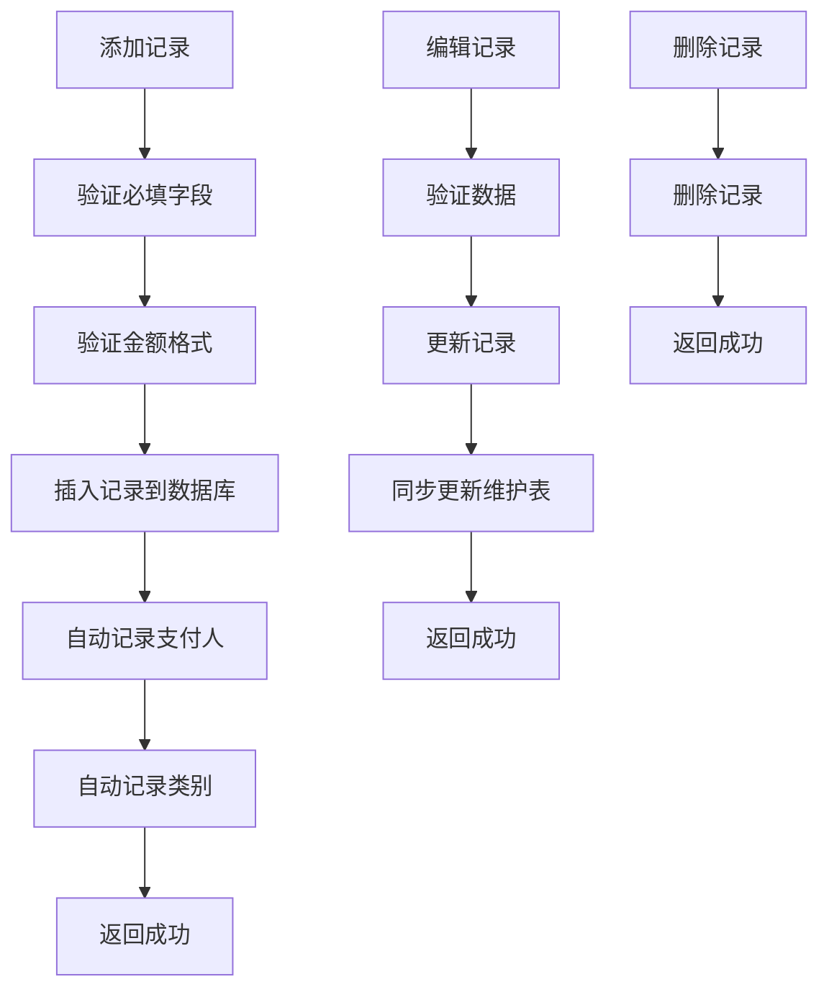
```mermaid
flowchart TD
A[添加记录] --> B[验证必填字段]
B --> C[验证金额格式]
C --> D[插入记录到数据库]
D --> E[自动记录支付人]
E --> F[自动记录类别]
F --> G[返回成功]
H[编辑记录] --> I[验证数据]
I --> J[更新记录]
J --> K[同步更新维护表]
K --> L[返回成功]
M[删除记录] --> N[删除记录]
N --> O[返回成功]
```

**图表来源**
- [app.py:245-309](file://app.py#L245-L309)
- [assets/js/trip.js:161-313](file://assets/js/trip.js#L161-L313)

**章节来源**
- [app.py:75-83](file://app.py#L75-L83)
- [app.py:245-309](file://app.py#L245-L309)
- [assets/js/trip.js:161-313](file://assets/js/trip.js#L161-L313)

### 支付人管理组件

#### 自动维护机制

系统在添加或编辑记录时自动维护支付人列表：

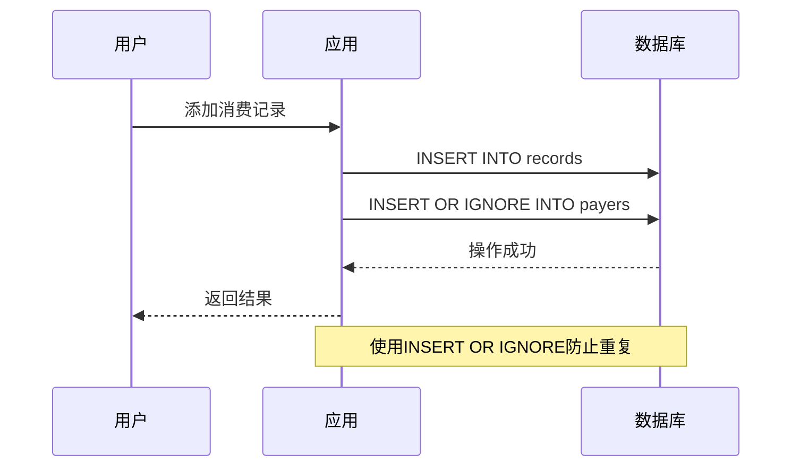
```mermaid
sequenceDiagram
participant U as 用户
participant A as 应用
participant DB as 数据库
U->>A : 添加消费记录
A->>DB : INSERT INTO records
A->>DB : INSERT OR IGNORE INTO payers
DB-->>A : 操作成功
A-->>U : 返回结果
Note over A,DB : 使用INSERT OR IGNORE防止重复
```

**图表来源**
- [app.py:269-271](file://app.py#L269-L271)
- [app.py:332-351](file://app.py#L332-L351)

#### 手动管理

用户也可以手动添加支付人：

```mermaid
flowchart TD
A[用户点击"新增支付人"] --> B[显示输入框]
B --> C[用户输入姓名]
C --> D[提交到服务器]
D --> E[验证姓名非空]
E --> F[INSERT OR IGNORE payers]
F --> G[添加成功]
```

**图表来源**
- [app.py:320-330](file://app.py#L320-L330)
- [assets/js/trip.js:97-102](file://assets/js/trip.js#L97-L102)

**章节来源**
- [app.py:311-362](file://app.py#L311-L362)
- [assets/js/trip.js:74-88](file://assets/js/trip.js#L74-L88)

### 分类管理组件

#### 默认分类

系统预设了四个常用消费类别：
- 交通工具（飞机/动车/自驾）
- 住宿
- 餐费
- 打车

#### 自动维护

与支付人类似，类别也具有自动维护功能：

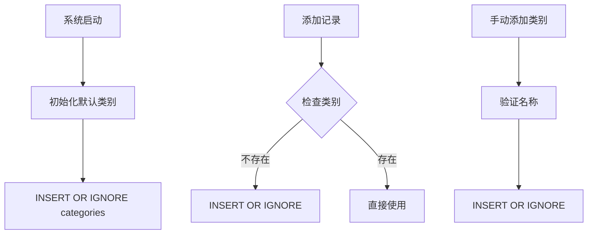
```mermaid
flowchart TD
A[系统启动] --> B[初始化默认类别]
B --> C[INSERT OR IGNORE categories]
D[添加记录] --> E{检查类别}
E --> |不存在| F[INSERT OR IGNORE]
E --> |存在| G[直接使用]
H[手动添加类别] --> I[验证名称]
I --> J[INSERT OR IGNORE]
```

**图表来源**
- [app.py:94-96](file://app.py#L94-L96)
- [app.py:373-383](file://app.py#L373-L383)

**章节来源**
- [app.py:364-415](file://app.py#L364-L415)
- [assets/js/trip.js:55-88](file://assets/js/trip.js#L55-L88)

### 前端组件分析

#### 公共工具模块

common.js提供了统一的API封装和工具函数：

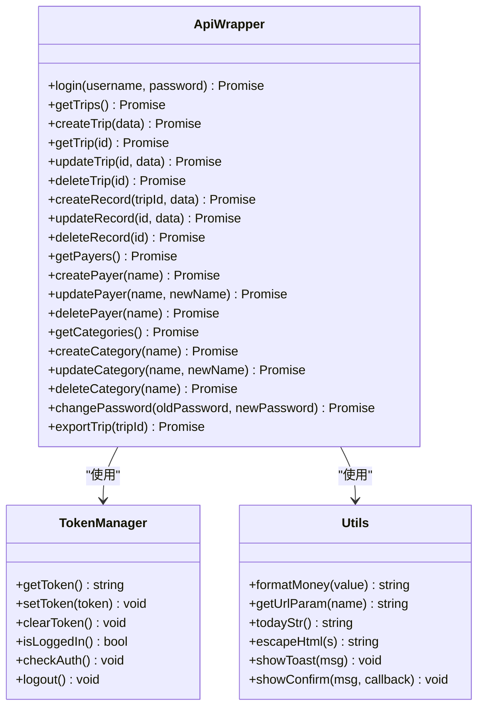
```mermaid
classDiagram
class ApiWrapper {
+login(username, password) Promise
+getTrips() Promise
+createTrip(data) Promise
+getTrip(id) Promise
+updateTrip(id, data) Promise
+deleteTrip(id) Promise
+createRecord(tripId, data) Promise
+updateRecord(id, data) Promise
+deleteRecord(id) Promise
+getPayers() Promise
+createPayer(name) Promise
+updatePayer(name, newName) Promise
+deletePayer(name) Promise
+getCategories() Promise
+createCategory(name) Promise
+updateCategory(name, newName) Promise
+deleteCategory(name) Promise
+changePassword(oldPassword, newPassword) Promise
+exportTrip(tripId) Promise
}
class TokenManager {
+getToken() string
+setToken(token) void
+clearToken() void
+isLoggedIn() bool
+checkAuth() void
+logout() void
}
class Utils {
+formatMoney(value) string
+getUrlParam(name) string
+todayStr() string
+escapeHtml(s) string
+showToast(msg) void
+showConfirm(msg, callback) void
}
ApiWrapper --> TokenManager : "使用"
ApiWrapper --> Utils : "使用"
```

**图表来源**
- [assets/js/common.js:113-165](file://assets/js/common.js#L113-L165)
- [assets/js/common.js:15-36](file://assets/js/common.js#L15-L36)
- [assets/js/common.js:195-239](file://assets/js/common.js#L195-L239)

#### 页面交互逻辑

每个页面都有独立的JavaScript模块处理特定的业务逻辑：

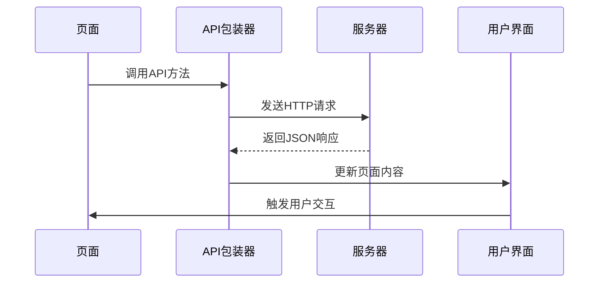
```mermaid
sequenceDiagram
participant Page as 页面
participant API as API包装器
participant Server as 服务器
participant UI as 用户界面
Page->>API : 调用API方法
API->>Server : 发送HTTP请求
Server-->>API : 返回JSON响应
API->>UI : 更新页面内容
UI->>Page : 触发用户交互
```

**图表来源**
- [assets/js/trips.js:17-24](file://assets/js/trips.js#L17-L24)
- [assets/js/trip.js:105-123](file://assets/js/trip.js#L105-L123)

**章节来源**
- [assets/js/common.js:1-239](file://assets/js/common.js#L1-L239)
- [assets/js/trips.js:1-130](file://assets/js/trips.js#L1-L130)
- [assets/js/trip.js:1-411](file://assets/js/trip.js#L1-L411)

## 设置管理功能

### 密码修改功能

系统提供了动态密码修改功能，允许用户修改默认密码：

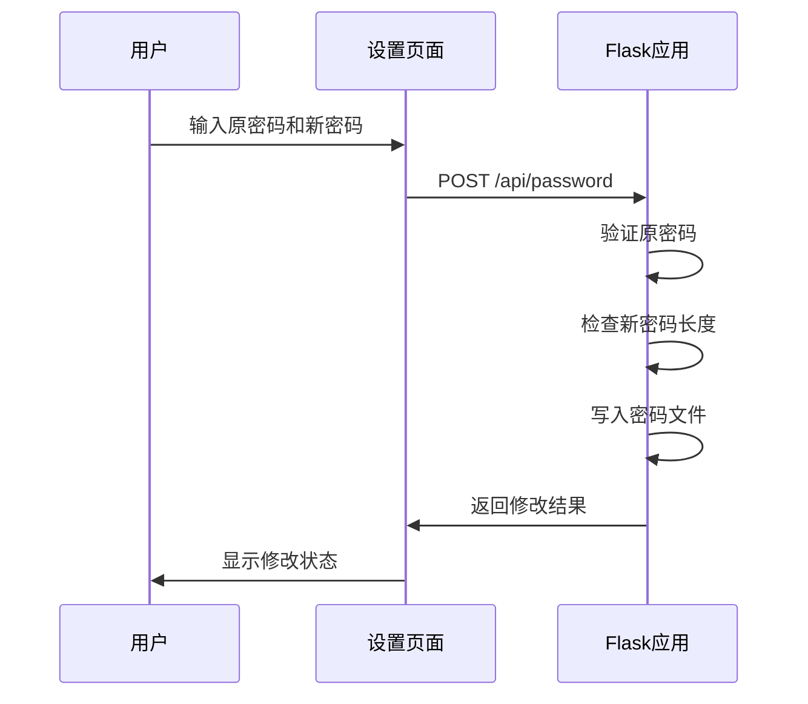
```mermaid
sequenceDiagram
participant U as 用户
participant S as 设置页面
participant A as Flask应用
U->>S : 输入原密码和新密码
S->>A : POST /api/password
A->>A : 验证原密码
A->>A : 检查新密码长度
A->>A : 写入密码文件
A->>S : 返回修改结果
S->>U : 显示修改状态
```

**图表来源**
- [app.py:139-152](file://app.py#L139-L152)
- [assets/js/settings.js:123-151](file://assets/js/settings.js#L123-L151)

#### 密码安全机制

- **密码文件存储**：新密码存储在`.password`文件中，优先于硬编码密码
- **长度验证**：新密码至少3位字符
- **原密码验证**：修改前必须验证当前密码正确性
- **文件权限**：密码文件位于应用根目录，受文件系统权限保护

### 支付人管理功能

设置页面提供了完整的支付人管理功能：

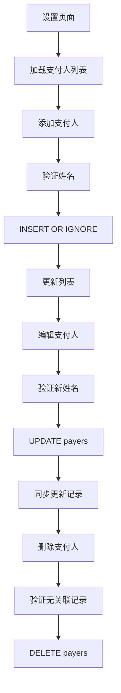
```mermaid
flowchart TD
A[设置页面] --> B[加载支付人列表]
B --> C[添加支付人]
C --> D[验证姓名]
D --> E[INSERT OR IGNORE]
E --> F[更新列表]
F --> G[编辑支付人]
G --> H[验证新姓名]
H --> I[UPDATE payers]
I --> J[同步更新记录]
J --> K[删除支付人]
K --> L[验证无关联记录]
L --> M[DELETE payers]
```

**图表来源**
- [app.py:313-362](file://app.py#L313-L362)
- [assets/js/settings.js:39-79](file://assets/js/settings.js#L39-L79)

#### 支付人管理特性

- **自动去重**：使用`INSERT OR IGNORE`避免重复添加
- **名称验证**：确保支付人姓名非空且唯一
- **数据同步**：更新支付人名称时同步更新相关记录
- **关联检查**：删除支付人前检查是否有相关记录

### 类别管理功能

类别管理功能与支付人管理类似，提供完整的CRUD操作：

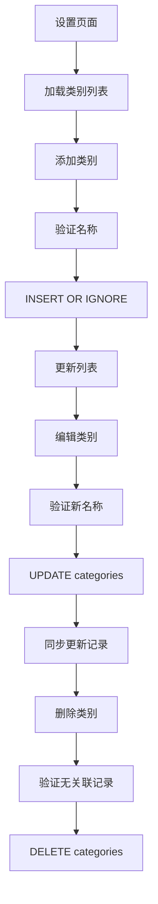
```mermaid
flowchart TD
A[设置页面] --> B[加载类别列表]
B --> C[添加类别]
C --> D[验证名称]
D --> E[INSERT OR IGNORE]
E --> F[更新列表]
F --> G[编辑类别]
G --> H[验证新名称]
H --> I[UPDATE categories]
I --> J[同步更新记录]
J --> K[删除类别]
K --> L[验证无关联记录]
L --> M[DELETE categories]
```

**图表来源**
- [app.py:366-415](file://app.py#L366-L415)
- [assets/js/settings.js:81-121](file://assets/js/settings.js#L81-L121)

#### 类别管理特性

- **默认类别**：系统启动时自动初始化常用类别
- **自动维护**：添加记录时自动创建新类别
- **名称唯一**：类别名称在数据库层面保证唯一性
- **数据同步**：更新类别名称时同步更新相关记录

**章节来源**
- [app.py:18-42](file://app.py#L18-L42)
- [app.py:139-152](file://app.py#L139-L152)
- [app.py:313-415](file://app.py#L313-L415)
- [settings.html:1-83](file://settings.html#L1-L83)
- [assets/js/settings.js:1-235](file://assets/js/settings.js#L1-L235)

## Excel导出功能

### 导出功能概述

系统提供了旅行数据的Excel导出功能，将旅行详情、消费记录、统计信息导出为CSV格式：

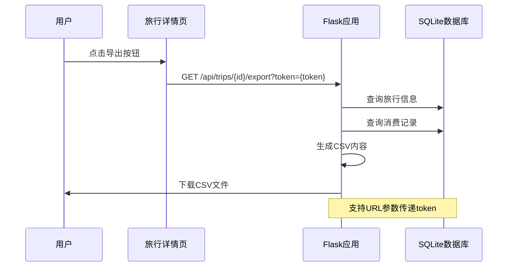
```mermaid
sequenceDiagram
participant U as 用户
participant T as 旅行详情页
participant A as Flask应用
participant DB as SQLite数据库
U->>T : 点击导出按钮
T->>A : GET /api/trips/{id}/export?token={token}
A->>DB : 查询旅行信息
A->>DB : 查询消费记录
A->>A : 生成CSV内容
A->>U : 下载CSV文件
Note over A,DB : 支持URL参数传递token
```

**图表来源**
- [app.py:419-498](file://app.py#L419-L498)
- [assets/js/trip.js:399-406](file://assets/js/trip.js#L399-L406)

### CSV格式规范

导出的CSV文件包含以下内容：

#### 文件头信息
- 旅行名称
- 开始日期
- 结束日期
- 备注信息

#### 明细表头
- 日期
- 类别
- 金额
- 支付人
- 备注

#### 统计信息
- 总计金额
- 按支付人汇总
- 按类别汇总

### 导出功能特性

- **中文支持**：使用BOM头确保Excel正确识别UTF-8编码
- **文件命名**：以旅行名称作为文件名
- **URL参数**：支持通过URL参数传递认证令牌
- **数据完整性**：包含所有消费记录和统计信息
- **格式兼容**：标准CSV格式，可在Excel等软件中打开

**章节来源**
- [app.py:419-498](file://app.py#L419-L498)
- [assets/js/common.js:160-164](file://assets/js/common.js#L160-L164)
- [assets/js/trip.js:399-406](file://assets/js/trip.js#L399-L406)

## 依赖关系分析

系统的主要依赖关系如下：

```mermaid
graph TB
subgraph "外部依赖"
A[Flask - Web框架]
B[SQLite - 数据库引擎]
C[JavaScript - 前端语言]
D[HTML/CSS - 界面技术]
E[io.StringIO - 字符串IO]
F[urllib.parse.quote - URL编码]
end
subgraph "内部模块"
G[app.py - 主应用]
H[common.js - 公共工具]
I[login.js - 登录逻辑]
J[settings.js - 设置逻辑]
K[trips.js - 列表逻辑]
L[trip.js - 详情逻辑]
end
subgraph "数据依赖"
M[trips表 - 旅行信息]
N[records表 - 消费记录]
O[payers表 - 支付人]
P[categories表 - 消费类别]
Q[password文件 - 密码存储]
end
A --> G
H --> I
H --> J
H --> K
H --> L
G --> M
G --> N
G --> O
G --> P
G --> Q
A --> B
E --> G
F --> G
```

**图表来源**
- [app.py:1-515](file://app.py#L1-L515)
- [assets/js/common.js:1-239](file://assets/js/common.js#L1-L239)

**章节来源**
- [app.py:1-515](file://app.py#L1-L515)
- [assets/js/common.js:1-239](file://assets/js/common.js#L1-L239)

## 性能考虑

### 数据库优化

- **WAL模式**：启用写前日志模式提高并发性能
- **外键约束**：确保数据完整性，防止脏数据
- **索引策略**：旅行ID作为外键，自动建立索引
- **批量操作**：使用事务保证操作原子性

### 前端性能

- **懒加载**：仅在需要时加载数据
- **缓存策略**：利用浏览器缓存静态资源
- **异步处理**：使用Promise处理异步操作
- **防抖处理**：避免重复提交

### 安全考虑

- **输入验证**：前后端双重验证
- **SQL注入防护**：使用参数化查询
- **XSS防护**：HTML转义输出
- **CSRF防护**：令牌验证
- **密码安全**：密码文件存储，避免硬编码泄露

## 故障排除指南

### 常见问题及解决方案

#### 登录失败
- **症状**：登录后立即跳转回登录页
- **原因**：令牌验证失败或过期
- **解决**：重新登录，检查网络连接

#### 数据加载失败
- **症状**：页面空白或显示加载错误
- **原因**：API调用失败或网络问题
- **解决**：检查服务器状态，刷新页面

#### 数据验证错误
- **症状**：提交表单时报错
- **原因**：必填字段为空或格式不正确
- **解决**：检查输入格式，确保必填字段完整

#### 数据库连接问题
- **症状**：应用启动失败
- **原因**：数据库文件权限问题
- **解决**：检查文件权限，确保读写权限

#### 密码修改失败
- **症状**：修改密码后仍提示原密码错误
- **原因**：密码文件写入失败或权限不足
- **解决**：检查应用目录写权限，重新尝试修改

#### 导出功能异常
- **症状**：导出文件无法打开或内容乱码
- **原因**：编码问题或文件损坏
- **解决**：检查浏览器兼容性，重新导出

**章节来源**
- [assets/js/common.js:195-239](file://assets/js/common.js#L195-L239)
- [assets/js/settings.js:123-151](file://assets/js/settings.js#L123-L151)

## 结论

recorded项目是一个功能完整、结构清晰的旅游记账管理系统。系统采用简洁的设计理念，在保证功能完整性的同时保持了代码的可读性和可维护性。

**更新** 新增的设置管理功能和Excel导出功能进一步增强了系统的实用性：

### 主要优势

1. **架构清晰**：前后端分离，职责明确
2. **功能完整**：覆盖了旅游记账的全流程
3. **易于扩展**：模块化设计便于功能扩展
4. **部署简单**：单文件部署，无需复杂配置
5. **可配置性强**：支持密码修改和自定义配置
6. **数据导出**：支持Excel格式导出，便于数据分析

### 技术特点

1. **轻量级**：使用Flask和SQLite，资源占用少
2. **响应式**：前端适配移动端设备
3. **离线支持**：本地存储令牌，支持离线使用
4. **国际化**：支持多语言界面
5. **安全性**：密码文件存储，令牌验证机制

### 扩展建议

1. **认证升级**：从固定账号升级到动态用户管理
2. **数据持久化**：考虑使用更强大的数据库
3. **功能增强**：添加报表导出、数据分析等功能
4. **用户体验**：优化界面交互和加载速度
5. **数据备份**：添加自动备份和恢复功能
6. **多用户支持**：支持多个用户同时使用

该系统为个人和小团队的旅游记账需求提供了完整的解决方案，具有良好的实用价值和扩展潜力。