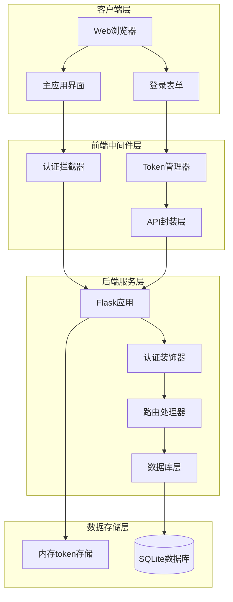
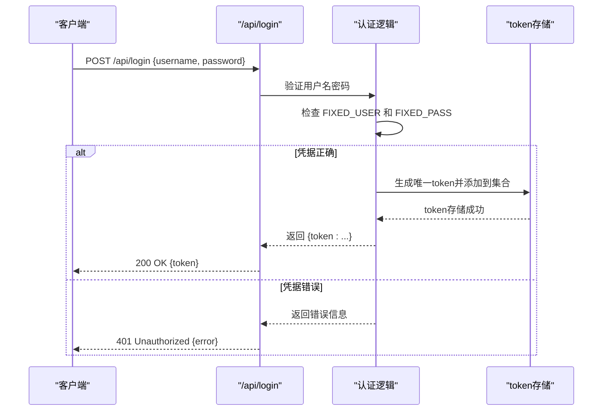
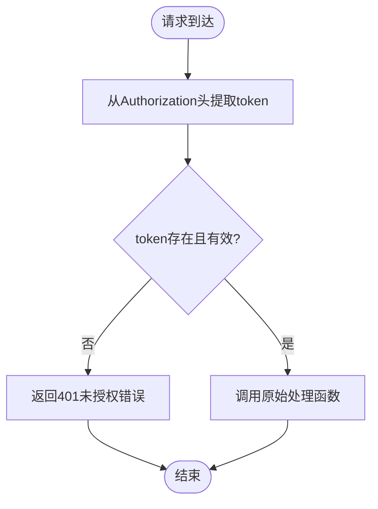
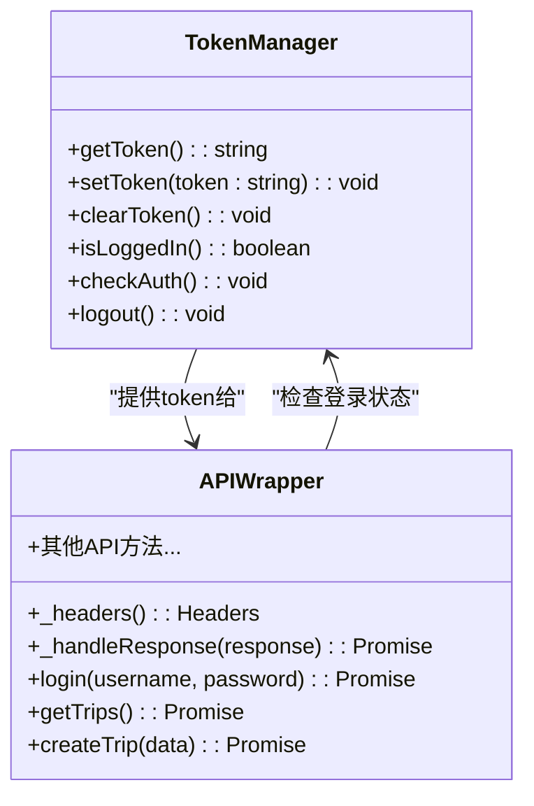
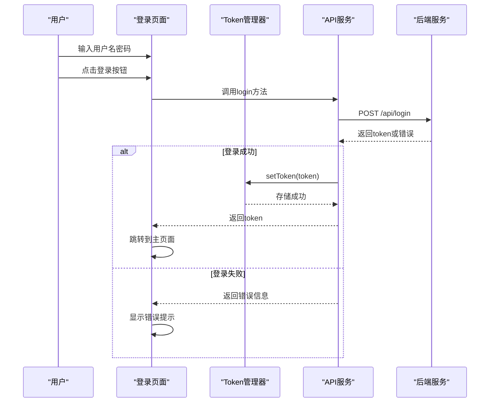
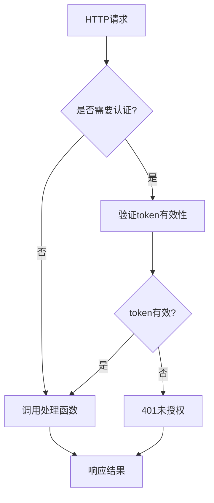
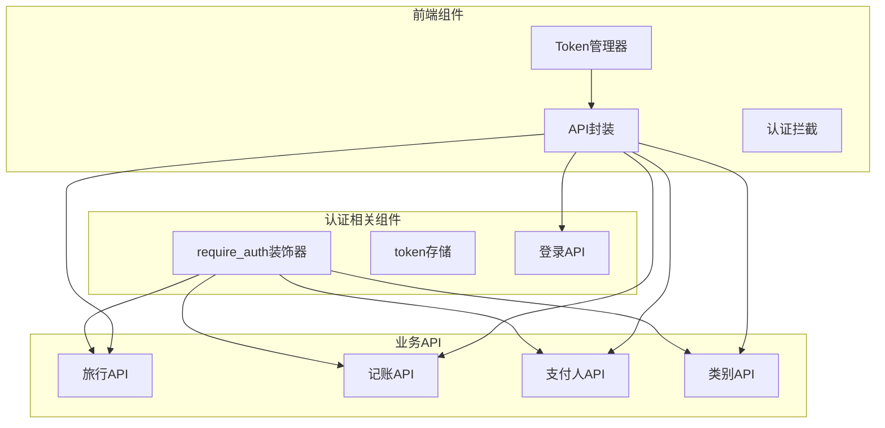
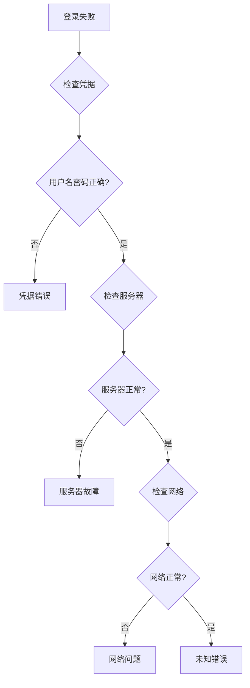

# 用户认证系统

<cite>
**本文档引用的文件**
- [app.py](file://app.py)
- [common.js](file://assets/js/common.js)
- [login.js](file://assets/js/login.js)
- [login.html](file://login.html)
- [trips.html](file://trips.html)
- [trip.html](file://trip.html)
- [style.css](file://assets/css/style.css)
</cite>

## 目录
1. [简介](#简介)
2. [项目结构](#项目结构)
3. [核心组件](#核心组件)
4. [架构概览](#架构概览)
5. [详细组件分析](#详细组件分析)
6. [依赖关系分析](#依赖关系分析)
7. [性能考虑](#性能考虑)
8. [故障排除指南](#故障排除指南)
9. [安全加固建议](#安全加固建议)
10. [结论](#结论)

## 简介

recorded项目是一个基于Flask的旅游记账系统，采用了简化的固定账号认证机制。该系统实现了基于Bearer Token的无状态认证方案，通过内存中的token集合进行会话管理。本文档深入分析了系统的认证实现原理，包括用户名密码验证逻辑、JWT风格的token认证机制、会话管理策略以及require_auth装饰器的工作原理。

## 项目结构

该项目采用前后端分离的架构设计，主要包含以下组件：

```mermaid
graph TB
subgraph "前端层"
Login[login.html]
Trips[trips.html]
Trip[trip.html]
CommonJS[common.js]
LoginJS[login.js]
Style[style.css]
end
subgraph "后端层"
AppPy[app.py]
Flask[Flask框架]
SQLite[SQLite数据库]
end
subgraph "认证组件"
FixedUser[固定账号配置]
RequireAuth[require_auth装饰器]
TokenSet[内存token存储]
LoginAPI[/api/login接口]
end
Login --> CommonJS
Trips --> CommonJS
Trip --> CommonJS
LoginJS --> CommonJS
CommonJS --> AppPy
Login --> LoginJS
LoginJS --> LoginAPI
AppPy --> RequireAuth
AppPy --> TokenSet
AppPy --> FixedUser
AppPy --> SQLite
```

**图表来源**
- [app.py:1-331](file://app.py#L1-L331)
- [common.js:1-206](file://assets/js/common.js#L1-L206)
- [login.js:1-44](file://assets/js/login.js#L1-L44)

**章节来源**
- [app.py:1-331](file://app.py#L1-L331)
- [login.html:1-32](file://login.html#L1-L32)
- [trips.html:1-60](file://trips.html#L1-L60)
- [trip.html:1-155](file://trip.html#L1-L155)

## 核心组件

### 固定账号系统

系统使用硬编码的固定账号进行身份验证，这种设计适用于单用户场景或演示环境：

- **用户名**: lou
- **密码**: 123

这种实现方式简单直接，但缺乏灵活性，不适合多用户或多租户场景。

**章节来源**
- [app.py:16-18](file://app.py#L16-L18)

### 内存token存储

系统采用Python内置的set数据结构作为内存中的token存储容器：

```python
# 简单 token 存储（内存中，重启后失效，用户重新登录即可）
valid_tokens = set()
```

这种设计具有以下特点：
- **内存存储**: 使用Python set数据结构，提供O(1)的查找复杂度
- **生命周期**: 进程重启后所有token失效，需要重新登录
- **简单性**: 无需外部依赖，部署简单

**章节来源**
- [app.py:20-21](file://app.py#L20-L21)

### require_auth装饰器

这是系统的核心认证组件，实现了统一的请求验证逻辑：

```python
def require_auth(f):
    @functools.wraps(f)
    def wrapper(*args, **kwargs):
        token = request.headers.get('Authorization', '').replace('Bearer ', '')
        if not token or token not in valid_tokens:
            return jsonify({'error': '未登录或登录已过期'}), 401
        return f(*args, **kwargs)
    return wrapper
```

**章节来源**
- [app.py:82-89](file://app.py#L82-L89)

## 架构概览

系统采用经典的三层架构模式，实现了清晰的职责分离：



**图表来源**
- [app.py:82-89](file://app.py#L82-L89)
- [common.js:15-57](file://assets/js/common.js#L15-L57)

## 详细组件分析

### 后端认证流程

#### 登录API实现

登录流程是整个认证系统的核心，负责验证用户凭据并发放访问令牌：



**图表来源**
- [app.py:106-115](file://app.py#L106-L115)

#### 认证装饰器工作原理

require_auth装饰器实现了统一的请求验证机制：



**图表来源**
- [app.py:82-89](file://app.py#L82-L89)

**章节来源**
- [app.py:106-115](file://app.py#L106-L115)
- [app.py:82-89](file://app.py#L82-L89)

### 前端认证流程

#### Token管理机制

前端使用localStorage进行token持久化存储，实现了跨页面的会话保持：



**图表来源**
- [common.js:15-132](file://assets/js/common.js#L15-L132)

#### 登录页面交互流程



**图表来源**
- [login.js:13-34](file://assets/js/login.js#L13-L34)
- [common.js:59-71](file://assets/js/common.js#L59-L71)

**章节来源**
- [common.js:15-57](file://assets/js/common.js#L15-L57)
- [login.js:13-34](file://assets/js/login.js#L13-L34)

### 数据流分析

#### 请求处理流程

系统实现了标准化的请求处理管道：



**图表来源**
- [app.py:82-89](file://app.py#L82-L89)
- [app.py:106-115](file://app.py#L106-L115)

**章节来源**
- [app.py:82-89](file://app.py#L82-L89)
- [app.py:106-115](file://app.py#L106-L115)

## 依赖关系分析

### 组件耦合度分析

系统采用了松耦合的设计原则，各组件之间的依赖关系清晰明确：



**图表来源**
- [app.py:82-89](file://app.py#L82-L89)
- [common.js:39-132](file://assets/js/common.js#L39-L132)

### 外部依赖

系统对外部依赖的使用非常有限，主要依赖包括：

- **Flask**: Web框架，提供路由、请求处理等功能
- **SQLite**: 数据库引擎，用于数据持久化
- **uuid**: 生成唯一标识符
- **functools**: 提供装饰器功能

**章节来源**
- [app.py:5-9](file://app.py#L5-L9)

## 性能考虑

### 认证性能优化

系统在认证方面采用了多项性能优化措施：

1. **内存存储优势**: 使用Python set进行token存储，查找复杂度为O(1)
2. **装饰器缓存**: require_auth装饰器避免重复的认证逻辑
3. **轻量级数据结构**: token存储使用简单的set，减少内存开销

### 数据库性能

```python
# 数据库连接池和优化设置
def get_db():
    if 'db' not in g:
        g.db = sqlite3.connect(DB_PATH)
        g.db.row_factory = sqlite3.Row
        g.db.execute('PRAGMA journal_mode=WAL')
        g.db.execute('PRAGMA foreign_keys=ON')
    return g.db
```

**章节来源**
- [app.py:27-39](file://app.py#L27-L39)

## 故障排除指南

### 常见认证问题

#### 401未授权错误

当用户遇到401错误时，可能的原因包括：

1. **Token过期**: 由于使用内存存储，进程重启会导致所有token失效
2. **Token被清除**: 用户手动清除浏览器缓存或localStorage
3. **网络问题**: 请求过程中token丢失

#### 登录失败排查



**图表来源**
- [app.py:106-115](file://app.py#L106-L115)
- [common.js:47-57](file://assets/js/common.js#L47-L57)

### 错误响应格式

系统统一使用JSON格式的错误响应：

```javascript
{
    "error": "具体的错误描述"
}
```

**章节来源**
- [app.py:86](file://app.py#L86)
- [app.py:115](file://app.py#L115)

## 安全加固建议

### 当前安全风险

基于当前实现，存在以下安全风险：

1. **固定账号风险**: 硬编码的用户名密码容易被发现
2. **明文传输风险**: HTTP传输中token可能被截获
3. **内存存储风险**: 进程重启导致的会话丢失
4. **CSRF风险**: 缺少CSRF保护机制

### 安全加固方案

#### 1. 增强认证机制

```python
# 建议的改进方案
import hashlib
import secrets
from datetime import datetime, timedelta

class EnhancedAuth:
    def __init__(self):
        self.users = {}  # 用户存储
        self.active_sessions = {}  # 活跃会话存储
    
    def hash_password(self, password, salt):
        """密码哈希加密"""
        return hashlib.pbkdf2_hmac('sha256', password.encode(), salt.encode(), 100000)
    
    def create_session(self, user_id):
        """创建安全会话"""
        session_id = secrets.token_urlsafe(32)
        expiration = datetime.now() + timedelta(hours=24)
        self.active_sessions[session_id] = {
            'user_id': user_id,
            'expires_at': expiration
        }
        return session_id
    
    def validate_session(self, session_id):
        """验证会话有效性"""
        session = self.active_sessions.get(session_id)
        if not session:
            return False
        if datetime.now() > session['expires_at']:
            del self.active_sessions[session_id]
            return False
        return True
```

#### 2. HTTPS强制启用

```python
# 在生产环境中强制HTTPS
@app.before_request
def force_https():
    if not request.is_secure and not app.debug:
        return redirect(request.url.replace('http://', 'https://', 1))
```

#### 3. CSRF防护

```python
# CSRF令牌机制
from flask_wtf.csrf import CSRFProtect

csrf = CSRFProtect(app)

# 在表单中添加CSRF令牌
@app.route('/login')
def login_page():
    return render_template('login.html', csrf_token=generate_csrf())
```

#### 4. 会话超时管理

```python
# 实现会话超时
class SessionManager:
    def __init__(self):
        self.sessions = {}
    
    def create_session(self, user_id):
        session_id = str(uuid.uuid4())
        self.sessions[session_id] = {
            'user_id': user_id,
            'created_at': time.time(),
            'last_accessed': time.time()
        }
        return session_id
    
    def validate_session(self, session_id):
        session = self.sessions.get(session_id)
        if not session:
            return False
        
        # 会话超时检查（30分钟）
        if time.time() - session['last_accessed'] > 1800:
            del self.sessions[session_id]
            return False
        
        # 更新最后访问时间
        session['last_accessed'] = time.time()
        return True
```

#### 5. 日志审计

```python
import logging
from datetime import datetime

# 配置日志
logging.basicConfig(
    level=logging.INFO,
    format='%(asctime)s - %(name)s - %(levelname)s - %(message)s',
    handlers=[
        logging.FileHandler('auth.log'),
        logging.StreamHandler()
    ]
)

def log_auth_event(event_type, user_id, ip_address, details):
    """记录认证事件"""
    logging.info({
        'event_type': event_type,
        'user_id': user_id,
        'ip_address': ip_address,
        'timestamp': datetime.now().isoformat(),
        'details': details
    })
```

## 结论

recorded项目的用户认证系统虽然采用了简化的实现方式，但其设计理念体现了"够用就好"的原则。系统的主要优势包括：

### 优点

1. **实现简洁**: 使用装饰器模式实现了统一的认证逻辑
2. **性能优良**: 内存存储提供了快速的token验证
3. **易于部署**: 无外部依赖，部署简单
4. **代码清晰**: 职责分离明确，易于理解和维护

### 局限性

1. **安全性不足**: 固定账号和明文传输存在安全隐患
2. **扩展性有限**: 不支持多用户和复杂的权限管理
3. **可靠性问题**: 进程重启导致会话丢失
4. **监控缺失**: 缺少完善的日志和审计功能

### 适用场景

该认证系统最适合以下场景：
- 单用户演示应用
- 内网环境下的个人工具
- 开发和测试环境
- 对安全性要求不高的内部系统

### 推荐升级路径

对于生产环境或需要增强功能的应用，建议按照以下顺序进行升级：

1. **基础安全升级**: HTTPS强制、CSRF防护、密码哈希
2. **架构升级**: 数据库持久化、分布式会话管理
3. **功能扩展**: 多用户支持、角色权限管理
4. **监控完善**: 完善的日志审计和异常监控

通过这些改进，可以在保持系统简洁性的基础上，显著提升安全性和可靠性。