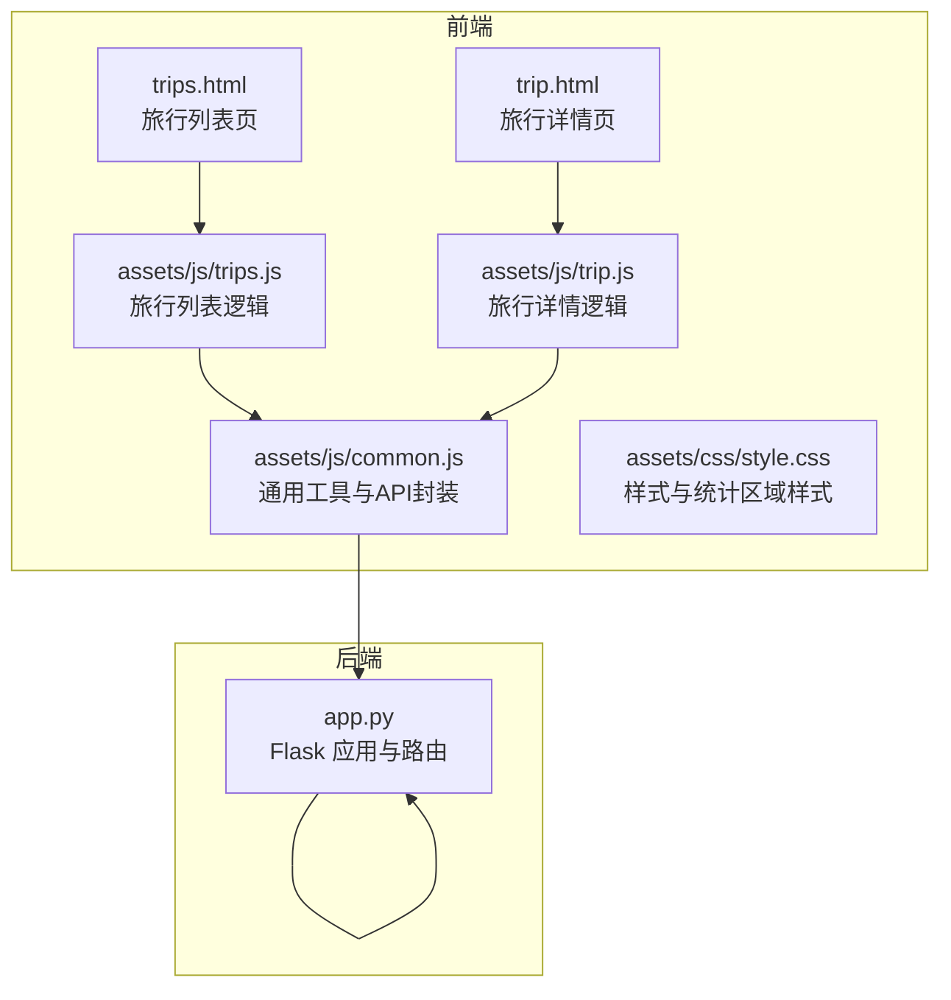
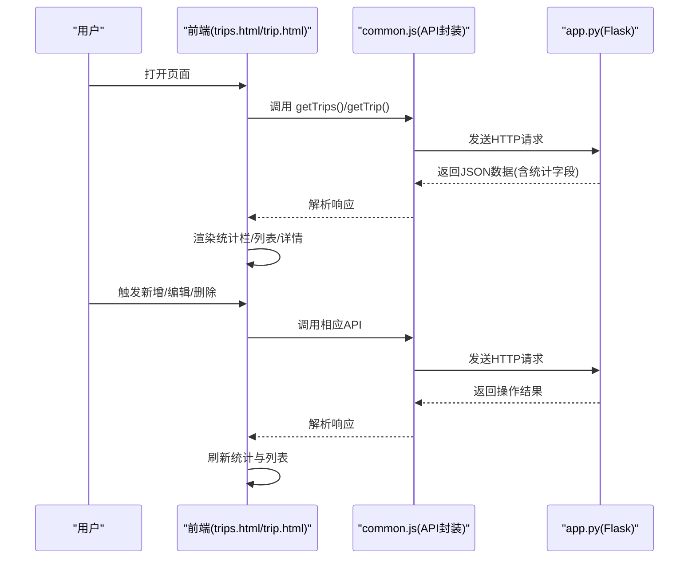
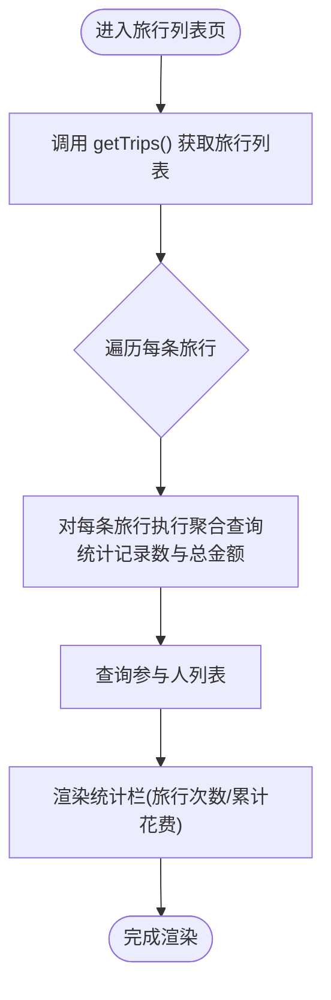
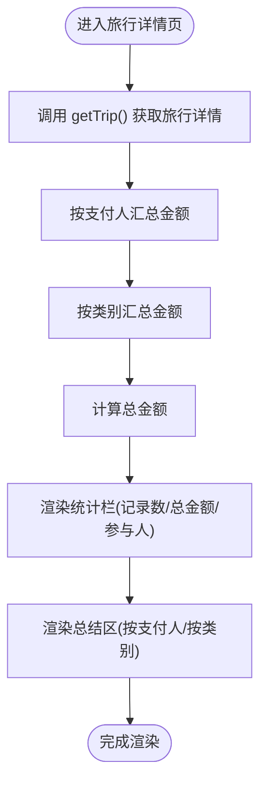
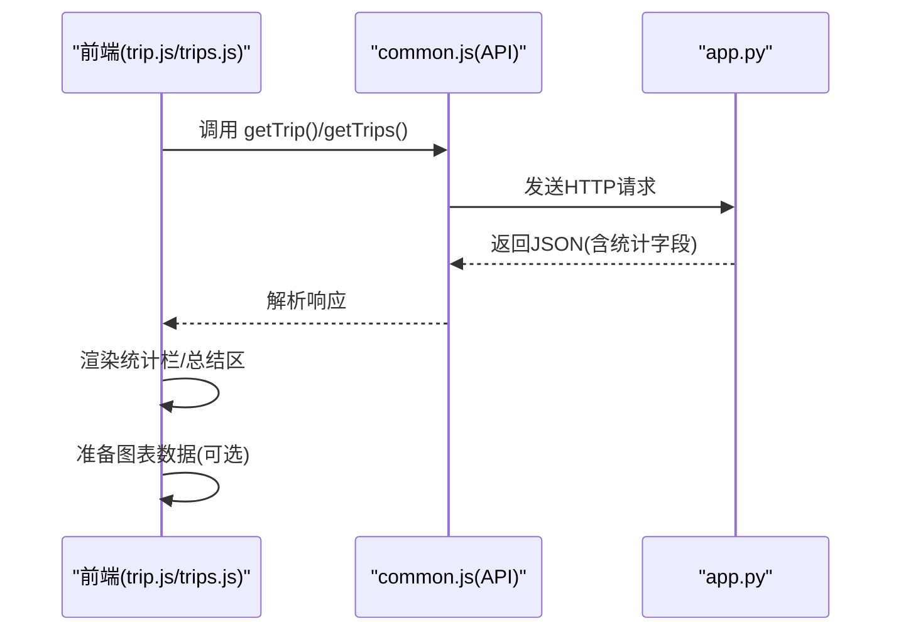
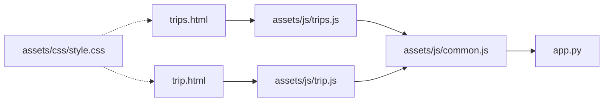

# 统计分析功能

<cite>
**本文引用的文件**
- [app.py](file://app.py)
- [trip.html](file://trip.html)
- [trips.html](file://trips.html)
- [assets/js/trip.js](file://assets/js/trip.js)
- [assets/js/trips.js](file://assets/js/trips.js)
- [assets/js/common.js](file://assets/js/common.js)
- [assets/css/style.css](file://assets/css/style.css)
</cite>

## 目录
1. [简介](#简介)
2. [项目结构](#项目结构)
3. [核心组件](#核心组件)
4. [架构概览](#架构概览)
5. [详细组件分析](#详细组件分析)
6. [依赖分析](#依赖分析)
7. [性能考虑](#性能考虑)
8. [故障排查指南](#故障排查指南)
9. [结论](#结论)
10. [附录](#附录)

## 简介
本文件面向 recorded 项目的统计分析功能，聚焦以下目标：
- 旅行级别的统计实现：记录数量统计、总金额计算
- 旅行详情页面的统计逻辑：按支付人、按分类的金额汇总算法
- 前端如何接收与展示统计数据：JSON 响应解析、图表数据准备
- 统计计算的性能优化策略：数据库层面的聚合查询与前端层面的数据处理
- 统计结果的缓存与更新机制
- 统计功能的扩展方法：新增统计维度与自定义报表
- 统计数据分析的业务价值与应用场景
- 统计功能定制与扩展的技术指导

## 项目结构
该项目采用前后端分离的轻量级架构：
- 后端使用 Python 的 Flask 框架，SQLite 作为存储，提供 RESTful API
- 前端使用原生 JavaScript 与静态 HTML/CSS，通过 fetch API 与后端交互
- 统计相关的数据来源主要来自 trips 与 records 两张表

**图示来源**
- [app.py:119-177](file://app.py#L119-L177)
- [assets/js/trips.js:17-36](file://assets/js/trips.js#L17-L36)
- [assets/js/trip.js:105-123](file://assets/js/trip.js#L105-L123)
- [assets/js/common.js:39-132](file://assets/js/common.js#L39-L132)

**章节来源**
- [app.py:41-78](file://app.py#L41-L78)
- [trips.html:20-25](file://trips.html#L20-L25)
- [trip.html:27-28](file://trip.html#L27-L28)

## 核心组件
- 后端统计接口
  - 旅行列表统计：在获取旅行列表时，对每条旅行执行一次聚合查询，计算记录数量与总金额，并查询参与人列表
  - 旅行详情统计：在获取旅行详情时，返回该旅行的所有记录，并在服务端进行按支付人与按类别的金额汇总
- 前端展示组件
  - 旅行列表页统计栏：基于后端返回的旅行数组中的统计字段进行渲染
  - 旅行详情页统计栏与总结区：基于后端返回的旅行详情对象中的统计字段进行渲染
- 数据模型
  - trips 表：旅行基本信息
  - records 表：记账记录，包含 trip_id、category、amount、payer 等字段

**章节来源**
- [app.py:119-177](file://app.py#L119-L177)
- [assets/js/trips.js:27-36](file://assets/js/trips.js#L27-L36)
- [assets/js/trip.js:141-149](file://assets/js/trip.js#L141-L149)
- [assets/js/trip.js:316-348](file://assets/js/trip.js#L316-L348)

## 架构概览
后端负责数据聚合与校验，前端负责展示与交互。旅行列表与详情页均依赖统一的 API 接口。

**图示来源**
- [assets/js/common.js:74-94](file://assets/js/common.js#L74-L94)
- [assets/js/common.js:82-84](file://assets/js/common.js#L82-L84)
- [app.py:119-177](file://app.py#L119-L177)

## 详细组件分析

### 旅行级别统计实现
- 旅行列表统计
  - 在获取旅行列表时，对每条旅行执行一次聚合查询，统计记录数量与总金额，并查询参与人列表
  - 前端渲染统计栏时，直接使用后端返回的统计字段
- 旅行详情统计
  - 获取旅行详情时，返回该旅行的所有记录，并在服务端进行按支付人与按类别的金额汇总
  - 前端渲染统计栏与总结区时，直接使用后端返回的统计字段

**图示来源**
- [app.py:119-139](file://app.py#L119-L139)
- [assets/js/trips.js:17-36](file://assets/js/trips.js#L17-L36)

**章节来源**
- [app.py:119-139](file://app.py#L119-L139)
- [assets/js/trips.js:17-36](file://assets/js/trips.js#L17-L36)

### 旅行详情页面统计逻辑
- 按支付人汇总
  - 服务端对 records 进行分组求和，得到每个支付人的总金额
  - 前端渲染“按支付人”统计区，显示每个支付人的金额
- 按分类汇总
  - 服务端对 records 进行分组求和，得到每个类别的总金额
  - 前端渲染“按类别”统计区，显示每个类别的金额，并结合样式图标
- 总金额与记录数
  - 服务端返回旅行总金额与记录数；前端统计栏显示记录数、总金额与参与人数

**图示来源**
- [app.py:157-177](file://app.py#L157-L177)
- [assets/js/trip.js:141-149](file://assets/js/trip.js#L141-L149)
- [assets/js/trip.js:316-348](file://assets/js/trip.js#L316-L348)

**章节来源**
- [app.py:157-177](file://app.py#L157-L177)
- [assets/js/trip.js:141-149](file://assets/js/trip.js#L141-L149)
- [assets/js/trip.js:316-348](file://assets/js/trip.js#L316-L348)

### 前端接收与展示统计数据
- JSON 响应解析
  - 前端通过 common.js 中的 API 封装发送请求并解析响应，错误时统一处理
- 统计栏与总结区
  - 旅行列表页：统计栏显示旅行次数与累计花费
  - 旅行详情页：统计栏显示记录数、总金额与参与人数；总结区分别按支付人与类别展示金额
- 图表数据准备
  - 当前代码未直接集成图表库，但前端已具备将 by_payer 与 by_category 转换为图表所需数组的能力（如按顺序遍历键值对）

**图示来源**
- [assets/js/common.js:39-132](file://assets/js/common.js#L39-L132)
- [assets/js/trip.js:141-149](file://assets/js/trip.js#L141-L149)
- [assets/js/trip.js:316-348](file://assets/js/trip.js#L316-L348)
- [assets/js/trips.js:27-36](file://assets/js/trips.js#L27-L36)

**章节来源**
- [assets/js/common.js:39-132](file://assets/js/common.js#L39-L132)
- [assets/js/trip.js:141-149](file://assets/js/trip.js#L141-L149)
- [assets/js/trip.js:316-348](file://assets/js/trip.js#L316-L348)
- [assets/js/trips.js:27-36](file://assets/js/trips.js#L27-L36)

### 统计计算的性能优化策略
- 数据库层面
  - 旅行列表统计：对每条旅行执行一次聚合查询，使用 COUNT(*) 与 SUM(amount)，并查询 DISTINCT payer，避免一次性全量扫描
  - 旅行详情统计：在服务端进行按支付人与按类别的分组求和，减少前端重复计算
- 前端层面
  - 使用 Promise.all 并行加载旅行详情所需的多源数据（旅行详情、支付人、类别），降低首屏等待时间
  - 对于空数据场景，前端直接渲染空状态，避免不必要的计算
- 可选优化建议
  - 旅行列表页：若旅行较多，可在后端增加分页参数，减少单次传输数据量
  - 旅行详情页：若记录量较大，可考虑后端分页返回记录，前端再进行汇总，或引入服务端分页聚合

**章节来源**
- [app.py:119-139](file://app.py#L119-L139)
- [app.py:157-177](file://app.py#L157-L177)
- [assets/js/trip.js:105-123](file://assets/js/trip.js#L105-L123)

### 统计结果的缓存与更新机制
- 缓存现状
  - 当前代码未实现专门的缓存层；统计结果由后端实时计算并返回
- 更新机制
  - 增删改记账记录后，前端调用相应 API，后端返回最新状态；前端刷新页面或局部更新以反映最新统计
- 可选改进
  - 前端可引入本地缓存（如 localStorage）短期缓存最近一次的统计结果，减少重复请求
  - 后端可引入 Redis 或内存缓存，针对热门旅行的统计结果进行缓存，设置合理过期策略

**章节来源**
- [assets/js/trip.js:183-196](file://assets/js/trip.js#L183-L196)
- [assets/js/trip.js:246-254](file://assets/js/trip.js#L246-L254)
- [assets/js/trips.js:101-121](file://assets/js/trips.js#L101-L121)

### 统计功能的扩展方法
- 新增统计维度
  - 时间维度：按月/季度/年份进行统计，需在后端增加相应聚合查询并在前端展示
  - 支付方式维度：若未来引入支付方式字段，可在后端按支付方式进行分组汇总
- 自定义报表
  - 前端可将 by_payer 与 by_category 转换为图表所需格式，集成图表库生成可视化报表
  - 报表导出：支持导出为 CSV/Excel，便于进一步分析
- 业务规则扩展
  - 多旅行对比：在旅行列表页增加对比视图，比较不同旅行的花费趋势
  - 预算控制：结合预算字段，计算超支比例并给出预警

**章节来源**
- [assets/js/trip.js:316-348](file://assets/js/trip.js#L316-L348)
- [assets/js/trips.js:38-80](file://assets/js/trips.js#L38-L80)

### 统计数据分析的业务价值与应用场景
- 旅行成本控制：通过按类别与支付人的统计，识别高消费类别与高频支付人，优化下次出行预算
- 成员分摊：按支付人统计可辅助成员间费用分摊与结算
- 趋势分析：结合时间维度，分析旅行花费的变化趋势，为预算制定提供依据
- 决策支持：为下次旅行的交通、住宿、餐饮等资源分配提供数据支撑

## 依赖分析
- 前端依赖后端 API，API 封装位于 common.js，具体页面逻辑位于 trips.js 与 trip.js
- 后端依赖 SQLite，通过聚合查询实现统计
- 样式文件提供统计区域的视觉呈现

**图示来源**
- [assets/js/trips.js:17-24](file://assets/js/trips.js#L17-L24)
- [assets/js/trip.js:105-123](file://assets/js/trip.js#L105-L123)
- [assets/js/common.js:39-132](file://assets/js/common.js#L39-L132)
- [app.py:119-177](file://app.py#L119-L177)

**章节来源**
- [assets/js/trips.js:17-24](file://assets/js/trips.js#L17-L24)
- [assets/js/trip.js:105-123](file://assets/js/trip.js#L105-L123)
- [assets/js/common.js:39-132](file://assets/js/common.js#L39-L132)
- [app.py:119-177](file://app.py#L119-L177)

## 性能考虑
- 数据库查询
  - 使用聚合查询减少网络传输与前端计算压力
  - WAL 模式与外键约束提升并发与一致性
- 前端渲染
  - 并行加载多源数据，缩短首屏时间
  - 空数据场景直接渲染空状态，避免无效计算
- 可扩展优化
  - 分页与缓存：旅行列表与详情页均可引入分页与缓存策略
  - 图表渲染：在记录量较大时，考虑延迟渲染或虚拟滚动

[本节为通用性能建议，不直接分析具体文件]

## 故障排查指南
- 登录鉴权问题
  - 若出现未登录或登录过期提示，检查 Authorization 头是否正确传递，确认 token 是否存在
- 请求失败
  - 查看响应中的错误信息，确认请求路径与参数是否正确
- 统计异常
  - 检查旅行是否存在，确认 records 表中是否存在对应 trip_id 的记录
  - 确认金额字段为正数，类别与支付人非空

**章节来源**
- [assets/js/common.js:47-57](file://assets/js/common.js#L47-L57)
- [app.py:106-115](file://app.py#L106-L115)
- [app.py:208-236](file://app.py#L208-L236)

## 结论
recorded 的统计分析功能以简洁高效的方式实现了旅行级别的记录数量与总金额统计，并在旅行详情页提供了按支付人与按分类的金额汇总。前端通过统一的 API 封装与并行加载提升了用户体验，后端通过聚合查询保证了统计的准确性与时效性。未来可在缓存、分页、图表集成与多维统计方面继续扩展，以满足更复杂的业务需求。

## 附录
- 数据模型关系
  - trips 表与 records 表通过 trip_id 关联，records 中的 amount、category、payer 字段用于统计计算
- 样式与交互
  - 统计区域与总结区的样式由 style.css 提供，确保在移动端的良好展示

**章节来源**
- [app.py:47-64](file://app.py#L47-L64)
- [assets/css/style.css:151-182](file://assets/css/style.css#L151-L182)