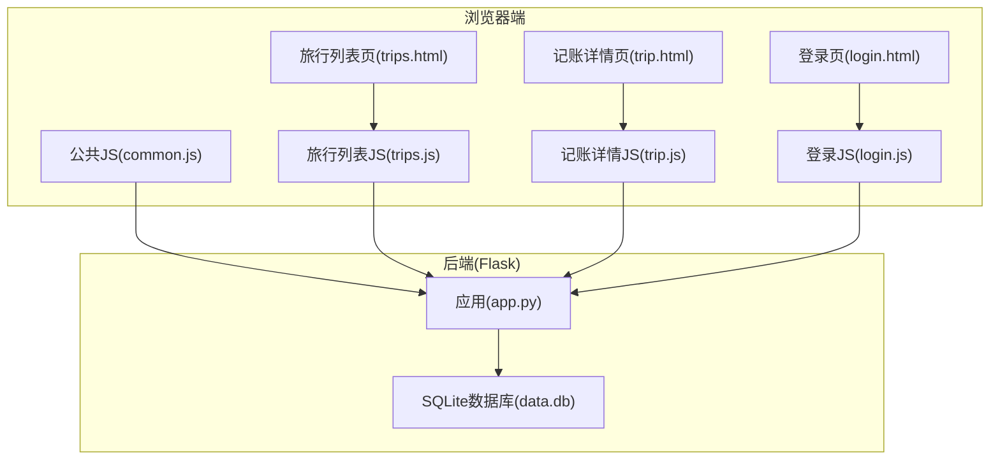
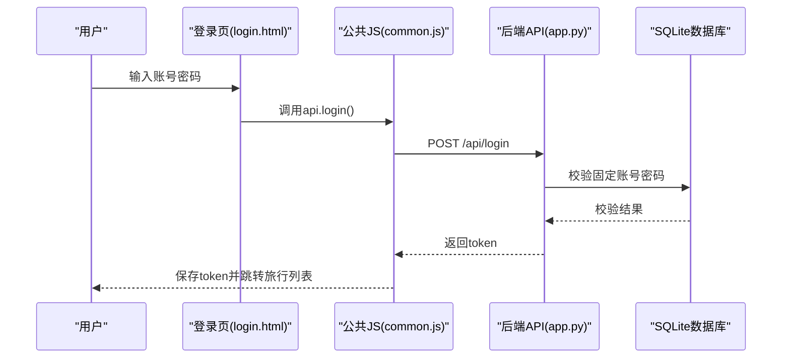
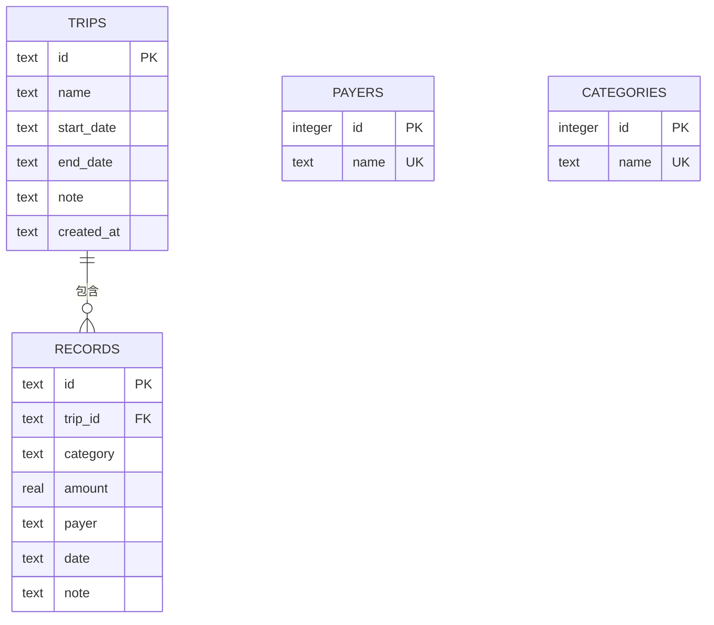
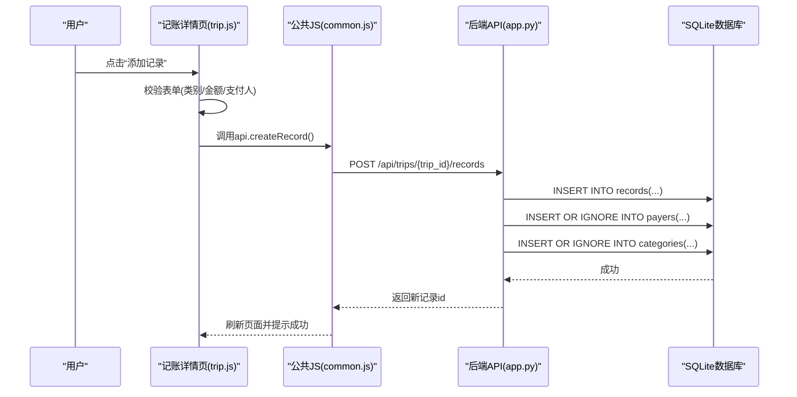
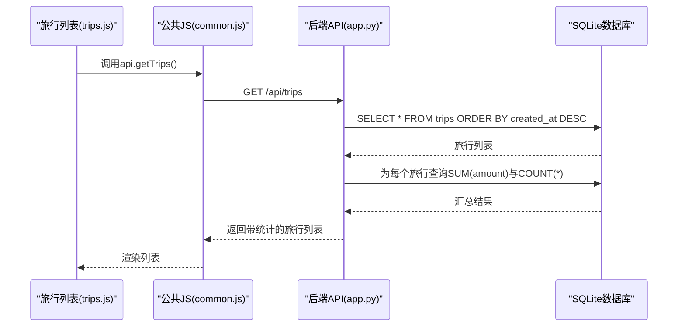
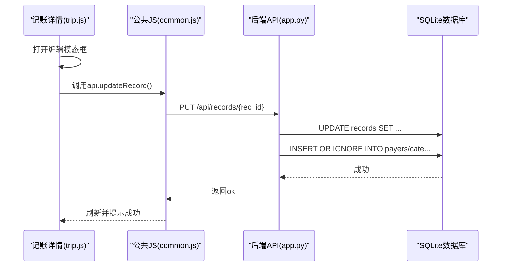
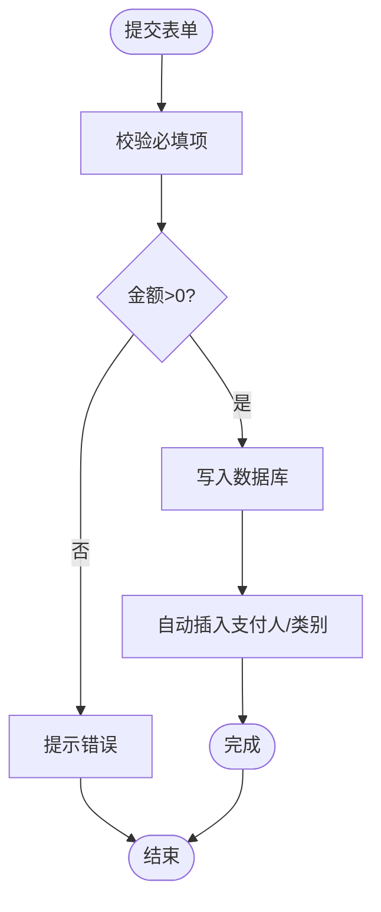
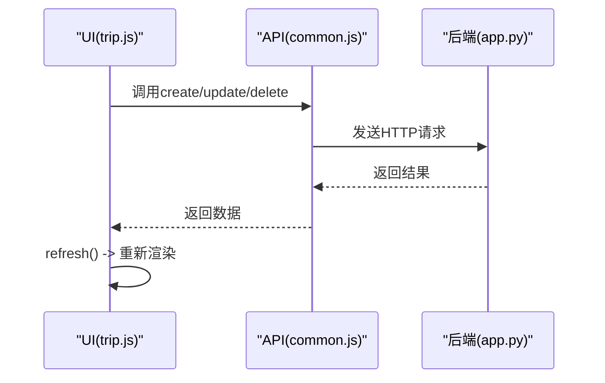
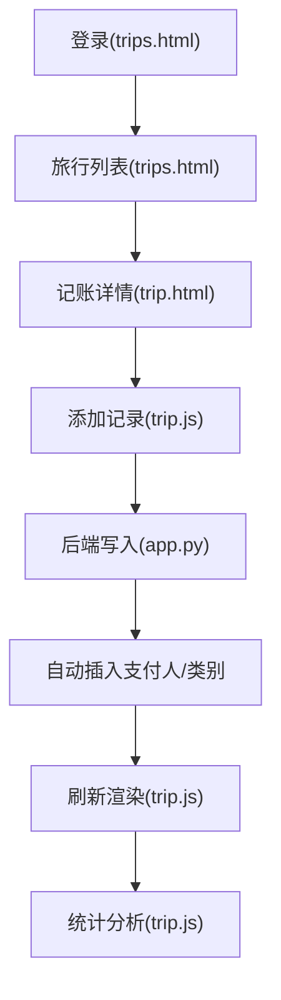
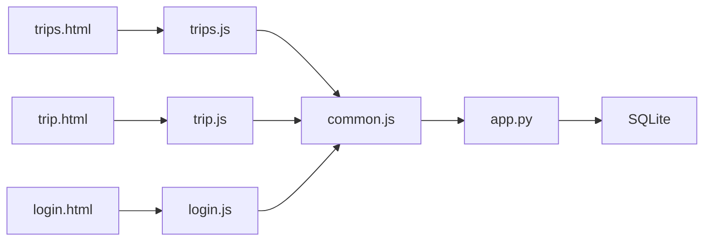

# 记账记录管理

<cite>
**本文引用的文件**
- [app.py](file://app.py)
- [trip.html](file://trip.html)
- [trips.html](file://trips.html)
- [assets/js/common.js](file://assets/js/common.js)
- [assets/js/trip.js](file://assets/js/trip.js)
- [assets/js/trips.js](file://assets/js/trips.js)
- [assets/js/login.js](file://assets/js/login.js)
- [login.html](file://login.html)
- [recorded.md](file://recorded.md)
</cite>

## 目录
1. [简介](#简介)
2. [项目结构](#项目结构)
3. [核心组件](#核心组件)
4. [架构总览](#架构总览)
5. [详细组件分析](#详细组件分析)
6. [依赖分析](#依赖分析)
7. [性能考虑](#性能考虑)
8. [故障排除指南](#故障排除指南)
9. [结论](#结论)
10. [附录](#附录)

## 简介
本文件面向“recorded”项目的记账记录管理功能，提供从数据模型设计、后端API实现、前端交互到业务流程的完整技术说明。重点覆盖：
- 消费记录的CRUD操作实现（创建、读取、更新、删除）
- 数据验证、金额格式转换与数据库操作
- 记录创建时的自动记录机制（支付人与类别的自动插入）
- 记录查询与过滤（按旅行ID查询、按日期排序）
- 记录更新与删除的实现细节
- 记账数据模型设计（外键关系与约束）
- 从添加到统计分析的完整业务流程
- 前端对记录的实时更新与显示机制
- 扩展性建议与最佳实践

## 项目结构
该项目采用前后端分离架构：
- 后端：基于Flask的Python应用，使用SQLite作为本地存储
- 前端：纯静态HTML/CSS/JS，通过XHR调用后端API
- 静态资源：样式与脚本位于assets目录，页面位于根目录

图表来源
- [app.py:1-331](file://app.py#L1-L331)
- [trip.html:1-155](file://trip.html#L1-L155)
- [trips.html:1-60](file://trips.html#L1-L60)
- [assets/js/common.js:1-206](file://assets/js/common.js#L1-L206)
- [assets/js/trip.js:1-401](file://assets/js/trip.js#L1-L401)
- [assets/js/trips.js:1-130](file://assets/js/trips.js#L1-L130)
- [assets/js/login.js:1-44](file://assets/js/login.js#L1-L44)

章节来源
- [app.py:1-331](file://app.py#L1-L331)
- [trip.html:1-155](file://trip.html#L1-L155)
- [trips.html:1-60](file://trips.html#L1-L60)
- [assets/js/common.js:1-206](file://assets/js/common.js#L1-L206)
- [assets/js/trip.js:1-401](file://assets/js/trip.js#L1-L401)
- [assets/js/trips.js:1-130](file://assets/js/trips.js#L1-L130)
- [assets/js/login.js:1-44](file://assets/js/login.js#L1-L44)

## 核心组件
- 数据模型与数据库初始化
  - 旅行表(trips)：主键id，名称、起止日期、备注、创建时间
  - 记账记录表(records)：主键id，关联旅行trip_id，类别、金额、支付人、日期、备注；外键约束级联删除
  - 支付人表(payers)：唯一名称
  - 类别表(categories)：唯一名称
- 后端API
  - 认证中间件：基于Authorization头的Bearer Token
  - 旅行相关：CRUD
  - 记账记录相关：CRUD
  - 支付人与类别：查询与新增
- 前端模块
  - 公共API封装与鉴权
  - 登录页、旅行列表页、记账详情页的交互逻辑
  - 实时刷新与提示反馈

章节来源
- [app.py:41-79](file://app.py#L41-L79)
- [app.py:82-89](file://app.py#L82-L89)
- [app.py:119-204](file://app.py#L119-L204)
- [app.py:208-272](file://app.py#L208-L272)
- [app.py:274-314](file://app.py#L274-L314)
- [assets/js/common.js:39-132](file://assets/js/common.js#L39-L132)
- [assets/js/trip.js:104-123](file://assets/js/trip.js#L104-L123)
- [assets/js/trips.js:17-24](file://assets/js/trips.js#L17-L24)

## 架构总览
后端通过Flask路由暴露REST接口，前端通过common.js中的api对象发起HTTP请求。认证通过固定账号密码换取token，后续请求在Header中携带Authorization: Bearer token。

图表来源
- [assets/js/login.js:13-34](file://assets/js/login.js#L13-L34)
- [assets/js/common.js:60-71](file://assets/js/common.js#L60-L71)
- [app.py:106-116](file://app.py#L106-L116)

章节来源
- [assets/js/login.js:1-44](file://assets/js/login.js#L1-L44)
- [assets/js/common.js:16-37](file://assets/js/common.js#L16-L37)
- [app.py:106-116](file://app.py#L106-L116)

## 详细组件分析

### 数据模型与数据库设计
- 表结构与约束
  - trips：主键id，name非空，created_at自动记录
  - records：主键id，trip_id外键引用trips(id)，ON DELETE CASCADE；category与payer非空；amount为REAL且必须>0
  - payers：name唯一
  - categories：name唯一
- 默认类别初始化
  - 启动时向categories表插入默认类别，忽略重复
- 外键级联删除
  - 删除旅行会级联删除其所有记录

图表来源
- [app.py:47-72](file://app.py#L47-L72)
- [app.py:74-78](file://app.py#L74-L78)

章节来源
- [app.py:41-79](file://app.py#L41-L79)

### 记录创建流程（含自动记录机制）
- 请求入口：POST /api/trips/{trip_id}/records
- 校验与转换
  - trip_id存在性校验
  - category与payer非空校验
  - amount转换为float并校验>0
- 写入记录
  - 生成rec_id并插入records
  - 使用INSERT OR IGNORE自动插入新的支付人与类别
- 返回
  - 返回新记录id，状态码201

图表来源
- [assets/js/trip.js:161-197](file://assets/js/trip.js#L161-L197)
- [assets/js/common.js:97-101](file://assets/js/common.js#L97-L101)
- [app.py:208-236](file://app.py#L208-L236)

章节来源
- [app.py:208-236](file://app.py#L208-L236)
- [assets/js/trip.js:161-197](file://assets/js/trip.js#L161-L197)

### 记录查询与过滤
- 查询旅行详情：GET /api/trips/{trip_id}
  - 返回旅行基本信息与记录列表
  - 记录按date降序排列
  - 附加统计：总金额、按支付人与类别的汇总
- 查询旅行列表：GET /api/trips
  - 返回旅行列表并附加每旅行的记录数与总金额
  - 列表按created_at降序排列

图表来源
- [assets/js/trips.js:17-24](file://assets/js/trips.js#L17-L24)
- [assets/js/common.js:74-76](file://assets/js/common.js#L74-L76)
- [app.py:119-139](file://app.py#L119-L139)

章节来源
- [app.py:119-139](file://app.py#L119-L139)
- [app.py:157-177](file://app.py#L157-L177)
- [assets/js/trips.js:17-24](file://assets/js/trips.js#L17-L24)

### 记录更新与删除
- 更新记录：PUT /api/records/{rec_id}
  - 校验category、payer非空，amount>0
  - 更新记录并自动插入新的支付人与类别
- 删除记录：DELETE /api/records/{rec_id}
  - 直接删除记录

图表来源
- [assets/js/trip.js:259-313](file://assets/js/trip.js#L259-L313)
- [assets/js/common.js:102-106](file://assets/js/common.js#L102-L106)
- [app.py:238-264](file://app.py#L238-L264)

章节来源
- [app.py:238-264](file://app.py#L238-L264)
- [app.py:266-272](file://app.py#L266-L272)

### 数据验证与金额格式转换
- 后端
  - 类别与支付人非空校验
  - 金额转换为float并校验>0
  - 旅行ID存在性校验
- 前端
  - 表单输入校验（金额>0、必填项）
  - 金额格式化显示：统一为¥xx.xx

图表来源
- [assets/js/trip.js:161-197](file://assets/js/trip.js#L161-L197)
- [app.py:215-227](file://app.py#L215-L227)
- [assets/js/common.js:135-138](file://assets/js/common.js#L135-L138)

章节来源
- [app.py:215-227](file://app.py#L215-L227)
- [assets/js/trip.js:161-197](file://assets/js/trip.js#L161-L197)
- [assets/js/common.js:135-138](file://assets/js/common.js#L135-L138)

### 前端实时更新与显示
- 刷新策略
  - 添加/编辑/删除成功后调用refresh()，重新拉取旅行详情、支付人、类别
  - 重新渲染统计栏、记录列表与总结区域
- 交互细节
  - 下拉框联动：选择“自定义类别/新增支付人”时显示输入框
  - 确认对话框用于删除操作
  - Toast提示全局错误与成功信息

图表来源
- [assets/js/trip.js:104-123](file://assets/js/trip.js#L104-L123)
- [assets/js/common.js:39-132](file://assets/js/common.js#L39-L132)
- [app.py:119-177](file://app.py#L119-L177)

章节来源
- [assets/js/trip.js:104-123](file://assets/js/trip.js#L104-L123)
- [assets/js/trip.js:200-256](file://assets/js/trip.js#L200-L256)
- [assets/js/trip.js:315-348](file://assets/js/trip.js#L315-L348)

### 完整业务流程（从添加到统计分析）
- 登录与导航
  - 登录成功后进入旅行列表
  - 点击旅行卡片进入记账详情
- 添加记录
  - 选择类别/输入金额/选择支付人/填写日期与备注
  - 提交后自动刷新并显示最新列表
- 统计分析
  - 统计栏显示记录数、总金额、参与人数
  - 按支付人与类别展示汇总
  - 总计金额展示

图表来源
- [assets/js/trips.js:17-24](file://assets/js/trips.js#L17-L24)
- [assets/js/trip.js:104-123](file://assets/js/trip.js#L104-L123)
- [app.py:208-236](file://app.py#L208-L236)
- [assets/js/trip.js:140-149](file://assets/js/trip.js#L140-L149)
- [assets/js/trip.js:315-348](file://assets/js/trip.js#L315-L348)

章节来源
- [assets/js/trips.js:17-24](file://assets/js/trips.js#L17-L24)
- [assets/js/trip.js:104-123](file://assets/js/trip.js#L104-L123)
- [app.py:208-236](file://app.py#L208-L236)
- [assets/js/trip.js:140-149](file://assets/js/trip.js#L140-L149)
- [assets/js/trip.js:315-348](file://assets/js/trip.js#L315-L348)

## 依赖分析
- 组件耦合
  - 前端各页面通过common.js的api对象耦合后端API
  - 记账详情页依赖旅行列表页提供的trip_id
- 外部依赖
  - Flask、SQLite
  - 浏览器端仅依赖标准API与本地存储
- 循环依赖
  - 无循环依赖，职责清晰

图表来源
- [assets/js/common.js:39-132](file://assets/js/common.js#L39-L132)
- [app.py:1-331](file://app.py#L1-L331)

章节来源
- [assets/js/common.js:39-132](file://assets/js/common.js#L39-L132)
- [app.py:1-331](file://app.py#L1-L331)

## 性能考虑
- 数据库优化
  - WAL模式提升并发写入性能
  - 开启外键约束保证数据一致性
- 查询优化
  - 旅行列表按created_at降序，减少排序成本
  - 记录列表按date降序，便于前端展示
- 前端优化
  - 一次性拉取旅行详情、支付人、类别，避免多次往返
  - 刷新时批量重渲染，减少DOM操作
- 建议
  - 对大列表可考虑分页或虚拟滚动
  - 对频繁查询可引入轻量缓存（如localStorage）

## 故障排除指南
- 登录失败
  - 检查账号密码是否正确
  - 确认token是否被保存并在请求头中携带
- 401未授权
  - token过期或无效，需重新登录
- 创建记录失败
  - 检查类别、支付人、金额是否符合要求
  - 确认旅行是否存在
- 删除记录失败
  - 检查记录ID是否正确
- 页面不刷新
  - 确认refresh()是否被调用
  - 检查网络请求与控制台错误

章节来源
- [assets/js/common.js:47-57](file://assets/js/common.js#L47-L57)
- [app.py:215-227](file://app.py#L215-L227)
- [assets/js/trip.js:104-123](file://assets/js/trip.js#L104-L123)

## 结论
recorded项目的记账记录管理功能以简洁的数据模型与清晰的前后端分工实现了完整的CRUD与统计分析能力。后端通过严格的参数校验与自动记录机制确保数据质量，前端通过统一的API封装与实时刷新提供了良好的用户体验。整体架构易于扩展，适合在此基础上增加更多维度的统计与导出功能。

## 附录
- 运行与部署
  - 使用Flask内置开发服务器启动，生产环境建议配合Nginx与WSGI
  - 数据库存放在项目根目录下的data.db
- 扩展建议
  - 增加记录搜索与筛选（按日期范围、支付人、类别）
  - 增加导出报表（CSV/PDF）
  - 增加旅行预算与超支提醒
  - 增加多语言支持与主题切换
  - 增加旅行照片与备注富文本