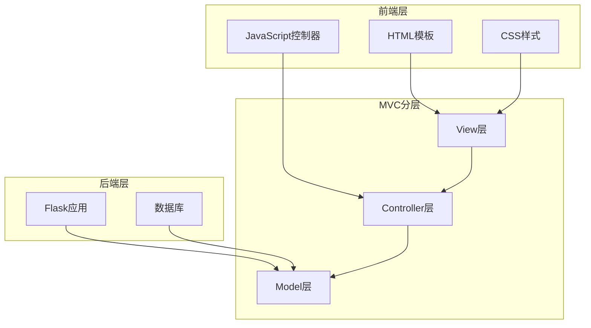
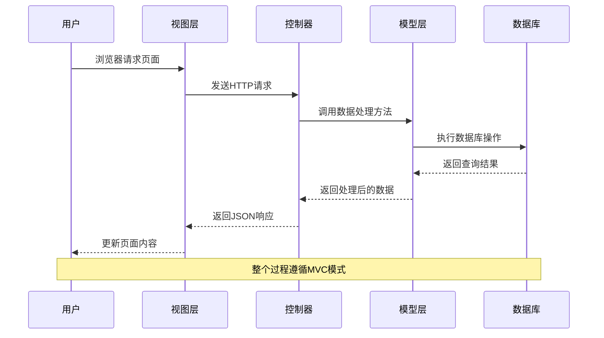
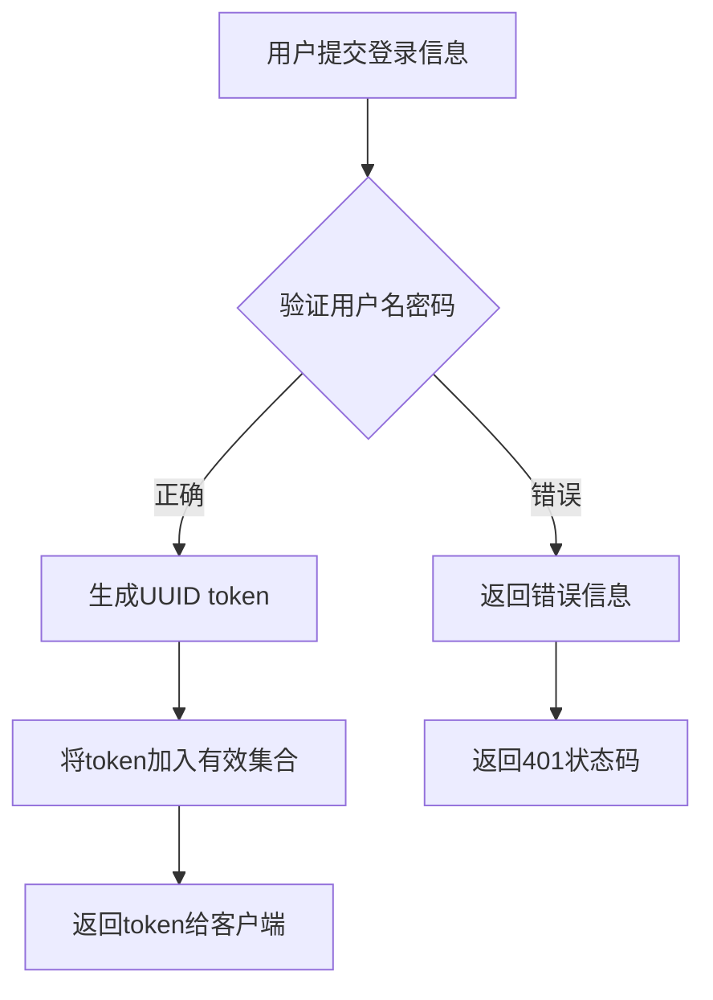
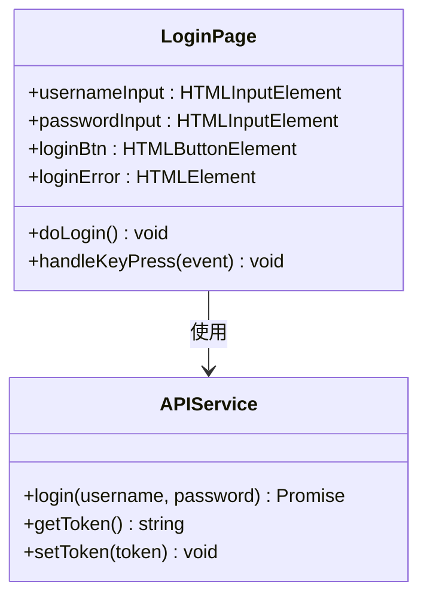
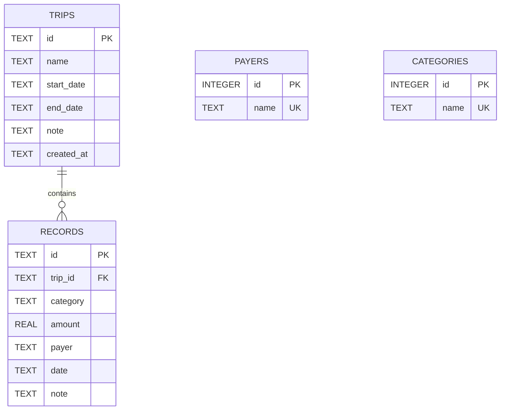
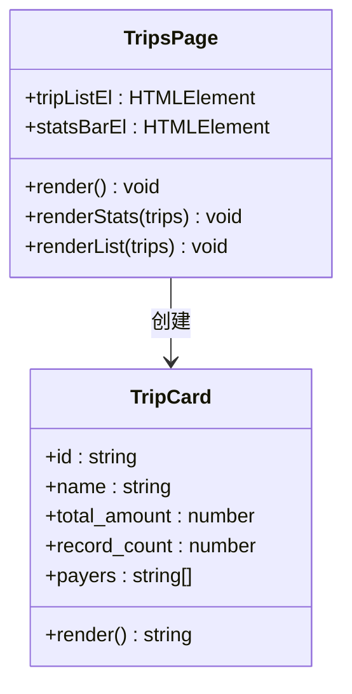
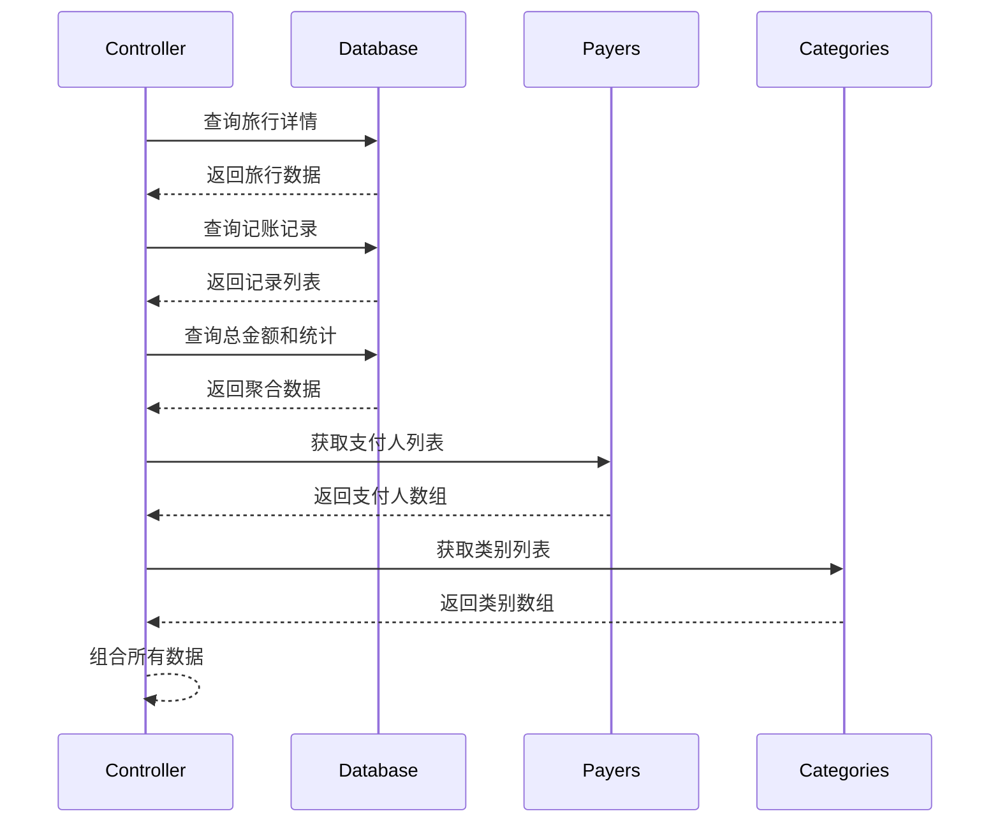
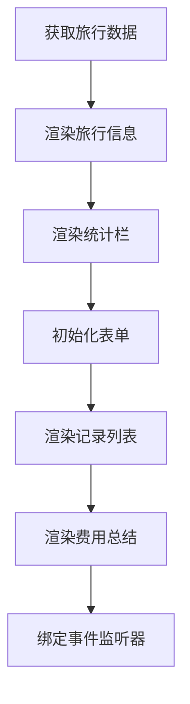
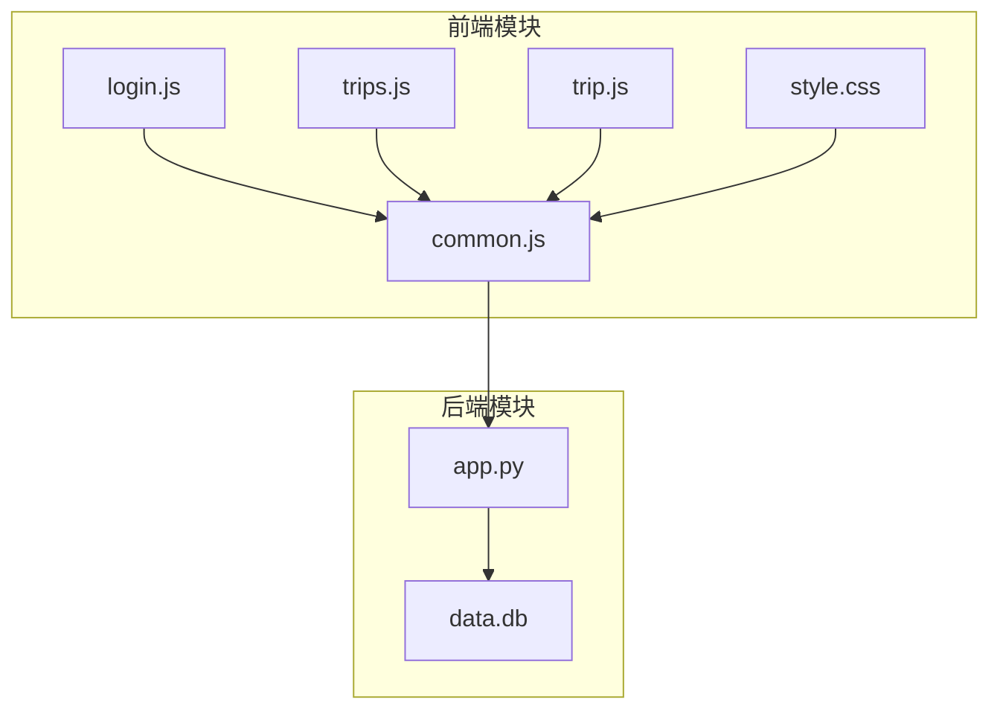

# MVC设计模式

<cite>
**本文档引用的文件**
- [app.py](file://app.py)
- [login.html](file://login.html)
- [trips.html](file://trips.html)
- [trip.html](file://trip.html)
- [assets/js/common.js](file://assets/js/common.js)
- [assets/js/login.js](file://assets/js/login.js)
- [assets/js/trips.js](file://assets/js/trips.js)
- [assets/js/trip.js](file://assets/js/trip.js)
- [assets/css/style.css](file://assets/css/style.css)
</cite>

## 目录
1. [简介](#简介)
2. [项目结构](#项目结构)
3. [核心组件](#核心组件)
4. [架构概览](#架构概览)
5. [详细组件分析](#详细组件分析)
6. [依赖分析](#依赖分析)
7. [性能考虑](#性能考虑)
8. [故障排除指南](#故障排除指南)
9. [结论](#结论)

## 简介

recorded项目是一个基于Flask的旅游记账系统，采用了经典的MVC（Model-View-Controller）设计模式。该项目展示了如何在现代Web应用中正确实现MVC架构，其中：
- **Model（模型）**：负责数据存储和业务逻辑处理，使用SQLite数据库进行数据持久化
- **View（视图）**：负责用户界面展示，包含HTML模板和CSS样式
- **Controller（控制器）**：负责处理用户请求和业务流程控制，通过Flask路由实现

该系统采用前后端分离的架构设计，前端使用纯JavaScript实现MVC模式，后端提供RESTful API接口，实现了清晰的职责分离和良好的可维护性。

## 项目结构

项目采用模块化的文件组织方式，清晰地分离了不同层次的功能：

**图表来源**
- [app.py:1-331](file://app.py#L1-L331)
- [login.html:1-32](file://login.html#L1-L32)
- [trips.html:1-60](file://trips.html#L1-L60)
- [trip.html:1-155](file://trip.html#L1-L155)

**章节来源**
- [app.py:1-331](file://app.py#L1-L331)
- [login.html:1-32](file://login.html#L1-L32)
- [trips.html:1-60](file://trips.html#L1-L60)
- [trip.html:1-155](file://trip.html#L1-L155)

## 核心组件

### Model层（数据模型）

Model层主要由Flask应用中的数据库操作和数据处理逻辑组成，负责数据的持久化和业务规则验证：

#### 数据库连接管理
- 使用Flask的g对象管理数据库连接
- 实现连接池优化和自动清理机制
- 支持WAL模式和外键约束

#### 数据表结构
- **trips表**：存储旅行基本信息
- **records表**：存储记账明细
- **payers表**：存储支付人信息
- **categories表**：存储费用类别

#### 数据访问方法
- 统一的数据库连接获取函数
- CRUD操作的封装
- 数据格式转换工具

**章节来源**
- [app.py:27-79](file://app.py#L27-L79)
- [app.py:93-103](file://app.py#L93-L103)

### View层（视图）

View层由HTML模板和CSS样式组成，负责用户界面的展示和交互：

#### 主要页面组件
- **登录页面**：用户认证界面
- **旅行列表页面**：旅行记录的主界面
- **旅行详情页面**：详细的记账信息展示

#### 视觉设计特点
- 移动端优先的设计理念
- Material Design风格的UI组件
- 响应式布局支持

**章节来源**
- [login.html:1-32](file://login.html#L1-L32)
- [trips.html:1-60](file://trips.html#L1-L60)
- [trip.html:1-155](file://trip.html#L1-L155)
- [assets/css/style.css:1-273](file://assets/css/style.css#L1-L273)

### Controller层（控制器）

Controller层通过Flask路由和API处理函数实现，负责处理用户请求和协调MVC各层：

#### API路由设计
- **认证路由**：/api/login
- **旅行管理路由**：/api/trips
- **记账记录路由**：/api/trips/{trip_id}/records
- **辅助数据路由**：/api/payers, /api/categories

#### 请求处理流程
- 参数验证和数据清洗
- 业务逻辑处理
- 错误处理和响应格式化

**章节来源**
- [app.py:106-315](file://app.py#L106-L315)

## 架构概览

recorded项目采用前后端分离的MVC架构，展示了现代Web应用的最佳实践：

**图表来源**
- [app.py:106-315](file://app.py#L106-L315)
- [assets/js/common.js:39-132](file://assets/js/common.js#L39-L132)

### 前后端分离的MVC协调

在recorded项目中，MVC模式在前后端分离架构中有其特殊应用：

#### 前端MVC实现
- **Model**：JavaScript中的数据模型和业务逻辑
- **View**：DOM元素和用户界面
- **Controller**：事件处理器和API调用

#### 后端MVC实现
- **Model**：数据库操作和数据处理
- **View**：HTML模板和静态资源
- **Controller**：Flask路由和API端点

#### 协调机制
- 通过RESTful API进行数据交换
- 统一的JSON数据格式
- Token认证机制确保安全性

**章节来源**
- [assets/js/common.js:39-132](file://assets/js/common.js#L39-L132)
- [app.py:106-315](file://app.py#L106-L315)

## 详细组件分析

### 登录功能的MVC实现

#### Model层实现
登录验证逻辑集中在后端，使用固定凭证进行身份验证，并生成临时token：

**图表来源**
- [app.py:106-116](file://app.py#L106-L116)

#### View层实现
登录页面提供了简洁的用户界面，包含表单字段和错误提示：

**图表来源**
- [assets/js/login.js:1-44](file://assets/js/login.js#L1-L44)
- [assets/js/common.js:60-71](file://assets/js/common.js#L60-L71)

#### Controller层实现
前端控制器处理用户交互并调用API服务：

**章节来源**
- [login.html:1-32](file://login.html#L1-L32)
- [assets/js/login.js:1-44](file://assets/js/login.js#L1-L44)
- [app.py:106-116](file://app.py#L106-L116)

### 旅行管理的MVC实现

#### Model层数据结构
旅行管理系统的核心数据模型包括旅行、记账记录、支付人和类别四个实体：

**图表来源**
- [app.py:46-73](file://app.py#L46-L73)

#### View层页面组件
旅行列表页面展示了聚合数据和统计信息：

**图表来源**
- [assets/js/trips.js:1-130](file://assets/js/trips.js#L1-L130)
- [trips.html:1-60](file://trips.html#L1-L60)

#### Controller层业务逻辑
旅行管理的控制器实现了完整的CRUD操作：

**章节来源**
- [app.py:119-204](file://app.py#L119-L204)
- [assets/js/trips.js:1-130](file://assets/js/trips.js#L1-L130)

### 记账详情的MVC实现

#### Model层数据聚合
旅行详情页面需要聚合多个数据源的信息：

**图表来源**
- [app.py:157-177](file://app.py#L157-L177)

#### View层动态渲染
记账详情页面实现了复杂的动态内容渲染：

**图表来源**
- [assets/js/trip.js:105-123](file://assets/js/trip.js#L105-L123)

#### Controller层事件处理
前端控制器处理复杂的用户交互事件：

**章节来源**
- [app.py:208-272](file://app.py#L208-L272)
- [assets/js/trip.js:1-401](file://assets/js/trip.js#L1-L401)

## 依赖分析

### 模块间依赖关系

**图表来源**
- [assets/js/common.js:1-206](file://assets/js/common.js#L1-L206)
- [app.py:1-331](file://app.py#L1-L331)

### 关键依赖关系

#### 前端依赖链
- 所有页面都依赖common.js提供的API封装
- 登录页面独立于后端认证逻辑
- 列表和详情页面都依赖common.js的API服务

#### 后端依赖关系
- 所有API端点依赖数据库连接管理
- 认证中间件依赖token验证机制
- 数据操作依赖统一的工具函数

**章节来源**
- [assets/js/common.js:39-132](file://assets/js/common.js#L39-L132)
- [app.py:82-89](file://app.py#L82-L89)

## 性能考虑

### 数据库性能优化

#### 连接管理
- 使用Flask的g对象实现数据库连接的上下文管理
- WAL模式提升并发写入性能
- 外键约束确保数据完整性

#### 查询优化
- 使用参数化查询防止SQL注入
- 合理的索引策略（主键自动索引）
- 批量操作减少数据库往返

### 前端性能优化

#### 资源加载
- 静态资源缓存策略
- 按需加载JavaScript模块
- CSS样式优化减少重绘

#### 用户体验
- 异步数据加载避免阻塞
- 本地存储token减少重复认证
- 合理的错误处理和反馈

## 故障排除指南

### 常见问题诊断

#### 认证问题
- **症状**：401未授权错误
- **原因**：token过期或无效
- **解决方案**：重新登录获取新token

#### 数据库连接问题
- **症状**：数据库操作失败
- **原因**：连接池耗尽或数据库锁定
- **解决方案**：检查数据库状态，重启应用

#### 前端API调用问题
- **症状**：页面无法加载数据
- **原因**：网络请求失败或跨域问题
- **解决方案**：检查浏览器开发者工具中的网络面板

### 调试技巧

#### 后端调试
- 使用Flask的调试模式
- 检查数据库连接状态
- 验证API响应格式

#### 前端调试
- 使用浏览器开发者工具
- 检查API响应和错误信息
- 验证DOM元素状态

**章节来源**
- [assets/js/common.js:47-57](file://assets/js/common.js#L47-L57)
- [app.py:82-89](file://app.py#L82-L89)

## 结论

recorded项目成功地实现了MVC设计模式在现代Web应用中的应用，展现了以下关键特性：

### 设计优势
- **清晰的职责分离**：Model、View、Controller各司其职
- **良好的可维护性**：模块化设计便于代码维护和扩展
- **前后端分离**：提高了系统的灵活性和可测试性

### 技术亮点
- **RESTful API设计**：标准化的接口规范
- **响应式UI设计**：优秀的用户体验
- **安全的认证机制**：基于token的身份验证

### 改进建议
- 可以考虑引入ORM框架简化数据库操作
- 增加单元测试覆盖提高代码质量
- 实现更完善的错误处理和日志记录

该实现为学习MVC设计模式在实际项目中的应用提供了优秀的参考案例，展示了如何在保持架构清晰的同时实现功能完整性和用户体验的平衡。