# 性能考虑

<cite>
**本文档引用的文件**
- [app.py](file://app.py)
- [nginx.conf](file://nginx.conf)
- [run_server.sh](file://run_server.sh)
- [assets/js/common.js](file://assets/js/common.js)
- [assets/js/trip.js](file://assets/js/trip.js)
- [assets/js/trips.js](file://assets/js/trips.js)
- [assets/css/style.css](file://assets/css/style.css)
- [login.html](file://login.html)
- [trip.html](file://trip.html)
- [trips.html](file://trips.html)
- [requirements.txt](file://requirements.txt)
</cite>

## 目录
1. [简介](#简介)
2. [项目结构](#项目结构)
3. [核心组件](#核心组件)
4. [架构概览](#架构概览)
5. [详细组件分析](#详细组件分析)
6. [依赖分析](#依赖分析)
7. [性能考虑](#性能考虑)
8. [故障排除指南](#故障排除指南)
9. [结论](#结论)

## 简介

recorded是一个基于Flask的旅游记账系统，采用前后端分离的设计模式。该系统实现了完整的旅行记账功能，包括旅行管理、费用记录、支付人管理和类别管理等核心功能。系统采用SQLite作为数据存储，Nginx作为反向代理服务器，前端使用原生JavaScript实现响应式界面。

## 项目结构

该项目采用简洁的文件组织结构，主要包含以下几类文件：

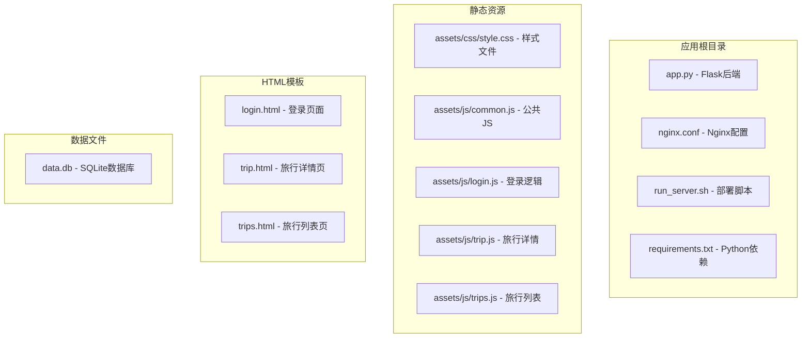

**图表来源**
- [app.py:1-331](file://app.py#L1-L331)
- [nginx.conf:1-38](file://nginx.conf#L1-L38)
- [run_server.sh:1-81](file://run_server.sh#L1-L81)

**章节来源**
- [app.py:1-331](file://app.py#L1-L331)
- [nginx.conf:1-38](file://nginx.conf#L1-L38)
- [run_server.sh:1-81](file://run_server.sh#L1-L81)

## 核心组件

### 后端服务组件

系统的核心后端服务基于Flask框架构建，主要包含以下关键组件：

- **数据库连接管理**：使用SQLite作为数据存储，通过WAL模式提升并发性能
- **认证中间件**：基于Bearer Token的简单认证机制
- **RESTful API接口**：提供完整的旅行和记账数据操作接口
- **静态文件服务**：支持直接托管静态资源文件

### 前端组件

前端采用模块化的JavaScript架构，包含：

- **公共工具模块**：封装API调用、认证管理和通用工具函数
- **页面特定模块**：针对不同页面的功能实现
- **响应式样式系统**：基于CSS变量的主题系统

**章节来源**
- [app.py:27-40](file://app.py#L27-L40)
- [app.py:82-89](file://app.py#L82-L89)
- [assets/js/common.js:39-132](file://assets/js/common.js#L39-L132)

## 架构概览

系统采用经典的三层架构设计，通过Nginx实现反向代理和静态资源服务：

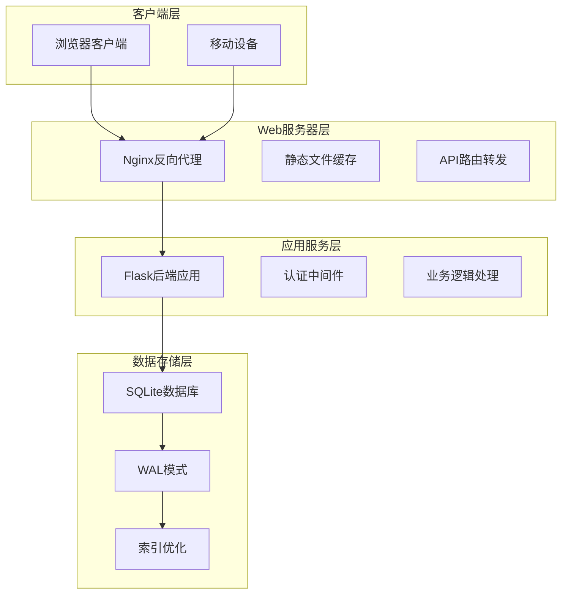

**图表来源**
- [nginx.conf:1-38](file://nginx.conf#L1-L38)
- [app.py:27-40](file://app.py#L27-L40)
- [app.py:41-78](file://app.py#L41-L78)

## 详细组件分析

### 数据库连接管理

系统使用Flask的g对象进行数据库连接管理，确保每个请求都有独立的数据库连接：

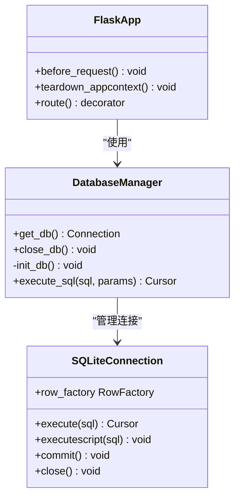

**图表来源**
- [app.py:27-40](file://app.py#L27-L40)
- [app.py:41-78](file://app.py#L41-L78)

数据库连接的关键特性：
- 使用WAL模式提升并发读取性能
- 启用外键约束保证数据完整性
- 每个请求创建独立连接避免线程安全问题

**章节来源**
- [app.py:27-40](file://app.py#L27-L40)
- [app.py:41-78](file://app.py#L41-L78)

### 认证中间件设计

系统实现了基于Bearer Token的认证机制：

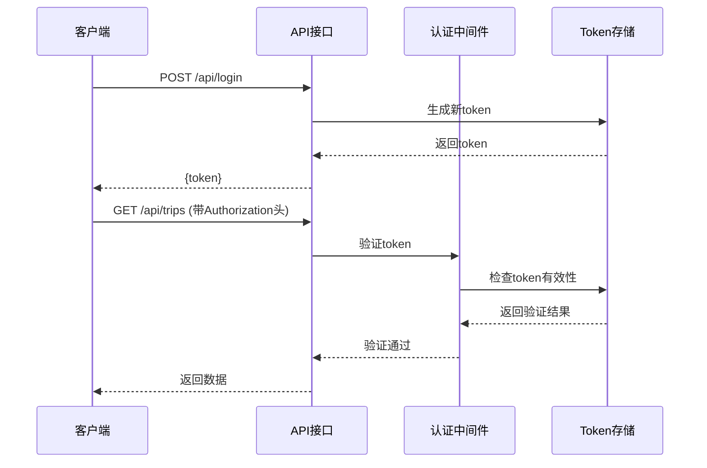

**图表来源**
- [app.py:82-89](file://app.py#L82-L89)
- [app.py:106-115](file://app.py#L106-L115)

认证流程特点：
- 内存中存储token，重启后自动失效
- 支持批量操作的统一认证检查
- 简洁的错误处理机制

**章节来源**
- [app.py:82-89](file://app.py#L82-L89)
- [app.py:106-115](file://app.py#L106-L115)

### 前端API封装

前端使用模块化的方式封装所有API调用：

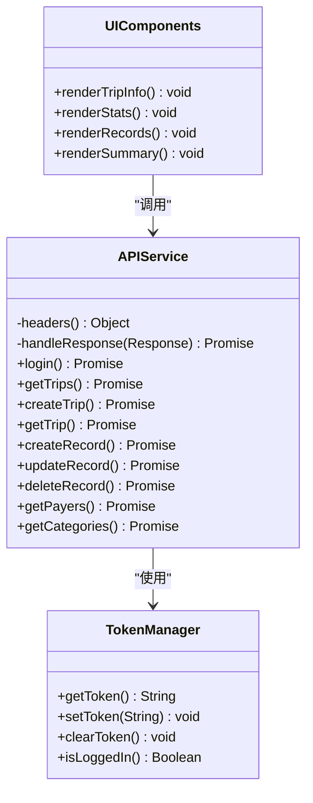

**图表来源**
- [assets/js/common.js:39-132](file://assets/js/common.js#L39-L132)
- [assets/js/trip.js:105-123](file://assets/js/trip.js#L105-L123)

前端架构优势：
- 统一的错误处理和响应格式
- 模块化的功能组织
- 轻量级的DOM操作

**章节来源**
- [assets/js/common.js:39-132](file://assets/js/common.js#L39-L132)
- [assets/js/trip.js:105-123](file://assets/js/trip.js#L105-L123)

## 依赖分析

系统的主要依赖关系如下：

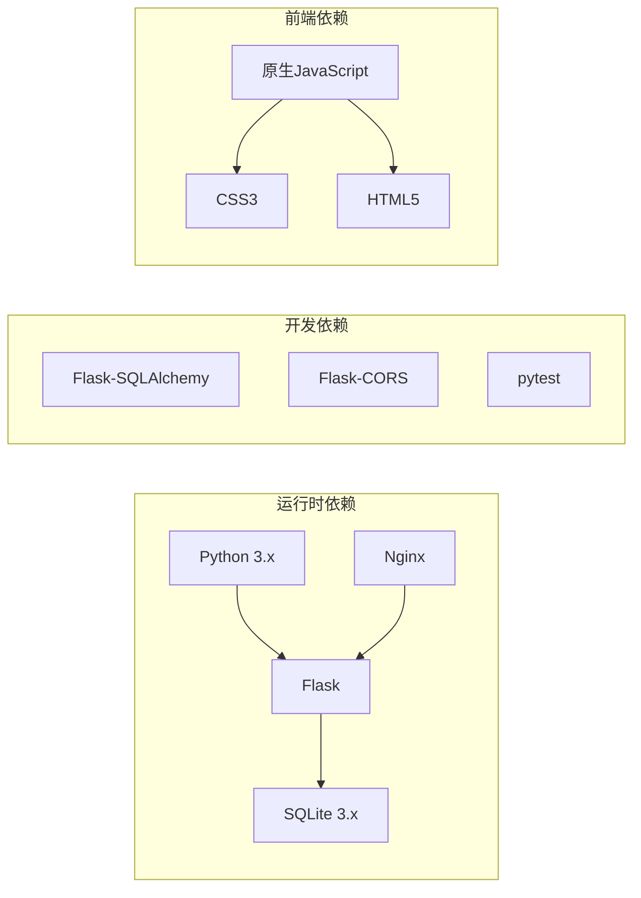

**图表来源**
- [requirements.txt:1-2](file://requirements.txt#L1-L2)
- [run_server.sh:22-32](file://run_server.sh#L22-L32)

**章节来源**
- [requirements.txt:1-2](file://requirements.txt#L1-L2)
- [run_server.sh:22-32](file://run_server.sh#L22-L32)

## 性能考虑

### 数据库查询优化

#### SQLite性能特点

系统使用SQLite作为数据存储，具有以下性能特征：

**WAL模式优势**：
- 提升并发读取性能，允许多个读操作同时进行
- 减少写操作阻塞，提高整体吞吐量
- 支持更高效的事务处理

**当前查询模式分析**：
- 主列表查询：使用ORDER BY created_at DESC排序
- 汇总计算：在应用层进行聚合计算而非数据库层
- 外键关联：通过FOREIGN KEY确保数据一致性

**优化建议**：

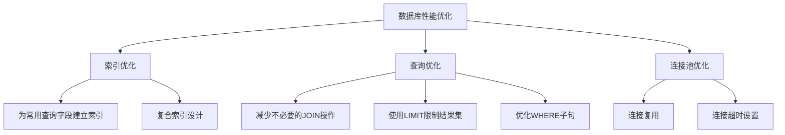

**图表来源**
- [app.py:31-32](file://app.py#L31-L32)
- [app.py:123-139](file://app.py#L123-L139)

#### 当前查询优化点

1. **旅行列表查询**：当前实现对每个旅行都执行多次数据库查询来获取汇总信息，可以优化为单次查询获取所有数据。

2. **索引设计**：建议为以下字段建立索引：
   - trips.created_at (用于排序)
   - records.trip_id (用于按旅行分组)
   - records.date (用于时间范围查询)

3. **连接管理**：当前每个请求创建新的数据库连接，可以考虑连接池优化。

**章节来源**
- [app.py:31-32](file://app.py#L31-L32)
- [app.py:123-139](file://app.py#L123-L139)

### 缓存策略

#### 应用层缓存

系统目前采用简单的内存缓存策略：

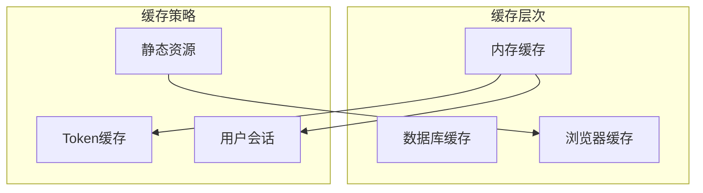

**当前缓存实现**：
- Token存储在内存集合中，进程重启后失效
- 静态资源通过Nginx缓存
- 浏览器端localStorage存储认证信息

**缓存优化建议**：
1. 实现Redis或Memcached作为分布式缓存
2. 为频繁访问的数据建立缓存层
3. 实现缓存失效策略和过期时间管理

**章节来源**
- [app.py:21-21](file://app.py#L21-L21)
- [assets/js/common.js:16-24](file://assets/js/common.js#L16-L24)

### 并发处理能力

#### 线程模型分析

系统采用Flask的单进程多线程模型：

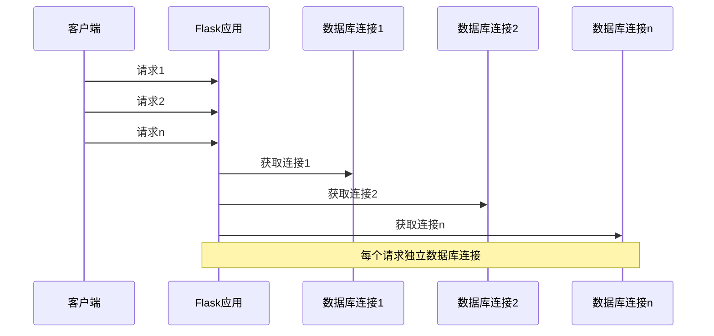

**并发限制**：
- SQLite在高并发场景下性能有限
- 默认的Flask开发服务器不适用于生产环境
- 建议使用WSGI服务器如Gunicorn

**章节来源**
- [app.py:27-40](file://app.py#L27-L40)
- [app.py:328-331](file://app.py#L328-L331)

### Nginx性能优化

#### 反向代理配置

Nginx作为反向代理服务器，提供了以下性能优化：

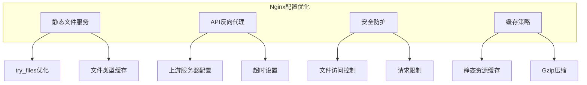

**当前配置特点**：
- 静态文件直接由Nginx服务，减少后端压力
- API请求转发到本地Flask应用
- 提供基本的安全防护规则

**优化建议**：
1. 启用Gzip压缩减少传输体积
2. 配置静态文件缓存头
3. 实现负载均衡和健康检查
4. 添加限流和DDoS防护

**章节来源**
- [nginx.conf:1-38](file://nginx.conf#L1-L38)

### 前端性能优化

#### JavaScript优化策略

前端采用轻量级的原生JavaScript实现，具有以下优化特点：

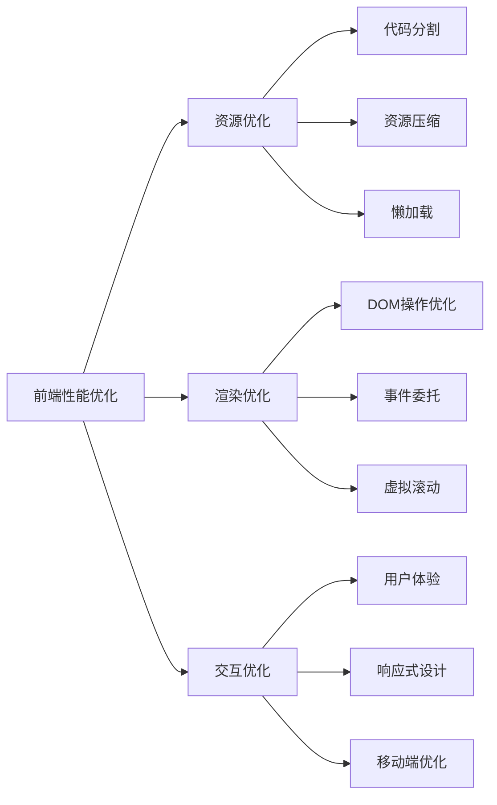

**当前优化实现**：
- 模块化的JavaScript文件组织
- 响应式CSS样式系统
- 移动端友好的界面设计

**优化建议**：
1. 实现代码分割和按需加载
2. 添加图片懒加载和预加载
3. 优化CSS渲染性能
4. 实现Service Worker缓存

**章节来源**
- [assets/js/common.js:1-206](file://assets/js/common.js#L1-L206)
- [assets/js/trip.js:1-401](file://assets/js/trip.js#L1-L401)
- [assets/js/trips.js:1-130](file://assets/js/trips.js#L1-L130)
- [assets/css/style.css:1-273](file://assets/css/style.css#L1-L273)

## 故障排除指南

### 常见性能问题诊断

#### 数据库性能问题

**症状识别**：
- 查询响应时间过长
- 并发访问时性能下降
- 数据库锁等待时间增加

**诊断方法**：
1. 监控数据库连接数和活跃查询
2. 分析慢查询日志
3. 检查索引使用情况

**解决方案**：
- 优化查询语句和索引设计
- 实现连接池和连接复用
- 考虑数据库迁移方案

#### 前端性能问题

**症状识别**：
- 页面加载缓慢
- 交互响应延迟
- 移动设备运行卡顿

**诊断方法**：
1. 使用浏览器开发者工具分析性能
2. 监控内存使用情况
3. 检查网络请求和资源加载

**解决方案**：
- 实现代码分割和懒加载
- 优化CSS渲染和JavaScript执行
- 添加缓存策略和预加载

**章节来源**
- [app.py:27-40](file://app.py#L27-L40)
- [assets/js/common.js:47-57](file://assets/js/common.js#L47-L57)

### 监控和调试工具

#### 后端监控

建议实施以下监控措施：

1. **应用性能监控**：使用Flask扩展或APM工具
2. **数据库监控**：监控查询性能和连接池状态
3. **系统资源监控**：CPU、内存、磁盘IO使用情况

#### 前端监控

1. **性能指标收集**：页面加载时间、交互延迟
2. **错误追踪**：JavaScript异常和网络错误
3. **用户行为分析**：页面访问和功能使用统计

## 结论

recorded项目作为一个轻量级的旅游记账系统，在性能方面具有以下特点：

**优势方面**：
- 简洁的架构设计便于维护和扩展
- SQLite数据库适合小规模应用场景
- 响应式前端设计提供良好的用户体验
- Nginx反向代理提供基本的性能优化

**改进方向**：
1. **数据库优化**：考虑引入索引和查询优化
2. **缓存策略**：实现分布式缓存提升性能
3. **并发处理**：使用WSGI服务器提升并发能力
4. **前端优化**：实现代码分割和资源优化
5. **监控体系**：建立完善的性能监控和告警机制

该系统适合中小规模的个人或小型团队使用，随着用户量的增长，建议逐步实施上述优化措施以满足更高的性能需求。