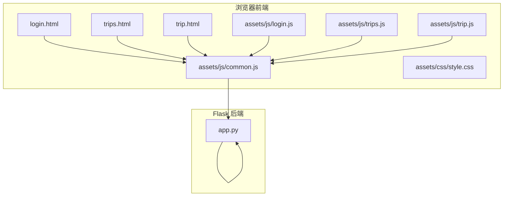
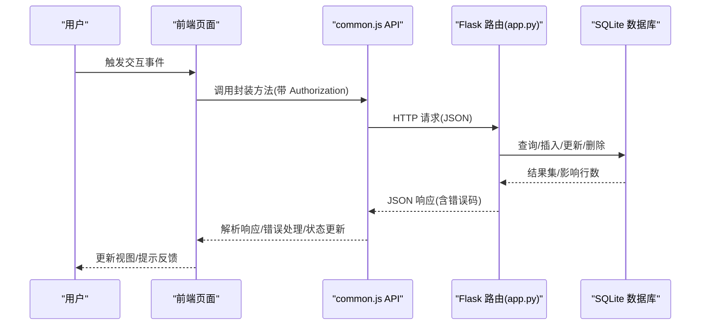
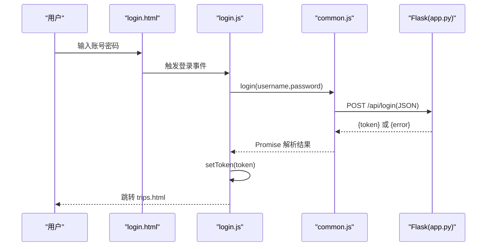
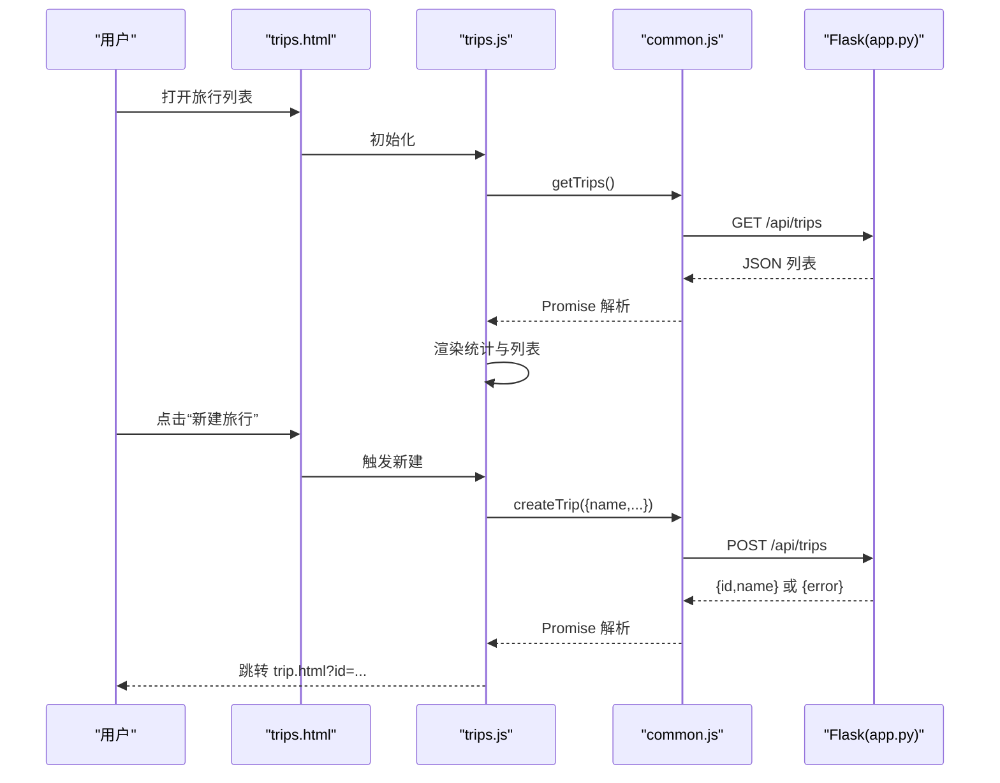
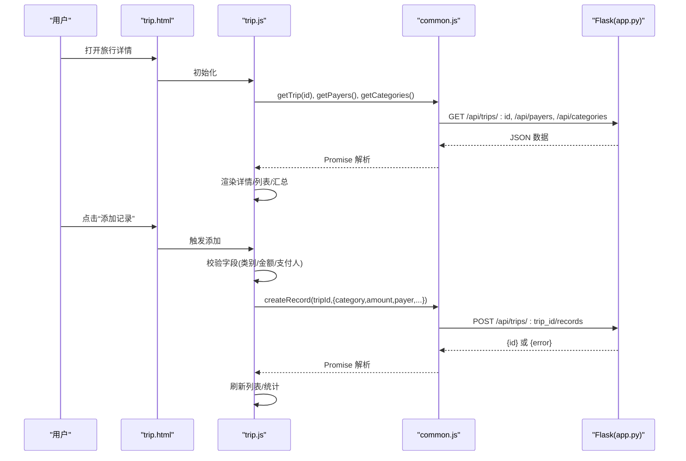
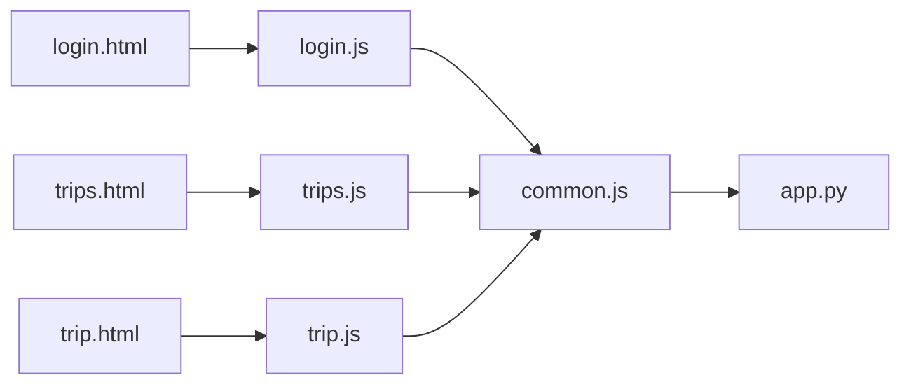
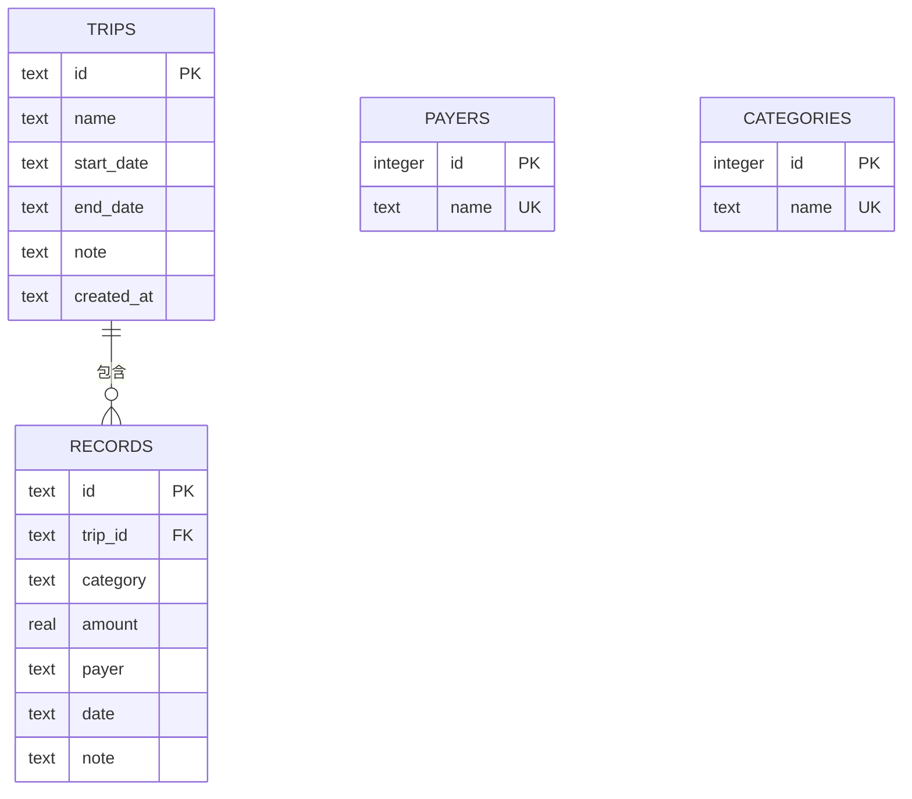

# 数据流设计

<cite>
**本文引用的文件**
- [app.py](file://app.py)
- [common.js](file://assets/js/common.js)
- [login.js](file://assets/js/login.js)
- [trips.js](file://assets/js/trips.js)
- [trip.js](file://assets/js/trip.js)
- [login.html](file://login.html)
- [trips.html](file://trips.html)
- [trip.html](file://trip.html)
- [style.css](file://assets/css/style.css)
</cite>

## 目录
1. [简介](#简介)
2. [项目结构](#项目结构)
3. [核心组件](#核心组件)
4. [架构总览](#架构总览)
5. [详细组件分析](#详细组件分析)
6. [依赖分析](#依赖分析)
7. [性能考量](#性能考量)
8. [故障排查指南](#故障排查指南)
9. [结论](#结论)
10. [附录](#附录)

## 简介
本文件面向 recorded 项目的“数据流设计”，系统性梳理从用户界面到后端服务的完整数据流转过程，覆盖以下方面：
- 用户操作如何触发前端 JavaScript 事件
- API 封装层的请求处理与鉴权
- Flask 路由的业务逻辑处理
- 数据库的 CRUD 操作
- HTTP 请求/响应格式、JSON 数据结构与错误处理机制
- 同步与异步处理方式（前端状态管理与后端事务）
- 安全考虑（认证令牌传递与敏感数据保护）

## 项目结构
该项目采用前后端分离的静态站点 + Flask 后端的服务模式：
- 前端：HTML 页面 + JavaScript 模块 + CSS 样式
- 后端：Flask 应用，提供 RESTful API，并内置 SQLite 数据库

图表来源
- [login.html](file://login.html)
- [trips.html](file://trips.html)
- [trip.html](file://trip.html)
- [common.js](file://assets/js/common.js)
- [login.js](file://assets/js/login.js)
- [trips.js](file://assets/js/trips.js)
- [trip.js](file://assets/js/trip.js)
- [style.css](file://assets/css/style.css)
- [app.py](file://app.py)

章节来源
- [login.html](file://login.html)
- [trips.html](file://trips.html)
- [trip.html](file://trip.html)
- [common.js](file://assets/js/common.js)
- [login.js](file://assets/js/login.js)
- [trips.js](file://assets/js/trips.js)
- [trip.js](file://assets/js/trip.js)
- [style.css](file://assets/css/style.css)
- [app.py](file://app.py)

## 核心组件
- 前端公共 API 封装层：统一处理 Authorization 头、响应解析、错误处理与重定向
- 登录页脚本：负责用户凭据提交与令牌存储
- 列表页脚本：旅行列表展示、统计、新建旅行
- 详情页脚本：旅行详情、记录增删改、费用汇总
- Flask 后端：RESTful API、SQLite 数据库、简单内存令牌校验

章节来源
- [common.js](file://assets/js/common.js)
- [login.js](file://assets/js/login.js)
- [trips.js](file://assets/js/trips.js)
- [trip.js](file://assets/js/trip.js)
- [app.py](file://app.py)

## 架构总览
整体数据流分为四层：UI 层（HTML + JS）、API 封装层（common.js）、Flask 路由层（app.py）、数据持久层（SQLite）。用户操作通过事件驱动前端脚本，脚本通过 fetch 发送 HTTP 请求，后端路由执行业务逻辑并访问数据库，返回 JSON 响应。

图表来源
- [common.js](file://assets/js/common.js)
- [app.py](file://app.py)

## 详细组件分析

### 前端公共 API 封装层（common.js）
- 职责
  - 统一设置 Content-Type 与 Authorization 头（Bearer 令牌）
  - 统一处理 401 未授权（清除本地令牌并跳转登录）
  - 统一解析响应 JSON，错误时抛出错误对象
  - 提供登录、旅行、记录、支付人、类别的 API 方法
- 关键点
  - 令牌读取/写入/清理均基于 localStorage
  - 所有 API 方法返回 Promise，便于链式调用与错误捕获
  - 错误处理包含网络错误与业务错误两类

章节来源
- [common.js](file://assets/js/common.js)

### 登录流程（login.html + login.js + common.js）
- 流程
  - 用户输入账号密码，点击登录按钮
  - 脚本调用 api.login，发送 JSON 请求
  - 成功后将 token 写入 localStorage 并跳转旅行列表页
  - 失败时显示错误提示并恢复按钮状态
- 安全要点
  - 使用 Bearer 令牌头传递 token
  - 401 时自动清除本地令牌并跳转登录

图表来源
- [login.html](file://login.html)
- [login.js](file://assets/js/login.js)
- [common.js](file://assets/js/common.js)
- [app.py](file://app.py)

章节来源
- [login.html](file://login.html)
- [login.js](file://assets/js/login.js)
- [common.js](file://assets/js/common.js)
- [app.py](file://app.py)

### 旅行列表页（trips.html + trips.js + common.js）
- 功能
  - 获取旅行列表与汇总统计
  - 新建旅行：校验名称，提交 JSON，成功后跳转详情页
  - 退出登录：清除令牌并跳转登录页
- 数据流
  - 列表页通过 Promise.all 并行获取旅行、支付人、类别数据
  - 新建旅行通过 api.createTrip 提交 JSON，解析响应后跳转详情

图表来源
- [trips.html](file://trips.html)
- [trips.js](file://assets/js/trips.js)
- [common.js](file://assets/js/common.js)
- [app.py](file://app.py)

章节来源
- [trips.html](file://trips.html)
- [trips.js](file://assets/js/trips.js)
- [common.js](file://assets/js/common.js)
- [app.py](file://app.py)

### 旅行详情页（trip.html + trip.js + common.js）
- 功能
  - 加载旅行详情、记录列表、按支付人/类别汇总
  - 添加记录：支持自定义类别与新增支付人
  - 编辑旅行信息与记录
  - 删除旅行与记录
- 数据流
  - 详情页通过 Promise.all 并行获取旅行详情、支付人、类别
  - 添加/编辑记录时，先校验前端字段，再调用 api.createRecord/api.updateRecord
  - 删除记录/旅行时，调用对应 API 并刷新视图

图表来源
- [trip.html](file://trip.html)
- [trip.js](file://assets/js/trip.js)
- [common.js](file://assets/js/common.js)
- [app.py](file://app.py)

章节来源
- [trip.html](file://trip.html)
- [trip.js](file://assets/js/trip.js)
- [common.js](file://assets/js/common.js)
- [app.py](file://app.py)

### Flask 后端（app.py）
- 数据库与初始化
  - WAL 模式、外键约束开启
  - 初始化 trips、records、payers、categories 表，插入默认类别
- 鉴权中间件
  - require_auth 从 Authorization 头提取 Bearer token，校验是否在内存集合中
- API 路由
  - 登录：校验固定账号密码，生成 token 并返回
  - 旅行：CRU(D) 操作，附带记录数量、总金额、参与人等汇总
  - 记录：CRU(D) 操作，金额校验为正数，自动去重插入支付人与类别
  - 支付人/类别：查询与新增（忽略重复）
- 错误处理
  - 400：参数非法
  - 401：未登录或登录过期
  - 404：资源不存在
  - 201：创建成功
  - 200：成功

章节来源
- [app.py](file://app.py)

## 依赖分析
- 前端模块耦合
  - common.js 作为唯一 API 封装，被 login.js、trips.js、trip.js 依赖
  - 各页面脚本仅负责 UI 事件绑定与视图渲染，不直接操作 DOM
- 后端模块耦合
  - 路由函数依赖数据库连接与工具函数（ID 生成、Row 转字典）
  - 鉴权装饰器统一拦截未授权请求
- 前后端接口契约
  - 所有请求/响应均为 JSON
  - 鉴权通过 Authorization: Bearer <token> 头传递
  - 错误响应包含 error 字段

图表来源
- [common.js](file://assets/js/common.js)
- [login.js](file://assets/js/login.js)
- [trips.js](file://assets/js/trips.js)
- [trip.js](file://assets/js/trip.js)
- [login.html](file://login.html)
- [trips.html](file://trips.html)
- [trip.html](file://trip.html)
- [app.py](file://app.py)

章节来源
- [common.js](file://assets/js/common.js)
- [login.js](file://assets/js/login.js)
- [trips.js](file://assets/js/trips.js)
- [trip.js](file://assets/js/trip.js)
- [login.html](file://login.html)
- [trips.html](file://trips.html)
- [trip.html](file://trip.html)
- [app.py](file://app.py)

## 性能考量
- 前端
  - 列表页使用 Promise.all 并行加载旅行、支付人、类别，减少等待时间
  - 详情页同样并行加载旅行详情与辅助数据，提升首屏体验
- 后端
  - 使用 WAL 模式提升并发写入性能
  - 外键级联删除保证数据一致性
  - 对记录查询进行分组聚合，避免应用层二次计算
- 网络
  - 统一 Content-Type 与 Authorization 头，减少不必要的头部差异
  - 错误快速返回，避免无效请求继续传输

## 故障排查指南
- 登录失败
  - 检查用户名/密码是否匹配固定值
  - 确认前端是否正确发送 JSON 与 Authorization 头
  - 查看后端返回的错误信息
- 未登录或会话过期
  - 前端收到 401 会自动清除本地令牌并跳转登录
  - 检查浏览器 localStorage 中是否存在 travel_token
- 参数错误
  - 旅行名称为空、记录金额非正数、类别/支付人缺失等会返回 400
  - 前端会在调用 API 前做基础校验，后端也会再次校验
- 资源不存在
  - 访问不存在的旅行或记录会返回 404
- 数据库异常
  - 确认数据库初始化是否完成
  - 检查 WAL 模式与外键约束是否生效

章节来源
- [common.js](file://assets/js/common.js)
- [app.py](file://app.py)

## 结论
recorded 的数据流设计以“前端统一 API 封装 + Flask RESTful 路由 + SQLite”为核心，实现了清晰的职责分离与一致的错误处理机制。前端通过 Promise 实现异步数据加载与状态更新，后端通过装饰器实现统一鉴权与事务语义（WAL + 外键）。整体流程简洁可靠，适合小型团队或个人使用的轻量级记账场景。

## 附录

### HTTP 接口一览（请求/响应格式）
- 登录
  - POST /api/login
  - 请求体：{ username, password }
  - 成功：{ token }
  - 失败：{ error }，状态码 401
- 旅行
  - GET /api/trips
  - 成功：旅行数组（每项包含 record_count、total_amount、payers）
  - 失败：{ error }，状态码 401/404
  - POST /api/trips
  - 请求体：{ name, startDate, endDate, note }
  - 成功：{ id, name }，状态码 201
  - 失败：{ error }，状态码 400/401
  - GET /api/trips/:id
  - 成功：旅行详情（包含 records、total_amount、by_payer、by_category）
  - 失败：{ error }，状态码 401/404
  - PUT /api/trips/:id
  - 请求体：{ name, startDate, endDate, note }
  - 成功：{ ok }
  - DELETE /api/trips/:id
  - 成功：{ ok }
- 记录
  - POST /api/trips/:trip_id/records
  - 请求体：{ category, amount, payer, date, note }
  - 成功：{ id }，状态码 201
  - 失败：{ error }，状态码 400/401/404
  - PUT /api/records/:rec_id
  - 请求体：{ category, amount, payer, date, note }
  - 成功：{ ok }
  - DELETE /api/records/:rec_id
  - 成功：{ ok }
- 支付人
  - GET /api/payers
  - 成功：支付人数组
  - POST /api/payers
  - 请求体：{ name }
  - 成功：{ ok }，状态码 201
- 类别
  - GET /api/categories
  - 成功：类别数组
  - POST /api/categories
  - 请求体：{ name }
  - 成功：{ ok }，状态码 201

章节来源
- [app.py](file://app.py)

### 数据模型（SQLite）

图表来源
- [app.py](file://app.py)