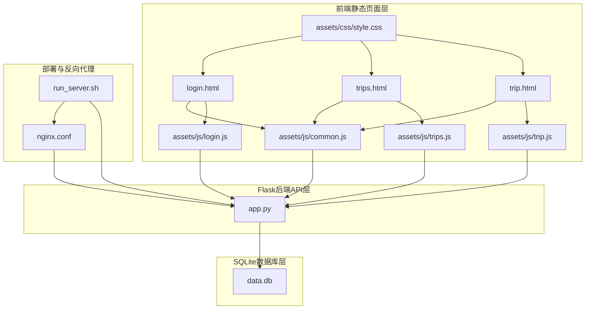
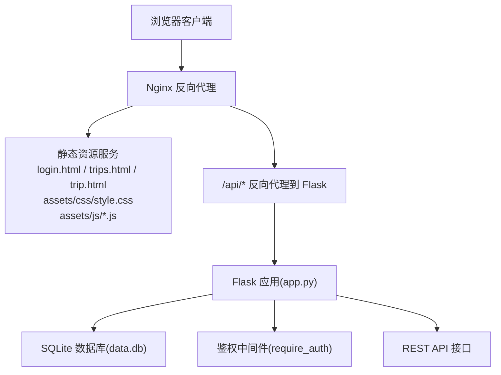
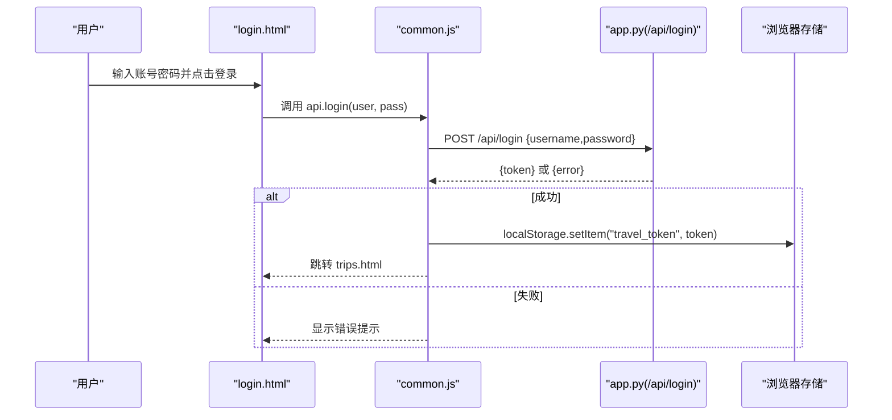
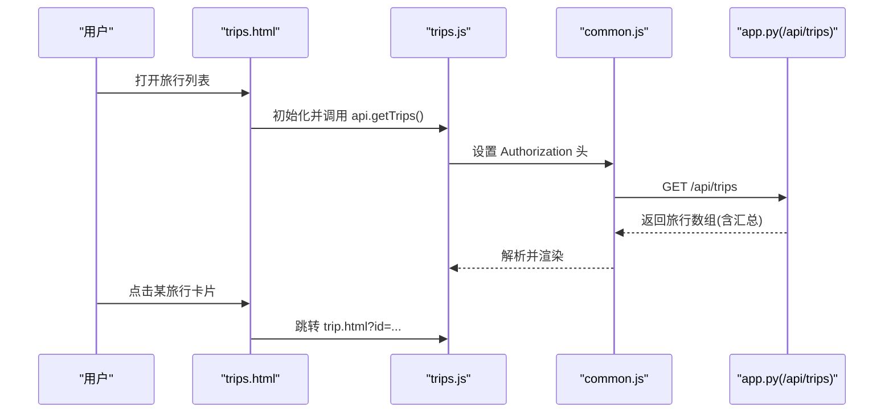
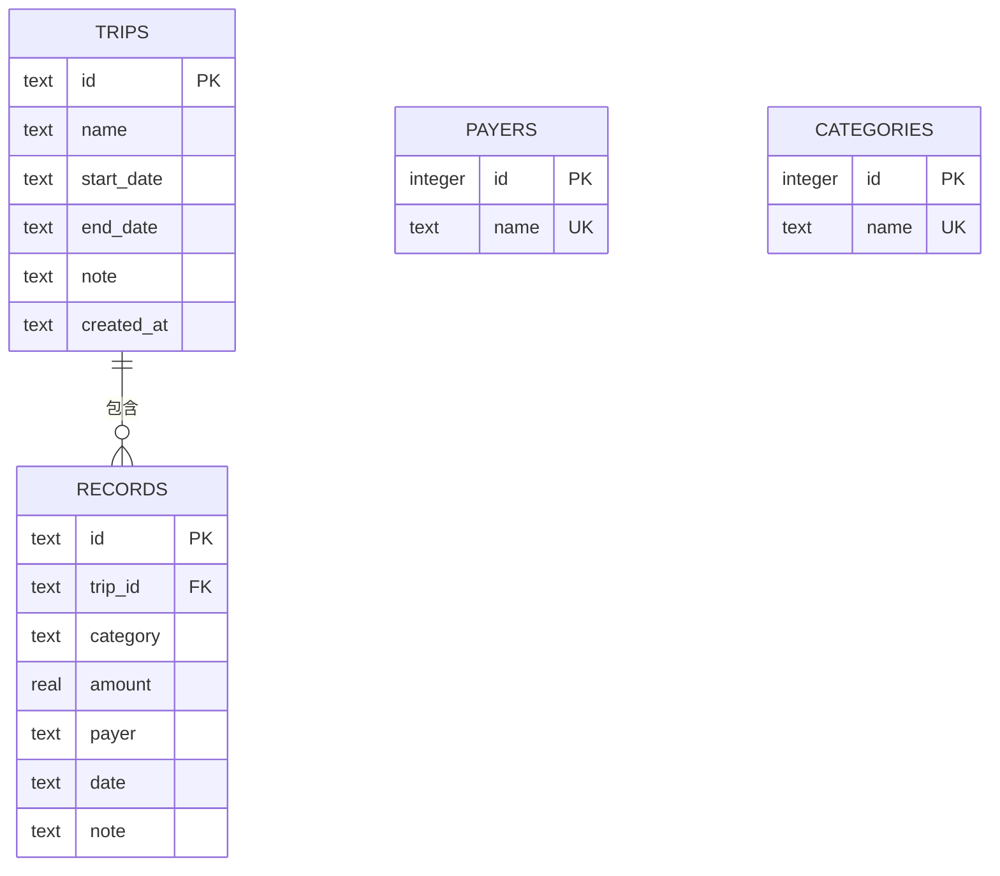
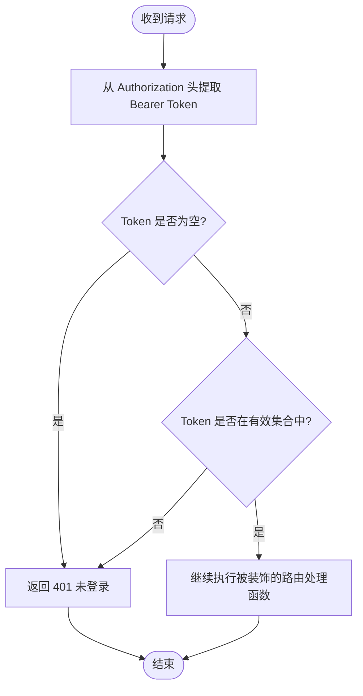
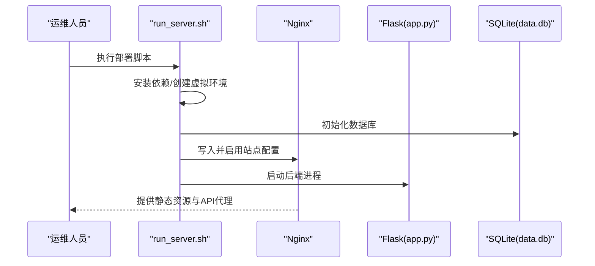
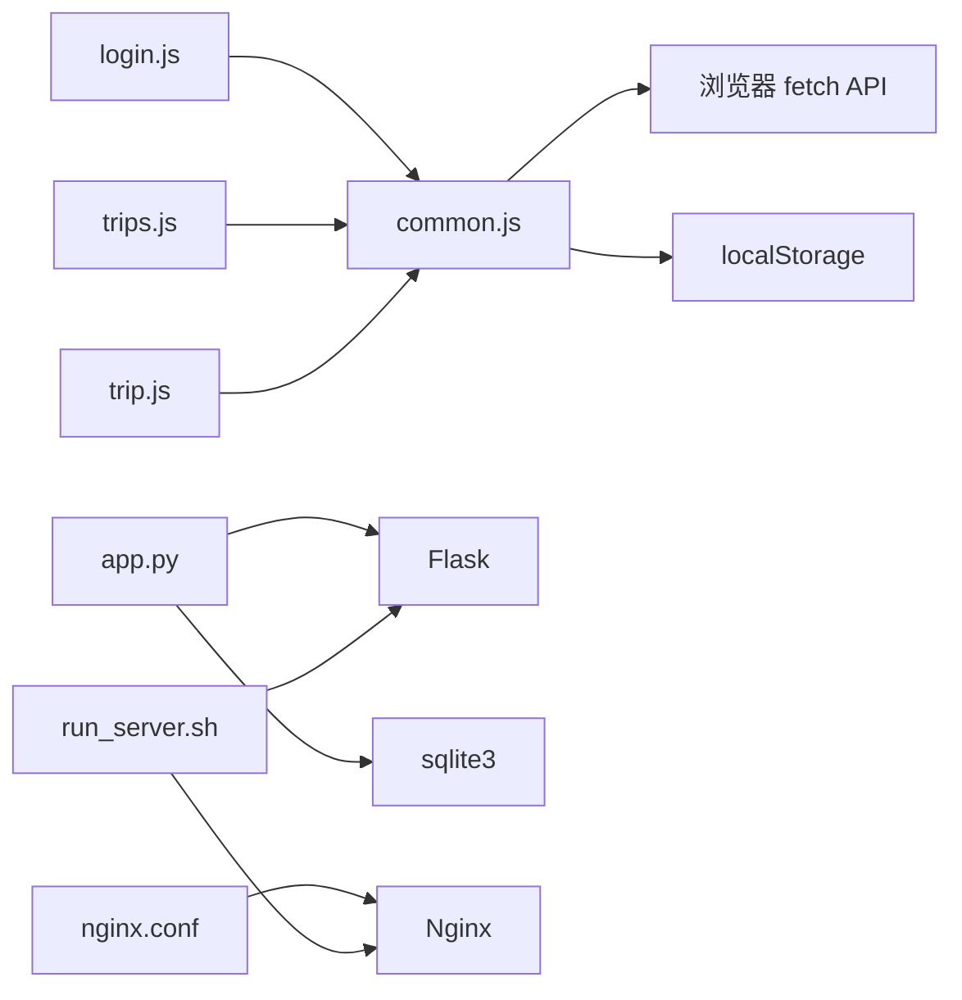

# 整体设计

<cite>
**本文引用的文件**
- [app.py](file://app.py)
- [nginx.conf](file://nginx.conf)
- [run_server.sh](file://run_server.sh)
- [login.html](file://login.html)
- [trips.html](file://trips.html)
- [trip.html](file://trip.html)
- [common.js](file://assets/js/common.js)
- [login.js](file://assets/js/login.js)
- [trips.js](file://assets/js/trips.js)
- [trip.js](file://assets/js/trip.js)
- [style.css](file://assets/css/style.css)
- [recorded.md](file://recorded.md)
- [requirements.txt](file://requirements.txt)
</cite>

## 目录
1. [引言](#引言)
2. [项目结构](#项目结构)
3. [核心组件](#核心组件)
4. [架构总览](#架构总览)
5. [详细组件分析](#详细组件分析)
6. [依赖分析](#依赖分析)
7. [性能考虑](#性能考虑)
8. [故障排查指南](#故障排查指南)
9. [结论](#结论)
10. [附录](#附录)

## 引言
本项目“recorded”是一个基于前后端分离思想的轻量级旅游记账系统。系统采用三层架构：前端静态页面层、Flask后端API层、SQLite数据库层。前端负责用户交互与视图渲染，后端提供REST风格的JSON API，并通过Nginx进行反向代理与静态资源服务。系统支持基本的登录鉴权、旅行与记账记录管理、统计汇总等功能，适合在单机环境下快速部署与使用。

## 项目结构
项目采用扁平的目录组织方式，核心文件如下：
- 后端入口与API：app.py
- 静态资源：assets/css/style.css、assets/js/*.js
- 前端页面：login.html、trips.html、trip.html
- 反向代理配置：nginx.conf
- 部署脚本：run_server.sh
- 依赖声明：requirements.txt
- 项目说明：recorded.md

图表来源
- [app.py:1-331](file://app.py#L1-L331)
- [nginx.conf:1-38](file://nginx.conf#L1-L38)
- [run_server.sh:1-81](file://run_server.sh#L1-L81)
- [login.html:1-32](file://login.html#L1-L32)
- [trips.html:1-60](file://trips.html#L1-L60)
- [trip.html:1-155](file://trip.html#L1-L155)
- [common.js:1-206](file://assets/js/common.js#L1-L206)
- [login.js:1-44](file://assets/js/login.js#L1-L44)
- [trips.js:1-130](file://assets/js/trips.js#L1-L130)
- [trip.js:1-401](file://assets/js/trip.js#L1-L401)
- [style.css:1-273](file://assets/css/style.css#L1-L273)

章节来源
- [recorded.md:1-9](file://recorded.md#L1-L9)
- [requirements.txt:1-2](file://requirements.txt#L1-L2)

## 核心组件
- 前端静态页面层
  - 登录页(login.html)：负责用户身份验证，调用后端登录接口获取令牌并跳转至旅行列表页。
  - 旅行列表页(trips.html)：展示旅行概览、统计信息；支持新建旅行、退出登录。
  - 旅行详情页(trip.html)：展示旅行明细、记录列表、按支付人/类别的费用统计；支持新增、编辑、删除记账记录。
  - 公共样式与脚本：style.css统一UI风格；common.js封装API调用、鉴权头设置、通用工具函数；各页面脚本(login.js、trips.js、trip.js)负责业务逻辑与交互。
- Flask后端API层
  - 静态资源托管：当未启用Nginx时，Flask直接提供静态文件服务与首页重定向。
  - 认证中间件：require_auth装饰器校验Authorization头中的Bearer Token。
  - 数据库初始化与连接：init_db创建trip、record、payers、categories表；get_db提供连接池式管理。
  - API接口：登录(/api/login)、旅行管理(/api/trips)、记账记录(/api/trips/:id/records、/api/records/:id)、支付人与类别查询及新增等。
- SQLite数据库层
  - trips：旅行基本信息。
  - records：每条记账记录，外键关联trip。
  - payers：支付人字典，自动去重。
  - categories：类别字典，默认包含固定类别，支持动态新增。

章节来源
- [app.py:27-79](file://app.py#L27-L79)
- [app.py:82-89](file://app.py#L82-L89)
- [app.py:106-315](file://app.py#L106-L315)
- [login.html:1-32](file://login.html#L1-L32)
- [trips.html:1-60](file://trips.html#L1-L60)
- [trip.html:1-155](file://trip.html#L1-L155)
- [common.js:15-132](file://assets/js/common.js#L15-L132)
- [login.js:1-44](file://assets/js/login.js#L1-L44)
- [trips.js:1-130](file://assets/js/trips.js#L1-L130)
- [trip.js:1-401](file://assets/js/trip.js#L1-L401)
- [style.css:1-273](file://assets/css/style.css#L1-L273)

## 架构总览
系统采用前后端分离架构，前端通过AJAX调用后端API，后端以JSON响应数据。生产环境通过Nginx进行反向代理，静态资源由Nginx直接提供，API请求转发至Flask后端。数据库采用SQLite，部署脚本会初始化数据库并创建默认类别。

图表来源
- [nginx.conf:9-21](file://nginx.conf#L9-L21)
- [app.py:318-325](file://app.py#L318-L325)
- [app.py:82-89](file://app.py#L82-L89)
- [app.py:106-315](file://app.py#L106-L315)

## 详细组件分析

### 前端组件分析
- 登录流程
  - 用户在登录页输入账号密码，前端调用后端登录接口，成功后将Token存入本地存储并跳转至旅行列表页。
  - 若未登录或Token无效，公共脚本会在API响应401时自动清空Token并跳转登录页。

图表来源
- [login.html:1-32](file://login.html#L1-L32)
- [common.js:59-71](file://assets/js/common.js#L59-L71)
- [app.py:106-115](file://app.py#L106-L115)

- 旅行列表与详情
  - 列表页：加载旅行列表、统计总次数与总花费；支持新建旅行并跳转详情页。
  - 详情页：加载旅行详情、记录列表、按支付人/类别的汇总；支持新增、编辑、删除记录。

图表来源
- [trips.html:1-60](file://trips.html#L1-L60)
- [trips.js:17-24](file://assets/js/trips.js#L17-L24)
- [common.js:74-94](file://assets/js/common.js#L74-L94)
- [app.py:119-139](file://app.py#L119-L139)

章节来源
- [login.html:1-32](file://login.html#L1-L32)
- [trips.html:1-60](file://trips.html#L1-L60)
- [trip.html:1-155](file://trip.html#L1-L155)
- [common.js:15-132](file://assets/js/common.js#L15-L132)
- [login.js:1-44](file://assets/js/login.js#L1-L44)
- [trips.js:1-130](file://assets/js/trips.js#L1-L130)
- [trip.js:1-401](file://assets/js/trip.js#L1-L401)

### 后端组件分析
- 数据库设计与初始化
  - trips：主表，记录旅行基本信息。
  - records：明细表，外键关联trips，支持级联删除。
  - payers/categories：字典型表，用于自动去重与默认值维护。
  - 初始化脚本在首次启动时创建表并插入默认类别。

图表来源
- [app.py:46-78](file://app.py#L46-L78)

- 认证与鉴权
  - 登录接口返回随机Token，前端在后续请求中通过Authorization头携带Bearer Token。
  - require_auth装饰器从请求头提取Token并在集合中校验，401时返回错误。

图表来源
- [app.py:82-89](file://app.py#L82-L89)
- [common.js:16-36](file://assets/js/common.js#L16-L36)

- API接口设计
  - 登录：POST /api/login
  - 旅行：GET/POST/GET/PUT/DELETE /api/trips[/id]
  - 记账：POST/PUT/DELETE /api/trips/:id/records /api/records/:id
  - 字典型数据：GET/POST /api/payers /api/categories

章节来源
- [app.py:106-315](file://app.py#L106-L315)
- [app.py:27-79](file://app.py#L27-L79)
- [app.py:82-89](file://app.py#L82-L89)

### 部署与反向代理
- Nginx配置要点
  - 静态文件根目录指向项目目录，try_files命中后返回静态资源。
  - /api/前缀的请求转发至Flask后端(127.0.0.1:5000)，并传递真实IP与协议头。
  - 对.db、.py、.sh等敏感文件进行访问限制。
- 部署脚本run_server.sh
  - 安装系统依赖与Python虚拟环境，安装Flask依赖。
  - 初始化数据库，替换nginx.conf中的root路径并启用站点。
  - 启动Flask后端并守护进程，重启Nginx。

图表来源
- [nginx.conf:1-38](file://nginx.conf#L1-L38)
- [run_server.sh:20-66](file://run_server.sh#L20-L66)
- [app.py:328-331](file://app.py#L328-L331)

章节来源
- [nginx.conf:1-38](file://nginx.conf#L1-L38)
- [run_server.sh:1-81](file://run_server.sh#L1-L81)
- [app.py:328-331](file://app.py#L328-L331)

## 依赖分析
- 前端依赖
  - common.js依赖浏览器原生fetch与localStorage，不依赖第三方库，便于在移动端微信内核中运行。
  - 各页面脚本仅依赖公共API封装，职责清晰。
- 后端依赖
  - Flask提供WSGI应用框架与路由、请求响应处理。
  - sqlite3提供本地数据库访问与事务控制。
  - 部署脚本依赖系统包管理器与Nginx服务。

图表来源
- [common.js:1-206](file://assets/js/common.js#L1-L206)
- [login.js:1-44](file://assets/js/login.js#L1-L44)
- [trips.js:1-130](file://assets/js/trips.js#L1-L130)
- [trip.js:1-401](file://assets/js/trip.js#L1-L401)
- [app.py:1-331](file://app.py#L1-L331)
- [nginx.conf:1-38](file://nginx.conf#L1-L38)
- [run_server.sh:1-81](file://run_server.sh#L1-L81)

章节来源
- [requirements.txt:1-2](file://requirements.txt#L1-L2)

## 性能考虑
- 前端
  - 使用静态资源缓存与CDN友好命名策略（当前为简单静态文件，建议生产环境配合Nginx缓存与压缩）。
  - 通过Promise.all并发加载旅行详情所需数据，减少等待时间。
- 后端
  - SQLite WAL模式提升并发读取性能；外键约束保证数据一致性。
  - 每次请求建立数据库连接，结合短生命周期的单机部署场景较为合适；若扩展需引入连接池或数据库代理。
- 反向代理
  - Nginx承担静态文件服务与请求转发，降低Flask负载；建议开启gzip压缩与静态缓存头。

## 故障排查指南
- 登录失败或401未登录
  - 检查前端是否正确设置Authorization头；确认后端登录接口返回的Token是否写入localStorage。
  - 若出现401，公共脚本会自动清空Token并跳转登录页。
- API请求异常
  - 确认Nginx是否正确转发/api/请求至Flask；检查Flask日志文件位置与权限。
  - 检查数据库文件是否存在且可读写。
- 静态资源无法加载
  - 确认Nginx root路径与项目目录一致；确保try_files规则生效。
- 部署问题
  - 使用run_server.sh输出的访问地址与账号密码；查看flask.log定位错误。

章节来源
- [common.js:47-57](file://assets/js/common.js#L47-L57)
- [nginx.conf:9-21](file://nginx.conf#L9-L21)
- [run_server.sh:73-79](file://run_server.sh#L73-L79)

## 结论
recorded项目以简洁的前后端分离架构实现了旅游记账的核心功能，具备良好的可部署性与可维护性。通过Nginx反向代理与静态资源服务，系统在单机环境下即可稳定运行。数据库设计遵循规范化原则，API接口清晰易用。未来可在认证体系、API版本控制、数据库扩展与监控等方面进一步增强。

## 附录
- 安全设计
  - 简单Token机制：内存中维护有效Token集合，重启后失效，需重新登录。
  - Nginx限制敏感文件访问，减少源码与数据库暴露风险。
  - 建议后续增强：HTTPS、JWT签名、Token刷新、RBAC访问控制、SQL注入防护等。
- 可扩展性设计
  - 数据库：当前为单机SQLite，适合小规模使用；如需扩展可迁移到PostgreSQL/MySQL并引入连接池。
  - API：当前未做版本控制，建议引入URL版本号或Accept头版本协商。
  - 前端：可引入构建工具与模块化，提升可维护性与测试覆盖率。
- 运行与访问
  - 默认登录账号：lou / 123；部署完成后通过脚本输出的地址访问。