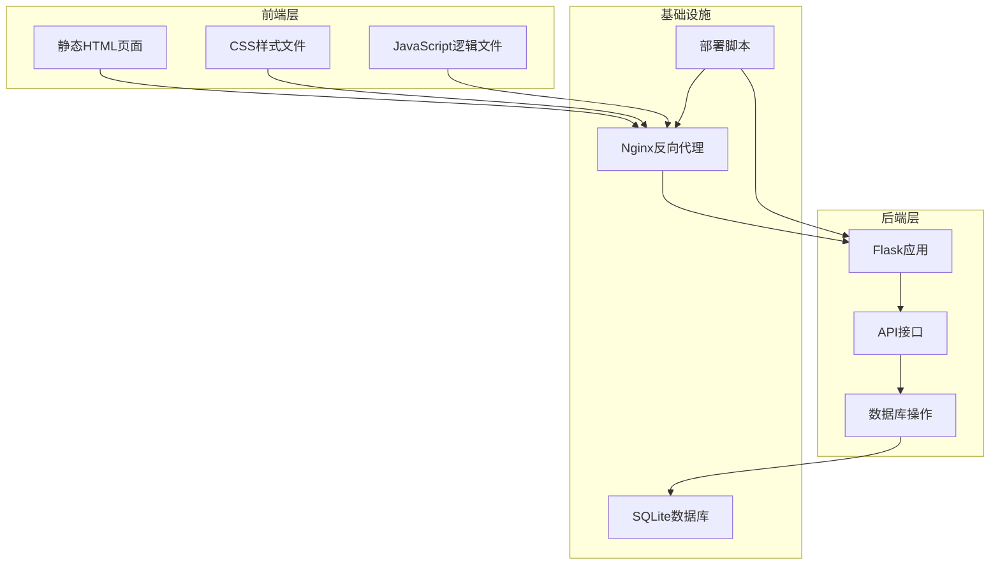
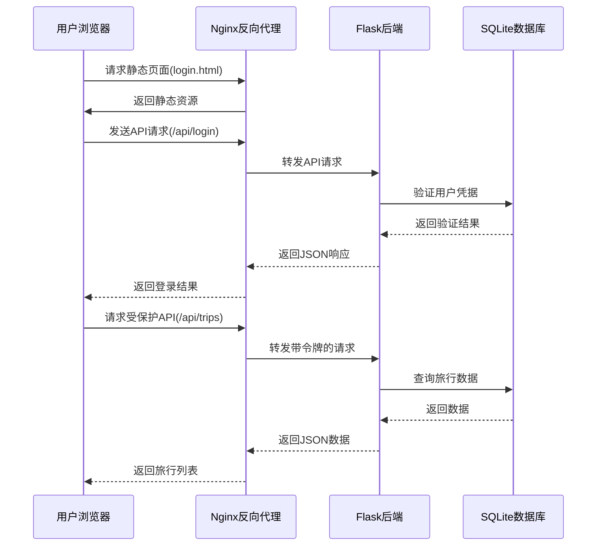
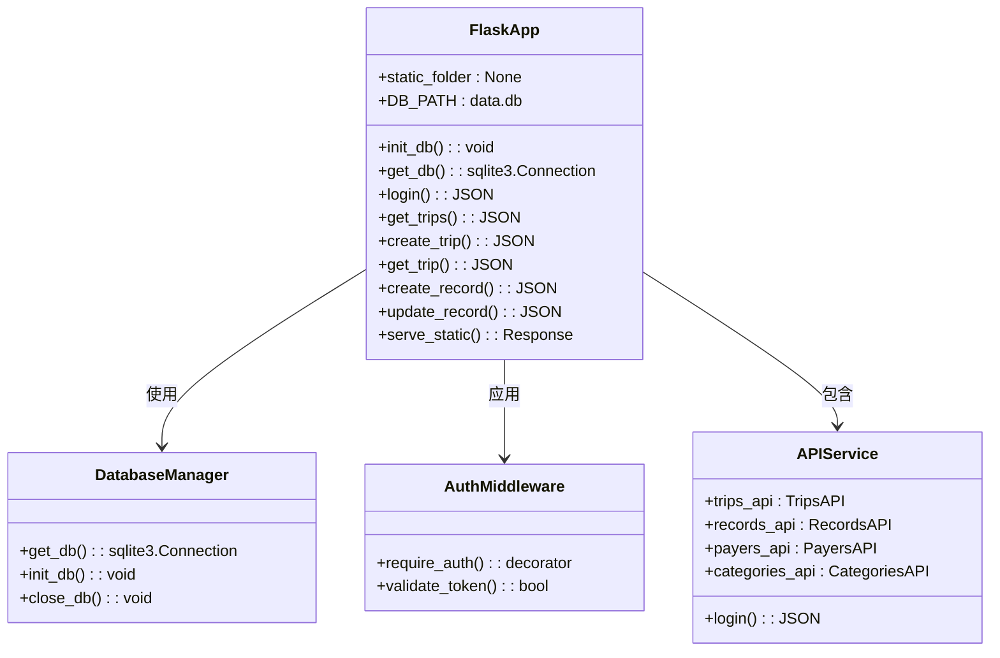
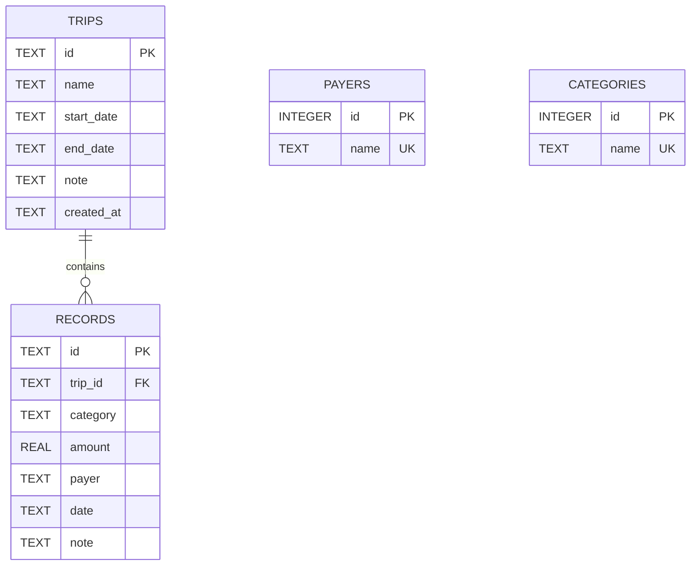
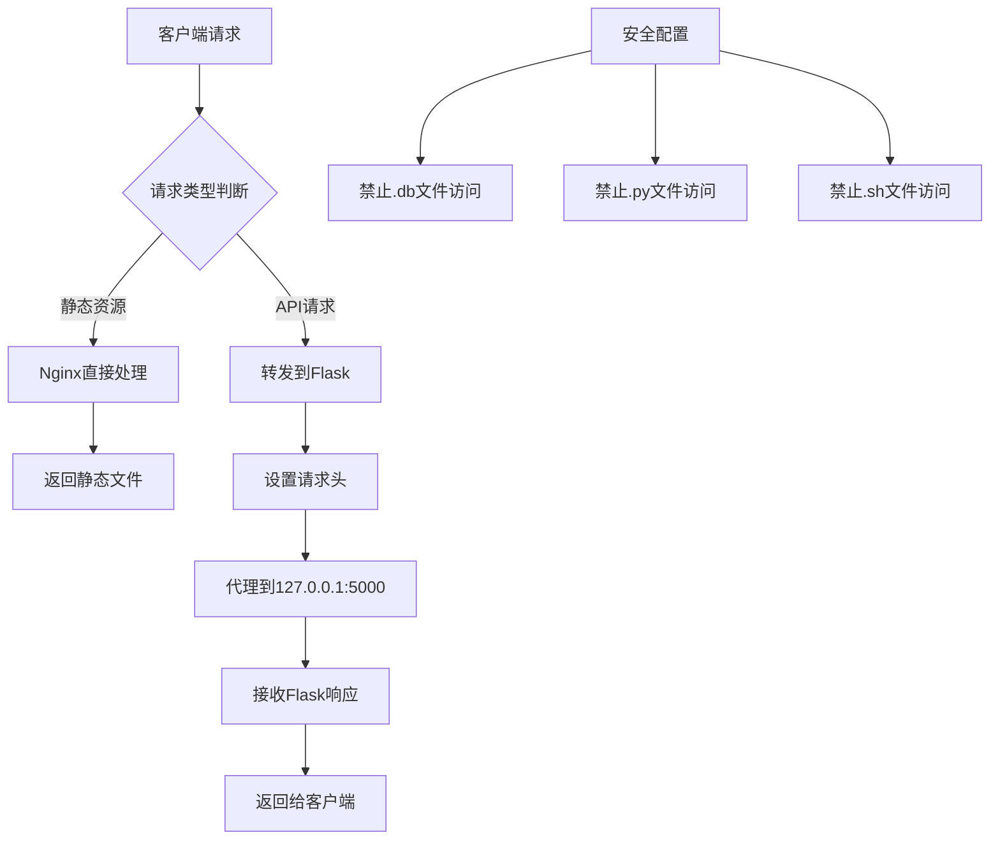
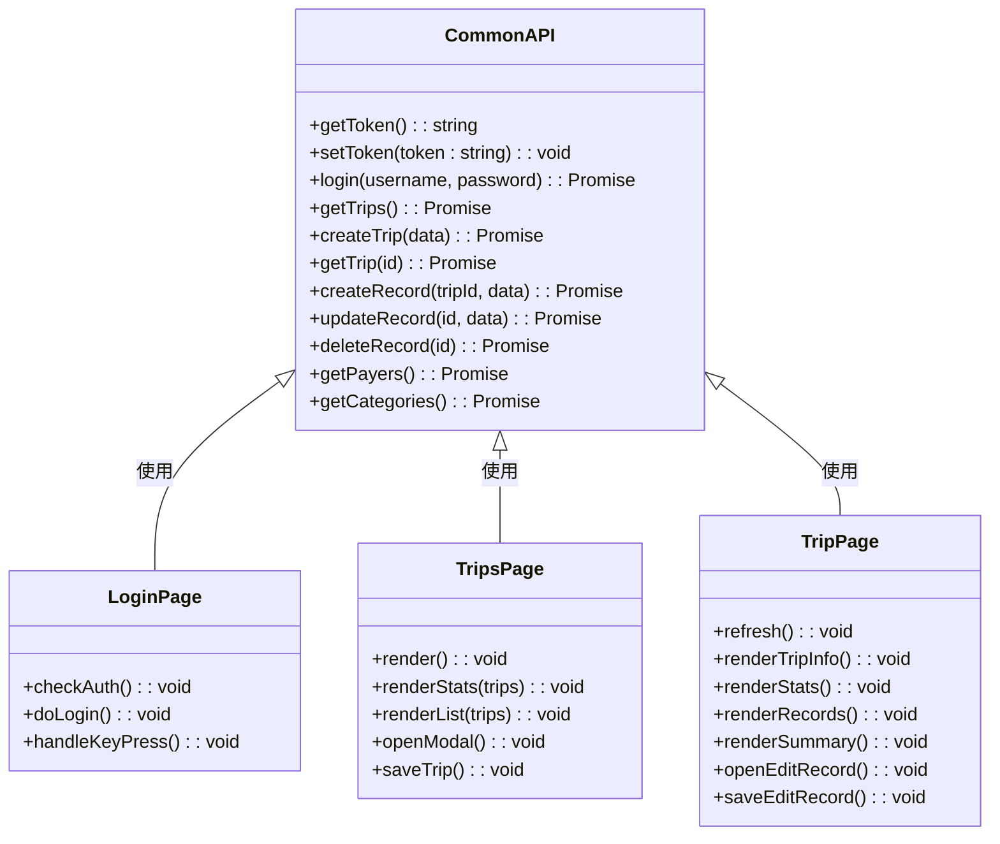
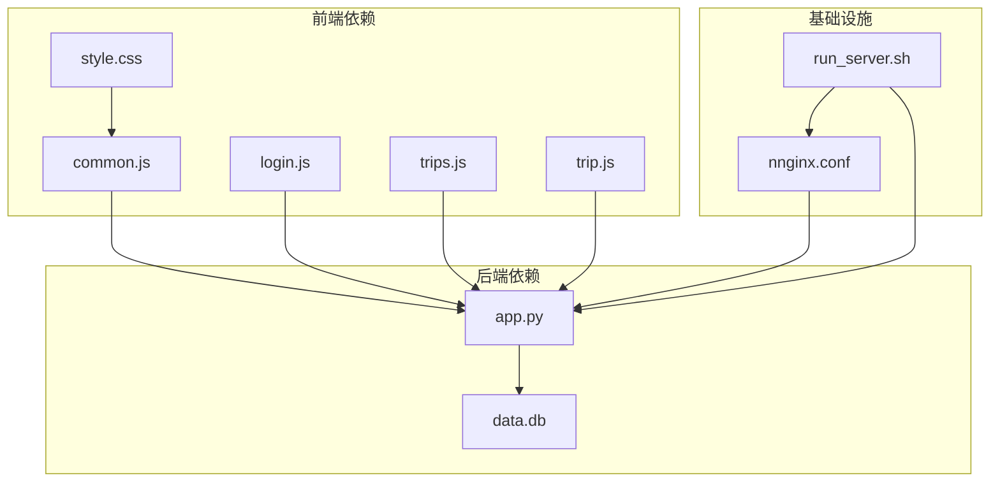
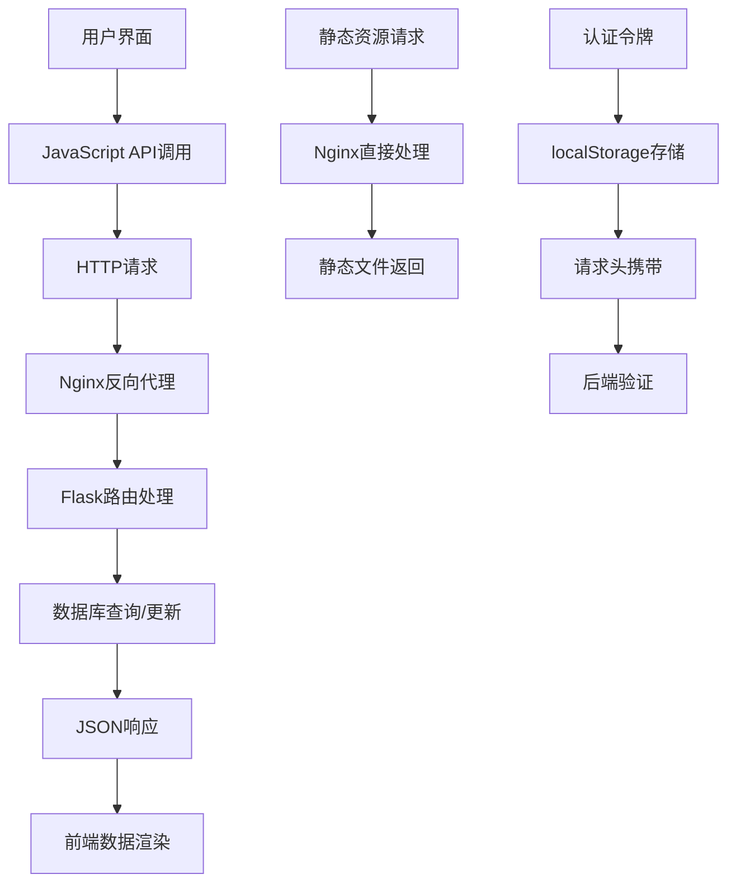

# 系统架构

<cite>
**本文引用的文件**
- [app.py](file://app.py)
- [nginx.conf](file://nginx.conf)
- [run_server.sh](file://run_server.sh)
- [login.html](file://login.html)
- [trip.html](file://trip.html)
- [trips.html](file://trips.html)
- [recorded.md](file://recorded.md)
- [assets/css/style.css](file://assets/css/style.css)
- [assets/js/common.js](file://assets/js/common.js)
- [assets/js/login.js](file://assets/js/login.js)
- [assets/js/trip.js](file://assets/js/trip.js)
- [assets/js/trips.js](file://assets/js/trips.js)
</cite>

## 目录
1. [简介](#简介)
2. [项目结构](#项目结构)
3. [核心组件](#核心组件)
4. [架构概览](#架构概览)
5. [详细组件分析](#详细组件分析)
6. [依赖关系分析](#依赖关系分析)
7. [性能考虑](#性能考虑)
8. [故障排除指南](#故障排除指南)
9. [结论](#结论)

## 简介

recorded是一个基于Flask的旅游记账系统，采用前后端分离架构设计。该系统实现了完整的旅行记账功能，包括用户登录认证、旅行管理、费用记录、统计分析等核心业务功能。系统支持微信移动端访问，具有良好的用户体验和响应式设计。

## 项目结构

该项目采用清晰的前后端分离架构，主要包含以下层次：

**图表来源**
- [app.py:1-331](file://app.py#L1-L331)
- [nginx.conf:1-38](file://nginx.conf#L1-L38)

**章节来源**
- [app.py:1-331](file://app.py#L1-L331)
- [nginx.conf:1-38](file://nginx.conf#L1-L38)
- [run_server.sh:1-81](file://run_server.sh#L1-L81)

## 核心组件

### 前端组件

系统包含三个主要的静态HTML页面：
- **登录页面** (`login.html`): 用户身份验证入口
- **旅行列表页面** (`trips.html`): 展示所有旅行记录的主界面
- **旅行详情页面** (`trip.html`): 显示具体旅行的详细信息和费用记录

每个页面都配有相应的CSS样式和JavaScript逻辑文件，实现完整的用户交互功能。

### 后端组件

Flask后端提供RESTful API接口，主要包含以下功能模块：
- **用户认证模块**: 处理用户登录和令牌管理
- **旅行管理模块**: CRUD操作旅行记录
- **费用记录模块**: 管理具体的费用明细
- **数据统计模块**: 提供聚合统计信息

### 基础设施组件

- **Nginx反向代理**: 处理静态资源和API请求转发
- **SQLite数据库**: 存储旅行和费用数据
- **部署脚本**: 自动化安装和配置流程

**章节来源**
- [login.html:1-32](file://login.html#L1-L32)
- [trips.html:1-60](file://trips.html#L1-L60)
- [trip.html:1-155](file://trip.html#L1-L155)
- [assets/js/common.js:1-206](file://assets/js/common.js#L1-L206)
- [app.py:105-314](file://app.py#L105-L314)

## 架构概览

系统采用典型的前后端分离架构，数据流向清晰明确：

**图表来源**
- [nginx.conf:14-21](file://nginx.conf#L14-L21)
- [app.py:106-115](file://app.py#L106-L115)
- [assets/js/common.js:39-132](file://assets/js/common.js#L39-L132)

### MVC设计模式应用

系统在不同层面体现了MVC设计模式：

**视图层 (View)**:
- HTML模板文件负责用户界面展示
- CSS样式文件控制视觉呈现
- JavaScript文件处理用户交互

**控制器层 (Controller)**:
- Flask路由函数处理HTTP请求
- API端点作为业务逻辑控制器
- JavaScript模块管理页面行为

**模型层 (Model)**:
- SQLite数据库存储业务数据
- Python类封装数据访问逻辑
- 数据验证和业务规则

**章节来源**
- [login.html:1-32](file://login.html#L1-L32)
- [trips.html:1-60](file://trips.html#L1-L60)
- [trip.html:1-155](file://trip.html#L1-L155)
- [app.py:27-39](file://app.py#L27-L39)

## 详细组件分析

### Flask后端架构

Flask应用采用模块化设计，每个功能模块都有清晰的职责分工：

**图表来源**
- [app.py:12-331](file://app.py#L12-L331)

#### 数据库设计

系统使用SQLite作为数据存储，采用规范化设计：

**图表来源**
- [app.py:46-78](file://app.py#L46-L78)

#### API接口设计

系统提供RESTful API接口，遵循统一的命名规范：

**认证相关接口**:
- `POST /api/login` - 用户登录
- `GET /api/trips` - 获取旅行列表
- `POST /api/trips` - 创建新旅行

**旅行管理接口**:
- `GET /api/trips/:id` - 获取特定旅行详情
- `PUT /api/trips/:id` - 更新旅行信息
- `DELETE /api/trips/:id` - 删除旅行

**费用记录接口**:
- `POST /api/trips/:trip_id/records` - 添加费用记录
- `PUT /api/records/:id` - 更新费用记录
- `DELETE /api/records/:id` - 删除费用记录

**数据管理接口**:
- `GET /api/payers` - 获取支付人列表
- `POST /api/payers` - 添加支付人
- `GET /api/categories` - 获取类别列表
- `POST /api/categories` - 添加类别

**章节来源**
- [app.py:106-314](file://app.py#L106-L314)

### Nginx反向代理配置

Nginx作为反向代理服务器，承担以下职责：

**图表来源**
- [nginx.conf:14-36](file://nginx.conf#L14-L36)

#### 配置要点

- **静态资源处理**: 使用`try_files`指令直接返回静态文件
- **API转发**: 通过`proxy_pass`将`/api/`前缀的请求转发到Flask
- **请求头设置**: 保持原始Host、IP和协议信息
- **安全防护**: 禁止访问敏感文件类型

**章节来源**
- [nginx.conf:1-38](file://nginx.conf#L1-L38)

### 前端架构

前端采用模块化JavaScript设计，每个页面都有独立的功能模块：

**图表来源**
- [assets/js/common.js:39-132](file://assets/js/common.js#L39-L132)
- [assets/js/login.js:1-44](file://assets/js/login.js#L1-L44)
- [assets/js/trips.js:1-130](file://assets/js/trips.js#L1-L130)
- [assets/js/trip.js:1-401](file://assets/js/trip.js#L1-L401)

#### 响应式设计

系统针对移动设备进行了优化，特别是微信浏览器的适配：

- 使用`viewport`元标签确保正确的缩放比例
- 采用`maximum-scale=1.0`防止用户手动缩放
- 媒体查询适配不同屏幕尺寸
- 触摸友好的按钮和表单元素设计

**章节来源**
- [login.html:4-7](file://login.html#L4-L7)
- [trips.html:4-7](file://trips.html#L4-L7)
- [trip.html:4-7](file://trip.html#L4-L7)
- [assets/css/style.css:268-273](file://assets/css/style.css#L268-L273)

## 依赖关系分析

系统各组件之间的依赖关系如下：

**图表来源**
- [assets/js/common.js:39-132](file://assets/js/common.js#L39-L132)
- [app.py:106-314](file://app.py#L106-L314)
- [nginx.conf:14-21](file://nginx.conf#L14-L21)

### 数据流架构

系统的数据流从用户界面到后端服务的完整过程：

**图表来源**
- [assets/js/common.js:39-132](file://assets/js/common.js#L39-L132)
- [nginx.conf:14-21](file://nginx.conf#L14-L21)
- [app.py:82-89](file://app.py#L82-L89)

**章节来源**
- [assets/js/common.js:15-36](file://assets/js/common.js#L15-L36)
- [app.py:27-39](file://app.py#L27-L39)

## 性能考虑

### 前端性能优化

- **静态资源缓存**: Nginx配置了静态文件的缓存策略
- **按需加载**: JavaScript模块按页面需求动态加载
- **响应式设计**: 减少不必要的DOM操作，优化移动端性能
- **本地存储**: 使用localStorage减少重复请求

### 后端性能优化

- **连接池管理**: Flask应用使用`g`对象管理数据库连接
- **WAL模式**: SQLite启用WAL模式提高并发性能
- **外键约束**: 启用外键检查确保数据一致性
- **令牌缓存**: 内存中存储有效的认证令牌

### 数据库性能

- **索引优化**: 为常用查询字段建立适当的索引
- **事务处理**: 使用事务确保数据操作的原子性
- **连接复用**: 复用数据库连接减少开销
- **数据归档**: 定期清理历史数据释放空间

## 故障排除指南

### 常见问题及解决方案

**登录失败**:
- 检查用户名密码是否正确
- 确认令牌是否正确存储在localStorage中
- 查看Flask日志文件获取详细错误信息

**API请求失败**:
- 验证Nginx配置是否正确
- 检查Flask服务是否正常运行
- 确认防火墙设置允许5000端口访问

**静态资源加载失败**:
- 检查Nginx root路径配置
- 验证文件权限设置
- 确认文件路径是否正确

**数据库连接问题**:
- 检查data.db文件是否存在
- 验证数据库文件权限
- 确认SQLite版本兼容性

**章节来源**
- [run_server.sh:52-66](file://run_server.sh#L52-L66)
- [app.py:328-331](file://app.py#L328-L331)

## 结论

recorded系统展现了良好的前后端分离架构设计，具有以下特点：

**架构优势**:
- 清晰的职责分离，便于维护和扩展
- RESTful API设计，易于集成第三方应用
- 响应式前端设计，支持多终端访问
- Nginx反向代理提供安全和性能保障

**技术特色**:
- 使用Flask构建轻量级Web服务
- SQLite数据库满足小型应用需求
- 前端采用原生JavaScript，无框架依赖
- 自动化部署脚本简化运维流程

**扩展建议**:
- 可考虑引入Redis缓存提升性能
- 支持更多数据库后端如PostgreSQL
- 添加单元测试和集成测试
- 实现用户权限管理和多用户支持

该系统为旅游记账场景提供了完整的技术解决方案，既满足了功能需求，又保持了架构的简洁性和可维护性。