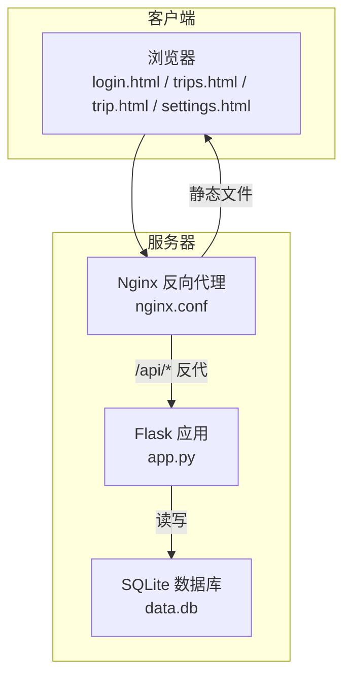
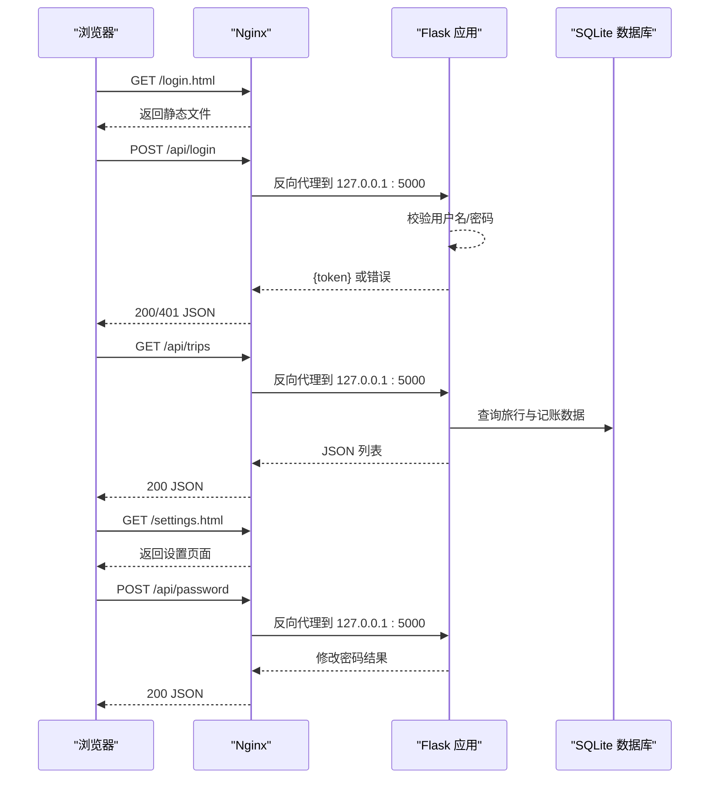
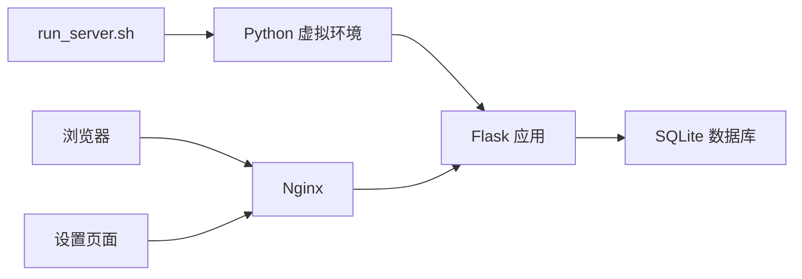

# 部署指南

<cite>
**本文引用的文件**
- [app.py](file://app.py)
- [nginx.conf](file://nginx.conf)
- [run_server.sh](file://run_server.sh)
- [project.md](file://project.md)
- [INSTALL.md](file://INSTALL.md)
- [login.html](file://login.html)
- [trip.html](file://trip.html)
- [trips.html](file://trips.html)
- [settings.html](file://settings.html)
- [style.css](file://assets/css/style.css)
- [common.js](file://assets/js/common.js)
- [login.js](file://assets/js/login.js)
- [settings.js](file://assets/js/settings.js)
- [requirements.txt](file://requirements.txt)
</cite>

## 更新摘要
**变更内容**
- 新增设置页面（settings.html）及其相关API端点
- 更新前端导航结构以包含设置页面入口
- 新增密码修改、支付人管理和类别管理功能
- 更新部署流程以包含设置页面的完整支持

## 目录
1. [简介](#简介)
2. [项目结构](#项目结构)
3. [核心组件](#核心组件)
4. [架构总览](#架构总览)
5. [详细组件分析](#详细组件分析)
6. [依赖分析](#依赖分析)
7. [性能考虑](#性能考虑)
8. [故障排查指南](#故障排查指南)
9. [结论](#结论)
10. [附录](#附录)

## 简介
本指南面向在 Ubuntu 22.04 环境部署 recorded 项目的运维与开发人员，覆盖系统依赖安装、Python 虚拟环境配置、Flask 应用部署、Nginx 反向代理配置与优化、自动化部署脚本使用、生产安全加固（SSL、防火墙、日志）、常见问题与解决方案，以及监控与维护最佳实践。项目采用 Flask 提供 REST API，前端通过 Nginx 提供静态资源与反向代理，实现登录认证、旅行记账与统计功能。**新增设置页面支持密码修改、支付人管理和类别管理功能**。

## 项目结构
项目采用"前端静态 + 后端 API"的分离架构：
- 前端静态资源位于根目录，包含登录页、旅行列表页、记账详情页、**设置页**及样式与脚本。
- Flask 后端提供 /api/* 接口，负责认证、旅行与记账数据的增删改查，**新增设置相关API**。
- Nginx 作为反向代理，静态文件直接由 Nginx 提供，API 请求转发至本地 Flask。

**图表来源**
- [nginx.conf:1-38](file://nginx.conf#L1-L38)
- [app.py:106-515](file://app.py#L106-L515)

**章节来源**
- [project.md:272-304](file://project.md#L272-L304)
- [app.py:1-515](file://app.py#L1-L515)
- [nginx.conf:1-38](file://nginx.conf#L1-L38)

## 核心组件
- Flask 后端
  - 提供登录接口与旅行、记账相关 API，**新增密码修改、支付人管理、类别管理API**。
  - 使用 SQLite 作为数据存储，默认 WAL 模式与外键约束。
  - 内存中维护简单 token，支持鉴权装饰器。
- Nginx 反向代理
  - 静态文件根目录指向项目目录，直接返回静态资源。
  - 对 /api/* 请求转发到本地 Flask（127.0.0.1:5000）。
  - 禁止访问 .db/.py/.sh 文件，提升安全性。
- 自动化部署脚本
  - 安装系统依赖、创建虚拟环境、安装 Python 依赖、初始化数据库。
  - 配置 Nginx 站点、启动 Flask 后端、重启 Nginx。
  - 输出访问地址、登录凭据与日志位置。
- **新增设置页面**
  - 支持密码修改、支付人管理和类别管理功能。
  - 通过 API 与后端进行数据交互。

**章节来源**
- [app.py:126-416](file://app.py#L126-L416)
- [nginx.conf:1-38](file://nginx.conf#L1-L38)
- [run_server.sh:1-81](file://run_server.sh#L1-L81)
- [settings.html:1-83](file://settings.html#L1-L83)
- [settings.js:1-235](file://assets/js/settings.js#L1-L235)

## 架构总览
下图展示从浏览器到后端 API 的完整调用链路，以及静态资源的直连路径，**包含设置页面的完整流程**。

**图表来源**
- [nginx.conf:14-21](file://nginx.conf#L14-L21)
- [app.py:126-152](file://app.py#L126-L152)
- [common.js:59-94](file://assets/js/common.js#L59-L94)

## 详细组件分析

### Flask 应用（app.py）
- 数据库初始化与连接
  - 使用 SQLite，WAL 模式与外键开启，保证并发与一致性。
  - 提供初始化脚本，创建 trips、records、payers、categories 表，并插入默认类别。
- 认证机制
  - 登录成功生成 token 并放入内存集合；后续请求需携带 Authorization: Bearer token。
  - 鉴权装饰器统一拦截未登录或过期请求。
- API 设计
  - **登录管理**：/api/login（POST）- 用户登录获取 token
  - **密码管理**：/api/password（POST）- 修改密码
  - **旅行管理**：分页排序、汇总统计、参与人列表。
  - **记账管理**：按旅行维度增删改查，自动去重记录支付人与类别。
  - **支付人管理**：/api/payers（GET/POST/PUT/DELETE）- 支付人查询、新增、修改、删除
  - **类别管理**：/api/categories（GET/POST/PUT/DELETE）- 类别查询、新增、修改、删除
  - **导出功能**：/api/trips/:id/export（GET）- 导出 CSV 格式账单
- 静态文件服务
  - 在无 Nginx 场景下，Flask 直接托管静态资源与入口页。

**章节来源**
- [app.py:47-98](file://app.py#L47-L98)
- [app.py:126-416](file://app.py#L126-L416)
- [app.py:502-509](file://app.py#L502-L509)

### Nginx 反向代理（nginx.conf）
- 监听 80 端口，root 指向项目目录，index 指向登录页。
- 静态文件匹配规则：try_files $uri $uri/ =404。
- API 反代：location /api/ 反代到 127.0.0.1:5000，并传递真实 IP、协议等头部。
- 安全限制：禁止访问 .db/.py/.sh 文件。
- 注意：当前配置未启用 SSL，生产环境需增加 HTTPS 配置。

**章节来源**
- [nginx.conf:1-38](file://nginx.conf#L1-L38)

### 自动化部署脚本（run_server.sh）
- 步骤概览
  - 安装系统依赖：python3、pip、python3-venv、nginx。
  - 创建虚拟环境并安装 requirements.txt。
  - 初始化数据库（调用 app.py 中的初始化函数）。
  - 配置 Nginx 站点：替换路径、启用站点、移除默认站点、校验配置。
  - 启动 Flask 后端：后台运行并记录日志，输出 PID 与端口。
  - 重启 Nginx 并启用开机自启。
- 关键行为
  - 使用 sed 替换 nginx.conf 中的 root 路径为实际部署路径。
  - 使用 nohup 启动 Flask，避免终端断开导致进程退出。
  - 输出访问地址、登录凭据与日志位置，便于快速验证。

**章节来源**
- [run_server.sh:1-81](file://run_server.sh#L1-L81)
- [requirements.txt:1-2](file://requirements.txt#L1-L2)

### 前端页面与交互（HTML/CSS/JS）
- 登录页（login.html）
  - 包含账号/密码输入与错误提示，提交后调用 /api/login 获取 token。
- 旅行列表页（trips.html）
  - 展示旅行卡片、统计栏与新建旅行弹窗。
- 记账详情页（trip.html）
  - 展示旅行信息、统计栏、新增记录表单、记录列表与费用总结。
- **设置页面（settings.html）**
  - **密码修改模块**：支持修改登录密码，包含原密码验证与新密码确认。
  - **支付人管理模块**：支持新增、编辑、删除支付人，实时同步到记账记录。
  - **类别管理模块**：支持新增、编辑、删除类别，自动同步到现有记录。
  - **导航结构**：包含返回按钮，从设置页面返回旅行列表。
- 样式与脚本（assets/css/style.css、assets/js/common.js、assets/js/login.js、assets/js/settings.js）
  - 统一的 UI 主题与响应式设计。
  - API 封装：统一处理 Authorization 头、401 自动跳转登录、错误解析。
  - 登录流程：输入账号密码，调用 /api/login，成功后持久化 token 并跳转。
  - **设置页面交互**：密码修改、支付人/类别 CRUD 操作，模态框编辑功能。

**章节来源**
- [login.html:1-32](file://login.html#L1-L32)
- [trips.html:1-60](file://trips.html#L1-L60)
- [trip.html:1-155](file://trip.html#L1-L155)
- [settings.html:1-83](file://settings.html#L1-L83)
- [style.css:1-273](file://assets/css/style.css#L1-L273)
- [common.js:1-206](file://assets/js/common.js#L1-L206)
- [login.js:1-44](file://assets/js/login.js#L1-L44)
- [settings.js:1-235](file://assets/js/settings.js#L1-L235)

## 依赖分析
- Python 依赖
  - Flask（requirements.txt 指定）。
- 系统依赖
  - python3、python3-pip、python3-venv、nginx。
- 运行时依赖
  - SQLite（内置，无需额外安装）。
- 外部集成点
  - Nginx 作为反向代理与静态资源服务器。
  - 浏览器通过 HTTPS/HTTP 访问静态资源与 API。

**图表来源**
- [run_server.sh:26-32](file://run_server.sh#L26-L32)
- [requirements.txt:1-2](file://requirements.txt#L1-L2)
- [nginx.conf:14-21](file://nginx.conf#L14-L21)

**章节来源**
- [run_server.sh:20-32](file://run_server.sh#L20-L32)
- [requirements.txt:1-2](file://requirements.txt#L1-L2)
- [nginx.conf:1-38](file://nginx.conf#L1-L38)

## 性能考虑
- 静态文件优化
  - Nginx 直接提供静态资源，减少 Flask 开销。
  - 建议在生产环境启用 gzip 压缩与缓存头，提升加载速度。
- API 性能
  - SQLite 默认 WAL 模式有助于并发读取；对于高并发场景建议迁移到 PostgreSQL/MySQL。
  - Flask 默认非多线程模式，建议结合 Gunicorn + Nginx 实现多进程/多线程。
- 反代优化
  - 设置合理的 proxy_read_timeout 与 proxy_connect_timeout，避免长连接阻塞。
  - 启用 X-Forwarded-* 头，便于后端识别真实客户端 IP 与协议。
- **设置页面性能**
  - 支付人和类别管理采用批量加载策略，减少 API 调用次数。
  - 编辑模态框采用延迟渲染，提升页面响应速度。

**章节来源**
- [nginx.conf:14-21](file://nginx.conf#L14-L21)
- [app.py:47-53](file://app.py#L47-L53)
- [settings.js:27-37](file://assets/js/settings.js#L27-L37)

## 故障排查指南
- 无法访问登录页
  - 检查 Nginx 是否正确启用站点、root 路径是否指向项目目录。
  - 确认 /etc/nginx/sites-enabled 下存在有效站点链接。
- API 401 未登录
  - 确认前端已正确保存 token 并在请求头中携带 Authorization: Bearer token。
  - 检查 Flask 后端是否正常运行且端口 5000 可达。
- 数据库相关错误
  - 确认 data.db 文件存在且权限允许读写。
  - 如需重建数据库，可删除 data.db 并重新初始化。
- 部署脚本执行失败
  - 检查 sudo 权限与网络连通性。
  - 查看脚本输出的日志与错误信息，定位具体步骤。
- **设置页面功能异常**
  - **密码修改失败**：检查新密码长度（至少3位）和确认密码一致性。
  - **支付人/类别管理异常**：确认唯一性约束，避免重复名称。
  - **编辑模态框无法打开**：检查 JavaScript 错误控制台输出。
- 生产安全问题
  - 当前 nginx.conf 仅监听 80 端口，未配置 SSL/TLS。
  - 建议增加 HTTPS、防火墙规则与日志轮转。

**章节来源**
- [run_server.sh:40-66](file://run_server.sh#L40-L66)
- [nginx.conf:1-38](file://nginx.conf#L1-L38)
- [common.js:38-57](file://assets/js/common.js#L38-L57)
- [settings.js:123-151](file://assets/js/settings.js#L123-L151)

## 结论
recorded 项目采用轻量级架构，适合在 Ubuntu 22.04 上快速部署。通过 Nginx 提供静态资源与反向代理，Flask 提供简洁的 REST API，配合自动化脚本可实现一键部署。**新增设置页面提供了完整的密码修改、支付人管理和类别管理功能**。生产环境中建议补充 SSL、防火墙与日志管理，以满足安全与稳定性要求。

## 附录

### Ubuntu 22.04 部署步骤（手动）
- 准备工作
  - 确保系统已更新，具备 sudo 权限。
- 安装系统依赖
  - 安装 python3、pip、python3-venv、nginx。
- 创建虚拟环境并安装依赖
  - 在项目目录创建 venv 并安装 requirements.txt。
- 初始化数据库
  - 运行初始化函数，创建表与默认类别。
- 配置 Nginx
  - 复制 nginx.conf 至 /etc/nginx/sites-available 并启用。
  - 修改 root 路径为项目目录，移除默认站点。
  - 校验配置并重启 Nginx。
- 启动 Flask 后端
  - 后台运行 app.py，记录日志。
- 验证访问
  - 打开浏览器访问登录页，使用固定账号登录。

**章节来源**
- [run_server.sh:20-66](file://run_server.sh#L20-L66)
- [requirements.txt:1-2](file://requirements.txt#L1-L2)
- [nginx.conf:1-38](file://nginx.conf#L1-L38)
- [app.py:512-515](file://app.py#L512-L515)

### Nginx 反向代理配置要点
- 静态文件服务
  - root 指向项目目录，index 指向登录页。
  - try_files $uri $uri/ =404。
- API 反代
  - location /api/ 反代到 127.0.0.1:5000。
  - 传递 Host、X-Real-IP、X-Forwarded-For、X-Forwarded-Proto。
- 安全限制
  - 禁止访问 .db/.py/.sh 文件。
- 生产建议
  - 增加 HTTPS（SSL/TLS）、防火墙规则与日志轮转。

**章节来源**
- [nginx.conf:1-38](file://nginx.conf#L1-L38)

### 自动化部署脚本使用说明
- 用途
  - 一键安装系统依赖、创建虚拟环境、安装 Python 依赖、初始化数据库。
  - 配置 Nginx 站点、启动 Flask 后端、重启 Nginx。
- 使用方式
  - 以 sudo 权限运行脚本，等待执行完成。
  - 查看输出的访问地址、登录凭据与日志位置。
- 常见问题
  - 若 root 路径不正确，需手动修改 /etc/nginx/sites-available/ 中的站点配置。
  - 如需更换端口或主机，需同步修改 Nginx 与 Flask 配置。

**章节来源**
- [run_server.sh:1-81](file://run_server.sh#L1-L81)

### 设置页面功能详解
- **密码修改功能**
  - 原理：调用 /api/password 接口，验证原密码后更新新密码。
  - 安全性：新密码至少3位字符，原密码验证通过后写入 .password 文件。
  - 用户体验：表单验证、错误提示、成功反馈。
- **支付人管理功能**
  - 增删改查：GET/POST/PUT/DELETE 支付人 API。
  - 数据同步：编辑支付人时自动更新相关记录中的支付人字段。
  - 唯一性约束：避免重复的支付人姓名。
- **类别管理功能**
  - 增删改查：GET/POST/PUT/DELETE 类别 API。
  - 数据同步：编辑类别时自动更新相关记录中的类别字段。
  - 默认类别：系统启动时自动创建常用类别。
- **前端交互**
  - 模态框编辑：统一的编辑界面，支持支付人和类别两种类型。
  - 实时更新：操作成功后自动刷新列表显示。
  - 错误处理：详细的错误提示和用户引导。

**章节来源**
- [settings.html:1-83](file://settings.html#L1-L83)
- [settings.js:1-235](file://assets/js/settings.js#L1-L235)
- [app.py:139-416](file://app.py#L139-L416)

### 生产环境安全配置建议
- SSL/TLS
  - 使用 Let's Encrypt 获取免费证书，配置 HTTPS。
  - 强制 HTTPS 重定向，禁用弱加密套件。
- 防火墙
  - 仅开放 80/443 端口，限制 SSH 端口与来源 IP。
- 日志管理
  - Nginx 与 Flask 日志分离，启用日志轮转。
  - 定期审计访问日志与错误日志，监控异常请求。
- 认证与授权
  - 替换固定账号为动态用户管理与强密码策略。
  - 为 token 设置有效期与刷新机制。
- **设置页面安全**
  - 密码修改需原密码验证，防止恶意修改。
  - 支付人和类别操作需唯一性检查，避免数据污染。

**章节来源**
- [nginx.conf:1-38](file://nginx.conf#L1-L38)
- [app.py:126-135](file://app.py#L126-L135)
- [settings.js:123-151](file://assets/js/settings.js#L123-L151)

### 监控与维护最佳实践
- 进程监控
  - 使用 systemd 管理 Flask 进程，设置自动重启。
- 资源监控
  - 监控 CPU、内存、磁盘与数据库连接数。
- 备份策略
  - 定期备份 data.db 与 Nginx 配置。
  - 设置页面的密码文件也需要定期备份。
- 更新与回滚
  - 采用蓝绿发布或滚动更新，确保回滚能力。
- **设置页面维护**
  - 定期检查支付人和类别数据完整性。
  - 监控密码修改日志，及时发现异常操作。

**章节来源**
- [run_server.sh:52-66](file://run_server.sh#L52-L66)
- [app.py:47-53](file://app.py#L47-L53)
- [settings.js:27-37](file://assets/js/settings.js#L27-L37)