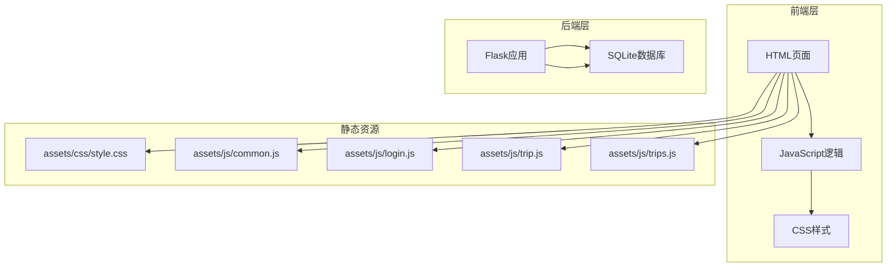
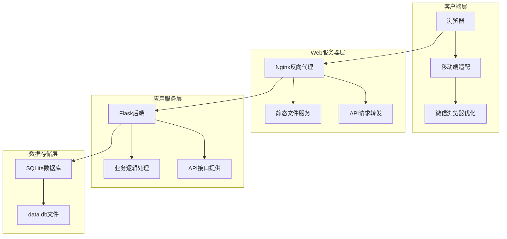
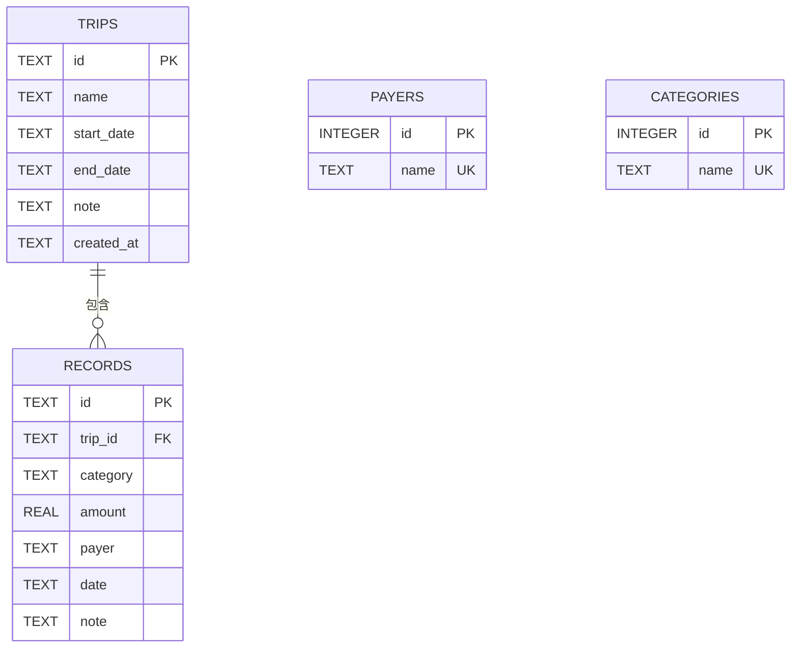
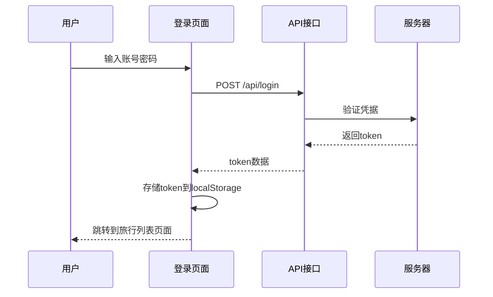
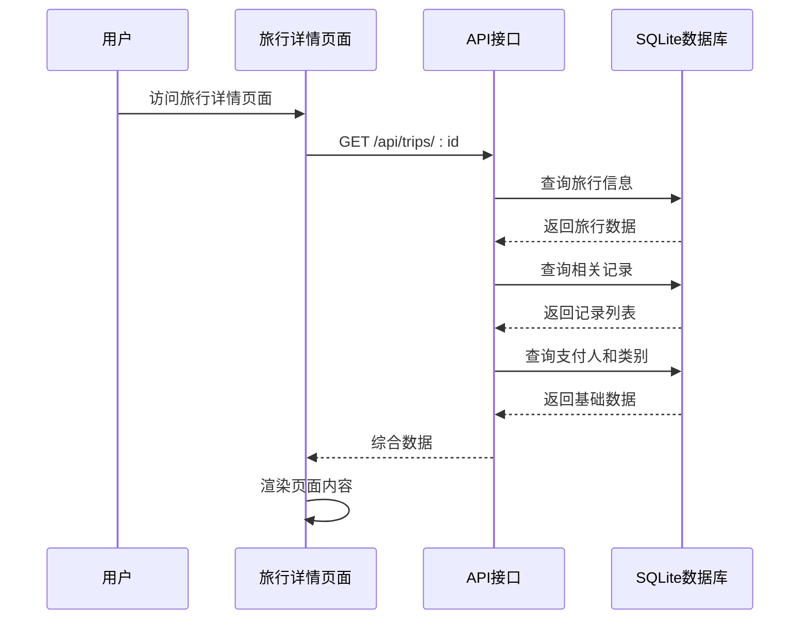
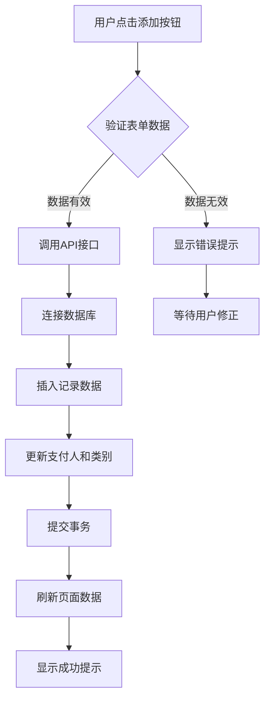

# 项目概述

<cite>
**本文档引用的文件**
- [app.py](file://app.py)
- [recorded.md](file://recorded.md)
- [login.html](file://login.html)
- [trip.html](file://trip.html)
- [trips.html](file://trips.html)
- [assets/js/common.js](file://assets/js/common.js)
- [assets/js/login.js](file://assets/js/login.js)
- [assets/js/trip.js](file://assets/js/trip.js)
- [assets/js/trips.js](file://assets/js/trips.js)
- [assets/css/style.css](file://assets/css/style.css)
- [run_server.sh](file://run_server.sh)
- [nginx.conf](file://nginx.conf)
</cite>

## 目录
1. [项目简介](#项目简介)
2. [核心目标与设计理念](#核心目标与设计理念)
3. [项目结构概览](#项目结构概览)
4. [核心功能特性](#核心功能特性)
5. [技术架构设计](#技术架构设计)
6. [数据库设计](#数据库设计)
7. [前后端交互流程](#前后端交互流程)
8. [部署方案](#部署方案)
9. [目标用户与使用场景](#目标用户与使用场景)
10. [性能与安全考虑](#性能与安全考虑)
11. [总结](#总结)

## 项目简介

recorded是一个专为旅游场景设计的记账管理系统，采用前后端分离架构，通过简洁直观的界面帮助用户记录和管理每次旅行的费用支出。该项目基于Python Flask后端和原生JavaScript前端技术栈构建，支持移动端自适应，特别优化了微信浏览器的使用体验。

项目的核心价值在于将复杂的财务管理工作简化为"一次旅行一个页面"的管理模式，让用户能够轻松追踪每段旅程的花费情况，包括交通、住宿、餐饮等各类支出，并提供详细的统计分析功能。

## 核心目标与设计理念

### 设计理念

项目采用"场景化记账"的设计理念，将传统的通用记账应用改造为专门针对旅游场景的垂直应用。这种设计有以下优势：

1. **场景专注性**：专注于旅游相关的费用类型，如交通、住宿、餐饮、打车等
2. **独立性管理**：每次旅行都有独立的记账页面，避免不同旅行间的费用混淆
3. **简单易用**：通过固定的费用分类和简化的操作流程降低使用门槛
4. **移动端优先**：专门为移动设备和微信浏览器优化界面布局

### 选择旅游记账的应用场景原因

选择旅游记账作为主要应用场景具有以下合理性：

- **高频使用场景**：人们经常进行短途或长途旅行，有持续的记账需求
- **明确的时间边界**：旅行有明确的开始和结束时间，便于费用归集
- **标准化的费用类型**：交通、住宿、餐饮等费用类型相对固定且易于理解
- **社交分享需求**：旅行费用往往需要与同行人员分摊和结算

## 项目结构概览

项目采用清晰的前后端分离架构，文件组织遵循功能模块化原则：



**图表来源**
- [app.py:12](file://app.py#L12)
- [assets/css/style.css:1](file://assets/css/style.css#L1)
- [assets/js/common.js:1](file://assets/js/common.js#L1)

### 文件组织结构

- **app.py**: Flask后端主程序，包含完整的API接口和数据库操作
- **HTML页面**: login.html、trips.html、trip.html分别对应登录、旅行列表、旅行详情页面
- **assets目录**: 包含CSS样式和JavaScript逻辑文件
- **配置文件**: nginx.conf用于Nginx反向代理配置，run_server.sh提供一键部署脚本

**章节来源**
- [app.py:1-331](file://app.py#L1-L331)
- [login.html:1-32](file://login.html#L1-L32)
- [trips.html:1-60](file://trips.html#L1-L60)
- [trip.html:1-155](file://trip.html#L1-L155)

## 核心功能特性

### 用户认证系统

系统提供简单的固定账号认证机制：
- 默认用户名：lou
- 默认密码：123
- 使用JWT风格的token进行会话管理
- token存储在内存中，重启后自动失效

### 旅行管理功能

- **旅行创建**：支持设置旅行名称、起止日期、备注信息
- **旅行编辑**：可以修改旅行的基本信息
- **旅行删除**：支持删除整个旅行及其所有相关记录
- **旅行列表**：显示所有旅行的汇总信息，包括总花费、记录数量等

### 记账功能

- **费用分类**：预设四大类别的费用（交通、住宿、餐饮、打车）
- **支付人管理**：支持选择现有支付人或新增支付人
- **记录管理**：支持添加、编辑、删除具体的费用记录
- **实时统计**：自动计算总花费、按支付人和按类别的费用分布

### 数据可视化

- **统计面板**：显示旅行次数、累计花费等关键指标
- **费用分布图**：按支付人和费用类别展示费用构成
- **响应式设计**：完美适配手机屏幕和微信浏览器

**章节来源**
- [app.py:16-21](file://app.py#L16-L21)
- [app.py:119-204](file://app.py#L119-L204)
- [trip.html:30-79](file://trip.html#L30-L79)
- [assets/js/trip.js:315-348](file://assets/js/trip.js#L315-L348)

## 技术架构设计

### 整体架构图



**图表来源**
- [nginx.conf:1](file://nginx.conf#L1)
- [app.py:12](file://app.py#L12)
- [run_server.sh:52-66](file://run_server.sh#L52-L66)

### 前后端分离设计

项目采用标准的前后端分离架构：

- **前端技术栈**：纯HTML5 + JavaScript + CSS3，无需任何框架依赖
- **后端技术栈**：Flask微框架，提供RESTful API服务
- **通信协议**：HTTP/HTTPS + JSON数据格式
- **静态资源**：通过Nginx直接提供，提高静态文件访问效率

### RESTful API设计

系统提供完整的RESTful API接口：

| 资源 | 方法 | 描述 |
|------|------|------|
| /api/login | POST | 用户登录获取token |
| /api/trips | GET | 获取旅行列表 |
| /api/trips | POST | 创建新旅行 |
| /api/trips/:id | GET | 获取指定旅行详情 |
| /api/trips/:id | PUT | 更新旅行信息 |
| /api/trips/:id | DELETE | 删除旅行 |
| /api/trips/:id/records | POST | 为旅行添加记录 |
| /api/records/:id | PUT | 更新记录 |
| /api/records/:id | DELETE | 删除记录 |
| /api/payers | GET | 获取支付人列表 |
| /api/payers | POST | 创建支付人 |
| /api/categories | GET | 获取费用类别列表 |
| /api/categories | POST | 创建费用类别 |

**章节来源**
- [app.py:106-314](file://app.py#L106-L314)
- [assets/js/common.js:39-132](file://assets/js/common.js#L39-L132)

## 数据库设计

### 数据库选择

项目选择SQLite作为数据库的原因：

1. **轻量级**：无需单独的数据库服务器进程
2. **零配置**：开箱即用，无需复杂的安装和配置
3. **可靠性**：内置WAL模式，提供更好的并发性能
4. **便携性**：单文件数据库，便于备份和迁移
5. **成本低**：完全免费，适合个人和小规模应用

### 数据库表结构



**图表来源**
- [app.py:46-72](file://app.py#L46-L72)

### 数据模型说明

- **trips表**：存储旅行基本信息，支持多旅行并存
- **records表**：存储具体的费用记录，外键关联到trips表
- **payers表**：维护支付人名单，支持动态添加
- **categories表**：维护费用类别，包含预设的四大类别

**章节来源**
- [app.py:46-78](file://app.py#L46-L78)

## 前后端交互流程

### 用户登录流程



**图表来源**
- [assets/js/login.js:13-34](file://assets/js/login.js#L13-L34)
- [assets/js/common.js:60-71](file://assets/js/common.js#L60-L71)

### 旅行详情加载流程



**图表来源**
- [assets/js/trip.js:105-123](file://assets/js/trip.js#L105-L123)
- [app.py:157-177](file://app.py#L157-L177)

### 记账记录添加流程



**图表来源**
- [assets/js/trip.js:161-197](file://assets/js/trip.js#L161-L197)
- [app.py:208-236](file://app.py#L208-L236)

**章节来源**
- [assets/js/common.js:39-132](file://assets/js/common.js#L39-L132)
- [assets/js/trip.js:161-197](file://assets/js/trip.js#L161-L197)

## 部署方案

### 一键部署脚本

项目提供了完整的自动化部署脚本，支持Ubuntu 22.04环境：

```bash
#!/bin/bash
# 主要部署步骤：
# 1. 安装系统依赖 (Python3, pip, nginx)
# 2. 创建Python虚拟环境并安装Flask
# 3. 初始化数据库结构
# 4. 配置Nginx反向代理
# 5. 启动Flask后端服务
# 6. 重启Nginx服务
```

### Nginx配置

Nginx作为反向代理服务器，负责：

- **静态文件服务**：直接提供HTML、CSS、JS等静态资源
- **API请求转发**：将/api/开头的请求转发到Flask后端
- **安全防护**：禁止访问敏感文件（.db、.py、.sh）
- **性能优化**：缓存静态资源，压缩传输内容

### 运行环境要求

- **操作系统**：Ubuntu 22.04 LTS
- **Python版本**：Python 3.x
- **内存要求**：至少512MB RAM
- **存储空间**：约50MB可用空间
- **网络要求**：开放80端口

**章节来源**
- [run_server.sh:1-81](file://run_server.sh#L1-L81)
- [nginx.conf:1-38](file://nginx.conf#L1-L38)

## 目标用户与使用场景

### 目标用户群体

1. **个人旅行者**：计划和参加各种规模的旅行活动
2. **家庭出行**：全家人的短途或长途旅行记账
3. **朋友结伴**：朋友间一起旅行的费用分摊管理
4. **学生群体**：学校组织的各类活动和旅行
5. **企业团队**：公司团建活动的费用管理

### 典型使用场景

- **周末短途游**：记录市内一日游的各项花费
- **长假旅行**：管理7天以上旅行的详细费用
- **朋友聚餐**：记录聚餐时的AA制费用分摊
- **商务出差**：管理差旅过程中的各项支出
- **学习交流**：记录学术会议或培训的费用

### 实际价值体现

1. **财务管理**：帮助用户清晰了解每次旅行的实际花费
2. **预算控制**：通过历史数据分析，为下次旅行制定预算
3. **报销便利**：为工作相关的费用报销提供完整记录
4. **社交分享**：方便与同行人员进行费用结算
5. **记忆保存**：记录旅行的美好回忆和相关花费

## 性能与安全考虑

### 性能优化策略

1. **数据库优化**：
   - 启用WAL模式提升并发性能
   - 开启外键约束确保数据完整性
   - 使用索引优化常用查询

2. **前端优化**：
   - 静态资源通过Nginx直接提供
   - 减少不必要的DOM操作
   - 使用本地存储缓存常用数据

3. **API优化**：
   - 批量数据加载减少请求次数
   - 合理的数据分页和缓存策略

### 安全措施

1. **认证安全**：
   - 固定账号密码，避免复杂认证流程
   - token存储在内存中，重启后自动失效
   - 所有API请求都需要有效的token

2. **数据安全**：
   - SQLite数据库文件权限控制
   - 防止SQL注入攻击的参数绑定
   - 输入数据的严格验证和过滤

3. **传输安全**：
   - 建议在生产环境中使用HTTPS
   - token通过Authorization头传输
   - 防止跨站脚本攻击(XSS)

### 可扩展性考虑

1. **水平扩展**：当前架构适合单机部署，可通过负载均衡扩展
2. **数据迁移**：SQLite单文件便于备份和迁移
3. **功能扩展**：模块化设计便于添加新功能
4. **性能监控**：提供日志记录便于性能分析

## 总结

recorded旅游记账管理系统是一个精心设计的垂直应用，它将复杂的财务管理简化为直观易用的旅游记账工具。通过前后端分离的现代化架构、简洁实用的功能设计和完善的部署方案，该项目为用户提供了一个可靠的旅行费用管理解决方案。

### 核心优势

1. **场景专注**：专门针对旅游场景优化，符合用户使用习惯
2. **易于使用**：简单直观的操作界面，降低学习成本
3. **可靠稳定**：基于成熟技术栈，提供稳定的用户体验
4. **部署简便**：一键部署脚本，快速上线运行
5. **成本低廉**：零配置数据库，无需额外硬件投入

### 发展前景

随着移动互联网的发展和人们生活水平的提高，个人财务管理需求将持续增长。recorded项目为未来的功能扩展奠定了良好的基础，包括：

- 多用户支持和团队协作
- 更丰富的统计分析功能  
- 移动端原生应用开发
- 云端同步和备份服务
- 第三方支付集成

该项目不仅是一个实用的工具应用，更是探索垂直领域应用开发的优秀案例，展示了如何通过专注特定场景来创造有价值的产品。